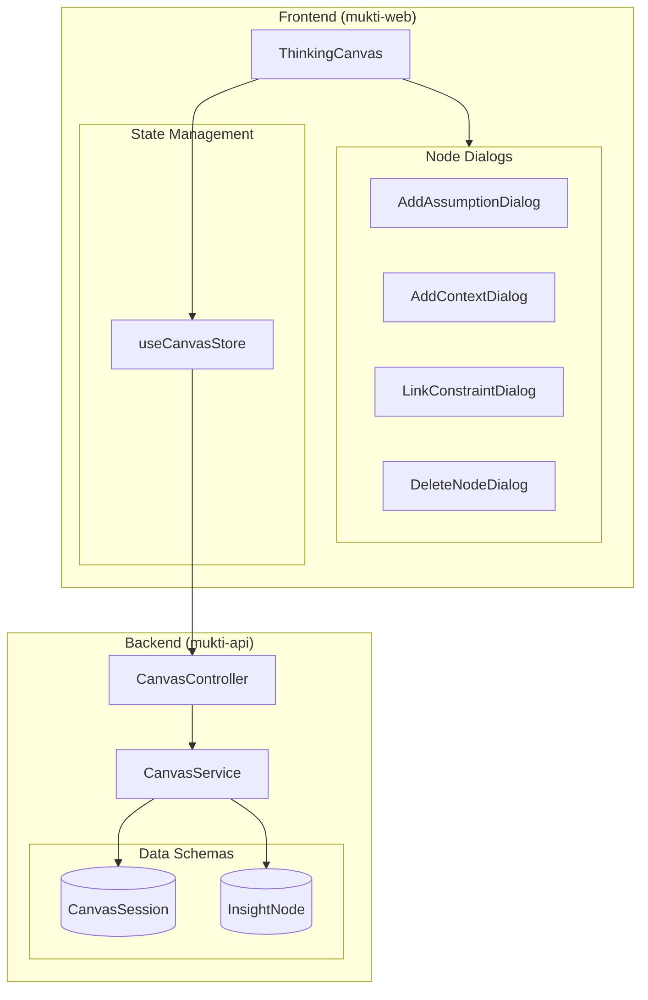

# Design Document: Canvas Node Management

## Overview

The Canvas Node Management feature extends the Thinking Canvas with persistent dynamic nodes, relationship edges, and the ability to add new assumptions and context items after initial setup. This enables users to evolve their thinking map as they explore their problem through Socratic dialogue, while maintaining clear visual connections between assumptions and the constraints that influence them.

## Architecture



## Components and Interfaces

### Backend Schema Extensions

#### InsightNode Schema (New Collection)

```typescript
@Schema({ collection: 'insight_nodes', timestamps: true })
export class InsightNode {
  _id: Types.ObjectId;
  
  @Prop({ required: true, ref: 'CanvasSession', index: true })
  sessionId: Types.ObjectId;
  
  @Prop({ required: true })
  nodeId: string;  // e.g., 'insight-0', 'insight-1'
  
  @Prop({ required: true })
  label: string;
  
  @Prop({ required: true })
  parentNodeId: string;  // e.g., 'root-0', 'soil-1'
  
  @Prop({ type: { x: Number, y: Number } })
  position: { x: number; y: number };
  
  @Prop({ default: false })
  isExplored: boolean;
  
  createdAt: Date;
  updatedAt: Date;
}
```

#### CanvasSession Schema Extension

```typescript
// Add to existing CanvasSession schema
interface RelationshipEdge {
  id: string;           // e.g., 'rel-root-0-soil-1'
  sourceNodeId: string; // Assumption node ID (root-*)
  targetNodeId: string; // Constraint node ID (soil-*)
}

@Prop({
  default: [],
  type: [{
    id: { type: String, required: true },
    sourceNodeId: { type: String, required: true },
    targetNodeId: { type: String, required: true },
  }],
})
relationshipEdges: RelationshipEdge[];

// Track which nodes were added dynamically (vs original setup)
@Prop({ default: [], type: [String] })
dynamicNodeIds: string[];
```

### DTOs

#### CreateInsightNodeDto

```typescript
export class CreateInsightNodeDto {
  @IsString()
  @MinLength(5)
  @MaxLength(200)
  label: string;
  
  @IsString()
  parentNodeId: string;
  
  @IsNumber()
  x: number;
  
  @IsNumber()
  y: number;
}
```

#### AddAssumptionDto

```typescript
export class AddAssumptionDto {
  @IsString()
  @MinLength(5)
  @MaxLength(200)
  assumption: string;
}
```

#### AddContextDto

```typescript
export class AddContextDto {
  @IsString()
  @MinLength(5)
  @MaxLength(200)
  context: string;
}
```

#### CreateRelationshipDto

```typescript
export class CreateRelationshipDto {
  @IsString()
  @Matches(/^root-\d+$/)
  sourceNodeId: string;  // Must be a root node
  
  @IsString()
  @Matches(/^soil-\d+$/)
  targetNodeId: string;  // Must be a soil node
}
```

#### DeleteNodeDto

```typescript
export class DeleteNodeDto {
  @IsString()
  nodeId: string;
  
  @IsBoolean()
  @IsOptional()
  deleteDependents?: boolean;  // Whether to delete child insights
}
```

### API Endpoints

```typescript
// Insight nodes
POST   /canvas/sessions/:id/insights     // Create insight node
GET    /canvas/sessions/:id/insights     // Get all insights for session
DELETE /canvas/sessions/:id/insights/:nodeId  // Delete insight

// Dynamic nodes (assumptions/context)
POST   /canvas/sessions/:id/assumptions  // Add new assumption
DELETE /canvas/sessions/:id/assumptions/:index  // Delete dynamic assumption
POST   /canvas/sessions/:id/context      // Add new context
DELETE /canvas/sessions/:id/context/:index  // Delete dynamic context

// Relationships
POST   /canvas/sessions/:id/relationships  // Create relationship edge
DELETE /canvas/sessions/:id/relationships/:id  // Delete relationship
```

### Frontend Components

#### AddAssumptionDialog

```typescript
interface AddAssumptionDialogProps {
  open: boolean;
  onOpenChange: (open: boolean) => void;
  onConfirm: (assumption: string) => void;
  currentCount: number;  // For showing limit
  maxCount: number;      // 8
}
```

#### AddContextDialog

```typescript
interface AddContextDialogProps {
  open: boolean;
  onOpenChange: (open: boolean) => void;
  onConfirm: (context: string) => void;
  currentCount: number;
  maxCount: number;  // 10
}
```

#### LinkConstraintDialog

```typescript
interface LinkConstraintDialogProps {
  open: boolean;
  onOpenChange: (open: boolean) => void;
  sourceNode: CanvasNode;  // The assumption being linked
  availableConstraints: CanvasNode[];  // Soil nodes
  existingLinks: string[];  // Already linked constraint IDs
  onConfirm: (constraintNodeId: string) => void;
}
```

#### DeleteNodeDialog

```typescript
interface DeleteNodeDialogProps {
  open: boolean;
  onOpenChange: (open: boolean) => void;
  node: CanvasNode;
  dependentNodes: CanvasNode[];  // Child insights that will be deleted
  onConfirm: (deleteDependents: boolean) => void;
}
```

### Canvas Store Extensions

```typescript
interface CanvasState {
  // Existing state...
  
  // New state
  relationshipEdges: RelationshipEdge[];
  dynamicNodeIds: string[];
  
  // New actions
  addAssumption: (label: string) => Promise<string | null>;
  addContext: (label: string) => Promise<string | null>;
  createRelationship: (sourceNodeId: string, targetNodeId: string) => Promise<string | null>;
  deleteNode: (nodeId: string, deleteDependents?: boolean) => Promise<boolean>;
  deleteRelationship: (relationshipId: string) => Promise<boolean>;
  
  // Helpers
  canDeleteNode: (nodeId: string) => boolean;
  getNodeRelationships: (nodeId: string) => RelationshipEdge[];
  getDependentNodes: (nodeId: string) => CanvasNode[];
}
```

## Data Models

### Edge Types

```typescript
type EdgeType = 'structural' | 'relationship';

interface CanvasEdge extends Edge {
  source: string;
  target: string;
  type?: EdgeType;
  data?: {
    edgeType: EdgeType;
  };
}

// Structural edges: solid line, connects to seed or parent
// Relationship edges: dashed line, connects assumption to constraint
```

### Node Deletion Rules

```typescript
interface NodeDeletionRules {
  // Cannot delete
  seed: false;
  originalRoots: false;  // Roots from initial setup
  originalSoil: false;   // Soil from initial setup
  
  // Can delete
  dynamicRoots: true;    // Roots added after setup
  dynamicSoil: true;     // Soil added after setup
  insights: true;        // All insight nodes
}
```

## Correctness Properties

*A property is a characteristic or behavior that should hold true across all valid executions of a system-essentially, a formal statement about what the system should do. Properties serve as the bridge between human-readable specifications and machine-verifiable correctness guarantees.*

### Property 1: Insight node persistence round-trip
*For any* insight node created with a valid parent node, saving and reloading the canvas session should restore the insight node with the same label, parent node ID, and position.
**Validates: Requirements 1.1, 1.2, 1.3**

### Property 2: Insight edge creation
*For any* insight node, there should exist exactly one edge connecting it to its parent node.
**Validates: Requirements 1.4**

### Property 3: Parent node validation
*For any* attempt to create an insight node with a non-existent parent node ID, the system should reject the creation with an error.
**Validates: Requirements 1.5**

### Property 4: Dynamic node connection to seed
*For any* dynamically created assumption or context node, there should exist exactly one edge connecting it to the Seed node.
**Validates: Requirements 2.3, 5.3**

### Property 5: Dynamic node positioning
*For any* dynamically created assumption node, its position should fall within the Root node arc (right hemisphere). *For any* dynamically created context node, its position should fall within the Soil node arc (left hemisphere).
**Validates: Requirements 2.4, 5.4**

### Property 6: Dynamic node persistence
*For any* dynamically created assumption, it should appear in problemStructure.roots after persistence. *For any* dynamically created context, it should appear in problemStructure.soil after persistence.
**Validates: Requirements 2.5, 5.5**

### Property 7: Node count limits
*For any* canvas session, the total number of assumptions (roots) should not exceed 8, and the total number of context items (soil) should not exceed 10.
**Validates: Requirements 2.6, 5.6**

### Property 8: Relationship edge creation
*For any* relationship created between an assumption and a constraint, there should exist a dashed edge connecting the two nodes, and the relationship should be persisted to the backend.
**Validates: Requirements 3.3, 3.4, 3.5**

### Property 9: Multiple relationships to same constraint
*For any* constraint node, multiple assumption nodes should be able to link to it, and all relationships should be preserved.
**Validates: Requirements 3.6**

### Property 10: Relationship count indicator
*For any* node with N relationships, the node should display an indicator showing the count N.
**Validates: Requirements 4.4**

### Property 11: Original node deletion protection
*For any* node that was part of the original setup (seed, original roots, original soil), the system should prevent deletion.
**Validates: Requirements 6.2**

### Property 12: Edge cleanup on deletion
*For any* node deletion, all edges connected to that node (both structural and relationship) should be removed.
**Validates: Requirements 6.3**

### Property 13: Deletion persistence
*For any* node deletion, the node should not appear when the canvas session is reloaded.
**Validates: Requirements 6.5**

## Error Handling

### Frontend Error Handling

1. **Insight Creation Failure**: Show error toast, preserve input in dialog
2. **Assumption/Context Limit Reached**: Disable add button, show limit message
3. **Relationship Creation Failure**: Show error toast, reset linking mode
4. **Deletion Failure**: Show error toast, restore node in UI

```typescript
// Optimistic update with rollback
const addAssumption = async (label: string) => {
  const tempId = `root-${Date.now()}`;
  const tempNode = createTempAssumptionNode(tempId, label);
  
  // Optimistic add
  set(state => ({ nodes: [...state.nodes, tempNode] }));
  
  try {
    const result = await canvasApi.addAssumption(sessionId, { assumption: label });
    // Replace temp with real node
    set(state => ({
      nodes: state.nodes.map(n => n.id === tempId ? result.node : n)
    }));
    return result.nodeId;
  } catch (error) {
    // Rollback
    set(state => ({
      nodes: state.nodes.filter(n => n.id !== tempId)
    }));
    throw error;
  }
};
```

### Backend Error Handling

1. **Parent Node Not Found**: Return 400 with "Parent node does not exist"
2. **Limit Exceeded**: Return 400 with "Maximum {type} limit reached"
3. **Cannot Delete Original Node**: Return 400 with "Cannot delete original setup nodes"
4. **Session Not Found**: Return 404
5. **Unauthorized**: Return 403

## Testing Strategy

### Property-Based Testing Library
Use **fast-check** for property-based testing. Configure each test to run a minimum of 100 iterations.

### Unit Tests

1. **InsightNode Service Tests**
   - Test creation with valid parent
   - Test creation with invalid parent
   - Test retrieval by session

2. **Canvas Service Extension Tests**
   - Test addAssumption within limit
   - Test addAssumption at limit
   - Test addContext within limit
   - Test relationship creation
   - Test node deletion rules

3. **Canvas Store Tests**
   - Test relationship edge state
   - Test dynamic node tracking
   - Test deletion with dependents

### Property-Based Tests

```typescript
// Example: Property 1 - Insight persistence round-trip
// **Feature: canvas-node-management, Property 1: Insight node persistence round-trip**
describe('Insight node persistence', () => {
  it('persists and restores insight nodes correctly', () => {
    fc.assert(
      fc.property(
        fc.record({
          label: fc.string({ minLength: 5, maxLength: 200 }),
          parentNodeId: fc.constantFrom('root-0', 'root-1', 'soil-0', 'seed'),
          x: fc.integer({ min: -1000, max: 1000 }),
          y: fc.integer({ min: -1000, max: 1000 }),
        }),
        async (insightData) => {
          // Create insight
          const created = await canvasApi.createInsight(sessionId, insightData);
          
          // Reload session
          const session = await canvasApi.getSession(sessionId);
          const insights = await canvasApi.getInsights(sessionId);
          
          // Find the created insight
          const found = insights.find(i => i.nodeId === created.nodeId);
          
          return (
            found !== undefined &&
            found.label === insightData.label &&
            found.parentNodeId === insightData.parentNodeId &&
            found.position.x === insightData.x &&
            found.position.y === insightData.y
          );
        }
      ),
      { numRuns: 100 }
    );
  });
});
```

### Integration Tests

1. **Full Workflow Tests**
   - Create session → Add assumption → Link to constraint → Create insight → Delete assumption
   - Verify cascade behavior

2. **Concurrent Modification Tests**
   - Multiple users editing same session (if applicable)
