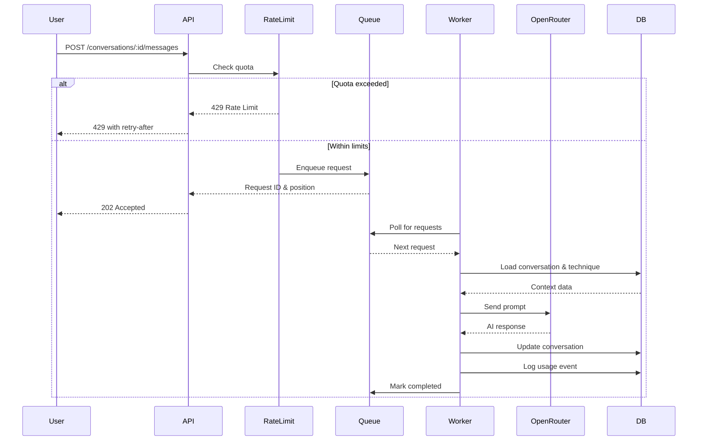

# Design Document

## Overview

The conversation backend system implements the core Thinking Workspace paradigm for Mukti, enabling users to engage in Socratic dialogues powered by AI through OpenRouter. The system supports multiple questioning techniques, asynchronous request processing, message archival, usage tracking, and rate limiting.

### Key Design Goals

- Enable Socratic questioning through multiple techniques (elenchus, dialectic, maieutics, etc.)
- Provide scalable message storage with hybrid in-memory and archived approach
- Integrate with OpenRouter for unified AI model access
- Implement fair resource distribution through rate limiting and subscription tiers
- Track usage for analytics and billing purposes
- Ensure data isolation and security through ownership validation
- Support asynchronous processing with priority-based queuing

## Architecture

### System Components

The conversation backend follows a layered architecture with clear separation of concerns:

```
┌─────────────────────────────────────────────────────────────┐
│                     API Layer (Controllers)                  │
│  - ConversationController                                    │
│  - Handles HTTP requests, validation, authentication         │
└─────────────────────────────────────────────────────────────┘
                              │
┌─────────────────────────────────────────────────────────────┐
│                   Service Layer (Business Logic)             │
│  - ConversationService: CRUD operations                      │
│  - MessageService: Message management & archival             │
│  - OpenRouterService: AI API integration                     │
│  - QueueService: Asynchronous request processing             │
│  - UsageTrackingService: Analytics & billing                 │
│  - RateLimitService: Quota enforcement                       │
└─────────────────────────────────────────────────────────────┘
                              │
┌─────────────────────────────────────────────────────────────┐
│                    Data Layer (Repositories)                 │
│  - MongoDB: Conversations, Users, Techniques, etc.           │
│  - Redis: Rate limiting, caching (future)                    │
└─────────────────────────────────────────────────────────────┘
                              │
┌─────────────────────────────────────────────────────────────┐
│                   External Services                          │
│  - OpenRouter API: AI model access                           │
└─────────────────────────────────────────────────────────────┘
```


### Request Flow

The system implements an asynchronous request processing flow:

1. **Request Reception**: User sends message via HTTP POST
2. **Authentication & Authorization**: Verify user identity and conversation ownership
3. **Rate Limiting**: Check hourly and daily quotas
4. **Request Enqueueing**: Add to priority queue based on subscription tier
5. **Immediate Response**: Return HTTP 202 with queue position
6. **Background Processing**: Worker picks up request from queue
7. **Context Loading**: Retrieve conversation history and technique template
8. **Prompt Building**: Construct AI prompt with system instructions and context
9. **OpenRouter Call**: Send request to AI model
10. **Response Processing**: Parse tokens, cost, and content
11. **Data Persistence**: Update conversation, archive if needed
12. **Usage Tracking**: Log event and update counters
13. **Queue Completion**: Mark request as completed

### Data Flow Diagram



## Components and Interfaces


### ConversationController

REST API endpoints for conversation management.

**Endpoints:**
- `POST /conversations` - Create new conversation
- `GET /conversations` - List user's conversations with filtering/sorting
- `GET /conversations/:id` - Get conversation by ID
- `PATCH /conversations/:id` - Update conversation properties
- `DELETE /conversations/:id` - Delete conversation
- `POST /conversations/:id/messages` - Send message to conversation
- `GET /conversations/:id/messages/archived` - Get archived messages

**Responsibilities:**
- Request validation using DTOs
- Authentication via JWT guards
- Authorization (ownership verification)
- HTTP response formatting
- Error handling and status codes

### ConversationService

Core business logic for conversation operations.

**Methods:**
- `createConversation(userId, dto)` - Create new conversation
- `findConversationById(id, userId)` - Retrieve conversation with ownership check
- `findUserConversations(userId, filters, pagination)` - List conversations with filtering
- `updateConversation(id, userId, updates)` - Update conversation properties
- `deleteConversation(id, userId)` - Delete conversation and archived messages
- `validateOwnership(conversationId, userId)` - Check user owns conversation

**Responsibilities:**
- Conversation CRUD operations
- Ownership validation
- Business rule enforcement
- Data transformation

### MessageService

Handles message operations and archival logic.

**Methods:**
- `addMessageToConversation(conversationId, message)` - Append message to conversation
- `archiveOldMessages(conversationId)` - Move messages to ArchivedMessage collection
- `getArchivedMessages(conversationId, pagination)` - Retrieve archived messages
- `buildConversationContext(conversation)` - Prepare context for AI prompt

**Responsibilities:**
- Message appending with 50-message limit
- Automatic archival when threshold exceeded
- Metadata updates (tokens, cost, timestamps)
- Context preparation for AI calls


### OpenRouterService

Integration with OpenRouter API for AI model access.

**Methods:**
- `sendChatCompletion(messages, model, technique)` - Send request to OpenRouter
- `buildPrompt(technique, conversationHistory, userMessage)` - Construct AI prompt
- `parseResponse(response)` - Extract content, tokens, and cost
- `calculateCost(promptTokens, completionTokens, model)` - Compute request cost
- `selectModel(subscriptionTier)` - Choose model based on user tier

**Configuration:**
- API Key: From environment variable `OPENROUTER_API_KEY`
- Base URL: `https://openrouter.ai/api/v1`
- Models: Free tier uses `openai/gpt-3.5-turbo`, paid tier uses `openai/gpt-4o`
- Timeout: 30 seconds
- Retry: Exponential backoff with max 3 retries

**Responsibilities:**
- HTTP client for OpenRouter API
- Prompt engineering with technique templates
- Response parsing and validation
- Cost calculation
- Error handling and retries

### QueueService

Asynchronous request processing using BullMQ with Redis backend.

**Methods:**
- `enqueueRequest(userId, conversationId, message, priority)` - Add job to BullMQ queue
- `processRequest(job)` - Execute request processing workflow (worker processor)
- `getJobStatus(jobId)` - Get current job status and progress
- `getQueueMetrics()` - Get queue statistics (waiting, active, completed, failed)

**BullMQ Configuration:**
- Queue name: `conversation-requests`
- Redis connection: From environment variables
- Priority levels: 1-10 (higher = more priority)
- Concurrency: 5 workers (configurable)
- Job options:
  - Attempts: 3 (max retries)
  - Backoff: Exponential (1s, 2s, 4s)
  - Remove on complete: After 24 hours
  - Remove on fail: After 7 days

**Queue Priority:**
- Paid tier: Priority 10
- Free tier: Priority 1
- FIFO within same priority level

**Responsibilities:**
- BullMQ queue initialization and configuration
- Job enqueueing with priority
- Worker processor implementation
- Retry logic via BullMQ's built-in mechanism
- Job status tracking
- Queue monitoring and metrics


### UsageTrackingService

Analytics and billing event tracking.

**Methods:**
- `logQuestionEvent(userId, conversationId, metadata)` - Record question event
- `updateSubscriptionUsage(userId, tokens, cost)` - Increment usage counters
- `resetDailyUsage(userId)` - Reset daily counters
- `resetHourlyUsage(userId)` - Reset hourly counters
- `getUserUsageStats(userId, dateRange)` - Get usage statistics

**Event Metadata:**
- Event type: QUESTION
- Tokens: prompt + completion
- Cost: Calculated from token usage
- Latency: Request processing time
- Model: AI model used
- Technique: Socratic technique applied
- Conversation ID: Associated conversation

**Responsibilities:**
- Usage event logging
- Subscription counter updates
- Time-based resets
- Analytics data collection

### RateLimitService

Quota enforcement and anti-spam protection.

**Methods:**
- `checkRateLimit(userId)` - Verify user within quotas
- `consumeQuota(userId)` - Decrement available requests
- `getRemainingQuota(userId)` - Get current quota status
- `getResetTime(userId, window)` - Calculate next reset time

**Rate Limit Windows:**
- Hourly: Rolling 1-hour window
- Daily: Calendar day (resets at midnight UTC)

**Tier Limits:**
- Free: 10/hour, 50/day
- Paid: 100/hour, 500/day

**Responsibilities:**
- Quota checking before request processing
- Counter management
- Reset time calculation
- HTTP 429 response generation

## Data Models


### Conversation Model

Primary document for storing conversation state.

**Fields:**
- `_id`: ObjectId - Unique identifier
- `userId`: ObjectId - Owner reference
- `title`: String - Conversation title
- `technique`: String - Socratic technique (enum)
- `recentMessages`: Array - Last 50 messages in memory
- `hasArchivedMessages`: Boolean - Flag for archived messages
- `totalMessageCount`: Number - Total messages including archived
- `metadata`: Object - Aggregated statistics
  - `messageCount`: Number
  - `totalTokens`: Number
  - `estimatedCost`: Number
  - `lastMessageAt`: Date
  - `averageLatencyMs`: Number
- `tags`: Array<String> - User-defined tags
- `isFavorite`: Boolean - Favorite flag
- `isArchived`: Boolean - Archive flag
- `isShared`: Boolean - Public sharing flag
- `shareToken`: String - Unique share token
- `createdAt`: Date - Creation timestamp
- `updatedAt`: Date - Last update timestamp

**Indexes:**
- `{ userId: 1, updatedAt: -1 }` - User's conversations sorted by update
- `{ userId: 1, createdAt: -1 }` - User's conversations sorted by creation
- `{ userId: 1, isFavorite: 1, updatedAt: -1 }` - Favorite conversations
- `{ technique: 1 }` - Filter by technique
- `{ tags: 1 }` - Filter by tags
- `{ title: 'text', tags: 'text' }` - Full-text search

### ArchivedMessage Model

Scalable storage for conversation history beyond 50 messages.

**Fields:**
- `_id`: ObjectId - Unique identifier
- `conversationId`: ObjectId - Parent conversation
- `role`: String - Message role (user/assistant/system)
- `content`: String - Message content
- `sequenceNumber`: Number - Message order
- `timestamp`: Date - Message timestamp
- `metadata`: Object - Message-specific data
  - `model`: String
  - `promptTokens`: Number
  - `completionTokens`: Number
  - `totalTokens`: Number
  - `latencyMs`: Number
  - `cost`: Number
- `isEdited`: Boolean - Edit flag
- `editedContent`: String - Original content if edited
- `editedAt`: Date - Edit timestamp

**Indexes:**
- `{ conversationId: 1, sequenceNumber: 1 }` - Efficient range queries
- `{ conversationId: 1, timestamp: 1 }` - Time-based retrieval
- `{ content: 'text' }` - Full-text search


### BullMQ Job Data Structure

Job payload for conversation request processing in BullMQ.

**Job Data Fields:**
- `userId`: String - Requester reference (ObjectId as string)
- `conversationId`: String - Target conversation (ObjectId as string)
- `message`: String - User message content
- `subscriptionTier`: String - User's tier (free/paid)
- `technique`: String - Conversation technique

**Job Options:**
- `jobId`: Unique identifier (generated)
- `priority`: Number - 1 (free) or 10 (paid)
- `attempts`: 3 - Maximum retry attempts
- `backoff`: Exponential backoff strategy
- `removeOnComplete`: 24 hours retention
- `removeOnFail`: 7 days retention

**Job States (BullMQ built-in):**
- `waiting`: Job in queue, not yet processed
- `active`: Job currently being processed
- `completed`: Job successfully finished
- `failed`: Job failed after all retries
- `delayed`: Job scheduled for future processing

**Job Result (on completion):**
- `messageId`: String - Created message ID
- `tokens`: Number - Total tokens used
- `cost`: Number - Request cost
- `latency`: Number - Processing time in ms

**Job Error (on failure):**
- `message`: String - Error description
- `code`: String - Error code
- `stack`: String - Stack trace
- `attemptsMade`: Number - Retry attempts made

### Technique Model

Socratic questioning methodology templates.

**Built-in Techniques:**

1. **Elenchus** (Socratic Refutation)
   - System Prompt: "You are a Socratic questioner using the elenchus method. Challenge assumptions by asking probing questions that reveal contradictions. Never provide direct answers."
   - Questioning Style: "Challenging and probing"
   - Follow-up Strategy: "Identify contradictions and ask for clarification"

2. **Dialectic** (Thesis-Antithesis-Synthesis)
   - System Prompt: "Guide the user through dialectical reasoning. Present opposing viewpoints and help synthesize understanding through questioning."
   - Questioning Style: "Balanced and exploratory"
   - Follow-up Strategy: "Present counterarguments and seek synthesis"

3. **Maieutics** (Midwifery of Ideas)
   - System Prompt: "Help the user give birth to their own ideas through gentle questioning. Draw out latent knowledge rather than imposing external answers."
   - Questioning Style: "Gentle and encouraging"
   - Follow-up Strategy: "Build on partial insights with supportive questions"

4. **Definitional** (Concept Clarification)
   - System Prompt: "Focus on defining key terms and concepts precisely. Ask questions that clarify meaning and boundaries."
   - Questioning Style: "Precise and analytical"
   - Follow-up Strategy: "Test definitions with edge cases and examples"

5. **Analogical** (Reasoning by Analogy)
   - System Prompt: "Use analogies and comparisons to illuminate concepts. Ask questions that draw parallels to familiar domains."
   - Questioning Style: "Creative and comparative"
   - Follow-up Strategy: "Explore where analogies hold and where they break down"

6. **Counterfactual** (What-If Reasoning)
   - System Prompt: "Explore alternative scenarios through counterfactual questions. Ask 'what if' to test reasoning and assumptions."
   - Questioning Style: "Speculative and exploratory"
   - Follow-up Strategy: "Vary conditions and examine consequences"


## Correctness Properties

*A property is a characteristic or behavior that should hold true across all valid executions of a system-essentially, a formal statement about what the system should do. Properties serve as the bridge between human-readable specifications and machine-verifiable correctness guarantees.*

### Property 1: Conversation creation initializes correctly

*For any* valid technique and user, creating a conversation should result in a document with empty recentMessages array, zero message count, and default metadata values (estimatedCost: 0, totalTokens: 0, messageCount: 0).

**Validates: Requirements 1.1, 1.2, 1.3, 1.5**

### Property 2: Invalid techniques are rejected

*For any* string that is not in the set {elenchus, dialectic, maieutics, definitional, analogical, counterfactual}, attempting to create a conversation should return an error.

**Validates: Requirements 1.4**

### Property 3: Ownership validation prevents unauthorized access

*For any* conversation and user where the user does not own the conversation, attempts to read, update, or delete should return HTTP 403 Forbidden.

**Validates: Requirements 2.1, 3.4, 5.4, 6.3**

### Property 4: Rate limiting enforces quotas

*For any* user who has reached their hourly or daily question limit, attempting to send a message should return HTTP 429 with appropriate retry-after information.

**Validates: Requirements 2.2, 2.3, 11.1, 11.2**

### Property 5: Request enqueueing returns correct response

*For any* valid message send within rate limits, the system should return HTTP 202 with a request queue ID and position number.

**Validates: Requirements 2.4, 2.5**

### Property 6: Message appending updates metadata

*For any* message added to a conversation, the conversation metadata should be updated with incremented totalTokens, updated estimatedCost, and current lastMessageAt timestamp.

**Validates: Requirements 2.11**

### Property 7: Archival threshold triggers correctly

*For any* conversation with exactly 50 messages, adding one more message should trigger archival of the oldest messages and set hasArchivedMessages to true.

**Validates: Requirements 2.12, 2.13**

### Property 8: Both messages are appended

*For any* successful AI response, both the user message and assistant response should be appended to the conversation's recentMessages array.

**Validates: Requirements 2.10**

### Property 9: Request completion updates queue status

*For any* successfully processed request, the RequestQueue document should be updated with status COMPLETED and include result data (messageId, tokens, cost).

**Validates: Requirements 2.14**

### Property 10: Usage events are logged

*For any* completed conversation message, a UsageEvent should be created with eventType QUESTION and metadata including tokens, cost, latency, model, and technique.

**Validates: Requirements 2.15, 10.1, 10.2, 10.3**

### Property 11: Subscription usage counters increment

*For any* UsageEvent created, the associated user's subscription should have questionsToday and questionsThisHour incremented by 1.

**Validates: Requirements 10.4, 10.5**

### Property 12: Archived messages maintain order

*For any* set of archived messages for a conversation, retrieving them should return messages ordered by sequenceNumber in ascending order.

**Validates: Requirements 3.2**

### Property 13: Pagination works correctly

*For any* list or archived message query with page and limit parameters, the returned results should have length ≤ limit and skip the correct number of items based on page number.

**Validates: Requirements 3.3, 4.2**

### Property 14: Conversation listing respects ownership

*For any* user listing conversations, the results should contain only conversations where userId matches the requesting user's ID.

**Validates: Requirements 4.1**

### Property 15: Filtering works correctly

*For any* conversation list query with filters (technique, tags, isArchived, isFavorite), all returned conversations should match the specified filter criteria.

**Validates: Requirements 4.3**

### Property 16: Sorting works correctly

*For any* conversation list query with a sort parameter (createdAt, updatedAt, lastMessageAt), the results should be ordered by that field in descending order.

**Validates: Requirements 4.4**

### Property 17: Total count is accurate

*For any* paginated list query, the returned total count should equal the actual number of documents matching the query filters.

**Validates: Requirements 4.5**

### Property 18: Title validation rejects empty strings

*For any* conversation update with an empty or whitespace-only title, the system should return a validation error.

**Validates: Requirements 5.1**

### Property 19: Tags validation enforces array of strings

*For any* conversation update with tags that are not an array of strings, the system should return a validation error.

**Validates: Requirements 5.2**

### Property 20: Boolean flags accept only booleans

*For any* conversation update with isFavorite or isArchived values that are not boolean, the system should return a validation error.

**Validates: Requirements 5.3**

### Property 30: Technique switching validates and updates

*For any* conversation update with a new technique, if the technique is in the valid set {elenchus, dialectic, maieutics, definitional, analogical, counterfactual}, the conversation should be updated with the new technique; otherwise, a validation error should be returned.

**Validates: Requirements 5.4, 5.5**

### Property 21: Conversation deletion cascades

*For any* conversation deletion, all associated ArchivedMessage documents should also be deleted.

**Validates: Requirements 6.1, 6.2**

### Property 22: Non-existent resources return 404

*For any* operation (read, update, delete) on a conversation ID that does not exist, the system should return HTTP 404 Not Found.

**Validates: Requirements 3.5, 5.5, 6.4**

### Property 23: Seeded techniques have correct properties

*For all* built-in techniques seeded during initialization, each should have isBuiltIn: true, status: 'approved', and a complete template with systemPrompt, questioningStyle, followUpStrategy, and exampleQuestions.

**Validates: Requirements 7.2, 7.3, 7.4**

### Property 24: Seeding is idempotent

*For any* technique or user that already exists, running the seed operation again should not create duplicates.

**Validates: Requirements 7.5, 8.3**

### Property 25: OpenRouter errors are logged

*For any* OpenRouter API error response, the system should log the error with full context including request details, error message, and stack trace.

**Validates: Requirements 9.1**

### Property 26: Retriable errors trigger requeue

*For any* OpenRouter API failure where retryCount < maxRetries, the request should be requeued with status PENDING and incremented retryCount.

**Validates: Requirements 9.2**

### Property 27: Failed requests store error details

*For any* request marked as FAILED, the RequestQueue document should contain error details including message, code, and timestamp.

**Validates: Requirements 9.4**

### Property 28: Usage counter resets work correctly

*For any* user whose subscription usage counters need daily reset (different calendar day), calling resetDailyUsage should set questionsToday to 0 and update lastResetAt.

**Validates: Requirements 11.5**

### Property 29: Hourly reset works correctly

*For any* user whose subscription usage counters need hourly reset (≥1 hour elapsed), calling resetHourlyUsage should set questionsThisHour to 0 and update lastHourResetAt.

**Validates: Requirements 11.6**


## Error Handling

### Error Categories

**Validation Errors (400 Bad Request)**
- Empty or invalid conversation title
- Invalid technique name
- Malformed request body
- Invalid pagination parameters

**Authentication Errors (401 Unauthorized)**
- Missing JWT token
- Expired JWT token
- Invalid JWT signature

**Authorization Errors (403 Forbidden)**
- User does not own conversation
- Insufficient permissions for operation

**Not Found Errors (404 Not Found)**
- Conversation ID does not exist
- User ID does not exist
- Technique not found

**Rate Limit Errors (429 Too Many Requests)**
- Hourly quota exceeded
- Daily quota exceeded
- Response includes Retry-After header

**External Service Errors (502 Bad Gateway)**
- OpenRouter API unavailable
- OpenRouter API timeout
- OpenRouter API returns error

**Internal Errors (500 Internal Server Error)**
- Database connection failure
- Unexpected exceptions
- Data corruption

### Error Response Format

All errors follow a consistent structure:

```json
{
  "success": false,
  "error": {
    "code": "ERROR_CODE",
    "message": "Human-readable error message",
    "details": {
      "field": "Additional context"
    }
  },
  "meta": {
    "timestamp": "2024-01-01T00:00:00Z",
    "requestId": "uuid"
  }
}
```

### Retry Strategy

**OpenRouter API Failures:**
- Max retries: 3
- Backoff: Exponential (1s, 2s, 4s)
- Retriable errors: Timeout, 5xx status codes
- Non-retriable: 4xx status codes (except 429)

**Database Failures:**
- Max retries: 2
- Backoff: Linear (500ms, 1s)
- Retriable: Connection errors, timeout
- Non-retriable: Validation errors, duplicate key


## Testing Strategy

### Unit Testing

Unit tests verify individual components in isolation using mocked dependencies.

**ConversationService Tests:**
- Create conversation with valid/invalid techniques
- Find conversation by ID with ownership validation
- List conversations with various filters and sorting
- Update conversation properties
- Delete conversation and verify cascade

**MessageService Tests:**
- Add message to conversation
- Archive messages when threshold exceeded
- Retrieve archived messages with pagination
- Build conversation context for AI prompt

**OpenRouterService Tests:**
- Build prompt with technique template
- Parse API response correctly
- Calculate cost from token usage
- Handle API errors and timeouts
- Select correct model based on tier

**QueueService Tests:**
- Enqueue request with correct priority
- Dequeue requests in priority order
- Process request workflow
- Handle retry logic with backoff
- Mark requests as completed/failed

**UsageTrackingService Tests:**
- Log usage events with correct metadata
- Update subscription counters atomically
- Reset daily/hourly counters at correct times
- Calculate usage statistics

**RateLimitService Tests:**
- Check rate limits correctly
- Consume quota and decrement counters
- Calculate reset times
- Handle quota exhaustion

### Property-Based Testing

Property-based tests verify universal properties across many randomly generated inputs using **fast-check** library for TypeScript/JavaScript.

**Configuration:**
- Minimum iterations per property: 100
- Test framework: Jest with fast-check integration
- Each property test tagged with: `**Feature: conversation-backend, Property {number}: {property_text}**`

**Property Test Coverage:**
- All 29 correctness properties defined in design document
- Each property implemented as a single property-based test
- Generators for: users, conversations, messages, techniques, subscriptions
- Smart generators that constrain to valid input space

**Example Property Test Structure:**

```typescript
/**
 * Feature: conversation-backend, Property 1: Conversation creation initializes correctly
 */
it('should initialize conversations correctly for any valid technique and user', async () => {
  await fc.assert(
    fc.asyncProperty(
      fc.record({
        userId: fc.hexaString({ minLength: 24, maxLength: 24 }),
        technique: fc.constantFrom('elenchus', 'dialectic', 'maieutics', 'definitional', 'analogical', 'counterfactual'),
        title: fc.string({ minLength: 1, maxLength: 100 })
      }),
      async ({ userId, technique, title }) => {
        const conversation = await conversationService.createConversation(userId, { technique, title });
        
        expect(conversation.recentMessages).toEqual([]);
        expect(conversation.totalMessageCount).toBe(0);
        expect(conversation.metadata.estimatedCost).toBe(0);
        expect(conversation.metadata.totalTokens).toBe(0);
        expect(conversation.metadata.messageCount).toBe(0);
      }
    ),
    { numRuns: 100 }
  );
});
```

### Integration Testing

Integration tests verify component interactions with real database and external services.

**Test Scenarios:**
- End-to-end conversation creation and message flow
- Rate limiting with real subscription data
- Message archival with database operations
- OpenRouter integration (with test API key)
- Queue processing with worker simulation

**Test Database:**
- Separate MongoDB instance for testing
- Automatic cleanup between tests
- Seeded with test data (users, techniques)

### End-to-End Testing

E2E tests verify complete user workflows through HTTP API.

**Test Scenarios:**
- User creates conversation and sends messages
- User lists and filters conversations
- User updates conversation properties
- User deletes conversation
- Rate limiting prevents excessive requests
- Archived messages are retrievable

**Test Environment:**
- Test server with in-memory database
- Mocked OpenRouter API responses
- JWT authentication with test tokens

## Security Considerations

**Authentication:**
- JWT-based authentication on all endpoints
- Token expiration: 7 days
- Refresh token support for extended sessions

**Authorization:**
- Ownership validation on all conversation operations
- User can only access their own conversations
- Admin role for moderation (future)

**Input Validation:**
- All DTOs validated with class-validator
- Whitelist mode: strip unknown properties
- Sanitize user input to prevent injection

**Rate Limiting:**
- Prevent abuse and DoS attacks
- Fair resource distribution
- Tier-based quotas

**Data Privacy:**
- Conversations are private by default
- Sharing requires explicit opt-in with unique token
- Sensitive data (passwords, tokens) never logged

**API Security:**
- CORS configured for allowed origins
- HTTPS required in production
- API keys stored in environment variables
- Request size limits to prevent payload attacks

## Performance Optimization

**Database Optimization:**
- Compound indexes for common queries
- Lean queries when virtuals not needed
- Pagination for all list endpoints
- Projection to limit returned fields

**Caching Strategy (Future):**
- Redis cache for frequently accessed conversations
- Cache invalidation on updates
- TTL-based expiration

**Asynchronous Processing:**
- Non-blocking request handling
- Background workers for AI calls
- Priority queue for fair processing

**Message Archival:**
- Hybrid storage: recent in-memory, old in separate collection
- Reduces document size for faster queries
- On-demand loading of archived messages

## Deployment Considerations

**Environment Variables:**
- `MONGODB_URI`: Database connection string
- `REDIS_HOST`: Redis host for BullMQ
- `REDIS_PORT`: Redis port (default: 6379)
- `REDIS_PASSWORD`: Redis password (optional)
- `OPENROUTER_API_KEY`: OpenRouter API key
- `JWT_SECRET`: JWT signing secret
- `RATE_LIMIT_FREE_TIER_PER_HOUR`: Free tier hourly limit
- `RATE_LIMIT_FREE_TIER_PER_DAY`: Free tier daily limit
- `RATE_LIMIT_PAID_TIER_PER_HOUR`: Paid tier hourly limit
- `RATE_LIMIT_PAID_TIER_PER_DAY`: Paid tier daily limit
- `QUEUE_CONCURRENCY`: Number of concurrent workers (default: 5)

**Database Migrations:**
- Seed built-in techniques on first deployment
- Create indexes for performance
- Seed test user for development

**Monitoring:**
- Log all OpenRouter API calls
- Track request processing latency
- Monitor queue depth and processing rate
- Alert on high error rates

**Scaling:**
- Horizontal scaling of API servers
- Multiple queue workers for parallel processing
- Database read replicas for query load
- Connection pooling for database efficiency
