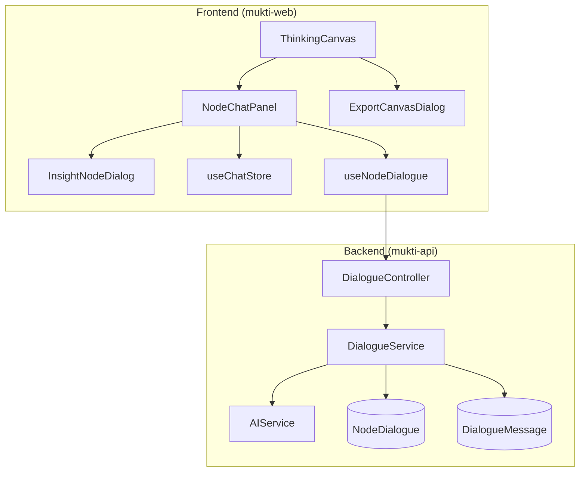

# Design Document: Thinking Canvas Context-aware Chat

## Overview

The Context-aware Chat connects Mukti's Socratic dialogue system to the visual canvas, enabling focused conversations about specific nodes. When a user selects a node, a chat panel opens with AI-powered questioning tailored to that node's content and type. The AI uses different Socratic strategies for assumptions (challenging validity) versus constraints (exploring flexibility). As insights emerge, users can spawn new nodes, creating a growing visual map of their decision-making process.

## Architecture



## Components and Interfaces

### Chat Panel Component

```typescript
interface NodeChatPanelProps {
  sessionId: string;
  selectedNode: CanvasNode | null;
  onClose: () => void;
  onInsightCreate: (insight: InsightNodeData) => void;
  width: number;
  onWidthChange: (width: number) => void;
}

interface InsightNodeData {
  label: string;
  parentNodeId: string;
}
```

### Chat Message Components

```typescript
interface ChatMessageProps {
  message: DialogueMessage;
  isUser: boolean;
}

interface ChatInputProps {
  onSend: (content: string) => void;
  disabled: boolean;
  placeholder?: string;
}

interface DialogueHeaderProps {
  node: CanvasNode;
  messageCount: number;
  onStartDialogue: () => void;
  hasHistory: boolean;
}
```

### Insight Node Dialog

```typescript
interface InsightNodeDialogProps {
  open: boolean;
  onOpenChange: (open: boolean) => void;
  parentNode: CanvasNode;
  onConfirm: (label: string) => void;
}
```

### Export Dialog

```typescript
interface ExportCanvasDialogProps {
  open: boolean;
  onOpenChange: (open: boolean) => void;
  sessionId: string;
}

type ExportFormat = 'markdown' | 'pdf';

interface ExportOptions {
  format: ExportFormat;
  includeDialogues: boolean;
  dialogueDetail: 'summary' | 'full';
}
```

### Chat State Management (Zustand)

```typescript
interface ChatState {
  // Active dialogue
  activeNodeId: string | null;
  messages: Map<string, DialogueMessage[]>;  // nodeId -> messages
  
  // UI state
  panelWidth: number;
  isLoading: boolean;
  
  // Actions
  setActiveNode: (nodeId: string | null) => void;
  addMessage: (nodeId: string, message: DialogueMessage) => void;
  setMessages: (nodeId: string, messages: DialogueMessage[]) => void;
  setPanelWidth: (width: number) => void;
  setLoading: (loading: boolean) => void;
  clearNodeMessages: (nodeId: string) => void;
}

// Panel width constraints
const MIN_PANEL_WIDTH = 320;
const MAX_PANEL_WIDTH = 600;
const DEFAULT_PANEL_WIDTH = 400;
```

## Data Models

### Backend Schemas

#### NodeDialogue Schema

```typescript
@Schema({ collection: 'node_dialogues', timestamps: true })
export class NodeDialogue {
  _id: Types.ObjectId;
  
  @Prop({ required: true, ref: 'CanvasSession', index: true })
  sessionId: Types.ObjectId;
  
  @Prop({ required: true, index: true })
  nodeId: string;  // e.g., 'seed', 'soil-0', 'root-1', 'insight-0'
  
  @Prop({ required: true, enum: ['seed', 'soil', 'root', 'insight'] })
  nodeType: string;
  
  @Prop({ required: true })
  nodeLabel: string;  // The node's content for context
  
  @Prop({ default: 0 })
  messageCount: number;
  
  @Prop({ type: Date })
  lastMessageAt?: Date;
  
  createdAt: Date;
  updatedAt: Date;
}

// Compound index for efficient queries
NodeDialogueSchema.index({ sessionId: 1, nodeId: 1 }, { unique: true });
```

#### DialogueMessage Schema

```typescript
@Schema({ collection: 'dialogue_messages', timestamps: true })
export class DialogueMessage {
  _id: Types.ObjectId;
  
  @Prop({ required: true, ref: 'NodeDialogue', index: true })
  dialogueId: Types.ObjectId;
  
  @Prop({ required: true, enum: ['user', 'assistant'] })
  role: string;
  
  @Prop({ required: true })
  content: string;
  
  @Prop({ default: 0 })
  sequence: number;
  
  @Prop({ type: Object })
  metadata?: {
    tokens?: number;
    model?: string;
    latencyMs?: number;
  };
  
  createdAt: Date;
}

// Index for pagination
DialogueMessageSchema.index({ dialogueId: 1, sequence: 1 });
```

### Frontend Types

```typescript
interface NodeDialogue {
  id: string;
  sessionId: string;
  nodeId: string;
  nodeType: NodeType;
  nodeLabel: string;
  messageCount: number;
  lastMessageAt?: string;
}

interface DialogueMessage {
  id: string;
  dialogueId: string;
  role: 'user' | 'assistant';
  content: string;
  sequence: number;
  timestamp: string;
}

interface SendNodeMessageDto {
  content: string;
}

interface CreateInsightNodeDto {
  label: string;
  parentNodeId: string;
}
```

## AI Prompt Construction

### System Prompt Template

```typescript
function buildSystemPrompt(
  node: CanvasNode,
  problemStructure: ProblemStructure,
  technique: SocraticTechnique
): string {
  const basePrompt = `You are a Socratic mentor helping the user examine their thinking. 
Your role is to ask thought-provoking questions, not provide answers.
Use the ${technique} technique to guide the dialogue.

The user is exploring a problem: "${problemStructure.seed}"

Context (constraints): ${problemStructure.soil.join(', ')}
Assumptions being examined: ${problemStructure.roots.join(', ')}`;

  const nodeSpecificPrompt = getNodeSpecificPrompt(node);
  
  return `${basePrompt}\n\n${nodeSpecificPrompt}`;
}

function getNodeSpecificPrompt(node: CanvasNode): string {
  switch (node.type) {
    case 'seed':
      return `The user wants to explore the core problem statement: "${node.data.label}"
Ask questions that help clarify the problem and identify hidden assumptions.`;
    
    case 'soil':
      return `The user is examining a constraint: "${node.data.label}"
Ask questions that explore whether this constraint is truly fixed or if there's flexibility.
Challenge whether this is a real limitation or a perceived one.`;
    
    case 'root':
      return `The user is examining an assumption: "${node.data.label}"
Challenge the validity of this assumption. Ask for evidence.
Explore what would change if this assumption were false.`;
    
    case 'insight':
      return `The user discovered this insight: "${node.data.label}"
Help them explore the implications and how it connects to their original problem.`;
    
    default:
      return '';
  }
}
```

### Initial Question Generation

```typescript
function generateInitialQuestion(node: CanvasNode): string {
  switch (node.type) {
    case 'root':
      return `You've identified "${node.data.label}" as an assumption. What evidence do you have that supports this belief? Have you considered what might happen if this assumption were incorrect?`;
    
    case 'soil':
      return `You've noted "${node.data.label}" as a constraint. Is this truly fixed, or might there be ways to work around it? What would change if this constraint didn't exist?`;
    
    case 'seed':
      return `Let's explore your problem: "${node.data.label}". Before we dive in, what do you think is the root cause? What have you already tried?`;
    
    case 'insight':
      return `You've discovered: "${node.data.label}". How does this change your understanding of the original problem? What new questions does this raise?`;
    
    default:
      return `Tell me more about "${node.data.label}". What aspects would you like to explore?`;
  }
}
```

## Insight Node Integration

### Insight Node Type

```typescript
// Extend node types from Phase 2
type NodeType = 'seed' | 'soil' | 'root' | 'insight';

interface InsightNodeData {
  label: string;
  parentNodeId: string;
  isExplored?: boolean;
}

// Insight node ID convention
const getInsightNodeId = (index: number) => `insight-${index}`;
```

### Insight Node Positioning

```typescript
function calculateInsightPosition(
  parentNode: CanvasNode,
  existingInsights: CanvasNode[]
): Position {
  const INSIGHT_OFFSET = 150;  // Distance from parent
  const ANGLE_SPREAD = Math.PI / 4;  // 45 degrees between insights
  
  // Count existing insights for this parent
  const siblingCount = existingInsights.filter(
    n => n.data.parentNodeId === parentNode.id
  ).length;
  
  // Calculate angle (spread below the parent)
  const baseAngle = Math.PI / 2;  // Start pointing down
  const angle = baseAngle + (siblingCount - existingInsights.length / 2) * ANGLE_SPREAD;
  
  return {
    x: parentNode.position.x + Math.cos(angle) * INSIGHT_OFFSET,
    y: parentNode.position.y + Math.sin(angle) * INSIGHT_OFFSET,
  };
}
```

## Export Functionality

### Markdown Export Template

```typescript
function generateMarkdownExport(
  session: CanvasSession,
  dialogues: Map<string, DialogueMessage[]>,
  options: ExportOptions
): string {
  let markdown = `# Thinking Canvas: ${session.problemStructure.seed}\n\n`;
  markdown += `*Exported on ${new Date().toLocaleDateString()}*\n\n`;
  
  // Problem Structure
  markdown += `## Problem Statement\n${session.problemStructure.seed}\n\n`;
  
  markdown += `## Context & Constraints\n`;
  session.problemStructure.soil.forEach((item, i) => {
    markdown += `- ${item}\n`;
  });
  markdown += '\n';
  
  markdown += `## Assumptions Examined\n`;
  session.problemStructure.roots.forEach((item, i) => {
    markdown += `- ${item}\n`;
  });
  markdown += '\n';
  
  // Dialogues
  if (options.includeDialogues) {
    markdown += `## Dialogue Transcripts\n\n`;
    
    for (const [nodeId, messages] of dialogues) {
      if (messages.length === 0) continue;
      
      markdown += `### ${getNodeLabel(nodeId, session)}\n\n`;
      
      if (options.dialogueDetail === 'full') {
        messages.forEach(msg => {
          const role = msg.role === 'user' ? '**You**' : '**Mentor**';
          markdown += `${role}: ${msg.content}\n\n`;
        });
      } else {
        // Summary: just first and last exchange
        markdown += `*${messages.length} messages exchanged*\n\n`;
      }
    }
  }
  
  return markdown;
}
```

## Correctness Properties

*A property is a characteristic or behavior that should hold true across all valid executions of a system-essentially, a formal statement about what the system should do. Properties serve as the bridge between human-readable specifications and machine-verifiable correctness guarantees.*

### Property 1: Context-aware prompt construction
*For any* node type (seed, soil, root, insight), the AI system prompt should include type-specific questioning instructions appropriate to that node type.
**Validates: Requirements 1.4, 1.5, 2.5**

### Property 2: AI context inclusion
*For any* dialogue message sent to the AI, the prompt should include the node's content, the problem structure context, and the conversation history.
**Validates: Requirements 1.2, 2.2, 4.3**

### Property 3: Dialogue history display
*For any* node with dialogue history, selecting that node should display all messages in chronological order with timestamps.
**Validates: Requirements 4.1, 4.2, 5.3**

### Property 4: Node switching preserves state
*For any* sequence of node selections, switching between nodes should preserve each node's dialogue state without data loss.
**Validates: Requirements 5.1, 5.2**

### Property 5: Insight node creation
*For any* insight node created from dialogue, the node should be positioned relative to its parent node and connected by an edge.
**Validates: Requirements 3.3, 3.4**

### Property 6: Exploration status tracking
*For any* canvas session, nodes with dialogue history should display an explored indicator, and completion status should reflect when all Root nodes have been explored.
**Validates: Requirements 6.1, 6.2, 6.3**

### Property 7: Dialogue persistence
*For any* message sent in a node dialogue, the message should be persisted to the backend with correct node association and retrievable on subsequent loads.
**Validates: Requirements 4.4**

### Property 8: Export completeness
*For any* canvas export, the output should include all nodes (Seed, Soil, Roots, Insights) and their associated dialogue content based on export options.
**Validates: Requirements 8.2, 8.3**

### Property 9: Efficient dialogue loading
*For any* canvas session load, dialogue history should only be fetched when a node is selected (lazy loading), and long histories should be paginated.
**Validates: Requirements 9.2, 9.3**

### Property 10: Panel width constraints
*For any* panel resize operation, the resulting width should be clamped between MIN_PANEL_WIDTH (320px) and MAX_PANEL_WIDTH (600px).
**Validates: Requirements 7.2**

### Property 11: Panel size preference persistence
*For any* panel width change, the preference should be persisted and restored on subsequent canvas loads.
**Validates: Requirements 7.4**

## Error Handling

### Frontend Error Handling

1. **Message Send Failure**: Show error toast, keep message in input for retry
2. **Dialogue Load Failure**: Show error state in chat panel with retry button
3. **Insight Creation Failure**: Show error dialog, preserve input
4. **Export Failure**: Show error toast with details

```typescript
// Optimistic message handling
const sendMessage = async (content: string) => {
  const optimisticMessage: DialogueMessage = {
    id: `temp-${Date.now()}`,
    role: 'user',
    content,
    sequence: messages.length,
    timestamp: new Date().toISOString(),
  };
  
  // Add optimistically
  addMessage(activeNodeId, optimisticMessage);
  
  try {
    const response = await dialogueApi.sendMessage(sessionId, activeNodeId, { content });
    // Replace optimistic with real message
    // Add AI response
  } catch (error) {
    // Remove optimistic message
    // Show error
  }
};
```

### Backend Error Handling

1. **Dialogue Not Found**: Create new dialogue on first message
2. **AI Service Failure**: Return 503 with retry-after header
3. **Rate Limiting**: Return 429 with queue position
4. **Invalid Node ID**: Return 400 with validation error

## Testing Strategy

### Property-Based Testing Library
Use **fast-check** for property-based testing. Configure each test to run a minimum of 100 iterations.

### Unit Tests

1. **Prompt Construction Tests**
   - Test system prompt includes correct node-specific instructions
   - Test context inclusion in prompts

2. **Chat Store Tests**
   - Test message state management
   - Test node switching behavior
   - Test panel width constraints

3. **Export Tests**
   - Test markdown generation
   - Test content completeness

### Property-Based Tests

```typescript
// Example: Property 1 - Context-aware prompt construction
// **Feature: thinking-canvas-context-chat, Property 1: Context-aware prompt construction**
describe('Context-aware prompt construction', () => {
  it('includes type-specific instructions for each node type', () => {
    fc.assert(
      fc.property(
        fc.constantFrom('seed', 'soil', 'root', 'insight'),
        fc.string({ minLength: 5, maxLength: 200 }),
        (nodeType, label) => {
          const node = { type: nodeType, data: { label } };
          const prompt = getNodeSpecificPrompt(node);
          
          // Verify type-specific content
          if (nodeType === 'root') {
            return prompt.includes('assumption') && prompt.includes('evidence');
          }
          if (nodeType === 'soil') {
            return prompt.includes('constraint') && prompt.includes('fixed');
          }
          return prompt.length > 0;
        }
      ),
      { numRuns: 100 }
    );
  });
});
```

### Integration Tests

1. **Dialogue Flow Tests**
   - Test complete message send/receive cycle
   - Test dialogue history loading

2. **Insight Creation Tests**
   - Test insight node appears on canvas
   - Test edge connection to parent
