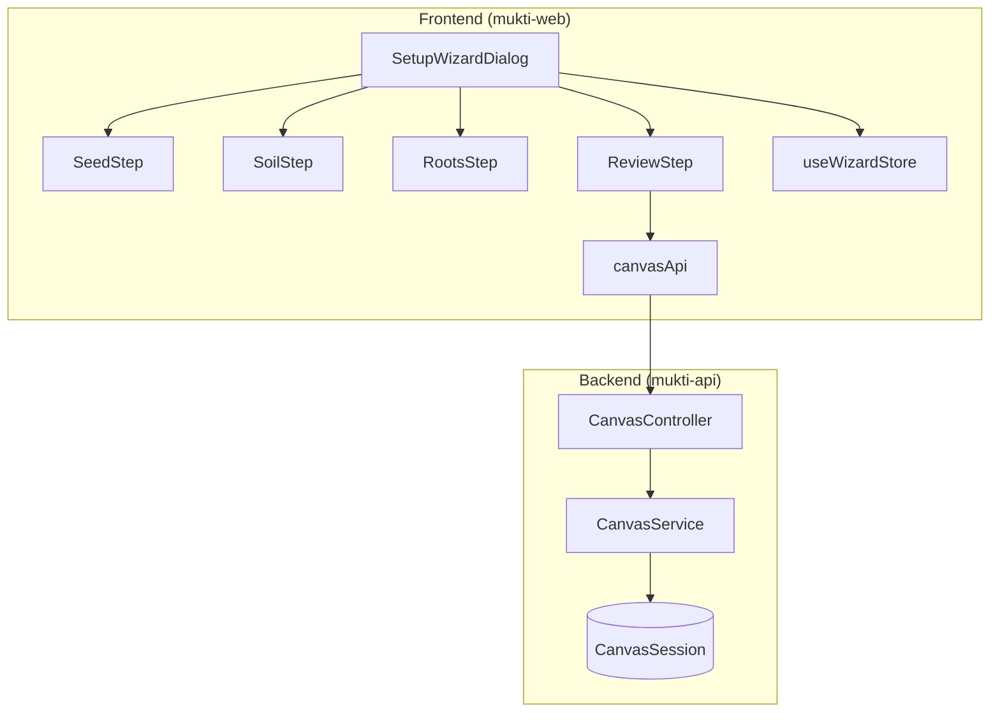

# Design Document: Thinking Canvas Setup Wizard

## Overview

The Setup Wizard is a multi-step modal form that guides users through defining the structure of their problem before entering the Thinking Canvas. It captures three key elements:

1. **Seed** - The main problem statement
2. **Soil** - Context and constraints surrounding the problem
3. **Roots** - Core assumptions the user holds about the problem

This structured input approach provides the AI with rich context for effective Socratic mentoring, differentiating Mukti from linear chat interfaces.

## Architecture



## Components and Interfaces

### Frontend Components

#### SetupWizardDialog
The main container component that manages wizard state and step navigation.

```typescript
interface SetupWizardDialogProps {
  open: boolean;
  onOpenChange: (open: boolean) => void;
  onSuccess?: (canvasSession: CanvasSession) => void;
}
```

#### Step Components
Each step is a separate component for maintainability:

```typescript
// SeedStep - Problem statement input
interface SeedStepProps {
  value: string;
  onChange: (value: string) => void;
  onNext: () => void;
  errors?: string[];
}

// SoilStep - Context/constraints input
interface SoilStepProps {
  items: string[];
  onAdd: (item: string) => void;
  onRemove: (index: number) => void;
  onNext: () => void;
  onBack: () => void;
  errors?: string[];
}

// RootsStep - Assumptions input
interface RootsStepProps {
  items: string[];
  onAdd: (item: string) => void;
  onRemove: (index: number) => void;
  onNext: () => void;
  onBack: () => void;
  errors?: string[];
}

// ReviewStep - Final review before creation
interface ReviewStepProps {
  seed: string;
  soil: string[];
  roots: string[];
  onConfirm: () => void;
  onBack: () => void;
  onEditStep: (step: WizardStep) => void;
  isSubmitting: boolean;
}
```

#### Wizard State Management (Zustand)

```typescript
type WizardStep = 'seed' | 'soil' | 'roots' | 'review';

interface WizardState {
  // Data
  seed: string;
  soil: string[];
  roots: string[];
  
  // Navigation
  currentStep: WizardStep;
  
  // Actions
  setSeed: (seed: string) => void;
  addSoilItem: (item: string) => void;
  removeSoilItem: (index: number) => void;
  addRootsItem: (item: string) => void;
  removeRootsItem: (index: number) => void;
  setStep: (step: WizardStep) => void;
  nextStep: () => void;
  prevStep: () => void;
  reset: () => void;
}
```

### Backend Components

#### CanvasController
REST controller for canvas session operations.

```typescript
@Controller('canvas')
export class CanvasController {
  @Post('sessions')
  createSession(@Body() dto: CreateCanvasSessionDto): Promise<CanvasSession>;
  
  @Get('sessions/:id')
  getSession(@Param('id') id: string): Promise<CanvasSession>;
  
  @Patch('sessions/:id')
  updateSession(
    @Param('id') id: string,
    @Body() dto: UpdateCanvasSessionDto
  ): Promise<CanvasSession>;
}
```

#### CanvasService
Business logic for canvas session management.

```typescript
@Injectable()
export class CanvasService {
  async createSession(
    userId: string,
    dto: CreateCanvasSessionDto
  ): Promise<CanvasSession>;
  
  async findSessionById(id: string): Promise<CanvasSession>;
  
  async updateSession(
    id: string,
    dto: UpdateCanvasSessionDto
  ): Promise<CanvasSession>;
}
```

## Data Models

### Frontend Types

```typescript
// Canvas session type for frontend
interface CanvasSession {
  id: string;
  userId: string;
  problemStructure: ProblemStructure;
  createdAt: string;
  updatedAt: string;
}

interface ProblemStructure {
  seed: string;      // Main problem statement (10-500 chars)
  soil: string[];    // Context items (0-10 items, 5-200 chars each)
  roots: string[];   // Assumptions (1-8 items, 5-200 chars each)
}

// DTOs
interface CreateCanvasSessionDto {
  seed: string;
  soil: string[];
  roots: string[];
}
```

### Backend Schema (MongoDB)

```typescript
@Schema({ collection: 'canvas_sessions', timestamps: true })
export class CanvasSession {
  _id: Types.ObjectId;
  
  @Prop({ required: true, ref: 'User', index: true })
  userId: Types.ObjectId;
  
  @Prop({ required: true, type: Object })
  problemStructure: {
    seed: string;
    soil: string[];
    roots: string[];
  };
  
  createdAt: Date;
  updatedAt: Date;
}
```

### Validation Schemas (Zod)

```typescript
// Seed validation
export const seedSchema = z
  .string()
  .min(10, 'Problem statement must be at least 10 characters')
  .max(500, 'Problem statement must be less than 500 characters')
  .transform((val) => val.trim())
  .refine((val) => val.length >= 10, 'Problem statement cannot be only whitespace');

// Soil item validation
export const soilItemSchema = z
  .string()
  .min(5, 'Context item must be at least 5 characters')
  .max(200, 'Context item must be less than 200 characters')
  .transform((val) => val.trim())
  .refine((val) => val.length >= 5, 'Context item cannot be only whitespace');

// Soil array validation
export const soilSchema = z
  .array(soilItemSchema)
  .max(10, 'Maximum 10 context items allowed');

// Roots item validation
export const rootsItemSchema = z
  .string()
  .min(5, 'Assumption must be at least 5 characters')
  .max(200, 'Assumption must be less than 200 characters')
  .transform((val) => val.trim())
  .refine((val) => val.length >= 5, 'Assumption cannot be only whitespace');

// Roots array validation
export const rootsSchema = z
  .array(rootsItemSchema)
  .min(1, 'At least one assumption is required')
  .max(8, 'Maximum 8 assumptions allowed');

// Complete problem structure
export const problemStructureSchema = z.object({
  seed: seedSchema,
  soil: soilSchema,
  roots: rootsSchema,
});

// Create canvas session DTO
export const createCanvasSessionSchema = problemStructureSchema;
```

## Correctness Properties

*A property is a characteristic or behavior that should hold true across all valid executions of a system-essentially, a formal statement about what the system should do. Properties serve as the bridge between human-readable specifications and machine-verifiable correctness guarantees.*

Based on the prework analysis, the following correctness properties have been identified:

### Property 1: Seed validation
*For any* string input as a problem statement, the validation should accept it if and only if the trimmed string length is between 10 and 500 characters (inclusive).
**Validates: Requirements 1.2, 1.3**

### Property 2: Item validation
*For any* string input as a soil item or roots item, the validation should accept it if and only if the trimmed string length is between 5 and 200 characters (inclusive).
**Validates: Requirements 2.2, 3.2**

### Property 3: List management consistency
*For any* sequence of add and remove operations on soil or roots items, the resulting list should contain exactly the items that were added and not subsequently removed, in the order they were added.
**Validates: Requirements 2.3, 3.3**

### Property 4: Soil array constraints
*For any* soil array, the validation should accept it if and only if it contains between 0 and 10 items (inclusive).
**Validates: Requirements 2.4**

### Property 5: Roots array constraints
*For any* roots array, the validation should accept it if and only if it contains between 1 and 8 items (inclusive).
**Validates: Requirements 3.4**

### Property 6: Review displays complete structure
*For any* valid problem structure (seed, soil, roots), when rendered in the review step, all components should be present and match the input values exactly.
**Validates: Requirements 4.1**

### Property 7: Navigation preserves data
*For any* wizard state with entered data, navigating backward and forward through steps should preserve all entered data without modification.
**Validates: Requirements 5.2, 5.3**

### Property 8: Problem structure persistence
*For any* valid problem structure submitted through the wizard, the API call should include the complete structure (seed, soil, roots) and the authenticated user's ID.
**Validates: Requirements 4.3, 4.4, 7.1, 7.5**

### Property 9: Problem structure round-trip
*For any* valid problem structure, serializing to JSON and deserializing should produce an equivalent structure.
**Validates: Requirements 7.2**

## Error Handling

### Frontend Error Handling

1. **Validation Errors**: Display inline error messages below input fields using the Form component's error state.

2. **API Errors**: 
   - Network errors: Display toast notification with retry option
   - Server errors (5xx): Display generic error message with retry
   - Validation errors (400): Map to form field errors

3. **State Recovery**: On wizard close without completion, prompt user to confirm abandonment if data has been entered.

```typescript
// Error display pattern
{errors?.map((error, index) => (
  <p key={index} className="text-sm text-destructive mt-1">
    {error}
  </p>
))}
```

### Backend Error Handling

1. **Validation Errors**: Return 400 with detailed field-level errors
2. **Authentication Errors**: Return 401 for unauthenticated requests
3. **Not Found**: Return 404 for non-existent sessions
4. **Server Errors**: Log error details, return 500 with generic message

```typescript
// Standard error response format
{
  success: false,
  error: {
    code: 'VALIDATION_ERROR',
    message: 'Validation failed',
    details: {
      seed: ['Problem statement must be at least 10 characters'],
      roots: ['At least one assumption is required']
    }
  }
}
```

## Testing Strategy

### Property-Based Testing Library
Use **fast-check** for property-based testing in TypeScript. Configure each test to run a minimum of 100 iterations.

### Unit Tests

1. **Validation Schema Tests**
   - Test seedSchema with valid/invalid inputs
   - Test soilItemSchema and rootsItemSchema
   - Test array constraints for soil and roots

2. **Component Tests**
   - Test each step component renders correctly
   - Test form submission and validation display
   - Test navigation between steps

3. **Store Tests**
   - Test Zustand store actions
   - Test state transitions

### Property-Based Tests

Each correctness property will be implemented as a property-based test using fast-check:

```typescript
// Example: Property 1 - Seed validation
// **Feature: thinking-canvas-setup-wizard, Property 1: Seed validation**
describe('Seed validation property', () => {
  it('accepts strings with trimmed length 10-500', () => {
    fc.assert(
      fc.property(
        fc.string({ minLength: 10, maxLength: 500 }),
        (input) => {
          const result = seedSchema.safeParse(input);
          const trimmedLength = input.trim().length;
          return result.success === (trimmedLength >= 10 && trimmedLength <= 500);
        }
      ),
      { numRuns: 100 }
    );
  });
});
```

### Integration Tests

1. **API Integration**
   - Test canvas session creation endpoint
   - Test authentication requirement
   - Test validation error responses

2. **E2E Flow**
   - Complete wizard flow from start to canvas creation
   - Test navigation and data persistence
