# Design Document: Thinking Canvas Visualization

## Overview

The Canvas Visualization transforms the structured problem input from Phase 1 into an interactive, spatial mind map using React Flow. Users see their problem statement (Seed) as a central node with context items (Soil) and assumptions (Roots) arranged as satellite nodes. This visual representation enables users to see the "shape" of their problem and provides the foundation for context-aware Socratic dialogue in Phase 3.

## Architecture

```mermaid
graph TB
    subgraph Frontend ["Frontend (mukti-web)"]
        CanvasPage["/dashboard/canvas/[id]"]
        ThinkingCanvas[ThinkingCanvas]
        
        subgraph Nodes ["Custom Nodes"]
            SeedNode[SeedNode]
            SoilNode[SoilNode]
            RootNode[RootNode]
        end
        
        subgraph Controls ["Canvas Controls"]
            ZoomControls[ZoomControls]
            CanvasLegend[CanvasLegend]
            NodePanel[NodePanel]
        end
        
        CanvasStore[useCanvasStore]
        CanvasHooks[useCanvasSession]
        
        CanvasPage --> ThinkingCanvas
        ThinkingCanvas --> SeedNode
        ThinkingCanvas --> SoilNode
        ThinkingCanvas --> RootNode
        ThinkingCanvas --> ZoomControls
        ThinkingCanvas --> CanvasLegend
        ThinkingCanvas --> NodePanel
        ThinkingCanvas --> CanvasStore
        CanvasPage --> CanvasHooks
    end
    
    subgraph Backend ["Backend (mukti-api)"]
        CanvasController[CanvasController]
        CanvasService[CanvasService]
        CanvasSchema[(CanvasSession)]
    end
    
    CanvasHooks --> CanvasController
    CanvasController --> CanvasService
    CanvasService --> CanvasSchema
```



## Components and Interfaces

### React Flow Integration

Install React Flow as a dependency:
```bash
bun add @xyflow/react
```

### Custom Node Components

#### SeedNode
The central problem statement node with distinct styling.

```typescript
interface SeedNodeData {
  label: string;           // Problem statement text
  isExplored?: boolean;    // Whether node has been explored in dialogue
}

interface SeedNodeProps {
  data: SeedNodeData;
  selected: boolean;
}
```

#### SoilNode
Context/constraint satellite nodes.

```typescript
interface SoilNodeData {
  label: string;           // Context item text
  index: number;           // Position in soil array
  isExplored?: boolean;
}

interface SoilNodeProps {
  data: SoilNodeData;
  selected: boolean;
}
```

#### RootNode
Assumption satellite nodes.

```typescript
interface RootNodeData {
  label: string;           // Assumption text
  index: number;           // Position in roots array
  isExplored?: boolean;
}

interface RootNodeProps {
  data: RootNodeData;
  selected: boolean;
}
```

### Main Canvas Component

```typescript
interface ThinkingCanvasProps {
  session: CanvasSession;
  onNodeSelect?: (nodeId: string | null, nodeType: NodeType) => void;
  onPositionChange?: (nodeId: string, position: Position) => void;
}

type NodeType = 'seed' | 'soil' | 'root';

interface Position {
  x: number;
  y: number;
}
```

### Canvas Controls

```typescript
// Zoom controls toolbar
interface ZoomControlsProps {
  onZoomIn: () => void;
  onZoomOut: () => void;
  onFitView: () => void;
  currentZoom: number;
  minZoom: number;  // 0.25
  maxZoom: number;  // 2.0
}

// Legend showing node types
interface CanvasLegendProps {
  showExplorationStatus?: boolean;
}

// Side panel for selected node
interface NodePanelProps {
  selectedNode: CanvasNode | null;
  onClose: () => void;
  onStartDialogue?: (nodeId: string) => void;  // Phase 3 integration
}
```

### Canvas State Management (Zustand)

```typescript
interface CanvasState {
  // React Flow state
  nodes: Node[];
  edges: Edge[];
  
  // Selection
  selectedNodeId: string | null;
  
  // Viewport
  viewport: { x: number; y: number; zoom: number };
  
  // Actions
  setNodes: (nodes: Node[]) => void;
  setEdges: (edges: Edge[]) => void;
  onNodesChange: OnNodesChange;
  onEdgesChange: OnEdgesChange;
  selectNode: (nodeId: string | null) => void;
  updateNodePosition: (nodeId: string, position: Position) => void;
  setViewport: (viewport: Viewport) => void;
  initializeFromSession: (session: CanvasSession) => void;
}
```

### Backend Extensions

Extend the CanvasSession schema from Phase 1 to include node positions:

```typescript
interface NodePosition {
  nodeId: string;
  x: number;
  y: number;
}

// Extended CanvasSession
interface CanvasSession {
  id: string;
  userId: string;
  problemStructure: ProblemStructure;
  nodePositions?: NodePosition[];  // Persisted custom positions
  exploredNodes?: string[];        // Node IDs that have been explored
  createdAt: string;
  updatedAt: string;
}

// Update DTO
interface UpdateCanvasSessionDto {
  nodePositions?: NodePosition[];
  exploredNodes?: string[];
}
```

## Data Models

### Node ID Convention

```typescript
// Node IDs follow a predictable pattern for easy lookup
const SEED_NODE_ID = 'seed';
const getSoilNodeId = (index: number) => `soil-${index}`;
const getRootNodeId = (index: number) => `root-${index}`;
```

### React Flow Node Structure

```typescript
import type { Node, Edge } from '@xyflow/react';

// Node types for React Flow
type CanvasNodeType = 'seed' | 'soil' | 'root';

interface CanvasNode extends Node {
  type: CanvasNodeType;
  data: SeedNodeData | SoilNodeData | RootNodeData;
}

interface CanvasEdge extends Edge {
  source: string;  // Always 'seed' for initial structure
  target: string;  // Soil or Root node ID
}
```

### Layout Configuration

```typescript
interface LayoutConfig {
  centerX: number;
  centerY: number;
  soilRadius: number;      // Distance from center for soil nodes
  rootRadius: number;      // Distance from center for root nodes
  soilStartAngle: number;  // Starting angle for soil arc (radians)
  soilEndAngle: number;    // Ending angle for soil arc
  rootStartAngle: number;  // Starting angle for root arc
  rootEndAngle: number;    // Ending angle for root arc
  minNodeSpacing: number;  // Minimum pixels between nodes
}

const DEFAULT_LAYOUT: LayoutConfig = {
  centerX: 0,
  centerY: 0,
  soilRadius: 250,
  rootRadius: 250,
  soilStartAngle: Math.PI * 0.75,   // Upper left
  soilEndAngle: Math.PI * 1.25,     // Lower left
  rootStartAngle: -Math.PI * 0.25,  // Upper right
  rootEndAngle: Math.PI * 0.25,     // Lower right
  minNodeSpacing: 80,
};
```

## Auto-Layout Algorithm

```typescript
/**
 * Generates initial node positions using radial layout
 * - Seed at center
 * - Soil nodes in left arc
 * - Root nodes in right arc
 */
function generateLayout(
  problemStructure: ProblemStructure,
  config: LayoutConfig = DEFAULT_LAYOUT
): { nodes: CanvasNode[]; edges: CanvasEdge[] } {
  const nodes: CanvasNode[] = [];
  const edges: CanvasEdge[] = [];
  
  // Seed node at center
  nodes.push({
    id: SEED_NODE_ID,
    type: 'seed',
    position: { x: config.centerX, y: config.centerY },
    data: { label: problemStructure.seed },
  });
  
  // Soil nodes in left arc
  const soilAngleStep = (config.soilEndAngle - config.soilStartAngle) / 
    Math.max(problemStructure.soil.length - 1, 1);
  
  problemStructure.soil.forEach((item, index) => {
    const angle = config.soilStartAngle + (index * soilAngleStep);
    const nodeId = getSoilNodeId(index);
    
    nodes.push({
      id: nodeId,
      type: 'soil',
      position: {
        x: config.centerX + Math.cos(angle) * config.soilRadius,
        y: config.centerY + Math.sin(angle) * config.soilRadius,
      },
      data: { label: item, index },
    });
    
    edges.push({
      id: `edge-seed-${nodeId}`,
      source: SEED_NODE_ID,
      target: nodeId,
    });
  });
  
  // Root nodes in right arc
  const rootAngleStep = (config.rootEndAngle - config.rootStartAngle) / 
    Math.max(problemStructure.roots.length - 1, 1);
  
  problemStructure.roots.forEach((item, index) => {
    const angle = config.rootStartAngle + (index * rootAngleStep);
    const nodeId = getRootNodeId(index);
    
    nodes.push({
      id: nodeId,
      type: 'root',
      position: {
        x: config.centerX + Math.cos(angle) * config.rootRadius,
        y: config.centerY + Math.sin(angle) * config.rootRadius,
      },
      data: { label: item, index },
    });
    
    edges.push({
      id: `edge-seed-${nodeId}`,
      source: SEED_NODE_ID,
      target: nodeId,
    });
  });
  
  return { nodes, edges };
}
```

## Correctness Properties

*A property is a characteristic or behavior that should hold true across all valid executions of a system-essentially, a formal statement about what the system should do. Properties serve as the bridge between human-readable specifications and machine-verifiable correctness guarantees.*

### Property 1: Node generation from problem structure
*For any* valid problem structure with a seed, N soil items, and M root items, the canvas should generate exactly 1 + N + M nodes (1 seed + N soil + M root nodes).
**Validates: Requirements 1.1, 2.1, 3.1**

### Property 2: Text truncation at thresholds
*For any* node label, if the label length exceeds the threshold (100 chars for Seed, 50 chars for Soil/Root), the displayed text should be truncated with ellipsis, and the full text should be available on hover.
**Validates: Requirements 1.4, 2.5, 3.5**

### Property 3: Edge generation
*For any* canvas with N soil nodes and M root nodes, there should be exactly N + M edges, each connecting a satellite node to the Seed node.
**Validates: Requirements 2.4, 3.4**

### Property 4: Auto-layout grouping
*For any* problem structure, after auto-layout: (a) the Seed node should be at the center position, (b) all Soil nodes should be positioned in the left hemisphere, (c) all Root nodes should be positioned in the right hemisphere, (d) no two nodes should be closer than the minimum spacing threshold.
**Validates: Requirements 6.2, 6.3, 6.4, 6.5, 2.2, 3.2**

### Property 5: Single selection invariant
*For any* sequence of node selection operations, at most one node should be in the selected state at any time.
**Validates: Requirements 5.1, 5.2, 5.3**

### Property 6: Zoom constraints
*For any* zoom operation, the resulting zoom level should be clamped between 0.25 (25%) and 2.0 (200%).
**Validates: Requirements 4.3**

### Property 7: Position persistence round-trip
*For any* node position update, saving and reloading the canvas session should restore the node to the same position.
**Validates: Requirements 7.3**

### Property 8: Position bounds
*For any* node drag operation, the final node position should remain within the defined canvas bounds.
**Validates: Requirements 7.4**

### Property 9: Exploration status indicator
*For any* node marked as explored, the node should display a visual indicator distinguishing it from unexplored nodes.
**Validates: Requirements 8.4**

### Property 10: Canvas data loading
*For any* valid canvas session ID, navigating to `/dashboard/canvas/[id]` should load and display the correct problem structure.
**Validates: Requirements 10.2**

### Property 11: Authorization enforcement
*For any* canvas session, only the owning user should be able to view it; requests from other users should be rejected.
**Validates: Requirements 10.5**

## Error Handling

### Frontend Error Handling

1. **Session Not Found**: Display a friendly not-found page with link to create new canvas
2. **Load Failure**: Show error state with retry button
3. **Position Save Failure**: Queue failed updates for retry, show subtle error indicator
4. **React Flow Errors**: Wrap canvas in error boundary, show fallback UI

```typescript
// Error boundary fallback
function CanvasErrorFallback({ error, resetErrorBoundary }) {
  return (
    <div className="flex flex-col items-center justify-center h-full">
      <AlertCircle className="h-12 w-12 text-destructive mb-4" />
      <h2 className="text-lg font-semibold mb-2">Canvas Error</h2>
      <p className="text-muted-foreground mb-4">{error.message}</p>
      <Button onClick={resetErrorBoundary}>Try Again</Button>
    </div>
  );
}
```

### Backend Error Handling

1. **Session Not Found**: Return 404 with clear message
2. **Unauthorized Access**: Return 403 for sessions owned by other users
3. **Invalid Position Data**: Return 400 with validation errors
4. **Database Errors**: Log and return 500 with generic message

## Testing Strategy

### Property-Based Testing Library
Use **fast-check** for property-based testing. Configure each test to run a minimum of 100 iterations.

### Unit Tests

1. **Layout Algorithm Tests**
   - Test node generation count
   - Test position calculations
   - Test edge generation

2. **Custom Node Component Tests**
   - Test text truncation
   - Test selection styling
   - Test exploration indicator

3. **Canvas Store Tests**
   - Test node/edge state management
   - Test selection state
   - Test viewport state

### Property-Based Tests

```typescript
// Example: Property 1 - Node generation
// **Feature: thinking-canvas-visualization, Property 1: Node generation from problem structure**
describe('Node generation property', () => {
  it('generates correct number of nodes', () => {
    fc.assert(
      fc.property(
        fc.record({
          seed: fc.string({ minLength: 10, maxLength: 500 }),
          soil: fc.array(fc.string({ minLength: 5, maxLength: 200 }), { maxLength: 10 }),
          roots: fc.array(fc.string({ minLength: 5, maxLength: 200 }), { minLength: 1, maxLength: 8 }),
        }),
        (problemStructure) => {
          const { nodes } = generateLayout(problemStructure);
          const expectedCount = 1 + problemStructure.soil.length + problemStructure.roots.length;
          return nodes.length === expectedCount;
        }
      ),
      { numRuns: 100 }
    );
  });
});
```

### Integration Tests

1. **Canvas Page Tests**
   - Test route loading
   - Test authentication redirect
   - Test not-found handling

2. **React Flow Integration**
   - Test pan/zoom interactions
   - Test node drag and drop
   - Test selection behavior
