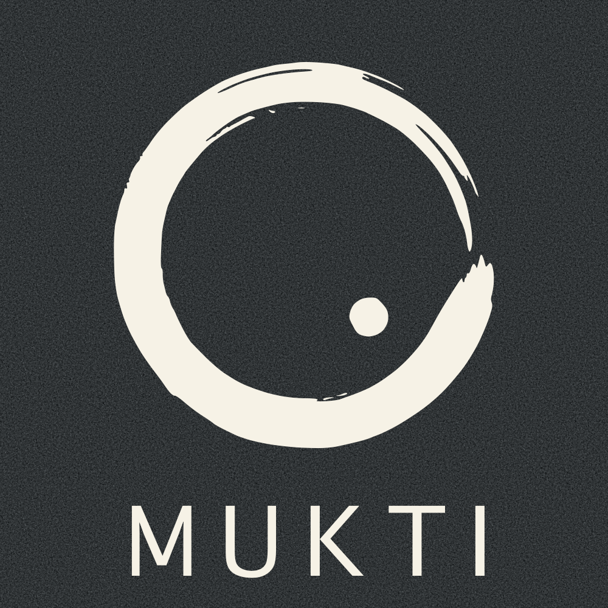
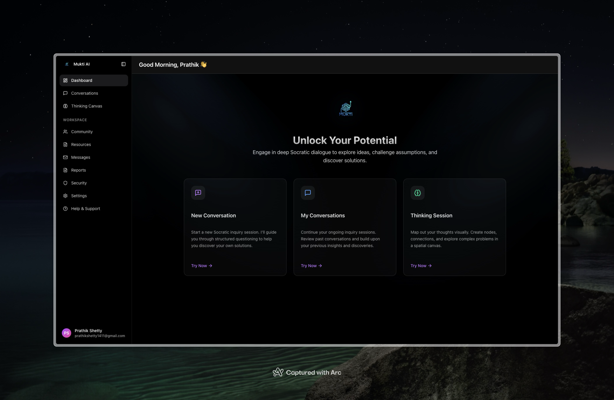
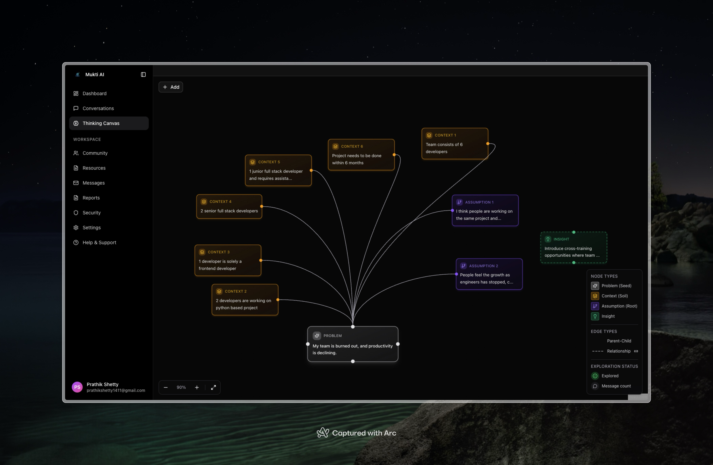

<div align="center">
  <picture>
    <source media="(prefers-color-scheme: dark)" srcset="packages/mukti-web/public/mukti-enso/mukti-inverted-no-bg.png" />
    <source media="(prefers-color-scheme: light)" srcset="packages/mukti-web/public/mukti-enso-inverted/mukti-no-bg.png" />
    
  </picture>

  <h1>mukti</h1>
  <p><strong>Liberation from AI Dependency</strong></p>
  <p><em>Mukti (mook-tee /ˈmʊkti/) translates to <strong>Liberation</strong> from Hindi.</em></p>

  <p>
    <a href="LICENSE"></a>
    
    
    
    
    
  </p>

  <p>
    <a href="DEVELOPMENT.md">Setup</a> |
    <a href="docs/reference/architecture/overview.md">Architecture</a> |
    <a href="RELEASE.md">Release</a> |
    <a href="packages/mukti-api/README.md">API</a> |
    <a href="mukti-mcp-server/README.md">MCP server</a>
  </p>
</div>

## Why Mukti

AI tools are useful, but they are easy to overuse. When every task gets auto-completed, people can slowly lose the habit of asking better questions, testing assumptions, and building original ideas.

Mukti is built around a different default: use AI as a thought partner, not a replacement for thought. The goal is not to ban AI. The goal is to stay intellectually in the loop while still benefiting from modern tooling.

That concern is not just philosophical. A relevant reference is MIT's paper, [Your Brain on ChatGPT: Accumulation of Cognitive Debt when Using an AI Assistant for Essay Writing Task](https://arxiv.org/pdf/2506.08872), which explores how assistance patterns can affect cognitive effort.

> [!IMPORTANT]
> Mukti is not a shortcut machine. If you want final answers without reflection, this product will feel uncomfortable by design.

## What Mukti Does

Mukti is a thinking workspace powered by a Socratic assistant: it guides you through problems with questions, structure, and references so you produce better reasoning, not just faster output.

- Turns vague prompts into clearer problem statements.
- Gives you canvases to break work into assumptions, options, and tradeoffs.
- Builds inquiry paths that keep investigation focused.
- Suggests relevant resources and follow-up reading.
- Prompts reflection so decisions are explicit and reviewable.

> [!NOTE]
> Expect more questions than answers. Progress in Mukti comes from active thinking, not passive consumption.

## How It Works (Socratic Method)

Mukti uses dialogue to push thinking forward without taking control of your work.

- **Probing questions:** surfaces missing context, constraints, and assumptions.
- **Self-discovery prompts:** helps you generate and compare your own options.
- **Iterative dialogue:** each turn builds on your latest answer.
- **Guided autonomy:** provides hints and resources without solving everything for you.
- **Reflection loops:** asks you to summarize decisions and reasoning before moving on.

**Example**

You ask: "I'm getting `TypeError: NoneType object is not iterable` in Python."

Mukti responds with a compact sequence:

- "Which variable is `None` at the failure point?"
- "What input path can produce that `None` value?"
- "Can you add a guard and a focused test for that path?"
- "Here is a debugging reference for this exact error class."

## Screenshots




## Repo Structure

```text
.
├── packages/mukti-web        # Next.js app
├── packages/mukti-api        # NestJS API
├── packages/mukti-mcp        # MCP prototype
└── docs/*                    # technical docs assets
```

## Quickstart (Local Dev)

For full setup variants and troubleshooting, see [DEVELOPMENT.md](DEVELOPMENT.md).

```bash
bun run dev
```

Optional dependencies:

```bash
docker compose up -d
```

This now starts MongoDB, Redis, a one-shot API seed job, the API, and the web app.
The seed step is idempotent and runs before the API starts.

Seeded local users:

- `test@mukti.app` / `testpassword123`
- `admin@mukti.live` / `muktifrombrainrot`

Default local ports from `docker-compose.yml`:

- API: `3000`
- Web: `3001`

## License

This project is open source and available under the [MIT License](LICENSE).

## Acknowledgments

Inspired by my mentor [Shaik Noorullah](https://github.com/shaiknoorullah) and the Socratic tradition of inquiry.

_"The only true wisdom is in knowing you know nothing."_ - Socrates
