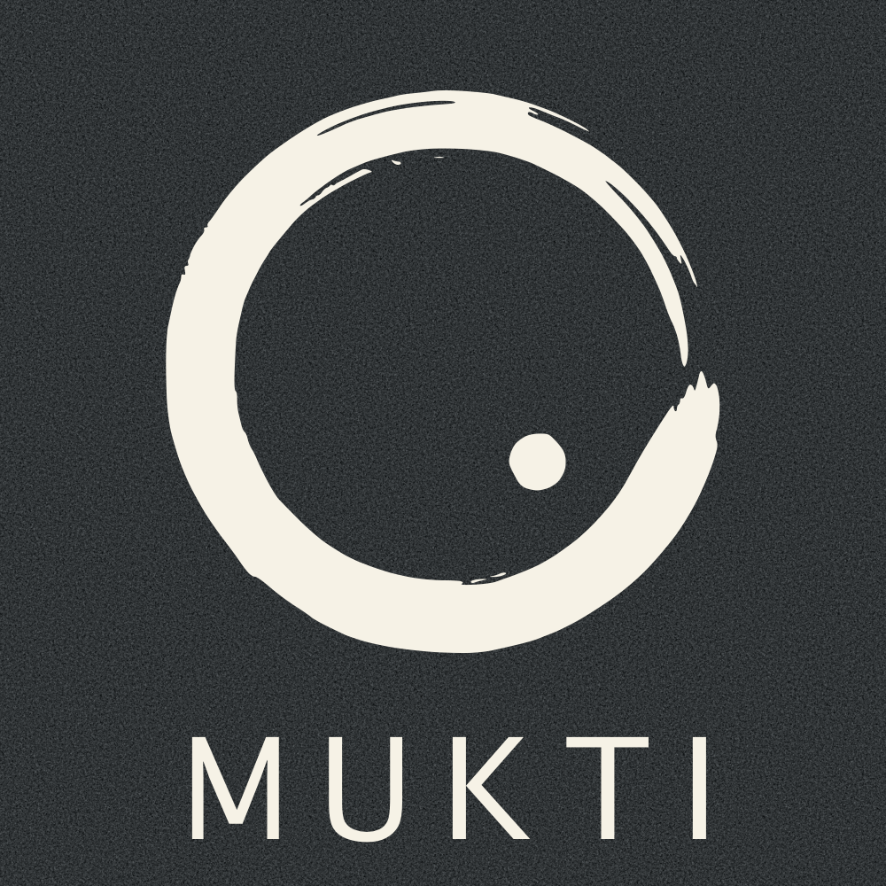

<div align="center">
  <picture>
    <source media="(prefers-color-scheme: dark)" srcset="packages/mukti-web/public/mukti-enso/mukti-inverted-no-bg.png" />
    <source media="(prefers-color-scheme: light)" srcset="packages/mukti-web/public/mukti-enso-inverted/mukti-no-bg.png" />
    
  </picture>

  <h1>mukti</h1>
  <p><strong>Liberation from AI Dependency</strong></p>
  <p><em>Mukti (mook-tee /ˈmʊkti/) — "Liberation" in Hindi</em></p>

  <p>
    <a href="LICENSE"></a>
    
    
    
    
    
  </p>

  <p>
    <a href="DEVELOPMENT.md">Setup</a> |
    <a href="docs/reference/architecture/overview.md">Architecture</a> |
    <a href="RELEASE.md">Release</a> |
    <a href="packages/mukti-api/README.md">API</a> |
    <a href="mukti-mcp-server/README.md">MCP Server</a>
  </p>
</div>

---

## What is Mukti?

Mukti is a thinking workspace powered by a Socratic assistant. Instead of giving you answers, it responds with better questions — guiding you through problems with structured canvases, reflection loops, and inquiry paths so **you** produce the insights.

- Turns vague prompts into clearer problem statements
- Gives you canvases to break work into assumptions, options, and tradeoffs
- Builds inquiry paths that keep investigation focused
- Suggests relevant resources and follow-up reading
- Prompts reflection so decisions are explicit and reviewable

> [!IMPORTANT]
> Mukti is not a shortcut machine. If you want final answers without reflection, this product will feel uncomfortable — by design.

## Demo

<video src="https://github.com/shettydev/mukti/releases/download/assets-v1/demo-01.mp4" width="100%" controls></video>

<video src="https://github.com/shettydev/mukti/releases/download/assets-v1/demo-02.mp4" width="100%" controls></video>

## Why?

AI tools are useful, but easy to overuse. When every task gets auto-completed, people slowly lose the habit of asking better questions, testing assumptions, and building original ideas.

Mukti is built around a different default: use AI as a thought partner, not a replacement for thought. The goal is not to ban AI — it's to stay intellectually in the loop while still benefiting from modern tooling.

> A relevant reference: MIT's [Your Brain on ChatGPT](https://arxiv.org/pdf/2506.08872) explores how AI assistance patterns can affect cognitive effort.

## How It Works (Socratic Method)

Mukti uses dialogue to push thinking forward without taking control of your work:

- **Probing questions** — surfaces missing context, constraints, and assumptions
- **Self-discovery prompts** — helps you generate and compare your own options
- **Iterative dialogue** — each turn builds on your latest answer
- **Guided autonomy** — provides hints and resources without solving everything
- **Reflection loops** — asks you to summarize decisions and reasoning before moving on

**Example**

You ask: _"I'm getting `TypeError: NoneType object is not iterable` in Python."_

Mukti responds with a compact sequence:

1. "Which variable is `None` at the failure point?"
2. "What input path can produce that `None` value?"
3. "Can you add a guard and a focused test for that path?"
4. "Here is a debugging reference for this exact error class."

## Quickstart (one command, uses your own AI CLI)

If you already have an AI CLI installed and signed in — [Claude Code](https://docs.claude.com/en/docs/claude-code/overview)
or the [Antigravity CLI](https://antigravity.google/docs/cli/reference) — you can run Mukti with
**no Docker, no Redis, no OpenRouter key**. The AI runs through that CLI, on your own
subscription.

### Prerequisites

- [Git](https://git-scm.com/), and either [Bun](https://bun.sh/) (recommended — it is what
  the rest of the workspace uses) or Node 22.18+
- One of:
  - the `claude` CLI, signed in (`claude login`), or
  - the `agy` CLI, signed in (run `agy` once and follow the prompts)

### Run it

```bash
git clone https://github.com/shettydev/mukti.git
cd mukti
bun install
bun run start:local
```

Without Bun, the same two steps are `npm install` and `npm run start:local` — the launcher
runs on Node's built-in TypeScript support. Every other workspace script assumes Bun, so
install it before doing more than trying Mukti out. Without a checkout, `npx muktiai` does the
same from prebuilt packages.

That's it. The launcher picks your AI CLI, runs preflight checks (that CLI installed and signed
in, ports free), then boots the API and web app and opens [http://localhost:3001](http://localhost:3001).
No login is required — local mode signs you in as a seeded local user.

### Choosing the AI CLI

The first time you start Mukti with both CLIs ready, it asks which to use and offers to remember
your answer:

```
◇  Which AI CLI should Mukti use?
│  ● Claude CLI       ready · about 13-20 seconds per reply
│  ○ Antigravity CLI  ready · about 30-60 seconds and 15-25k tokens per reply
│
◇  Use Claude CLI by default from now on?  Yes
```

Every supported CLI is listed, including ones you have not installed or signed in to, so you can
see what the alternatives are. After that, launches use your saved choice without asking, and say
so. To change it, or to decide without being asked:

```bash
bun run start:local -- --choose                    # ask again, and offer to remember
bun run start:local -- --provider antigravity      # just this once
npx muktiai --provider antigravity --save          # set the default, no prompt
```

The launcher decides in this order: `--provider`, then the `AI_PROVIDER` environment variable,
then your saved choice, then whichever CLIs are ready — installed _and_ signed in. A CLI you have
not signed in to is never chosen for you. It always reports which provider it used and why.

Your choice is saved in `~/.mukti/config.json` (or under `--data-dir`/`MUKTI_HOME`), and the same
choice is used whether you run from a checkout or through `npx`. Delete that file to forget it.
Without a terminal — piped output, or CI — Mukti never asks: it uses the first ready CLI and tells
you how to choose another.

The two are not equivalent, and the difference is worth knowing before you choose:

|                           | Claude Code (`claude-code`)                               | Antigravity (`antigravity`)                                                                                                                                               |
| ------------------------- | --------------------------------------------------------- | ------------------------------------------------------------------------------------------------------------------------------------------------------------------------- |
| Time per reply (measured) | about 13–20 seconds                                       | about 30–60 seconds                                                                                                                                                       |
| Prompt size per reply     | Mukti's own prompt and your conversation                  | about 15–25k input tokens: the same, plus agy's own ~14k-token coding-agent prompt, which cannot be replaced                                                              |
| Stored outside Mukti      | whatever Claude Code itself records for a `claude -p` run | a conversation record (about 1 MB) per reply in your Antigravity history (`~/.gemini/antigravity-cli`), filed under a `mukti-socratic` project. Mukti never deletes these |

A few more things to know about Antigravity:

- Your **global** agy rules and hooks (`~/.gemini/config/`) apply to Mukti's replies too, and a
  global rule can change what a reply says. Your project-level agy customizations do not apply:
  agy runs from `~/.mukti/mukti-socratic`, never from your projects.
- Each reply's full prompt, including your conversation so far, is passed to `agy` as a
  command-line argument, so other processes on your machine can see it (for example with `ps`).
- Every so often a reply takes two agy runs instead of one, while Mukti refreshes which concepts
  the conversation is about.

**What local mode does:** sets `MUKTI_LOCAL=1` and `AI_PROVIDER` to the chosen CLI, replaces
MongoDB with an embedded file-backed instance under `.mukti/local-db/` (data persists
across restarts), processes conversations inline (no Redis), and generates ephemeral
secrets on boot.

> **First run** downloads a one-time embedded MongoDB binary (via `mongodb-memory-server`),
> so the first `run start:local` takes a little longer.
>
> Pick a model from the model picker. The list comes from the CLI you are running — Claude Code's
> Sonnet / Opus / Haiku aliases, or whatever `agy models` reports — and the selection is passed to
> that CLI's `--model`.

For the full hosted stack (auth, subscriptions, OpenRouter), use the Docker quickstart below.

## Quickstart (Docker)

### Prerequisites

- [Docker](https://docs.docker.com/get-docker/) and Docker Compose
- [Git](https://git-scm.com/)

### 1. Clone the repo

```bash
git clone https://github.com/shettydev/mukti.git
cd mukti
```

### 2. Configure environment

```bash
cp .env.example .env
```

Open `.env` and set your `OPENROUTER_API_KEY` — this powers all AI/Socratic features.
Get a free key at [openrouter.ai/settings/keys](https://openrouter.ai/settings/keys).

Everything else has sensible defaults for local development.

### 3. Start everything

```bash
docker compose up -d
```

This boots the full stack:

| Service | Description                | Port  |
| ------- | -------------------------- | ----- |
| MongoDB | Database                   | 27017 |
| Redis   | Cache and queues           | 6379  |
| Seed    | One-shot DB seeder (exits) | —     |
| API     | NestJS backend             | 3000  |
| Web     | Next.js frontend           | 3001  |

The seed step is idempotent and runs automatically before the API starts.

### 4. Open Mukti

Navigate to [http://localhost:3001](http://localhost:3001) in your browser.

### 5. Log in

Use one of the seeded accounts:

| Email              | Password            |
| ------------------ | ------------------- |
| `test@mukti.app`   | `testpassword123`   |
| `admin@mukti.chat` | `muktifrombrainrot` |

> If you previously seeded the old `admin@mukti.live` user, reset the database with
> `docker compose down -v && docker compose up -d` to pick up the new seed.

### Useful commands

```bash
docker compose up -d --build   # Rebuild and restart
docker compose down            # Stop everything
docker compose logs -f api     # Tail API logs
docker compose up seed         # Re-run seed manually
```

## Development (without Docker)

For running services individually with hot-reload, see [DEVELOPMENT.md](DEVELOPMENT.md).

```bash
bun install                         # Install dependencies
docker compose up -d mongodb redis  # Start only databases
bun run dev                         # Start API + Web in watch mode
```

## Repo Structure

```text
.
├── packages/mukti-web        # Next.js frontend
├── packages/mukti-api        # NestJS backend
├── mukti-mcp-server          # MCP server (standalone)
└── docs/                     # RFCs and technical docs
```

## License

This project is open source and available under the [MIT License](LICENSE).

## Acknowledgments

Inspired by my mentor [Shaik Noorullah](https://github.com/shaiknoorullah) and the Socratic tradition of inquiry.

_"The only true wisdom is in knowing you know nothing."_ — Socrates
