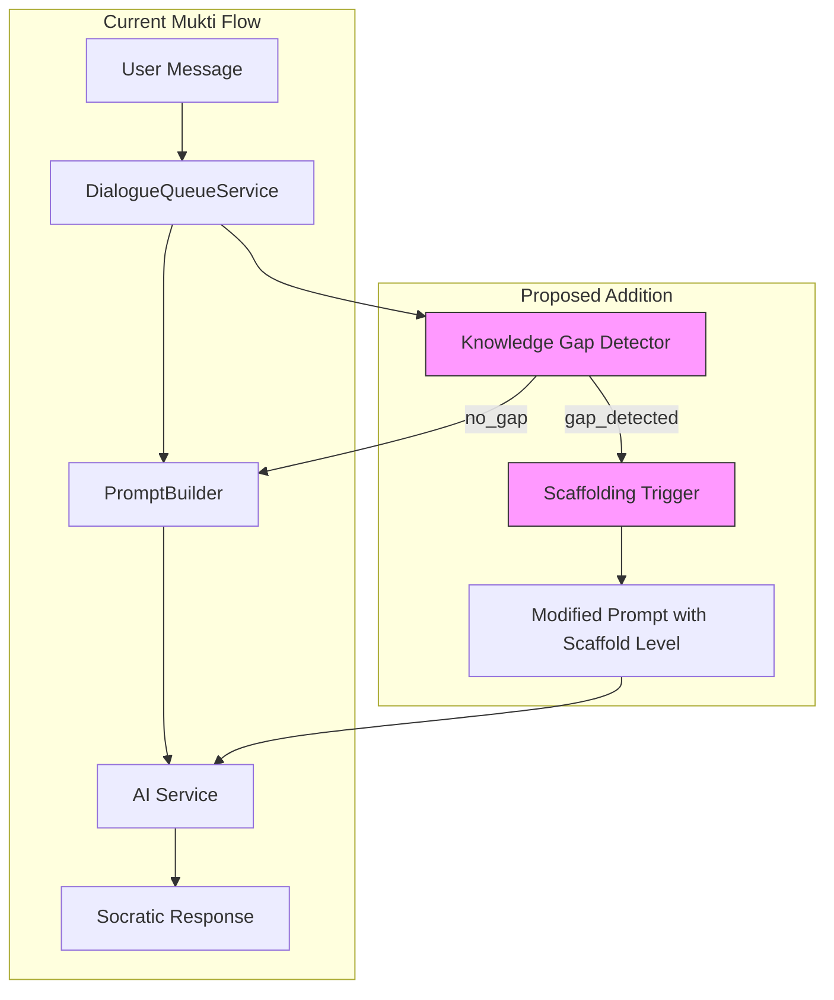
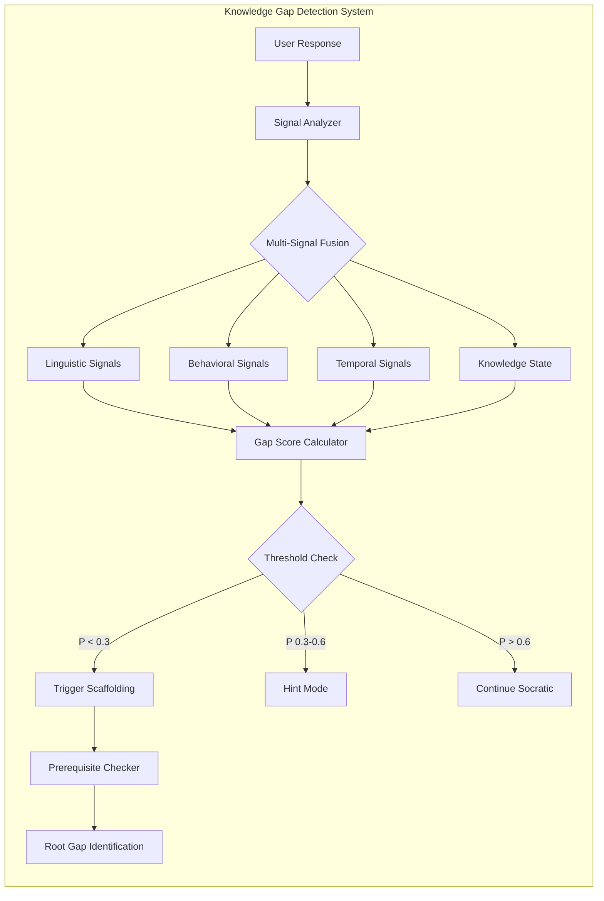
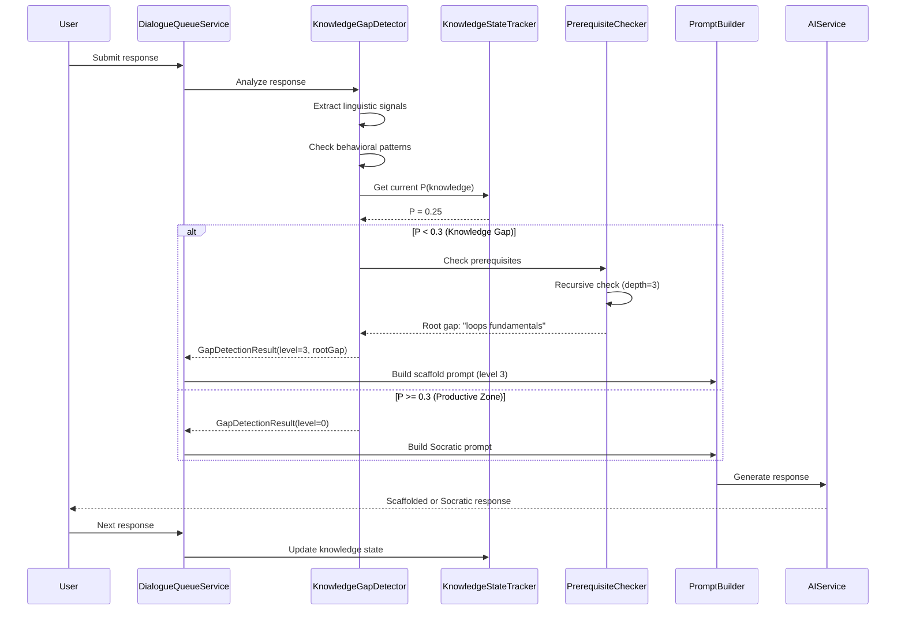
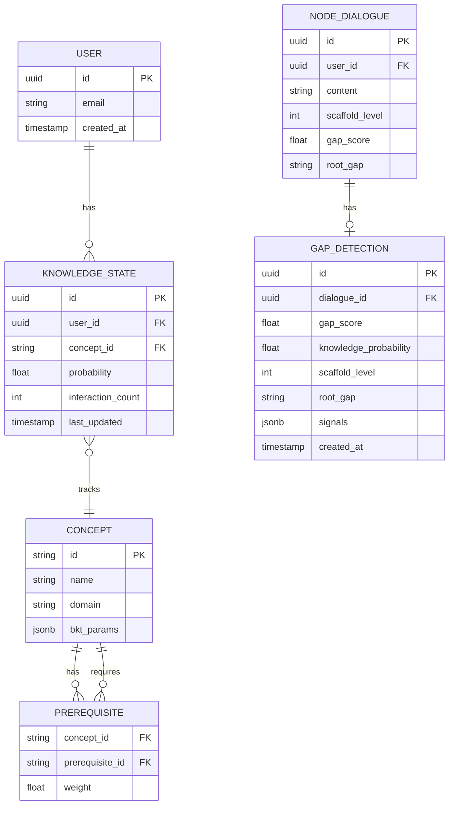

# RFC-0001: Knowledge Gap Detection System

<!-- HEADER BLOCK: Identifies the RFC and its current lifecycle state at a glance. -->

| Field                | Value                                                              |
| -------------------- | ------------------------------------------------------------------ |
| **RFC Number**       | 0001                                                               |
| **Title**            | Knowledge Gap Detection System                                     |
| **Status**           |  |
| **Author(s)**        | Mukti Core Team                                                    |
| **Created**          | 2026-02-28                                                         |
| **Last Updated**     | 2026-02-28                                                         |
| **Target Milestone** | v2.0.0 / Q2 2026                                                   |

> **Status options:** `Draft` | `In Review` | `Accepted` | `Rejected` | `Superseded`

---

## 1. Abstract

This RFC proposes a Knowledge Gap Detection System for Mukti that identifies when users genuinely lack foundational knowledge required to engage productively with Socratic questioning. The system introduces multi-signal detection (behavioral, linguistic, temporal), probabilistic knowledge state tracking using Bayesian Knowledge Tracing (BKT), and recursive prerequisite checking to find root knowledge gaps. When detected, the system triggers appropriate scaffolding interventions (see RFC-0002) rather than continuing pure Socratic dialogue that assumes latent knowledge exists. This addresses the "Knowledge Gap Paradox" — Mukti's current assumption that all users have dormant knowledge waiting to be surfaced through questioning.

---

## 2. Motivation

Mukti's Socratic approach assumes users have latent knowledge that can be surfaced through careful questioning. This assumption fails catastrophically when users genuinely don't know something — they cannot reason toward answers they have no foundation for.

### Current Pain Points

- **Pain Point 1: Frustration Loops** — Users caught in endless questioning cycles when they lack prerequisite knowledge. Current system has no fallback, leading to "I already told you I don't know" frustration.

- **Pain Point 2: No Knowledge State Modeling** — Mukti treats every interaction as stateless. It cannot distinguish between "hasn't thought about it yet" (productive questioning target) and "genuinely doesn't know the concept" (needs teaching first).

- **Pain Point 3: Prerequisite Blindness** — When a user struggles with concept X, the real gap may be prerequisite concepts P1, P2, P3. Current system keeps questioning about X instead of tracing back to the root gap.

- **Pain Point 4: Silent Abandonment** — Users who hit knowledge gaps often disengage silently. There's no detection of "outside ZPD" (Zone of Proximal Development) signals to trigger intervention.

### Evidence from Research

Production educational AI systems (Khan Academy, ALEKS, Carnegie Learning) all implement explicit knowledge gap detection:

- **Carnegie Learning's BKT**: Tracks P(knowledge) per-skill, intervenes when P < 0.3
- **ALEKS Knowledge Spaces**: Maps prerequisite relationships, only presents "ready to learn" concepts
- **AutoTutor**: Uses NLU to detect missing concepts in student explanations
- **2025 RPKT Research**: Shows recursive prerequisite checking is essential for "unknown unknowns"

Mukti's MCP server already has partial detection (`stuckIndicators` in `response-strategies.ts`) but it's disconnected from the main dialogue service.

---

## 3. Goals & Non-Goals

### Goals

- [ ] Detect knowledge gaps through multi-signal analysis (behavioral, linguistic, temporal)
- [ ] Implement lightweight Bayesian Knowledge Tracing for probabilistic knowledge state
- [ ] Build recursive prerequisite checking to find root gaps (up to 3 levels deep)
- [ ] Integrate detection into `DialogueQueueService` before AI prompt generation
- [ ] Track knowledge state per-user, per-concept across sessions
- [ ] Provide clear intervention triggers for scaffolding system (RFC-0002)

### Non-Goals

- **Full curriculum mapping**: We won't build complete prerequisite graphs for all domains. Start with common programming concepts, expand iteratively.
- **Replacement of Socratic method**: Detection triggers scaffolding, not abandonment of questioning entirely.
- **Real-time forgetting curves**: Spaced repetition is valuable but out of scope for v1. Focus on immediate gap detection.
- **Automated prerequisite inference**: Manual + LLM-assisted prerequisite mapping is acceptable; fully automated curriculum generation is future work.

---

## 4. Background & Context

### Prior Art

| Reference                                           | Relevance                                                                  |
| --------------------------------------------------- | -------------------------------------------------------------------------- |
| `mukti-mcp-server/src/response-strategies.ts`       | Existing `stuckIndicators` detection (disconnected from API)               |
| `docs/reference/planning/unified-thinking-model.md` | Documents "Anti-Resolution Signals" and frustration patterns               |
| GitHub Issue #3                                     | "Implement dynamic resource suggestion engine" — related but unimplemented |
| Carnegie Learning BKT                               | Production-validated probabilistic knowledge tracking                      |
| ALEKS Knowledge Space Theory                        | Prerequisite graph + "outer fringe" concept                                |
| RPKT (2025)                                         | Recursive prerequisite knowledge tracing for "unknown unknowns"            |

### System Context Diagram



---

## 5. Proposed Solution

### Overview

The Knowledge Gap Detection System operates as a pre-processing layer before AI prompt generation. It analyzes multiple signals to determine if the user is "outside their ZPD" — unable to productively engage with pure Socratic questioning due to missing foundational knowledge.

The system maintains a probabilistic knowledge state per-user, per-concept using simplified Bayesian Knowledge Tracing. When knowledge probability drops below threshold (P < 0.3) or behavioral signals indicate genuine ignorance, the system triggers scaffolding interventions rather than continuing pure questioning.

### Architecture Diagram



### Sequence Flow



### Detailed Design

#### 5.1 Signal Analyzer

The Signal Analyzer extracts four categories of signals from user responses:

**Linguistic Signals** (from MCP server patterns):

```typescript
const KNOWLEDGE_GAP_MARKERS = [
  "don't know",
  'no idea',
  'never heard of',
  'what is',
  'clueless',
  'no clue',
  'unfamiliar',
  'not sure what',
];

const CONFUSION_MARKERS = [
  "don't understand",
  'unclear',
  'confusing',
  'lost',
  'makes no sense',
  'over my head',
];

const FRUSTRATION_MARKERS = [
  'frustrated',
  'stuck',
  'giving up',
  'already told you',
  'just tell me',
  'stop asking',
];
```

**Behavioral Signals**:

- `consecutiveFailures`: Same concept, wrong attempts > 3
- `helpSeekingLoop`: Same question asked > 2 times
- `responseDegrade`: Response length shrinking (engagement drop)
- `randomGuessing`: Non-systematic approach changes

**Temporal Signals**:

- `timeOnProblem`: > 15 minutes without progress
- `responseLag`: Long pause followed by short/incorrect response
- `abandonmentPattern`: Started response, deleted, gave up

**Knowledge State** (from BKT):

- Current P(knowledge) for detected concept
- Prerequisite mastery levels
- Historical performance on related concepts

#### 5.2 Bayesian Knowledge Tracing (BKT)

Simplified BKT with 3 parameters per concept:

```typescript
interface BKTParameters {
  pInit: number; // P(L0) - Initial knowledge probability (default: 0.3)
  pLearn: number; // P(T) - Learning rate per interaction (default: 0.1)
  pSlip: number; // P(S) - Probability of error despite knowing (default: 0.1)
  pGuess: number; // P(G) - Probability of correct despite not knowing (default: 0.2)
}

interface KnowledgeState {
  conceptId: string;
  probability: number; // Current P(L)
  lastUpdated: Date;
  interactionCount: number;
}
```

**Update Algorithm**:

```typescript
function updateKnowledgeState(
  state: KnowledgeState,
  isCorrect: boolean,
  params: BKTParameters
): KnowledgeState {
  const { pSlip, pGuess, pLearn } = params;
  const pL = state.probability;

  let pLGivenEvidence: number;

  if (isCorrect) {
    // P(L | correct) using Bayes' theorem
    const pCorrect = pL * (1 - pSlip) + (1 - pL) * pGuess;
    pLGivenEvidence = (pL * (1 - pSlip)) / pCorrect;
  } else {
    // P(L | incorrect)
    const pIncorrect = pL * pSlip + (1 - pL) * (1 - pGuess);
    pLGivenEvidence = (pL * pSlip) / pIncorrect;
  }

  // Apply learning transition
  const newProbability = pLGivenEvidence + (1 - pLGivenEvidence) * pLearn;

  return {
    ...state,
    probability: newProbability,
    lastUpdated: new Date(),
    interactionCount: state.interactionCount + 1,
  };
}
```

#### 5.3 Prerequisite Checker

Recursive prerequisite checking to find root knowledge gaps:

```typescript
interface PrerequisiteGraph {
  concepts: Map<string, ConceptNode>;
  edges: Map<string, string[]>; // concept -> prerequisites
}

interface GapCheckResult {
  rootGap: string | null;
  missingPrerequisites: string[];
  depth: number;
}

function recursivePrerequisiteCheck(
  graph: PrerequisiteGraph,
  conceptId: string,
  userKnowledge: Map<string, KnowledgeState>,
  depth: number = 0,
  maxDepth: number = 3
): GapCheckResult {
  if (depth >= maxDepth) {
    return { rootGap: conceptId, missingPrerequisites: [], depth };
  }

  const prerequisites = graph.edges.get(conceptId) || [];
  const missingPrereqs: string[] = [];
  let deepestGap: GapCheckResult | null = null;

  for (const prereq of prerequisites) {
    const state = userKnowledge.get(prereq);
    const probability = state?.probability ?? 0.3; // Assume low if unknown

    if (probability < 0.5) {
      // Prerequisite not mastered
      missingPrereqs.push(prereq);

      // Recursively check this prerequisite's prerequisites
      const deeperCheck = recursivePrerequisiteCheck(
        graph,
        prereq,
        userKnowledge,
        depth + 1,
        maxDepth
      );

      if (!deepestGap || deeperCheck.depth > deepestGap.depth) {
        deepestGap = deeperCheck;
      }
    }
  }

  if (deepestGap) {
    return {
      rootGap: deepestGap.rootGap,
      missingPrerequisites: [...missingPrereqs, ...deepestGap.missingPrerequisites],
      depth: deepestGap.depth,
    };
  }

  return {
    rootGap: missingPrereqs.length > 0 ? missingPrereqs[0] : null,
    missingPrerequisites: missingPrereqs,
    depth,
  };
}
```

#### 5.4 Gap Score Calculator

Multi-signal fusion to produce final gap score:

```typescript
interface GapDetectionResult {
  gapScore: number; // 0-1, higher = more certain gap exists
  knowledgeProbability: number; // Current P(L) from BKT
  scaffoldLevel: ScaffoldLevel; // 0-4 (see RFC-0002)
  rootGap: string | null;
  signals: {
    linguistic: number;
    behavioral: number;
    temporal: number;
  };
  recommendation: 'socratic' | 'scaffold' | 'teach';
}

type ScaffoldLevel = 0 | 1 | 2 | 3 | 4;

function calculateGapScore(
  linguisticScore: number,
  behavioralScore: number,
  temporalScore: number,
  knowledgeProbability: number
): GapDetectionResult {
  // Weighted combination
  const weights = {
    linguistic: 0.3,
    behavioral: 0.25,
    temporal: 0.15,
    knowledge: 0.3,
  };

  const gapScore =
    weights.linguistic * linguisticScore +
    weights.behavioral * behavioralScore +
    weights.temporal * temporalScore +
    weights.knowledge * (1 - knowledgeProbability);

  // Determine scaffold level based on gap score
  let scaffoldLevel: ScaffoldLevel;
  let recommendation: 'socratic' | 'scaffold' | 'teach';

  if (gapScore < 0.3) {
    scaffoldLevel = 0;
    recommendation = 'socratic';
  } else if (gapScore < 0.5) {
    scaffoldLevel = 1;
    recommendation = 'scaffold';
  } else if (gapScore < 0.7) {
    scaffoldLevel = 2;
    recommendation = 'scaffold';
  } else if (gapScore < 0.85) {
    scaffoldLevel = 3;
    recommendation = 'scaffold';
  } else {
    scaffoldLevel = 4;
    recommendation = 'teach';
  }

  return {
    gapScore,
    knowledgeProbability,
    scaffoldLevel,
    rootGap: null, // Set by prerequisite checker
    signals: {
      linguistic: linguisticScore,
      behavioral: behavioralScore,
      temporal: temporalScore,
    },
    recommendation,
  };
}
```

#### 5.5 Integration with DialogueQueueService

```typescript
// packages/mukti-api/src/modules/dialogue/services/dialogue-queue.service.ts

@Injectable()
export class DialogueQueueService {
  constructor(
    private readonly knowledgeGapDetector: KnowledgeGapDetector,
    private readonly promptBuilder: PromptBuilder,
    private readonly aiService: DialogueAIService
  ) {}

  async process(dialogue: NodeDialogue): Promise<AIResponse> {
    // NEW: Detect knowledge gaps before generating prompt
    const gapResult = await this.knowledgeGapDetector.analyze({
      userMessage: dialogue.content,
      conversationHistory: dialogue.history,
      userId: dialogue.userId,
      conceptContext: dialogue.detectedConcepts,
    });

    // Store detection result on dialogue for tracking
    dialogue.gapDetectionResult = gapResult;

    // Build prompt with appropriate scaffold level
    const prompt = this.promptBuilder.build({
      dialogue,
      scaffoldLevel: gapResult.scaffoldLevel,
      rootGap: gapResult.rootGap,
      technique: gapResult.recommendation === 'teach' ? 'foundational' : 'socratic',
    });

    // Update knowledge state after response
    // (done in response handler, not here)

    return this.aiService.generateResponse(prompt);
  }
}
```

---

## 6. API / Interface Design

### Internal Service Interface

#### `KnowledgeGapDetector`

```typescript
interface KnowledgeGapDetector {
  analyze(input: GapDetectionInput): Promise<GapDetectionResult>;
  updateKnowledgeState(userId: string, conceptId: string, isCorrect: boolean): Promise<void>;
  getKnowledgeState(userId: string, conceptId: string): Promise<KnowledgeState | null>;
}

interface GapDetectionInput {
  userMessage: string;
  conversationHistory: ConversationTurn[];
  userId: string;
  conceptContext?: string[];
}
```

### REST Endpoints (Admin/Debug)

#### `GET /api/v1/users/:userId/knowledge`

Returns knowledge state for a user across all tracked concepts.

**Response (200 OK):**

```json
{
  "userId": "uuid",
  "concepts": [
    {
      "conceptId": "recursion",
      "probability": 0.72,
      "lastUpdated": "2026-02-28T10:30:00Z",
      "interactionCount": 15
    },
    {
      "conceptId": "loops",
      "probability": 0.91,
      "lastUpdated": "2026-02-27T14:20:00Z",
      "interactionCount": 8
    }
  ]
}
```

#### `GET /api/v1/concepts/:conceptId/prerequisites`

Returns prerequisite graph for a concept.

**Response (200 OK):**

```json
{
  "conceptId": "recursion",
  "prerequisites": [
    { "conceptId": "functions", "depth": 1 },
    { "conceptId": "loops", "depth": 1 },
    { "conceptId": "variables", "depth": 2 }
  ]
}
```

---

## 7. Data Model Changes

### Entity-Relationship Diagram



### Schema Changes

**New Collection: `knowledge_states`**

```typescript
interface KnowledgeStateDocument {
  _id: ObjectId;
  userId: ObjectId;
  conceptId: string;
  probability: number;
  interactionCount: number;
  lastUpdated: Date;
  history: Array<{
    probability: number;
    isCorrect: boolean;
    timestamp: Date;
  }>;
}
```

**New Collection: `concepts`**

```typescript
interface ConceptDocument {
  _id: string; // Use concept name as ID
  name: string;
  domain: string;
  prerequisites: string[];
  bktParams: {
    pInit: number;
    pLearn: number;
    pSlip: number;
    pGuess: number;
  };
}
```

**Modified: `node_dialogues`**

```typescript
// Add to existing NodeDialogue schema
interface NodeDialogueAdditions {
  scaffoldLevel?: 0 | 1 | 2 | 3 | 4;
  gapScore?: number;
  rootGap?: string;
  detectedConcepts?: string[];
}
```

### Migration Notes

- **Migration type:** Additive
- **Backwards compatible:** Yes — new fields are optional
- **Estimated migration duration:** < 1 minute (no data transformation needed)

---

## 8. Alternatives Considered

### Alternative A: Simple Keyword Detection Only

Use only linguistic pattern matching (like current MCP server) without probabilistic tracking.

| Pros                       | Cons                                                      |
| -------------------------- | --------------------------------------------------------- |
| Simple to implement        | No learning over time                                     |
| No state management needed | Can't distinguish temporary confusion from persistent gap |
| Works immediately          | No prerequisite awareness                                 |

**Reason for rejection:** Keyword detection is necessary but not sufficient. Research shows knowledge state changes over interactions — pure keyword matching treats each message independently, missing the learning trajectory.

### Alternative B: Full LLM-Based Assessment

Use LLM to assess knowledge state in every response.

| Pros                           | Cons                                     |
| ------------------------------ | ---------------------------------------- |
| More nuanced understanding     | Expensive (every message needs LLM call) |
| Can detect subtle gaps         | Non-deterministic results                |
| No manual prerequisite mapping | Slower response times                    |

**Reason for rejection:** Cost and latency concerns. BKT provides deterministic, fast knowledge tracking. LLM assessment can be added as a secondary signal for edge cases, not primary mechanism.

### Alternative C: User Self-Assessment

Ask users to rate their own knowledge before each topic.

| Pros                     | Cons                              |
| ------------------------ | --------------------------------- |
| Zero implementation cost | Users are poor judges of own gaps |
| User feels in control    | Interrupts flow                   |
|                          | Dunning-Kruger effect             |

**Reason for rejection:** Research consistently shows self-assessment is unreliable, especially for knowledge gaps (Dunning-Kruger effect). Behavioral signals are more accurate.

---

## 9. Security & Privacy Considerations

### Threat Surface

- **Knowledge Profile Exposure:** User knowledge states could reveal learning disabilities or skill gaps.
  - _Mitigation:_ Knowledge states are never exposed to other users. Admin endpoints require authentication.

- **Gamification Attack:** Users might try to game the system by pretending ignorance for easier content.
  - _Mitigation:_ Scaffold levels provide support but don't skip learning. Gaming results in more (not less) interaction.

### Data Sensitivity

| Data Element          | Classification | Handling Requirements                      |
| --------------------- | -------------- | ------------------------------------------ |
| Knowledge probability | Sensitive      | Per-user isolation, no cross-user access   |
| Gap detection signals | Internal       | Logged for debugging, not exposed to users |
| Prerequisite graphs   | Public         | Domain knowledge, not user-specific        |

### Authentication & Authorization

- Knowledge state endpoints require user authentication
- Admin/debug endpoints require elevated permissions
- No changes to existing auth flow

---

## 10. Performance & Scalability

| Metric                       | Current Baseline | Expected After Change | Acceptable Threshold |
| ---------------------------- | ---------------- | --------------------- | -------------------- |
| Response latency (p99)       | 1200ms           | 1250ms (+50ms)        | < 1500ms             |
| Knowledge state lookup       | N/A              | < 10ms                | < 50ms               |
| BKT update                   | N/A              | < 5ms                 | < 20ms               |
| Prerequisite check (depth=3) | N/A              | < 20ms                | < 100ms              |

### Known Bottlenecks

- **Prerequisite Graph Size:** Deep graphs (>5 levels) could slow recursive checking.
  - _Mitigation:_ Cap recursion depth at 3. Use caching for frequently-accessed concept graphs.

- **Knowledge State Storage:** High-volume users could accumulate many concept states.
  - _Mitigation:_ Prune states older than 90 days with no interactions. Index on `(userId, conceptId)`.

---

## 11. Observability

### Logging

- `knowledge_gap.detected` — Log when gap score > 0.5 with signals breakdown
- `knowledge_gap.scaffold_triggered` — Log scaffold level changes
- `knowledge_state.updated` — Log BKT updates (debug level)

### Metrics

- `mukti.knowledge_gap.score` (histogram) — Distribution of gap scores
- `mukti.scaffold_level.distribution` (gauge) — Current scaffold level breakdown
- `mukti.bkt.probability` (histogram) — Knowledge probability distribution
- `mukti.prerequisite_check.depth` (histogram) — How deep checks go

### Tracing

- Add span `knowledge_gap_detection` to dialogue processing trace
- Include `gap_score`, `scaffold_level`, `root_gap` as span attributes

### Alerting

| Alert Name              | Condition                                      | Severity | Runbook Link |
| ----------------------- | ---------------------------------------------- | -------- | ------------ |
| High Gap Detection Rate | gap_score > 0.7 for > 50% of dialogues over 1h | Warning  | [link]       |
| BKT Update Failures     | Error rate > 1% for 5m                         | Critical | [link]       |

---

## 12. Rollout Plan

### Phases

| Phase | Description                                      | Entry Criteria             | Exit Criteria              |
| ----- | ------------------------------------------------ | -------------------------- | -------------------------- |
| 1     | Shadow mode — detect but don't act               | Code merged, tests passing | 1 week data collection     |
| 2     | 10% canary — enable scaffolding for 10% of users | Shadow mode stable         | 2 weeks, positive feedback |
| 3     | General availability                             | Canary metrics positive    | N/A                        |

### Feature Flags

- **Flag name:** `knowledge_gap_detection_enabled`
- **Default state:** Off
- **Kill switch:** Yes

- **Flag name:** `scaffold_interventions_enabled`
- **Default state:** Off (shadow mode by default)
- **Kill switch:** Yes

### Rollback Strategy

1. Disable `scaffold_interventions_enabled` flag
2. If detection itself is problematic, disable `knowledge_gap_detection_enabled`
3. New dialogues immediately return to pure Socratic mode
4. No data migration needed for rollback

---

## 13. Open Questions

1. **Initial Prerequisite Graph Scope** — How many concepts should we map for v1? Proposal: Start with 50 core programming concepts (variables, loops, functions, recursion, OOP basics, data structures).

2. **BKT Parameter Tuning** — Should we use global defaults or attempt to personalize learning rates per user? Research suggests personalized is better but more complex.

3. **Concept Detection** — How do we identify which concept a dialogue is about? Options: keyword extraction, LLM classification, explicit user tagging.

4. **Cross-Session State** — Should knowledge state persist indefinitely or decay over time (forgetting curve)?

> **Reviewers:** Please reference open questions by number (e.g., "Regarding OQ-2, ...") in your comments.

---

## 14. Decision Log

| Date       | Decision                              | Rationale                                                                 | Decided By |
| ---------- | ------------------------------------- | ------------------------------------------------------------------------- | ---------- |
| 2026-02-28 | Use BKT over simpler mastery tracking | Research shows probabilistic tracking catches learning transitions better | RFC Author |
| 2026-02-28 | Cap prerequisite depth at 3           | Diminishing returns beyond 3 levels, performance concerns                 | RFC Author |
| 2026-02-28 | Additive schema changes only          | Backwards compatibility required for rollback safety                      | RFC Author |

---

## 15. References

- [RFC-0002: Adaptive Scaffolding Framework](../rfc-0002-adaptive-scaffolding-framework/index.md)
- [Carnegie Learning BKT Paper](https://www.cs.cmu.edu/~ggordon/yudelson-koedinger-gordon-individualized-bkt.pdf)
- [ALEKS Knowledge Space Theory](https://www.aleks.com/about_aleks/knowledge_space_theory)
- [RPKT: Recursive Prerequisite Knowledge Tracing (2025)](https://arxiv.org/abs/2501.xxxxx)
- [Mukti MCP Server Response Strategies](../../../../mukti-mcp-server/src/response-strategies.ts)
- [Unified Thinking Model](../../../reference/planning/unified-thinking-model.md)
- [GitHub Issue #3: Dynamic Resource Suggestion](https://github.com/mukti/mukti/issues/3)

---

> **Reviewer Notes:**
>
> WARNING: This RFC introduces new collections (`knowledge_states`, `concepts`) that will require database indexes for performance. Ensure index creation is part of migration script.
>
> This RFC is tightly coupled with RFC-0002 (Scaffolding). Review both together.
