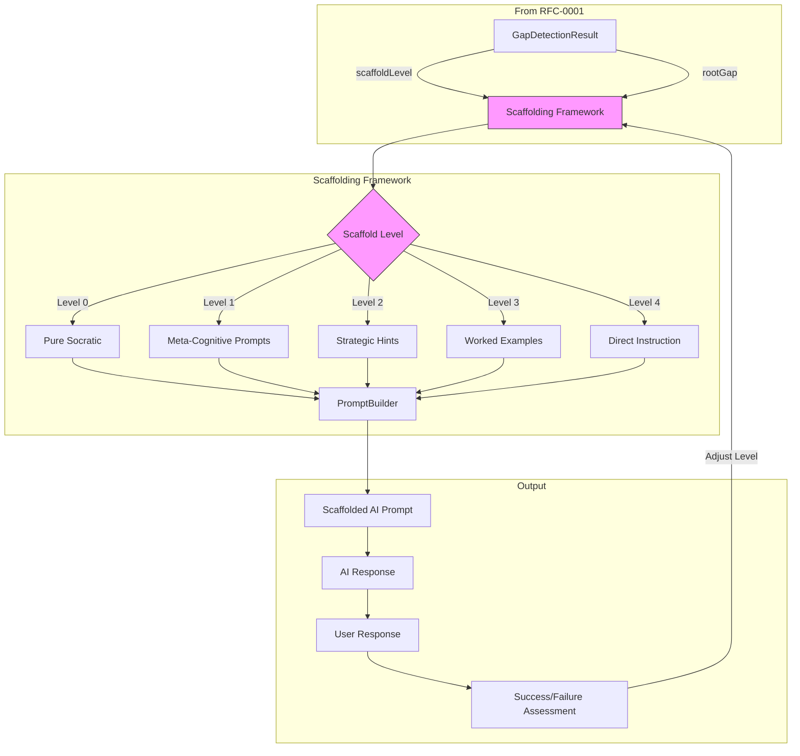
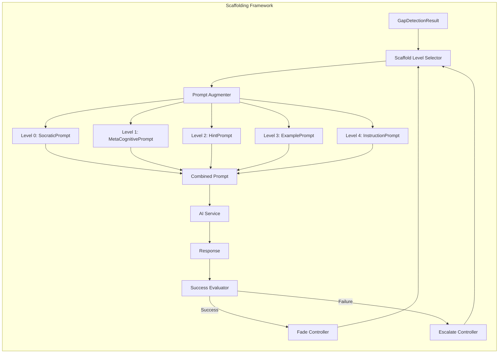
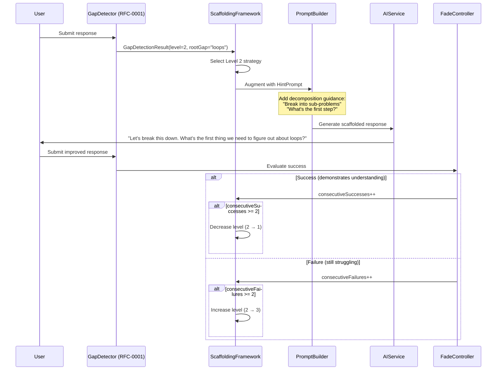
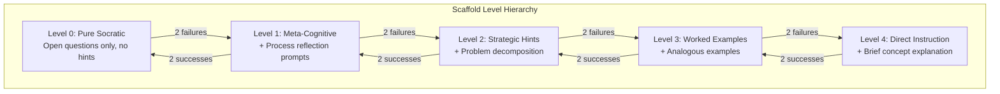
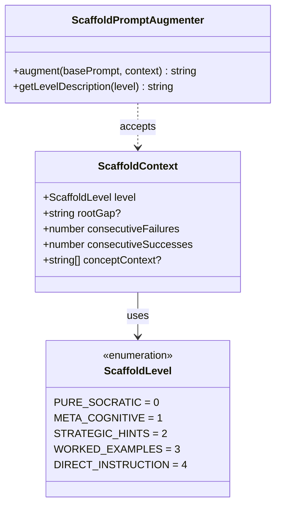
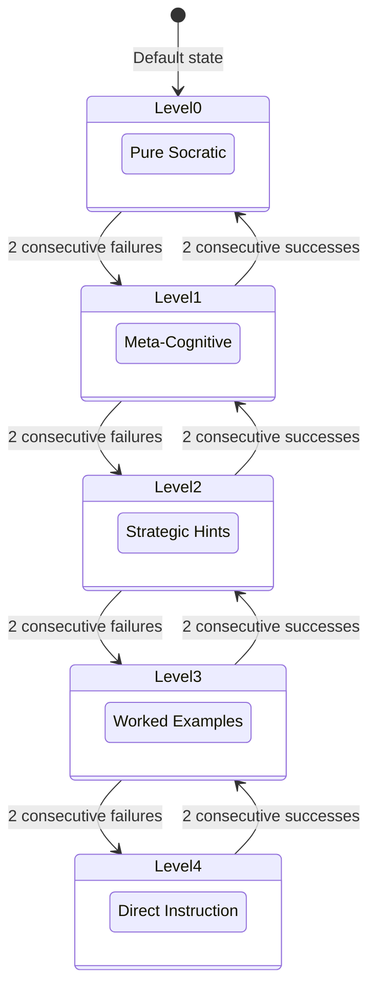
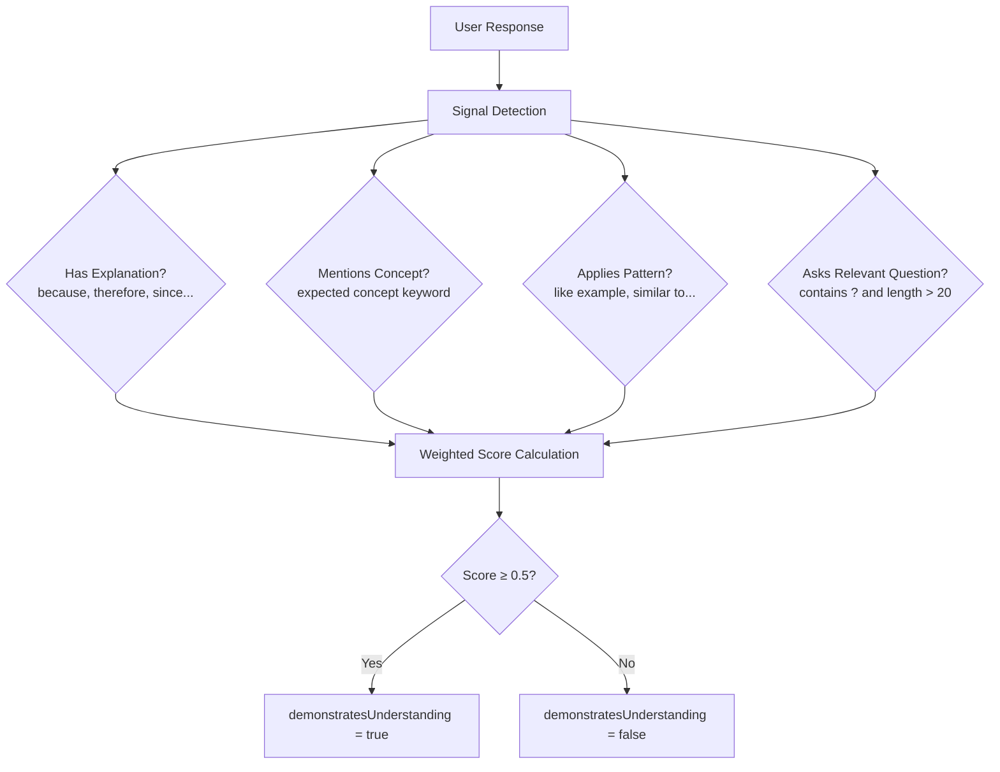
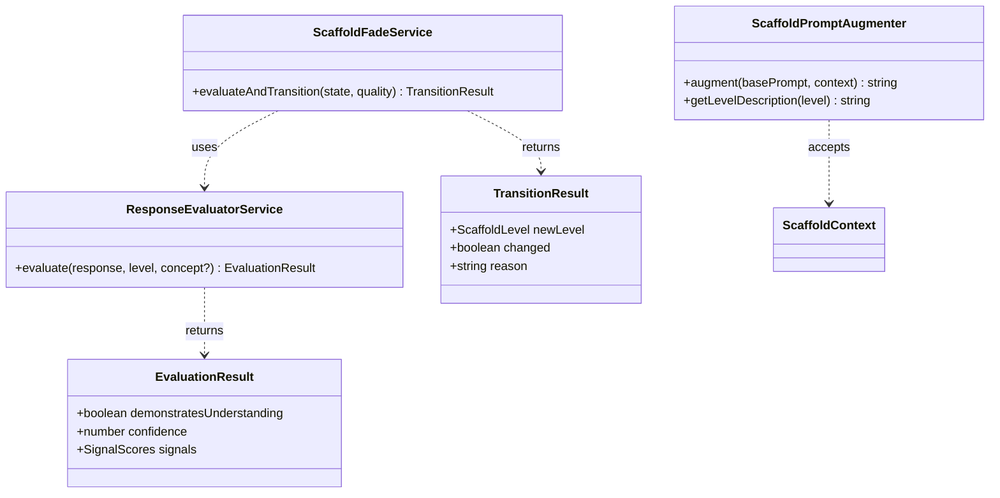
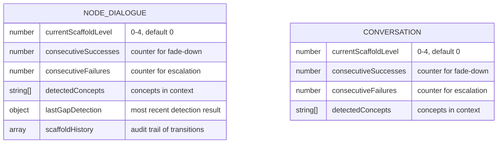

# RFC-0002: Adaptive Scaffolding Framework

<!-- HEADER BLOCK: Identifies the RFC and its current lifecycle state at a glance. -->

| Field            | Value                                                                         |
| ---------------- | ----------------------------------------------------------------------------- |
| **RFC Number**   | 0002                                                                          |
| **Title**        | Adaptive Scaffolding Framework                                                |
| **Status**       |  |
| **Author(s)**    | [Prathik Shetty](https://github.com/shettydev)                                |
| **Created**      | 2026-02-28                                                                    |
| **Last Updated** | 2026-03-04                                                                    |

> **Status options:** `Draft` | `In Review` | `Accepted` | `Implemented` | `Rejected` | `Superseded`

---

## 1. Abstract

This RFC proposes an Adaptive Scaffolding Framework that provides graduated support when the Knowledge Gap Detection System (RFC-0001) identifies users outside their Zone of Proximal Development (ZPD). The framework implements a 5-level scaffolding hierarchy from pure Socratic questioning (Level 0) to direct instruction with guided practice (Level 4), with automatic fading rules based on user success. Critically, all scaffolding levels preserve Mukti's Socratic principles — scaffolds guide users toward self-discovery rather than providing direct answers. The system modifies prompt generation to inject appropriate scaffolding strategies based on detected gap severity.

---

## 2. Motivation

When RFC-0001's detection system identifies a knowledge gap, Mukti needs a principled response strategy. Currently, `prompt-builder.ts:75` enforces "Never provide direct answers" — but this creates a deadlock when users genuinely lack foundational knowledge.

### Current Pain Points

- **Pain Point 1: Binary Mode** — Mukti has only one mode: pure Socratic questioning. There's no graduated support between "keep questioning" and "the user needs actual help."

- **Pain Point 2: No Scaffolding Vocabulary** — Even if we detect a gap, we have no framework for what "helping more" means while staying true to Socratic principles.

- **Pain Point 3: Expertise Reversal Risk** — Research shows detailed scaffolding helps novices but _hurts_ experts (wastes time, feels patronizing). We need adaptive levels based on user state.

- **Pain Point 4: No Fading Strategy** — If we add scaffolding, we need rules for when to _remove_ it. Permanent scaffolding creates dependency — the opposite of Mukti's mission.

### Evidence from Research

Pedagogical research provides clear guidance:

- **Wood, Bruner & Ross (1976)**: Scaffolding must be "contingent" — more help after failure, less after success
- **Kapur's Productive Failure (2023-2025)**: 2-3 failed attempts with varied reasoning is _productive_; >3 failures or repetitive errors needs intervention
- **Sweller's Expertise Reversal**: Worked examples help novices (reduce cognitive load) but hurt experts (redundant, slow)
- **Van de Pol (2010)**: Scaffold fading is as important as scaffold provision

The key insight: **scaffolding is not the opposite of Socratic method** — it's graduated Socratic method with more guardrails.

---

## 3. Goals & Non-Goals

### Goals

- [x] Define 5 scaffold levels with clear behavioral distinctions
- [x] Create prompt augmentation templates for each scaffold level
- [x] Implement automatic level transitions (up on failure, down on success)
- [x] Preserve Socratic principles at all levels, with controlled override at high scaffold levels
- [x] Implement Level 4 instruction behavior via scaffold override instructions (no new `foundational` technique enum)
- [ ] Track scaffold usage in per-user aggregate pattern storage (not implemented yet)

### Non-Goals

- **Curriculum sequencing**: We determine _how much_ to scaffold, not _what topic_ to cover next. That's a separate concern.
- **Content generation**: Scaffolds modify prompting strategy, not generate educational content from scratch.
- **Full tutoring system**: This is scaffolding for Socratic dialogue, not a complete Intelligent Tutoring System.
- **Automatic worked example generation**: Level 3 uses analogies/examples but generating novel curriculum content is out of scope.

---

## 4. Background & Context

### Prior Art

| Reference                         | Relevance                                                             |
| --------------------------------- | --------------------------------------------------------------------- |
| RFC-0001: Knowledge Gap Detection | Triggers scaffolding; provides gap scores and root gap identification |
| Wood, Bruner & Ross (1976)        | Original scaffolding research — contingent support principle          |
| Kapur (2023-2025)                 | Productive Failure framework — when struggle helps vs. harms          |
| Van de Pol et al. (2010)          | Scaffolding fading rules                                              |
| Sweller Cognitive Load Theory     | Expertise reversal effect — scaffolds must adapt to skill level       |
| `prompt-builder.ts`               | Current prompt generation — needs scaffold level integration          |

### Theoretical Foundation

**Zone of Proximal Development (ZPD)** — Vygotsky's concept of the space between what a learner can do independently and what they can do with guidance.

```
|---------------------|------------------------|---------------------|
|   Too Easy          |        ZPD             |      Too Hard       |
| (Below capability)  | (Productive learning)  | (Outside capability)|
|---------------------|------------------------|---------------------|
     ↓ Scaffold Down       ← Target Zone →          ↑ Scaffold Up
```

**Scaffolding Principle**: Provide the _minimum_ support needed to keep the learner in their ZPD. Too little support → frustration and abandonment. Too much support → dependency and reduced learning.

### System Context Diagram



---

## 5. Proposed Solution

### Overview

The Adaptive Scaffolding Framework operates as a prompt augmentation layer that modifies Mukti's AI prompts based on scaffold level from RFC-0001. Each level adds progressively more structure to the dialogue while maintaining Socratic principles — the AI never provides direct answers, but the _type_ of questions and guidance changes significantly.

The framework implements automatic level transitions: scaffold level increases after consecutive failures, decreases after consecutive successes. This creates a dynamic "breathing" scaffold that adapts to the user's evolving understanding.

In queue processing, the effective scaffold level is computed as `max(detectedLevel, storedLevel)`, so detection can escalate immediately while de-escalation is controlled by fade rules only. This avoids abrupt level drops mid-conversation.

### The Five Scaffold Levels

| Level | Name               | Trigger (Gap Score) | Prompt Strategy                                | Exit Condition          |
| ----- | ------------------ | ------------------- | ---------------------------------------------- | ----------------------- |
| 0     | Pure Socratic      | `< 0.3`             | Open questions only, no hints                  | Default state           |
| 1     | Meta-Cognitive     | `0.3 - <0.5`        | "What strategy are you using?" prompts         | 2 consecutive successes |
| 2     | Strategic Hints    | `0.5 - <0.7`        | Problem decomposition, chunking                | 2 consecutive successes |
| 3     | Worked Examples    | `0.7 - <0.85`       | Analogous examples, partial solutions          | 2 consecutive successes |
| 4     | Direct Instruction | `>= 0.85`           | Explicit concept explanation + guided practice | 2 consecutive successes |

Response evaluator thresholds used for transition decisions:

- Level 0: `0.65`
- Level 1: `0.55`
- Level 2: `0.45`
- Level 3: `0.4`
- Level 4: `0.35`

### Architecture Diagram



### Sequence Flow



### Detailed Design

#### 5.1 Scaffold Level Definitions

Each level builds on the previous, adding progressively more structure to the AI's prompting strategy. The prompt augmentation is cumulative — higher levels include relevant strategies from lower levels.



**Level 0: Pure Socratic (Default)** — No modifications to current behavior. The AI asks open-ended, probing questions that assume the user has latent knowledge. No hints, no structure. The user drives the direction. This is Mukti's default mode.

**Level 1: Meta-Cognitive Prompts** — The AI shifts from content questions to _process_ questions: "What strategy are you using?", "What do you already know about this?", "Walk me through your thinking step by step." The goal is to make the user's implicit reasoning explicit and activate prior knowledge. Focus is on thinking _about_ thinking, not on the content itself.

**Level 2: Strategic Hints (Chunking/Decomposition)** — The AI provides structural guidance that breaks the problem into manageable pieces: "Let's tackle this piece by piece — what's the first thing we need to figure out?", "This type of problem usually involves X, Y, and Z — which is clearest to you?" The AI does **not** solve any sub-problem — it only helps the user see the structure.

**Level 3: Worked Examples (Analogies)** — The AI provides analogous examples that illuminate the concept without directly solving the user's problem: "Here's a similar situation: [analogy]. How does this apply to your problem?", "In problems like this, we often see [pattern]. Can you identify it in your case?" The example must be **analogous, not identical** — the user must still transfer the insight.

**Level 4: Direct Instruction (Foundational)** — The only level where the AI explains concepts directly. The format is strictly constrained: (1) explain the concept in 2–3 sentences, (2) give one concrete example, (3) immediately return to Socratic mode by asking the user to apply the concept. The AI provides information but does **not** solve the user's problem — the explanation is foundational setup for productive questioning.

#### 5.2 Prompt Augmentation System

The `ScaffoldPromptAugmenter` takes a base prompt and a `ScaffoldContext`, then appends level-appropriate instructions. Prompt composition is cumulative — each level includes relevant strategies from lower levels.



**Prompt composition rules:**

| Level | Includes prompts from    | Additional context injected        |
| ----- | ------------------------ | ---------------------------------- |
| 0     | Base Socratic only       | None                               |
| 1     | Base + Level 1 additions | None                               |
| 2     | Base + Level 1 + Level 2 | Root gap context (if available)    |
| 3     | Base + Level 2 + Level 3 | Root gap context + fading reminder |
| 4     | Base + Level 4 additions | Root gap context + fading reminder |

**Additional behaviors:**

- At Level 2+, if a `rootGap` is identified (from RFC-0001 prerequisite checker), the augmenter injects: _"The user appears to be struggling with the foundational concept of [rootGap]. Address this gap before expecting progress."_
- At Level 3+, a fading reminder is appended: _"Scaffold support should be TEMPORARY. After each response, look for opportunities to reduce support."_

#### 5.3 Level Transition Controller (Fading)

The `ScaffoldFadeService` manages level transitions based on consecutive success/failure counts. The transition rules are symmetric: 2 consecutive successes to fade down, 2 consecutive failures to escalate up.



**Transition rules:**

- **Escalation**: On failure, increment `consecutiveFailures` and reset `consecutiveSuccesses` to 0. If `consecutiveFailures ≥ 2` and current level < 4, increase level by 1.
- **Fading**: On success, increment `consecutiveSuccesses` and reset `consecutiveFailures` to 0. If `consecutiveSuccesses ≥ 2` and current level > 0, decrease level by 1.
- **No change**: If neither threshold is met, the level remains unchanged.

**Success criteria vary by level:**

| Level | "Success" means the user...                        |
| ----- | -------------------------------------------------- |
| 0–1   | Demonstrates understanding in their explanation    |
| 2     | Successfully decomposes the problem into sub-parts |
| 3     | Correctly applies the pattern from the analogy     |
| 4     | Correctly applies the directly taught concept      |

**Key constraint:** Detection (RFC-0001) can escalate immediately via `max(detected, stored)`, but de-escalation only happens through these fade rules. This prevents abrupt level drops mid-conversation.

#### 5.4 Integration with PromptBuilder

The existing `prompt-builder.ts` gains a new entry point: `buildScaffoldAwarePrompt`. This function takes the standard node context, problem structure, and Socratic technique, builds the base system prompt as before, then conditionally augments it with scaffold context if provided. When no scaffold context is present (e.g., feature flag disabled), the function returns the unmodified base prompt — ensuring full backward compatibility.

#### 5.5 Response Quality Evaluator

The `ResponseEvaluatorService` determines whether a user response demonstrates understanding — the key input for the fade controller's transition decisions. It evaluates four signals and computes a weighted score that varies by scaffold level.



**Signal weights by scaffold level** (higher levels shift weight toward concept mention and pattern application):

| Signal      | L0   | L1   | L2   | L3   | L4   |
| ----------- | ---- | ---- | ---- | ---- | ---- |
| Explanation | 0.40 | 0.35 | 0.30 | 0.25 | 0.20 |
| Concept     | 0.30 | 0.30 | 0.30 | 0.35 | 0.40 |
| Pattern     | 0.20 | 0.20 | 0.25 | 0.30 | 0.30 |
| Question    | 0.10 | 0.15 | 0.15 | 0.10 | 0.10 |

**Design rationale:** At lower levels, explanation ability is weighted highest (the user should be reasoning independently). At higher levels, concept mention and pattern application are weighted more heavily (the user should be demonstrating they absorbed the scaffolded content). The threshold for "success" is always `score ≥ 0.5`, but the weights make success progressively easier to achieve at higher scaffold levels — reflecting that scaffolded users need less independent reasoning to demonstrate progress.

---

## 6. API / Interface Design

### Internal Service Interfaces



### REST Endpoints (Admin/Debug)

No scaffolding-specific REST endpoints are currently exposed. Scaffolding behavior is applied internally in queue processing and persisted on dialogue/conversation documents.

---

## 7. Data Model Changes

### Modified Schemas

Scaffolding state is persisted on both `node_dialogues` (canvas flows) and `conversations` (text chat flows). All fields are additive — no existing fields are modified or removed.



**Additive fields on `node_dialogues`:**

| Field                | Type     | Description                                                                       |
| -------------------- | -------- | --------------------------------------------------------------------------------- |
| currentScaffoldLevel | 0–4      | Current scaffold level for this dialogue (default: 0)                             |
| consecutiveSuccesses | number   | Counter for fade-down transitions (reset on failure)                              |
| consecutiveFailures  | number   | Counter for escalation transitions (reset on success)                             |
| detectedConcepts     | string[] | Concepts detected in this dialogue's context                                      |
| lastGapDetection     | object   | Most recent gap detection result (score, level, signals, rootGap, recommendation) |
| scaffoldHistory      | array    | Audit trail: `{ fromLevel, toLevel, reason, timestamp }`                          |

**Additive fields on `conversations`:** Same as above except `lastGapDetection` and `scaffoldHistory` (text chat flows use a simpler tracking model).

### Migration Notes

- **Migration type:** Additive
- **Backwards compatible:** Yes — new fields have sensible defaults
- **Estimated migration duration:** < 1 minute

---

## 8. Alternatives Considered

### Alternative A: Binary Scaffold (On/Off)

Simple switch between Socratic and Teaching mode.

| Pros                | Cons                              |
| ------------------- | --------------------------------- |
| Simple to implement | No nuance — missing middle ground |
| Clear mental model  | Jumps from 0 to 100% support      |
|                     | No fading strategy                |

**Reason for rejection:** Research shows graduated scaffolding is significantly more effective. Binary mode doesn't match how learning actually works.

### Alternative B: User-Selected Scaffold Level

Let users choose their support level.

| Pros                       | Cons                                                |
| -------------------------- | --------------------------------------------------- |
| User agency                | Users are poor judges of own needs                  |
| No detection system needed | Interrupts flow                                     |
|                            | Dunning-Kruger: struggling users underestimate need |

**Reason for rejection:** Same reason as RFC-0001 Alternative C. Automatic detection based on behavior is more reliable than self-assessment.

### Alternative C: AI-Determined Scaffolding Per-Response

Let the AI decide scaffold level in each response.

| Pros                       | Cons                          |
| -------------------------- | ----------------------------- |
| Most flexible              | Non-deterministic             |
| No explicit level tracking | AI might be too eager to help |
|                            | Can't track/analyze patterns  |
|                            | Hard to debug/tune            |

**Reason for rejection:** We need consistent, trackable scaffolding that can be analyzed and tuned. AI-in-the-loop for level selection adds unpredictability.

---

## 9. Security & Privacy Considerations

### Threat Surface

- **Scaffold Pattern Profiling:** Patterns could reveal learning disabilities or skill gaps.
  - _Mitigation:_ Patterns are user-private. No cross-user exposure.

### Data Sensitivity

| Data Element       | Classification | Handling Requirements                    |
| ------------------ | -------------- | ---------------------------------------- |
| Scaffold level     | Internal       | Per-dialogue, not exposed to other users |
| Transition history | Sensitive      | Can reveal struggle points               |
| Aggregate patterns | Sensitive      | Never shared between users               |

### Authentication & Authorization

No changes to existing auth. Scaffold data inherits dialogue permissions.

---

## 10. Performance & Scalability

| Metric                 | Current Baseline | Expected After Change | Acceptable Threshold |
| ---------------------- | ---------------- | --------------------- | -------------------- |
| Prompt generation      | 50ms             | 55ms (+5ms)           | < 100ms              |
| Response evaluation    | N/A              | < 20ms                | < 50ms               |
| Level transition check | N/A              | < 5ms                 | < 20ms               |

### Known Bottlenecks

- **Prompt Size:** Higher scaffold levels add ~200-400 tokens to prompts.
  - _Mitigation:_ Acceptable for improved response quality. Monitor token costs.

---

## 11. Observability

### Logging

- `scaffold.level_transition` — Log all level changes with reason
- `scaffold.prompt_augmented` — Log scaffold level used for prompt augmentation
- `scaffold.fade_success` — Log successful fading (level decrease)

### Metrics

- `mukti.scaffold.level_distribution` (gauge) — Current level breakdown across active dialogues
- `mukti.scaffold.transitions_per_session` (histogram) — How many transitions occur
- `mukti.scaffold.time_to_fade` (histogram) — Time at elevated levels before fading
- `mukti.scaffold.level4_triggers` (counter) — How often we reach max support

### Tracing

- Add `scaffold_level` attribute to dialogue processing spans
- Track level transitions as span events

### Alerting

| Alert Name        | Condition                             | Severity | Runbook Link |
| ----------------- | ------------------------------------- | -------- | ------------ |
| High Level 4 Rate | > 20% dialogues reach Level 4 over 1h | Warning  | [link]       |
| No Fading         | Avg time_to_fade > 30m over 1h        | Warning  | [link]       |

---

## 12. Rollout Plan

### Phases

| Phase | Description     | Entry Criteria    | Exit Criteria  |
| ----- | --------------- | ----------------- | -------------- |
| 1     | Levels 0-2 only | RFC-0001 deployed | 2 weeks stable |
| 2     | Add Level 3     | Phase 1 complete  | 1 week stable  |
| 3     | Add Level 4     | Phase 2 complete  | GA             |

### Feature Flags

- **Flag name:** `scaffold_max_level`
- **Default state:** 2 (strategic hints only)
- **Values:** 0-4

- **Flag name:** `scaffold_auto_fade`
- **Default state:** On
- **Kill switch:** Yes (disable fading, levels only increase)

### Rollback Strategy

1. Set `scaffold_max_level` to 0 (pure Socratic only)
2. Existing dialogues continue at their level but won't escalate
3. No data migration needed

---

## 13. Open Questions

1. **Level 4 Frequency Cap** — Should we limit how often a user can trigger Level 4 per session to prevent over-reliance? Proposal: Max 3 Level 4 interventions per session.

2. **Concept-Specific Levels** — Should scaffold level be per-concept or per-dialogue? A user might be Level 0 for "loops" but Level 3 for "recursion" in the same session.

3. **Worked Example Source** — Where do analogous examples come from at Level 3? Options: Pre-authored examples, LLM-generated, or resource suggestion system (Issue #3).

4. **Success Evaluation Accuracy** — The ResponseEvaluator uses heuristics. Should we add LLM-based evaluation for higher accuracy (at cost of latency/tokens)?

> **Reviewers:** Please reference open questions by number (e.g., "Regarding OQ-2, ...") in your comments.

---

## 14. Decision Log

| Date       | Decision                          | Rationale                                                               | Decided By |
| ---------- | --------------------------------- | ----------------------------------------------------------------------- | ---------- |
| 2026-02-28 | 5 scaffold levels                 | Research-backed hierarchy from meta-cognitive → direct instruction      | RFC Author |
| 2026-02-28 | 2-success fading rule             | Van de Pol research suggests 2 consecutive successes is reliable signal | RFC Author |
| 2026-02-28 | Level 4 preserves Socratic return | Even direct instruction must quickly return to questioning              | RFC Author |

---

## 15. References

- [RFC-0001: Knowledge Gap Detection System](../rfc-0001-knowledge-gap-detection/index.md)
- [Wood, Bruner & Ross (1976): The Role of Tutoring in Problem Solving](https://doi.org/10.1111/j.1469-7610.1976.tb00381.x)
- [Kapur (2023-2025): Productive Failure Research](https://www.manukapur.com/productive-failure)
- [Van de Pol et al. (2010): Scaffolding in Teacher-Student Interaction](https://doi.org/10.1007/s10648-010-9127-6)
- [Sweller Cognitive Load Theory: Expertise Reversal Effect](https://doi.org/10.1007/s10648-019-09465-5)
- [Mukti Unified Thinking Model](../../../reference/planning/unified-thinking-model.md)

---

> **Reviewer Notes:**
>
> WARNING: Level 4 (Direct Instruction) represents a philosophical shift for Mukti. Even though it returns to Socratic questioning, we are explicitly teaching. Ensure team alignment before enabling.
>
> This RFC depends on RFC-0001 for gap detection and level triggering. Review both together.
>
> Consider: Should Level 4 require explicit user consent? ("I see you're struggling. Would you like me to explain this concept directly?")
