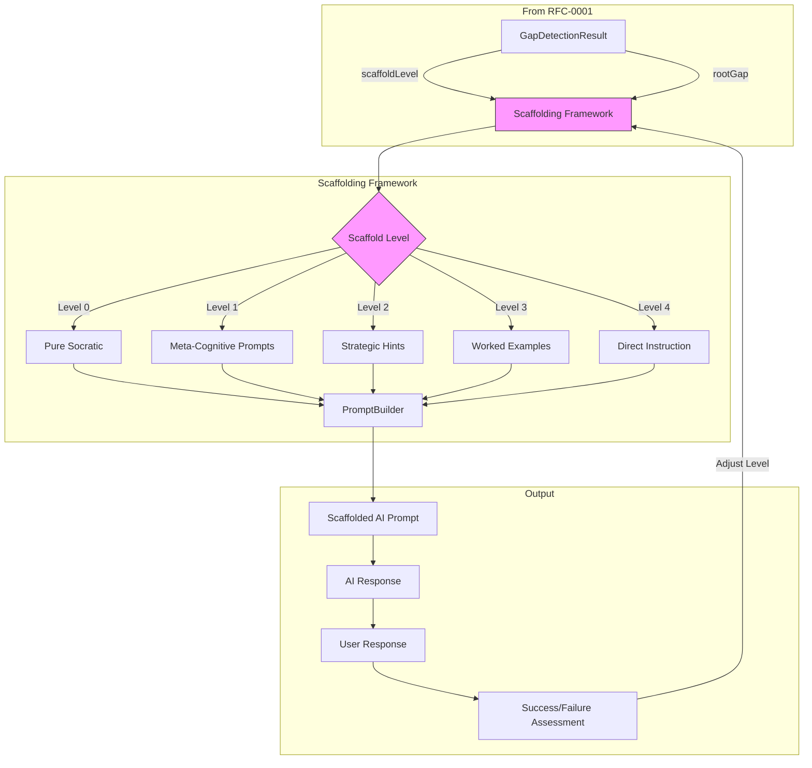
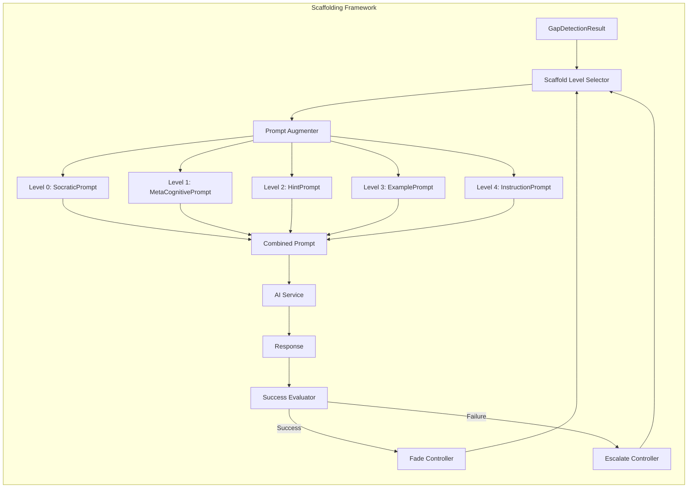
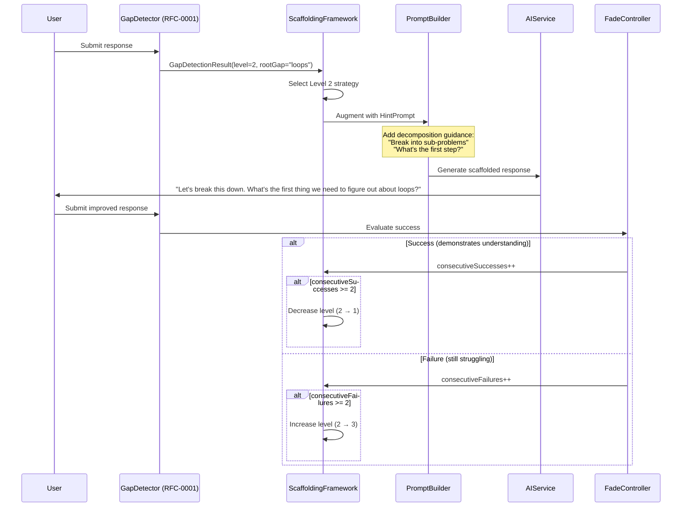

# RFC-0002: Adaptive Scaffolding Framework

<!-- HEADER BLOCK: Identifies the RFC and its current lifecycle state at a glance. -->

| Field            | Value                                                                         |
| ---------------- | ----------------------------------------------------------------------------- |
| **RFC Number**   | 0002                                                                          |
| **Title**        | Adaptive Scaffolding Framework                                                |
| **Status**       |  |
| **Author(s)**    | [Prathik Shetty](https://github.com/shettydev)                                |
| **Created**      | 2026-02-28                                                                    |
| **Last Updated** | 2026-03-04                                                                    |

> **Status options:** `Draft` | `In Review` | `Accepted` | `Implemented` | `Rejected` | `Superseded`

---

## 1. Abstract

This RFC proposes an Adaptive Scaffolding Framework that provides graduated support when the Knowledge Gap Detection System (RFC-0001) identifies users outside their Zone of Proximal Development (ZPD). The framework implements a 5-level scaffolding hierarchy from pure Socratic questioning (Level 0) to direct instruction with guided practice (Level 4), with automatic fading rules based on user success. Critically, all scaffolding levels preserve Mukti's Socratic principles — scaffolds guide users toward self-discovery rather than providing direct answers. The system modifies prompt generation to inject appropriate scaffolding strategies based on detected gap severity.

---

## 2. Motivation

When RFC-0001's detection system identifies a knowledge gap, Mukti needs a principled response strategy. Currently, `prompt-builder.ts:75` enforces "Never provide direct answers" — but this creates a deadlock when users genuinely lack foundational knowledge.

### Current Pain Points

- **Pain Point 1: Binary Mode** — Mukti has only one mode: pure Socratic questioning. There's no graduated support between "keep questioning" and "the user needs actual help."

- **Pain Point 2: No Scaffolding Vocabulary** — Even if we detect a gap, we have no framework for what "helping more" means while staying true to Socratic principles.

- **Pain Point 3: Expertise Reversal Risk** — Research shows detailed scaffolding helps novices but _hurts_ experts (wastes time, feels patronizing). We need adaptive levels based on user state.

- **Pain Point 4: No Fading Strategy** — If we add scaffolding, we need rules for when to _remove_ it. Permanent scaffolding creates dependency — the opposite of Mukti's mission.

### Evidence from Research

Pedagogical research provides clear guidance:

- **Wood, Bruner & Ross (1976)**: Scaffolding must be "contingent" — more help after failure, less after success
- **Kapur's Productive Failure (2023-2025)**: 2-3 failed attempts with varied reasoning is _productive_; >3 failures or repetitive errors needs intervention
- **Sweller's Expertise Reversal**: Worked examples help novices (reduce cognitive load) but hurt experts (redundant, slow)
- **Van de Pol (2010)**: Scaffold fading is as important as scaffold provision

The key insight: **scaffolding is not the opposite of Socratic method** — it's graduated Socratic method with more guardrails.

---

## 3. Goals & Non-Goals

### Goals

- [x] Define 5 scaffold levels with clear behavioral distinctions
- [x] Create prompt augmentation templates for each scaffold level
- [x] Implement automatic level transitions (up on failure, down on success)
- [x] Preserve Socratic principles at all levels, with controlled override at high scaffold levels
- [x] Implement Level 4 instruction behavior via scaffold override instructions (no new `foundational` technique enum)
- [ ] Track scaffold usage in per-user aggregate pattern storage (not implemented yet)

### Non-Goals

- **Curriculum sequencing**: We determine _how much_ to scaffold, not _what topic_ to cover next. That's a separate concern.
- **Content generation**: Scaffolds modify prompting strategy, not generate educational content from scratch.
- **Full tutoring system**: This is scaffolding for Socratic dialogue, not a complete Intelligent Tutoring System.
- **Automatic worked example generation**: Level 3 uses analogies/examples but generating novel curriculum content is out of scope.

---

## 4. Background & Context

### Prior Art

| Reference                         | Relevance                                                             |
| --------------------------------- | --------------------------------------------------------------------- |
| RFC-0001: Knowledge Gap Detection | Triggers scaffolding; provides gap scores and root gap identification |
| Wood, Bruner & Ross (1976)        | Original scaffolding research — contingent support principle          |
| Kapur (2023-2025)                 | Productive Failure framework — when struggle helps vs. harms          |
| Van de Pol et al. (2010)          | Scaffolding fading rules                                              |
| Sweller Cognitive Load Theory     | Expertise reversal effect — scaffolds must adapt to skill level       |
| `prompt-builder.ts`               | Current prompt generation — needs scaffold level integration          |

### Theoretical Foundation

**Zone of Proximal Development (ZPD)** — Vygotsky's concept of the space between what a learner can do independently and what they can do with guidance.

```
|---------------------|------------------------|---------------------|
|   Too Easy          |        ZPD             |      Too Hard       |
| (Below capability)  | (Productive learning)  | (Outside capability)|
|---------------------|------------------------|---------------------|
     ↓ Scaffold Down       ← Target Zone →          ↑ Scaffold Up
```

**Scaffolding Principle**: Provide the _minimum_ support needed to keep the learner in their ZPD. Too little support → frustration and abandonment. Too much support → dependency and reduced learning.

### System Context Diagram



---

## 5. Proposed Solution

### Overview

The Adaptive Scaffolding Framework operates as a prompt augmentation layer that modifies Mukti's AI prompts based on scaffold level from RFC-0001. Each level adds progressively more structure to the dialogue while maintaining Socratic principles — the AI never provides direct answers, but the _type_ of questions and guidance changes significantly.

The framework implements automatic level transitions: scaffold level increases after consecutive failures, decreases after consecutive successes. This creates a dynamic "breathing" scaffold that adapts to the user's evolving understanding.

In queue processing, the effective scaffold level is computed as `max(detectedLevel, storedLevel)`, so detection can escalate immediately while de-escalation is controlled by fade rules only. This avoids abrupt level drops mid-conversation.

### The Five Scaffold Levels

| Level | Name               | Trigger (Gap Score) | Prompt Strategy                                | Exit Condition          |
| ----- | ------------------ | ------------------- | ---------------------------------------------- | ----------------------- |
| 0     | Pure Socratic      | `< 0.3`             | Open questions only, no hints                  | Default state           |
| 1     | Meta-Cognitive     | `0.3 - <0.5`        | "What strategy are you using?" prompts         | 2 consecutive successes |
| 2     | Strategic Hints    | `0.5 - <0.7`        | Problem decomposition, chunking                | 2 consecutive successes |
| 3     | Worked Examples    | `0.7 - <0.85`       | Analogous examples, partial solutions          | 2 consecutive successes |
| 4     | Direct Instruction | `>= 0.85`           | Explicit concept explanation + guided practice | 2 consecutive successes |

Response evaluator thresholds used for transition decisions:

- Level 0: `0.65`
- Level 1: `0.55`
- Level 2: `0.45`
- Level 3: `0.4`
- Level 4: `0.35`

### Architecture Diagram



### Sequence Flow



### Detailed Design

#### 5.1 Scaffold Level Definitions

**Level 0: Pure Socratic (Default)**

No modifications to current behavior. Open-ended questions that assume user has latent knowledge.

```typescript
const LEVEL_0_PROMPT = `
You are a Socratic mentor. Ask probing questions that help the user discover the answer themselves.
Never provide direct answers or solutions.
Trust that the user has the knowledge to reach the answer through reflection.
`;
```

**Characteristics:**

- Open-ended questions only
- No hints or structure
- Assumes productive struggle
- User drives the direction

---

**Level 1: Meta-Cognitive Prompts**

Add prompts that encourage the user to reflect on their thinking process.

```typescript
const LEVEL_1_ADDITIONS = `
Additionally, guide the user's meta-cognition:
- Ask "What strategy are you currently using?"
- Prompt "What do you already know about this?"
- Inquire "What's similar to problems you've solved before?"
- Encourage "Walk me through your current thinking step by step."

Focus on making their thinking visible, not on the content itself.
`;
```

**Characteristics:**

- Questions about process, not content
- Activates prior knowledge
- Makes implicit reasoning explicit
- Builds self-monitoring skills

---

**Level 2: Strategic Hints (Chunking/Decomposition)**

Add structural guidance that breaks the problem into manageable pieces.

```typescript
const LEVEL_2_ADDITIONS = `
The user needs structural support. Guide them to decompose the problem:
- Suggest breaking into sub-problems: "Let's tackle this piece by piece. What's the first thing we need to figure out?"
- Offer chunking: "There are several parts to this. Which part should we focus on first?"
- Provide framing: "This type of problem usually involves [X], [Y], and [Z]. Which of these is clearest to you?"

Do NOT solve any sub-problem for them. Only help them see the structure.
`;
```

**Characteristics:**

- Problem decomposition questions
- Reduces cognitive load through chunking
- Provides structural scaffolding
- Still no content hints

---

**Level 3: Worked Examples (Analogies)**

Provide analogous examples that illuminate the concept without directly solving the user's problem.

```typescript
const LEVEL_3_ADDITIONS = `
The user needs concrete examples to understand the pattern. Provide ANALOGOUS examples:
- Use a parallel example: "Here's a similar situation: [analogy]. How does this apply to your problem?"
- Show partial structure: "In problems like this, we often see [pattern]. Can you identify this pattern in your case?"
- Reference familiar concepts: "Remember how [known concept] works? This follows a similar logic."

CRITICAL: The example must be ANALOGOUS, not the same problem. The user must still transfer the insight.
`;
```

**Characteristics:**

- Analogous examples, not solutions
- Pattern illumination
- Requires transfer from example to problem
- User completes the final connection

---

**Level 4: Direct Instruction (Foundational)**

Explicit concept explanation followed by guided practice. This is the only level where the AI explains concepts directly.

```typescript
const LEVEL_4_ADDITIONS = `
The user lacks foundational knowledge for this concept. Provide direct instruction:
1. EXPLAIN the concept clearly and concisely (2-3 sentences max)
2. Give ONE concrete example of the concept in action
3. Immediately return to Socratic mode: ask the user to apply this concept to their problem

Format:
"Let me explain [concept]: [brief explanation]. For example, [simple example].
Now, given this understanding, how does this apply to your situation?"

You ARE providing information, but you're NOT solving their problem. The explanation is foundational setup for productive questioning.
`;
```

**Characteristics:**

- Brief, focused concept explanation
- One illustrative example
- Immediate return to Socratic questioning
- Minimal direct instruction, maximum guided application

#### 5.2 Prompt Augmentation System

```typescript
// packages/mukti-api/src/modules/dialogue/utils/scaffold-prompts.ts

export enum ScaffoldLevel {
  PURE_SOCRATIC = 0,
  META_COGNITIVE = 1,
  STRATEGIC_HINTS = 2,
  WORKED_EXAMPLES = 3,
  DIRECT_INSTRUCTION = 4,
}

interface ScaffoldContext {
  level: ScaffoldLevel;
  rootGap?: string;
  consecutiveFailures: number;
  consecutiveSuccesses: number;
  conceptContext?: string[];
}

export class ScaffoldPromptAugmenter {
  private readonly levelPrompts: Map<ScaffoldLevel, string>;

  constructor() {
    this.levelPrompts = new Map([
      [ScaffoldLevel.PURE_SOCRATIC, LEVEL_0_PROMPT],
      [ScaffoldLevel.META_COGNITIVE, LEVEL_0_PROMPT + LEVEL_1_ADDITIONS],
      [ScaffoldLevel.STRATEGIC_HINTS, LEVEL_0_PROMPT + LEVEL_1_ADDITIONS + LEVEL_2_ADDITIONS],
      [ScaffoldLevel.WORKED_EXAMPLES, LEVEL_0_PROMPT + LEVEL_2_ADDITIONS + LEVEL_3_ADDITIONS],
      [ScaffoldLevel.DIRECT_INSTRUCTION, LEVEL_0_PROMPT + LEVEL_4_ADDITIONS],
    ]);
  }

  augment(basePrompt: string, context: ScaffoldContext): string {
    const scaffoldAdditions = this.levelPrompts.get(context.level) || '';

    let augmentedPrompt = basePrompt + '\n\n' + scaffoldAdditions;

    // Add root gap context if available
    if (context.rootGap && context.level >= ScaffoldLevel.STRATEGIC_HINTS) {
      augmentedPrompt += `\n\nNote: The user appears to be struggling with the foundational concept of "${context.rootGap}". `;
      augmentedPrompt += `Address this gap before expecting progress on the current question.`;
    }

    // Add fading reminder at higher levels
    if (context.level >= ScaffoldLevel.WORKED_EXAMPLES) {
      augmentedPrompt += `\n\nRemember: Scaffold support should be TEMPORARY. `;
      augmentedPrompt += `After each response, look for opportunities to reduce support.`;
    }

    return augmentedPrompt;
  }

  getLevelDescription(level: ScaffoldLevel): string {
    const descriptions: Record<ScaffoldLevel, string> = {
      [ScaffoldLevel.PURE_SOCRATIC]: 'Pure questioning, no hints',
      [ScaffoldLevel.META_COGNITIVE]: 'Process-focused reflection prompts',
      [ScaffoldLevel.STRATEGIC_HINTS]: 'Problem decomposition and chunking',
      [ScaffoldLevel.WORKED_EXAMPLES]: 'Analogous examples for pattern recognition',
      [ScaffoldLevel.DIRECT_INSTRUCTION]: 'Brief concept explanation with guided practice',
    };
    return descriptions[level];
  }
}
```

#### 5.3 Level Transition Controller (Fading)

```typescript
// packages/mukti-api/src/modules/dialogue/services/scaffold-fade.service.ts

interface FadeState {
  currentLevel: ScaffoldLevel;
  consecutiveSuccesses: number;
  consecutiveFailures: number;
  levelHistory: Array<{ level: ScaffoldLevel; timestamp: Date; reason: string }>;
}

interface TransitionResult {
  newLevel: ScaffoldLevel;
  changed: boolean;
  reason: string;
}

export class ScaffoldFadeService {
  private readonly SUCCESSES_TO_FADE = 2; // Consecutive successes needed to decrease level
  private readonly FAILURES_TO_ESCALATE = 2; // Consecutive failures needed to increase level

  /**
   * Evaluate user response and determine if scaffold level should change.
   *
   * Success criteria (varies by level):
   * - L0-L1: User demonstrates understanding in explanation
   * - L2: User successfully decomposes the problem
   * - L3: User correctly applies pattern from example
   * - L4: User correctly applies taught concept
   */
  evaluateAndTransition(state: FadeState, responseQuality: ResponseQuality): TransitionResult {
    const isSuccess = responseQuality.demonstratesUnderstanding;

    if (isSuccess) {
      state.consecutiveSuccesses++;
      state.consecutiveFailures = 0;

      if (state.consecutiveSuccesses >= this.SUCCESSES_TO_FADE && state.currentLevel > 0) {
        const newLevel = (state.currentLevel - 1) as ScaffoldLevel;
        return {
          newLevel,
          changed: true,
          reason: `${this.SUCCESSES_TO_FADE} consecutive successes → fading scaffold`,
        };
      }
    } else {
      state.consecutiveFailures++;
      state.consecutiveSuccesses = 0;

      if (state.consecutiveFailures >= this.FAILURES_TO_ESCALATE && state.currentLevel < 4) {
        const newLevel = (state.currentLevel + 1) as ScaffoldLevel;
        return {
          newLevel,
          changed: true,
          reason: `${this.FAILURES_TO_ESCALATE} consecutive failures → increasing scaffold`,
        };
      }
    }

    return {
      newLevel: state.currentLevel,
      changed: false,
      reason: 'No transition triggered',
    };
  }
}

interface ResponseQuality {
  demonstratesUnderstanding: boolean;
  appliedConcept: boolean;
  selfExplanationPresent: boolean;
  progressMade: boolean;
}

interface GapDetectionSignals {
  frustration: number;
  abandonment: boolean;
  explicitHelpRequest: boolean;
}
```

#### 5.4 Integration with PromptBuilder

```typescript
// Modifications to packages/mukti-api/src/modules/dialogue/utils/prompt-builder.ts

export function buildScaffoldAwarePrompt(
  node: NodeContext,
  problemStructure: ProblemStructure,
  scaffoldContext?: ScaffoldContext,
  technique: SocraticTechnique = 'elenchus'
): string {
  const basePrompt = buildSystemPrompt(node, problemStructure, technique);
  if (!scaffoldContext) return basePrompt;

  return augmentWithScaffoldContext(basePrompt, scaffoldContext);
}
```

#### 5.5 Response Quality Evaluator

```typescript
// packages/mukti-api/src/modules/dialogue/services/response-evaluator.service.ts

interface EvaluationResult {
  demonstratesUnderstanding: boolean;
  confidence: number;
  signals: {
    hasExplanation: boolean;
    mentionsConcept: boolean;
    appliesPattern: boolean;
    asksRelevantQuestion: boolean;
  };
}

export class ResponseEvaluatorService {
  /**
   * Evaluate whether user response demonstrates understanding.
   * Used by FadeController to determine scaffold transitions.
   */
  evaluate(
    userResponse: string,
    scaffoldLevel: ScaffoldLevel,
    expectedConcept?: string
  ): EvaluationResult {
    const signals = {
      hasExplanation: this.hasExplanation(userResponse),
      mentionsConcept: expectedConcept ? this.mentionsConcept(userResponse, expectedConcept) : true,
      appliesPattern: this.appliesPattern(userResponse, scaffoldLevel),
      asksRelevantQuestion: this.asksRelevantQuestion(userResponse),
    };

    // Calculate understanding score based on scaffold level expectations
    const weights = this.getWeightsForLevel(scaffoldLevel);
    const score =
      (signals.hasExplanation ? weights.explanation : 0) +
      (signals.mentionsConcept ? weights.concept : 0) +
      (signals.appliesPattern ? weights.pattern : 0) +
      (signals.asksRelevantQuestion ? weights.question : 0);

    return {
      demonstratesUnderstanding: score >= 0.5,
      confidence: score,
      signals,
    };
  }

  private getWeightsForLevel(level: ScaffoldLevel): Record<string, number> {
    // Higher scaffold levels have lower thresholds for "success"
    const levelWeights: Record<ScaffoldLevel, Record<string, number>> = {
      [ScaffoldLevel.PURE_SOCRATIC]: {
        explanation: 0.4,
        concept: 0.3,
        pattern: 0.2,
        question: 0.1,
      },
      [ScaffoldLevel.META_COGNITIVE]: {
        explanation: 0.35,
        concept: 0.3,
        pattern: 0.2,
        question: 0.15,
      },
      [ScaffoldLevel.STRATEGIC_HINTS]: {
        explanation: 0.3,
        concept: 0.3,
        pattern: 0.25,
        question: 0.15,
      },
      [ScaffoldLevel.WORKED_EXAMPLES]: {
        explanation: 0.25,
        concept: 0.35,
        pattern: 0.3,
        question: 0.1,
      },
      [ScaffoldLevel.DIRECT_INSTRUCTION]: {
        explanation: 0.2,
        concept: 0.4,
        pattern: 0.3,
        question: 0.1,
      },
    };
    return levelWeights[level];
  }

  private hasExplanation(response: string): boolean {
    // Check for explanation indicators
    const explanationMarkers = [
      /because/i,
      /since/i,
      /therefore/i,
      /this means/i,
      /I think .* because/i,
      /the reason/i,
      /this works by/i,
    ];
    return explanationMarkers.some((marker) => marker.test(response));
  }

  private mentionsConcept(response: string, concept: string): boolean {
    return response.toLowerCase().includes(concept.toLowerCase());
  }

  private appliesPattern(response: string, level: ScaffoldLevel): boolean {
    if (level < ScaffoldLevel.WORKED_EXAMPLES) return true;

    // Check for pattern application language
    const patternMarkers = [
      /like .* example/i,
      /similar to/i,
      /same as/i,
      /following .* pattern/i,
      /applying/i,
      /using .* approach/i,
    ];
    return patternMarkers.some((marker) => marker.test(response));
  }

  private asksRelevantQuestion(response: string): boolean {
    return /\?/.test(response) && response.length > 20;
  }
}
```

---

## 6. API / Interface Design

### Internal Service Interfaces

#### `ScaffoldPromptAugmenter`

```typescript
interface ScaffoldPromptAugmenter {
  augment(basePrompt: string, context: ScaffoldContext): string;
  getLevelDescription(level: ScaffoldLevel): string;
}
```

#### `ScaffoldFadeService`

```typescript
interface ScaffoldFadeService {
  evaluateAndTransition(state: FadeState, quality: ResponseQuality): TransitionResult;
}
```

#### `ResponseEvaluatorService`

```typescript
interface ResponseEvaluatorService {
  evaluate(input: EvaluationInput): EvaluationResult;
}
```

### REST Endpoints (Admin/Debug)

No scaffolding-specific REST endpoints are currently exposed. Scaffolding behavior is applied internally in queue processing and persisted on dialogue/conversation documents.

---

## 7. Data Model Changes

### Schema Changes

**Modified: `node_dialogues`**

```typescript
// Add to existing NodeDialogue schema
interface NodeDialogueScaffoldFields {
  currentScaffoldLevel: 0 | 1 | 2 | 3 | 4;
  consecutiveSuccesses: number;
  consecutiveFailures: number;
  detectedConcepts: string[];
  lastGapDetection?: {
    detectedAt: Date;
    gapScore: number;
    knowledgeProbability: number;
    recommendation: 'socratic' | 'scaffold' | 'teach';
    rootGap: string | null;
    scaffoldLevel: 0 | 1 | 2 | 3 | 4;
    signals: { linguistic: number; behavioral: number; temporal: number };
  };
  scaffoldHistory: Array<{
    fromLevel: number;
    toLevel: number;
    reason: string;
    timestamp: Date;
  }>;
}
```

`conversations` also persists `currentScaffoldLevel`, `consecutiveSuccesses`, `consecutiveFailures`, and `detectedConcepts` for non-canvas chat flows.

### Migration Notes

- **Migration type:** Additive
- **Backwards compatible:** Yes — new fields have sensible defaults
- **Estimated migration duration:** < 1 minute

---

## 8. Alternatives Considered

### Alternative A: Binary Scaffold (On/Off)

Simple switch between Socratic and Teaching mode.

| Pros                | Cons                              |
| ------------------- | --------------------------------- |
| Simple to implement | No nuance — missing middle ground |
| Clear mental model  | Jumps from 0 to 100% support      |
|                     | No fading strategy                |

**Reason for rejection:** Research shows graduated scaffolding is significantly more effective. Binary mode doesn't match how learning actually works.

### Alternative B: User-Selected Scaffold Level

Let users choose their support level.

| Pros                       | Cons                                                |
| -------------------------- | --------------------------------------------------- |
| User agency                | Users are poor judges of own needs                  |
| No detection system needed | Interrupts flow                                     |
|                            | Dunning-Kruger: struggling users underestimate need |

**Reason for rejection:** Same reason as RFC-0001 Alternative C. Automatic detection based on behavior is more reliable than self-assessment.

### Alternative C: AI-Determined Scaffolding Per-Response

Let the AI decide scaffold level in each response.

| Pros                       | Cons                          |
| -------------------------- | ----------------------------- |
| Most flexible              | Non-deterministic             |
| No explicit level tracking | AI might be too eager to help |
|                            | Can't track/analyze patterns  |
|                            | Hard to debug/tune            |

**Reason for rejection:** We need consistent, trackable scaffolding that can be analyzed and tuned. AI-in-the-loop for level selection adds unpredictability.

---

## 9. Security & Privacy Considerations

### Threat Surface

- **Scaffold Pattern Profiling:** Patterns could reveal learning disabilities or skill gaps.
  - _Mitigation:_ Patterns are user-private. No cross-user exposure.

### Data Sensitivity

| Data Element       | Classification | Handling Requirements                    |
| ------------------ | -------------- | ---------------------------------------- |
| Scaffold level     | Internal       | Per-dialogue, not exposed to other users |
| Transition history | Sensitive      | Can reveal struggle points               |
| Aggregate patterns | Sensitive      | Never shared between users               |

### Authentication & Authorization

No changes to existing auth. Scaffold data inherits dialogue permissions.

---

## 10. Performance & Scalability

| Metric                 | Current Baseline | Expected After Change | Acceptable Threshold |
| ---------------------- | ---------------- | --------------------- | -------------------- |
| Prompt generation      | 50ms             | 55ms (+5ms)           | < 100ms              |
| Response evaluation    | N/A              | < 20ms                | < 50ms               |
| Level transition check | N/A              | < 5ms                 | < 20ms               |

### Known Bottlenecks

- **Prompt Size:** Higher scaffold levels add ~200-400 tokens to prompts.
  - _Mitigation:_ Acceptable for improved response quality. Monitor token costs.

---

## 11. Observability

### Logging

- `scaffold.level_transition` — Log all level changes with reason
- `scaffold.prompt_augmented` — Log scaffold level used for prompt augmentation
- `scaffold.fade_success` — Log successful fading (level decrease)

### Metrics

- `mukti.scaffold.level_distribution` (gauge) — Current level breakdown across active dialogues
- `mukti.scaffold.transitions_per_session` (histogram) — How many transitions occur
- `mukti.scaffold.time_to_fade` (histogram) — Time at elevated levels before fading
- `mukti.scaffold.level4_triggers` (counter) — How often we reach max support

### Tracing

- Add `scaffold_level` attribute to dialogue processing spans
- Track level transitions as span events

### Alerting

| Alert Name        | Condition                             | Severity | Runbook Link |
| ----------------- | ------------------------------------- | -------- | ------------ |
| High Level 4 Rate | > 20% dialogues reach Level 4 over 1h | Warning  | [link]       |
| No Fading         | Avg time_to_fade > 30m over 1h        | Warning  | [link]       |

---

## 12. Rollout Plan

### Phases

| Phase | Description     | Entry Criteria    | Exit Criteria  |
| ----- | --------------- | ----------------- | -------------- |
| 1     | Levels 0-2 only | RFC-0001 deployed | 2 weeks stable |
| 2     | Add Level 3     | Phase 1 complete  | 1 week stable  |
| 3     | Add Level 4     | Phase 2 complete  | GA             |

### Feature Flags

- **Flag name:** `scaffold_max_level`
- **Default state:** 2 (strategic hints only)
- **Values:** 0-4

- **Flag name:** `scaffold_auto_fade`
- **Default state:** On
- **Kill switch:** Yes (disable fading, levels only increase)

### Rollback Strategy

1. Set `scaffold_max_level` to 0 (pure Socratic only)
2. Existing dialogues continue at their level but won't escalate
3. No data migration needed

---

## 13. Open Questions

1. **Level 4 Frequency Cap** — Should we limit how often a user can trigger Level 4 per session to prevent over-reliance? Proposal: Max 3 Level 4 interventions per session.

2. **Concept-Specific Levels** — Should scaffold level be per-concept or per-dialogue? A user might be Level 0 for "loops" but Level 3 for "recursion" in the same session.

3. **Worked Example Source** — Where do analogous examples come from at Level 3? Options: Pre-authored examples, LLM-generated, or resource suggestion system (Issue #3).

4. **Success Evaluation Accuracy** — The ResponseEvaluator uses heuristics. Should we add LLM-based evaluation for higher accuracy (at cost of latency/tokens)?

> **Reviewers:** Please reference open questions by number (e.g., "Regarding OQ-2, ...") in your comments.

---

## 14. Decision Log

| Date       | Decision                          | Rationale                                                               | Decided By |
| ---------- | --------------------------------- | ----------------------------------------------------------------------- | ---------- |
| 2026-02-28 | 5 scaffold levels                 | Research-backed hierarchy from meta-cognitive → direct instruction      | RFC Author |
| 2026-02-28 | 2-success fading rule             | Van de Pol research suggests 2 consecutive successes is reliable signal | RFC Author |
| 2026-02-28 | Level 4 preserves Socratic return | Even direct instruction must quickly return to questioning              | RFC Author |

---

## 15. References

- [RFC-0001: Knowledge Gap Detection System](../rfc-0001-knowledge-gap-detection/index.md)
- [Wood, Bruner & Ross (1976): The Role of Tutoring in Problem Solving](https://doi.org/10.1111/j.1469-7610.1976.tb00381.x)
- [Kapur (2023-2025): Productive Failure Research](https://www.manukapur.com/productive-failure)
- [Van de Pol et al. (2010): Scaffolding in Teacher-Student Interaction](https://doi.org/10.1007/s10648-010-9127-6)
- [Sweller Cognitive Load Theory: Expertise Reversal Effect](https://doi.org/10.1007/s10648-019-09465-5)
- [Mukti Unified Thinking Model](../../../reference/planning/unified-thinking-model.md)

---

> **Reviewer Notes:**
>
> WARNING: Level 4 (Direct Instruction) represents a philosophical shift for Mukti. Even though it returns to Socratic questioning, we are explicitly teaching. Ensure team alignment before enabling.
>
> This RFC depends on RFC-0001 for gap detection and level triggering. Review both together.
>
> Consider: Should Level 4 require explicit user consent? ("I see you're struggling. Would you like me to explain this concept directly?")
