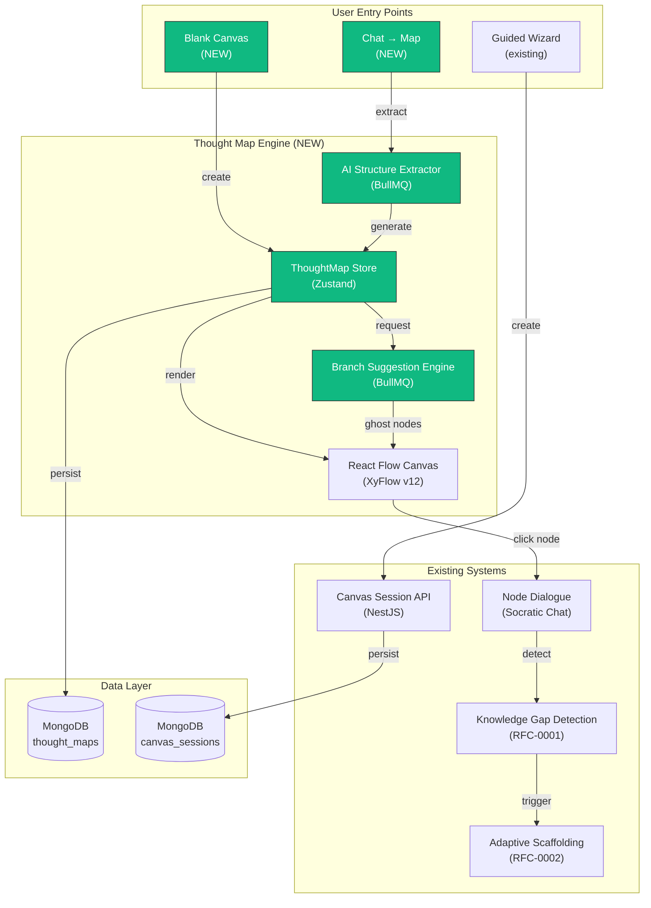
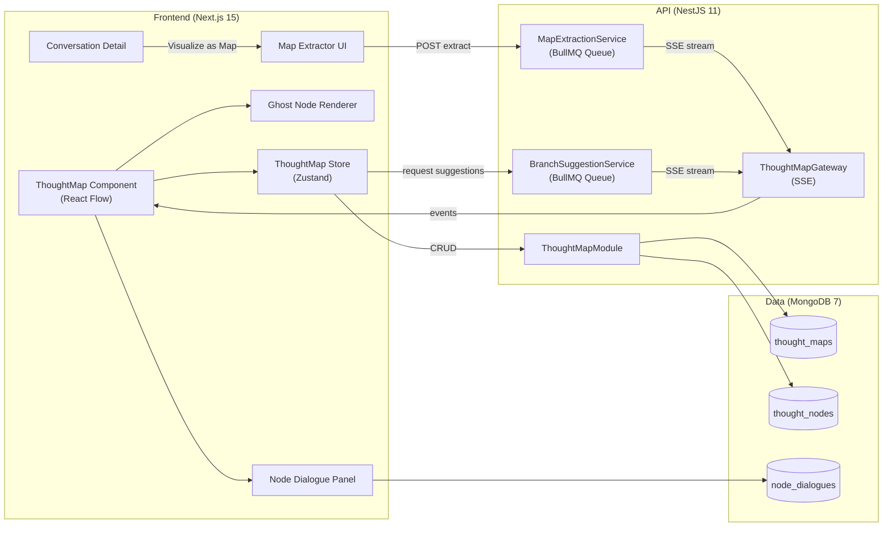
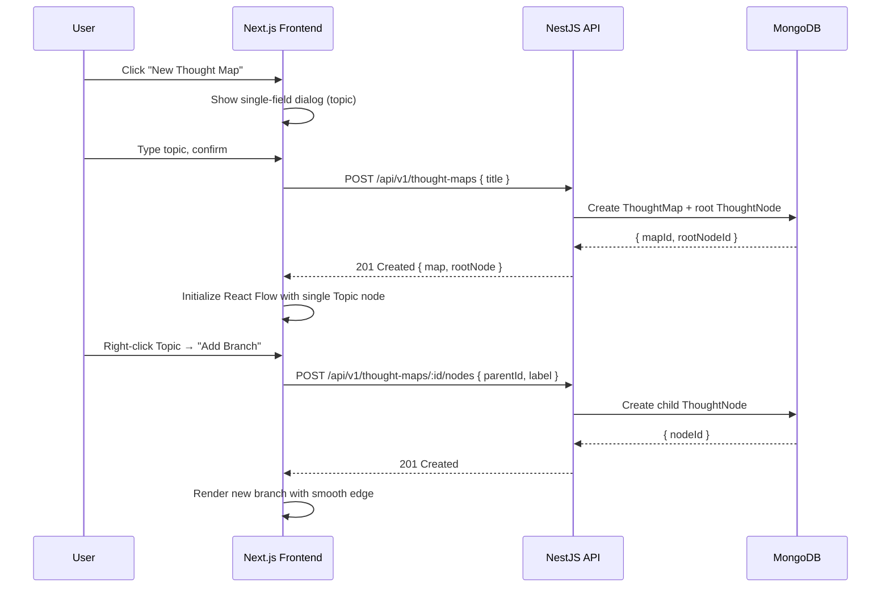
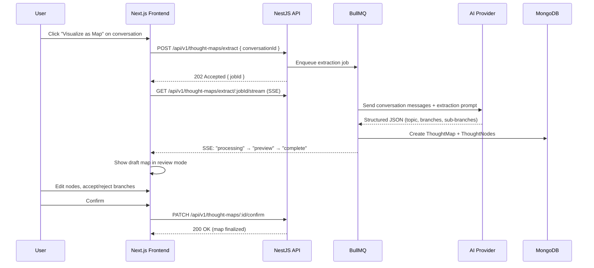
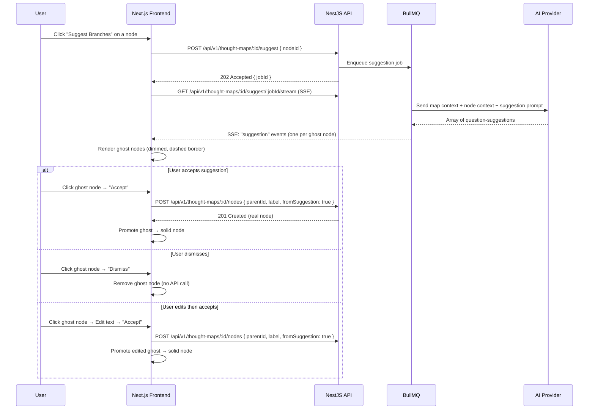
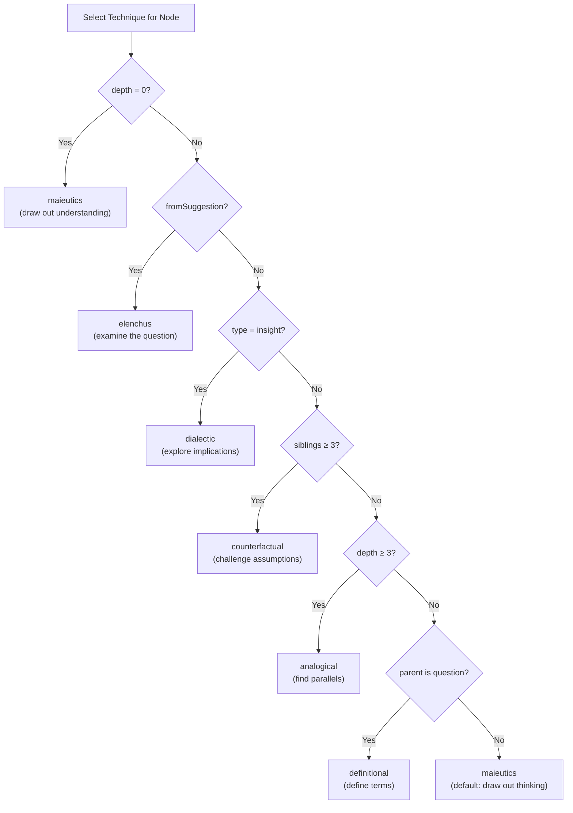
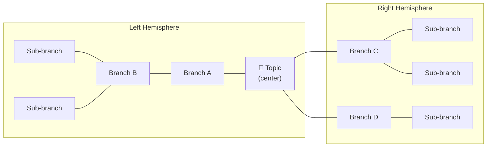
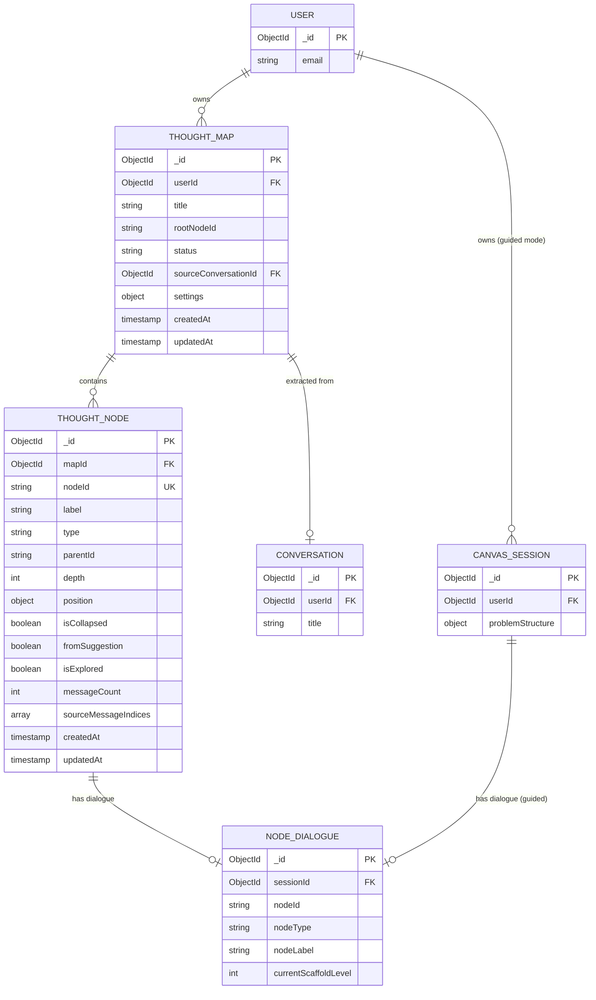

# RFC-0003: Thought Map — Unified Visual Thinking Canvas

<!-- HEADER BLOCK: Identifies the RFC and its current lifecycle state at a glance. -->

| Field            | Value                                                              |
| ---------------- | ------------------------------------------------------------------ |
| **RFC Number**   | 0003                                                               |
| **Title**        | Thought Map — Unified Visual Thinking Canvas                       |
| **Status**       |  |
| **Author(s)**    | [Prathik Shetty](https://github.com/shettydev)                     |
| **Created**      | 2026-03-08                                                         |
| **Last Updated** | 2026-03-08                                                         |

> **Status options:** `Draft` | `In Review` | `Accepted` | `Implemented` | `Rejected` | `Superseded`

---

## 1. Abstract

This RFC proposes the **Thought Map**, a free-form visual thinking canvas that replaces the rigid Seed/Soil/Root node taxonomy with an organic, Coggle-style mind map where users create a central topic and branch freely to unlimited depth. The proposal introduces four interconnected capabilities: (1) a free-form Thought Map canvas with generic, user-labeled nodes, (2) a blank canvas entry point where users start from a single topic and grow organically, (3) AI-powered conversion of linear chat conversations into visual Thought Maps, and (4) Socratic Branch Suggestions — AI-generated questions rendered as ghost nodes that guide exploration without giving direct answers. The existing Seed/Soil/Root canvas is preserved as a "Guided Mode" option. Together, these features bridge Mukti's two core experiences (chat and canvas) while staying true to the "more questions than answers" philosophy.

---

## 2. Motivation

Mukti currently offers two disconnected thinking experiences: linear Socratic conversations and a structured Thinking Canvas with a rigid Seed (problem) → Soil (constraints) → Root (assumptions) taxonomy. Both have significant UX limitations that prevent users from thinking freely and visually.

### Current Pain Points

- **Forced Taxonomy:** The Seed/Soil/Root metaphor requires users to categorize their thoughts into predefined buckets before they've even started thinking. Users must distinguish "constraints" from "assumptions" upfront — a distinction that often only becomes clear _after_ exploration. This front-loads cognitive overhead at the worst possible moment.

- **Disconnected Experiences:** Chat conversations and canvas sessions exist in separate silos. A user who has a rich 30-message Socratic conversation has no way to visualize the structure that emerged. Conversely, a user staring at a canvas has no way to "talk through" a branch without opening a separate dialogue panel. The two modes should flow into each other.

- **Shallow Branching:** The current canvas supports only two levels: Seed → Soil/Root, plus Insight nodes spawned from dialogue. Real thinking is recursive — an assumption leads to sub-assumptions, a constraint reveals sub-constraints, a question spawns deeper questions. The Coggle-style mind map (unlimited depth, free branching) maps far more naturally to how humans actually decompose problems.

- **Cold Start Problem:** When a user creates a new canvas, they face a blank Setup Wizard and must fill in Seed, Soil, and Roots before seeing anything visual. Users who are "clueless" (their own word) about their problem structure get stuck at step 1. There's no way to start with a vague topic and discover structure through exploration.

- **No AI-Guided Exploration:** When users run out of ideas for branches, the current system offers no help. The only AI interaction is per-node Socratic dialogue — there's no mechanism for AI to suggest _what to think about next_ at the canvas level. This is a missed opportunity for Socratic guidance that doesn't give answers.

---

## 3. Goals & Non-Goals

### Goals

- [ ] Introduce a free-form Thought Map canvas with unlimited branching depth and user-labeled nodes
- [ ] Support a "blank canvas" entry point: type a topic → land on canvas → branch freely
- [ ] Enable AI-powered conversion of chat conversations into visual Thought Maps
- [ ] Implement Socratic Branch Suggestions: AI-generated questions as ghost nodes
- [ ] Preserve the existing Seed/Soil/Root canvas as a "Guided Mode" option
- [ ] Maintain per-node Socratic dialogue on all Thought Map nodes
- [ ] Integrate with RFC-0001 (Knowledge Gap Detection) and RFC-0002 (Adaptive Scaffolding) per-node
- [ ] Ensure backward compatibility — existing canvas sessions continue to work unchanged

### Non-Goals

- **Real-time collaboration:** Multi-user editing of the same Thought Map is valuable but out of scope. This RFC focuses on single-user experience.
- **Automatic mind map generation without review:** The Conversation → Map feature always produces a draft that the user reviews and edits. Fully autonomous structure extraction is not a goal.
- **Replacing Socratic dialogue:** The Thought Map is a _complement_ to dialogue, not a replacement. Per-node Socratic conversations remain the core interaction.
- **Full graph database migration:** We use MongoDB's document model with embedded graph structures, not a dedicated graph database. Performance is acceptable for the expected node counts (< 200 nodes per map).
- **Deprecating Guided Mode:** The Seed/Soil/Root wizard remains available for users who prefer structured setup. No forced migration.

---

## 4. Background & Context

### Prior Art

| Reference                                    | Relevance                                                                                   |
| -------------------------------------------- | ------------------------------------------------------------------------------------------- |
| [Coggle](https://coggle.it)                  | Free-form mind mapping with unlimited branching, smooth curved edges, collaborative editing |
| [Whimsical Mind Maps](https://whimsical.com) | Clean mind map UX with AI-assisted node generation                                          |
| [Miro AI](https://miro.com)                  | AI-powered sticky note clustering and mind map generation from text                         |
| RFC-0001: Knowledge Gap Detection            | BKT-based gap detection applies per-node in Thought Maps                                    |
| RFC-0002: Adaptive Scaffolding Framework     | Scaffold levels (0-4) apply per-node dialogue in Thought Maps                               |
| Current `CanvasSession` schema               | Rigid `{ seed, soil[], roots[] }` structure being extended                                  |
| Current `NodeDialogue` schema                | Per-node dialogue with `nodeType` enum — needs extension for new node types                 |
| XyFlow/React Flow v12                        | Current canvas rendering library — supports custom nodes, edges, and layouts                |

### System Context Diagram



---

## 5. Proposed Solution

### Overview

The Thought Map introduces a **generic directed graph** as the primary canvas data structure, replacing the rigid `{ seed, soil[], roots[] }` problem structure. Every node in a Thought Map is a "Thought" — a user-labeled piece of thinking that can have unlimited children. The central node is the "Topic" (analogous to Seed), but child nodes are not forced into categories. Users label them however they want.

The system provides **four entry points** into the Thought Map experience:

1. **Blank Canvas** — User types a topic, lands on a canvas with one node, and branches freely. This is the primary new flow and the lowest-friction entry point.
2. **From Chat** — User clicks "Visualize as Map" on any conversation. AI extracts structure from the message history and generates a draft Thought Map that the user reviews and edits.
3. **Guided Mode** (preserved) — The existing Seed/Soil/Root Setup Wizard creates a classic `CanvasSession`. Users who prefer structured decomposition continue using this flow unchanged.
4. **From Thought Map node** — Any node on the Thought Map can spawn a Socratic dialogue (existing per-node chat), and insights from dialogue can become new child nodes.

**Socratic Branch Suggestions** are the AI-powered exploration aid. When a user pauses on the canvas (or explicitly requests suggestions), the AI analyzes the current map structure and generates 2-4 questions as "ghost nodes" — dimmed, dashed-border nodes attached to the relevant parent. The user can accept a suggestion (promoting it to a real node), dismiss it, or edit it before accepting. Crucially, suggestions are always **questions**, never answers — preserving Mukti's core philosophy.

### Architecture Diagram



### Sequence Flow

#### 5.0.1 Blank Canvas Creation



#### 5.0.2 Conversation → Map Extraction



#### 5.0.3 Socratic Branch Suggestions



### Detailed Design

#### 5.1 Node Taxonomy — From Rigid to Organic

The current canvas enforces four node types with hardcoded semantics:

| Current Type | Meaning    | Limit | Technique Mapping |
| ------------ | ---------- | ----- | ----------------- |
| `seed`       | Problem    | 1     | maieutics         |
| `soil`       | Constraint | 10    | counterfactual    |
| `root`       | Assumption | 8     | elenchus          |
| `insight`    | Discovery  | ∞     | dialectic         |

The Thought Map replaces this with a flexible taxonomy:

| New Type   | Meaning                         | Limit | Technique Selection                |
| ---------- | ------------------------------- | ----- | ---------------------------------- |
| `topic`    | Central subject (root of map)   | 1     | maieutics (draw out understanding) |
| `thought`  | Any user-created branch         | 100   | Context-aware (see §5.1.1)         |
| `question` | AI-suggested exploration branch | 100   | elenchus (examine the question)    |
| `insight`  | Discovery from dialogue         | ∞     | dialectic (explore implications)   |

##### 5.1.1 Context-Aware Technique Selection

Since `thought` nodes don't have a predetermined type, the Socratic technique is selected based on **node context** rather than node category:



This replaces the rigid `seed→maieutics, root→elenchus, soil→counterfactual` mapping with a dynamic algorithm that considers the node's position in the graph, its origin (user-created vs. AI-suggested), and its siblings.

#### 5.2 Blank Canvas Entry Flow

The blank canvas is the primary new entry point — designed for users who want to start thinking visually without upfront structure.

**UX Flow:**

1. User clicks "New Thought Map" from the dashboard
2. A minimal dialog appears with a single text field: _"What do you want to think about?"_
3. User types their topic (e.g., "How should I design my database schema?")
4. User lands on the canvas with a single Topic node at center
5. User can:
   - **Right-click** any node → "Add Branch" to create a child
   - **Click** "Suggest Branches" button (or wait for auto-suggestion after 10s idle)
   - **Click** any node to open Socratic dialogue
   - **Drag** nodes to rearrange
   - **Double-click** a node to edit its label

**Auto-Suggestion Trigger:**
When the canvas has only the Topic node and the user has been idle for 10 seconds, the system automatically requests branch suggestions. This addresses the cold-start problem — a user who types "How should I design my database schema?" and then stares at the screen gets helpful questions like:

- _"What entities does your system need to represent?"_
- _"What are the read vs. write access patterns?"_
- _"What scale are you designing for?"_
- _"Are there existing schemas you need to be compatible with?"_

These appear as ghost nodes (dimmed, dashed border) that the user can accept, edit, or dismiss.

#### 5.3 Conversation → Map Extraction

This feature bridges Mukti's chat and canvas experiences. A user who has had a rich Socratic conversation can convert it into a visual Thought Map.

**Extraction Algorithm:**

The AI receives the full conversation history and a structured extraction prompt:

```
Given this Socratic conversation, extract a mind map structure:

1. Identify the CENTRAL TOPIC (the main subject being explored)
2. Identify 3-7 KEY THEMES (major branches of discussion)
3. For each theme, identify 1-4 SUB-POINTS (specific arguments, questions, or insights)
4. Identify any UNRESOLVED QUESTIONS (topics raised but not fully explored)

Return as JSON:
{
  "topic": "string",
  "branches": [
    {
      "label": "string",
      "type": "thought" | "question",
      "children": [
        { "label": "string", "type": "thought" | "question" | "insight" }
      ],
      "sourceMessageIndices": [0, 3, 7]  // links back to conversation
    }
  ]
}
```

**Key Design Decisions:**

- **Maximum extraction depth: 3 levels** (Topic → Branch → Sub-branch). Deeper structure should emerge from user exploration, not AI extraction.
- **Source message linking:** Each extracted node stores indices of the conversation messages it was derived from. The UI can show "View source messages" on hover.
- **Review before finalize:** The extracted map always appears in a "draft" state. The user must review, edit, and confirm before it becomes a permanent Thought Map. This prevents AI from imposing structure the user doesn't agree with.
- **Bidirectional navigation:** From the Thought Map, users can click "View Conversation" to jump back to the source chat. From the conversation, a banner shows "This conversation has been visualized as a Thought Map."

#### 5.4 Socratic Branch Suggestions

This is the most philosophically sensitive feature. The core principle: **suggestions are always questions, never answers.**

**What makes a suggestion Socratic:**

| Socratic (allowed)                                    | Non-Socratic (forbidden)                      |
| ----------------------------------------------------- | --------------------------------------------- |
| "What assumptions are you making about scalability?"  | "You should use horizontal scaling"           |
| "Have you considered the user's perspective?"         | "Users prefer simple interfaces"              |
| "What would happen if this constraint didn't exist?"  | "Remove the constraint and use X instead"     |
| "How does this relate to your earlier point about Y?" | "This contradicts Y, so you should change it" |

**Suggestion Generation Prompt:**

```
You are a Socratic thinking assistant. The user is building a mind map to explore a topic.

Current map structure:
{mapContext}

The user is on node: "{nodeLabel}" (depth: {depth}, siblings: {siblingCount})

Generate 2-4 QUESTIONS that would help the user explore this branch further.

Rules:
- Every suggestion MUST be a question, never a statement or answer
- Questions should reveal unexplored dimensions, hidden assumptions, or missing perspectives
- Avoid questions the map already addresses
- Vary question types: definitional, counterfactual, analogical, causal
- Keep questions concise (under 80 characters)

Return as JSON array: ["question1", "question2", ...]
```

**Ghost Node UX:**

Ghost nodes are visually distinct from real nodes:

- **Opacity:** 50% (dimmed)
- **Border:** Dashed, using a muted purple color
- **Icon:** Sparkle icon (✨) indicating AI-generated
- **Actions on hover:** Accept (✓), Edit (✎), Dismiss (✕)
- **Animation:** Fade in with a subtle scale animation
- **Auto-dismiss:** Ghost nodes disappear after 60 seconds if not interacted with
- **Maximum:** 4 ghost nodes visible at once per parent node

**Trigger Mechanisms:**

1. **Explicit:** User clicks "Suggest Branches" button on any node
2. **Auto (cold start):** Canvas has ≤ 1 real node and user idle for 10 seconds
3. **Auto (exploration):** User has been on the same node for 30 seconds without branching (configurable, can be disabled)
4. **Never auto on dialogue:** Suggestions don't appear while a Socratic dialogue is active (would be distracting)

#### 5.5 Guided Mode Preservation

The existing Seed/Soil/Root canvas is preserved as "Guided Mode" — a structured alternative for users who prefer upfront decomposition.

**Coexistence Strategy:**

- Dashboard shows two creation options: "New Thought Map" (free-form) and "New Guided Canvas" (wizard)
- Existing `CanvasSession` schema and all related code remain unchanged
- Existing canvas sessions are accessible at their current URLs (`/canvas/:id`)
- New Thought Maps use a new URL pattern (`/map/:id`)
- No automatic migration of existing sessions
- Optional manual conversion: "Convert to Thought Map" button on existing canvas sessions (one-way, creates a copy)

**Guided → Thought Map Conversion Mapping:**

| Guided Mode Node | Thought Map Equivalent                  |
| ---------------- | --------------------------------------- |
| Seed             | Topic (root node)                       |
| Soil items       | Thought nodes (children of Topic)       |
| Root items       | Thought nodes (children of Topic)       |
| Insight nodes    | Insight nodes (preserved as-is)         |
| Relationships    | Edges between Thought nodes (preserved) |

#### 5.6 Layout Algorithm

The Thought Map uses a **radial tree layout** with automatic positioning, similar to Coggle:

- **Topic node** at center
- **First-level branches** arranged radially around the topic (left half and right half)
- **Deeper branches** extend outward from their parent, with automatic spacing to avoid overlap
- **Smooth curved edges** (bezier curves) connecting parent to child
- **Auto-layout on creation** with manual drag override (positions persist)
- **Collapse/expand** subtrees by clicking the expand indicator on any node

The layout algorithm distributes nodes to minimize edge crossings and maintain readability:



**Algorithm:** First-level children are split into left and right hemispheres (first half left, second half right). Each child is positioned at `±HORIZONTAL_SPACING × depth` on the X axis, with vertical spacing calculated to avoid sibling overlap. Subtrees extend outward from their parent in the assigned direction. Positions are auto-calculated on creation but persist after manual drag overrides.

---

## 6. API / Interface Design

### Endpoints

#### `POST /api/v1/thought-maps`

Create a new Thought Map with a single Topic node.

| Field   | Type   | Required | Description                     |
| ------- | ------ | -------- | ------------------------------- |
| `title` | string | Yes      | The central topic (5–500 chars) |

**Response (201 Created):** Returns the map with `id`, `title`, `rootNodeId`, a single Topic node at position `(0, 0)`, empty edges array, and timestamps. Wrapped in standard `{ success, data, meta }` envelope.

---

#### `POST /api/v1/thought-maps/:id/nodes`

Add a new node (branch) to the Thought Map.

| Field            | Type    | Required | Description                                         |
| ---------------- | ------- | -------- | --------------------------------------------------- |
| `parentId`       | string  | Yes      | Parent node ID                                      |
| `label`          | string  | Yes      | Node label (3–300 chars)                            |
| `type`           | string  | No       | `thought` (default), `question`, or `insight`       |
| `fromSuggestion` | boolean | No       | Whether promoted from a ghost node (default: false) |

**Response (201 Created):** Returns the created node with `nodeId`, `label`, `type`, `parentId`, `depth`, `position`, and `fromSuggestion`.

**Error Responses:**

| Status Code | Description                                  |
| ----------- | -------------------------------------------- |
| 400         | Invalid request body or label too short/long |
| 401         | Authentication required                      |
| 404         | Thought Map or parent node not found         |
| 422         | Maximum node limit reached (100)             |

---

#### `PATCH /api/v1/thought-maps/:id/nodes/:nodeId`

Update a node's label, position, or collapsed state. All fields optional.

| Field         | Type    | Description                |
| ------------- | ------- | -------------------------- |
| `label`       | string  | Updated label text         |
| `position`    | object  | `{ x: number, y: number }` |
| `isCollapsed` | boolean | Collapse/expand subtree    |

**Response (200 OK):** Returns the updated node fields.

---

#### `DELETE /api/v1/thought-maps/:id/nodes/:nodeId`

Delete a node. Query param `?cascade=true|false` (default: false). If `cascade=false` and the node has children, returns 409 Conflict. Cannot delete the Topic (root) node (400).

---

#### `POST /api/v1/thought-maps/extract`

Extract a Thought Map from a conversation. Accepts `{ conversationId }`.

**Response (202 Accepted):** Returns `{ jobId, position }` for queue tracking.

**SSE Stream:** `GET /api/v1/thought-maps/extract/:jobId/stream` — Events: `processing` → `preview` (with draft map JSON) → `complete` | `error`

---

#### `POST /api/v1/thought-maps/:id/suggest`

Request Socratic branch suggestions for a node. Accepts `{ nodeId }`.

**Response (202 Accepted):** Returns `{ jobId, position }` for queue tracking.

**SSE Stream:** `GET /api/v1/thought-maps/:id/suggest/:jobId/stream` — Events: `processing` → `suggestion` (repeated, one per ghost node) → `complete` | `error`. Each `suggestion` event contains `{ label, parentId, suggestedType }`.

---

#### `PATCH /api/v1/thought-maps/:id/confirm`

Confirm a draft Thought Map (from extraction) as finalized. Returns the map with `status: "active"` and `confirmedAt` timestamp.

---

## 7. Data Model Changes

### Entity-Relationship Diagram



### New Collection: `thought_maps`

Stores the top-level map metadata. Indexed on `userId` for dashboard queries.

| Field                 | Type     | Required | Description                                                                          |
| --------------------- | -------- | -------- | ------------------------------------------------------------------------------------ |
| userId                | ObjectId | Yes      | Owner (FK → User)                                                                    |
| title                 | string   | Yes      | Central topic text (trimmed)                                                         |
| rootNodeId            | string   | Yes      | ID of the root topic node                                                            |
| status                | string   | Yes      | Enum: `draft`, `active`, `archived` (default: `active`)                              |
| sourceConversationId  | ObjectId | No       | FK → Conversation (if created via extraction)                                        |
| sourceCanvasSessionId | ObjectId | No       | FK → CanvasSession (if converted from guided mode)                                   |
| settings              | object   | Yes      | `{ autoSuggestEnabled: true, autoSuggestIdleSeconds: 10, maxSuggestionsPerNode: 4 }` |

### New Collection: `thought_nodes`

Stores individual nodes within a map. Indexed on `mapId` for efficient per-map queries. Compound index on `(mapId, nodeId)` for uniqueness.

| Field                | Type     | Required | Description                                                |
| -------------------- | -------- | -------- | ---------------------------------------------------------- |
| mapId                | ObjectId | Yes      | FK → ThoughtMap                                            |
| nodeId               | string   | Yes      | Unique within map (e.g., `topic-0`, `thought-7`)           |
| label                | string   | Yes      | User-visible node text (trimmed)                           |
| type                 | string   | Yes      | Enum: `topic`, `thought`, `question`, `insight`            |
| parentId             | string   | No       | Parent node ID (null for root/topic node)                  |
| depth                | number   | Yes      | Tree depth (0 = topic, 1 = first-level branch, etc.)       |
| position             | object   | Yes      | `{ x: number, y: number }` — canvas coordinates            |
| isCollapsed          | boolean  | No       | Whether subtree is collapsed in UI (default: false)        |
| fromSuggestion       | boolean  | No       | Whether promoted from AI ghost node (default: false)       |
| isExplored           | boolean  | No       | Whether Socratic dialogue has been opened (default: false) |
| messageCount         | number   | No       | Count of dialogue messages on this node (default: 0)       |
| sourceMessageIndices | number[] | No       | For extraction: indices of source conversation messages    |

### Changes to Existing Schema: `NodeDialogue`

Two additive changes to support Thought Map nodes:

1. **Extended `nodeType` enum**: Add `topic`, `thought`, `question` to the existing `seed`, `soil`, `root`, `insight` values
2. **New optional `mapId` field**: Reference to ThoughtMap (alternative to `sessionId` for guided canvas)

**New index** for Thought Map dialogues: `(mapId, nodeId)` with unique + sparse constraint. The existing `(sessionId, nodeId)` index is preserved for backward compatibility.

### Migration Notes

- **Migration type:** Additive
- **Backwards compatible:** Yes — no existing schemas are modified destructively. New collections (`thought_maps`, `thought_nodes`) are created alongside existing ones. The `NodeDialogue` schema receives additive fields only.
- **Estimated migration duration:** No data migration required. New collections are empty on deploy. Existing `canvas_sessions` and `node_dialogues` continue to work unchanged.

---

## 8. Alternatives Considered

### Alternative A: Extend Existing CanvasSession Schema

Modify the existing `CanvasSession.problemStructure` to support free-form nodes by making `soil` and `roots` optional and adding a generic `nodes[]` array.

| Pros                                | Cons                                                    |
| ----------------------------------- | ------------------------------------------------------- |
| No new collections needed           | Overloads a schema designed for a different data model  |
| Single URL pattern for all canvases | Migration risk for existing sessions                    |
| Simpler API surface                 | `problemStructure.seed` becomes confusing for free-form |
|                                     | Guided Mode and free-form share validation logic        |

**Reason for rejection:** The `CanvasSession` schema is fundamentally designed around the `{ seed, soil[], roots[] }` structure. Retrofitting free-form graph support would create a "god schema" that serves two different data models poorly. Clean separation (new `ThoughtMap` + `ThoughtNode` collections) is simpler to reason about, test, and evolve independently.

### Alternative B: Client-Only Thought Map (No Backend Persistence)

Build the Thought Map entirely in the frontend using Zustand + localStorage, with no new backend schemas or API endpoints.

| Pros                  | Cons                                                  |
| --------------------- | ----------------------------------------------------- |
| Zero backend changes  | No cross-device sync                                  |
| Fastest to implement  | No AI extraction (requires backend queue)             |
| No migration concerns | No Socratic dialogue integration (needs NodeDialogue) |
|                       | Data loss on browser clear                            |
|                       | Can't share maps                                      |

**Reason for rejection:** The core value of Thought Maps comes from AI integration (extraction, suggestions) and Socratic dialogue per-node — both of which require backend infrastructure. A client-only approach would be a standalone mind map tool with no connection to Mukti's AI capabilities.

### Alternative C: Use a Graph Database (Neo4j / ArangoDB)

Store the Thought Map as a native graph in a graph database instead of MongoDB documents.

| Pros                                | Cons                                              |
| ----------------------------------- | ------------------------------------------------- |
| Native graph traversal queries      | New infrastructure dependency                     |
| Efficient deep relationship queries | Operational complexity (another DB to manage)     |
| Natural fit for tree/graph data     | Overkill for expected scale (< 200 nodes per map) |
|                                     | Team unfamiliar with graph DB operations          |

**Reason for rejection:** MongoDB's document model with embedded references handles tree structures well at our expected scale. A Thought Map with 100 nodes and 99 edges is trivially queryable with MongoDB indexes. Adding a graph database introduces operational complexity disproportionate to the benefit.

---

## 9. Security & Privacy Considerations

### Threat Surface

- **AI Prompt Injection via Node Labels:** Users could craft node labels designed to manipulate the AI suggestion or extraction prompts. **Mitigation:** Sanitize node labels before including in AI prompts. Apply the same input validation used for conversation messages (max length, no control characters).

- **Conversation Data Exposure in Extraction:** The Conversation → Map extraction sends full conversation history to the AI provider. **Mitigation:** This follows the same data flow as existing conversation AI responses — no new exposure surface. BYOK users' keys are used per existing `AiPolicyService`.

- **Ghost Node Content Filtering:** AI-generated suggestions could contain inappropriate content. **Mitigation:** Apply the same content moderation pipeline used for AI conversation responses.

### Data Sensitivity

| Data Element               | Classification | Handling Requirements                          |
| -------------------------- | -------------- | ---------------------------------------------- |
| Thought Map content        | User Content   | Encrypted at rest (MongoDB), access-controlled |
| Node labels                | User Content   | Sanitized before AI prompt inclusion           |
| Source message indices     | Metadata       | No PII, links to existing conversation data    |
| Suggestion generation logs | Operational    | Standard API logging, no content stored        |

### Authentication & Authorization

No changes to auth flows. All new endpoints are JWT-protected (global `APP_GUARD`). Thought Maps are scoped to `userId` — users can only access their own maps. The existing `@CurrentUser()` decorator provides user context.

---

## 10. Performance & Scalability

| Metric                         | Current Baseline    | Expected After Change | Acceptable Threshold |
| ------------------------------ | ------------------- | --------------------- | -------------------- |
| Canvas load time (p95)         | ~200ms (< 20 nodes) | ~350ms (< 100 nodes)  | < 500ms              |
| Map extraction latency         | N/A                 | 3-8s (AI dependent)   | < 15s                |
| Branch suggestion latency      | N/A                 | 1-3s (AI dependent)   | < 5s                 |
| React Flow render (100 nodes)  | N/A                 | ~16ms per frame       | < 33ms (30fps)       |
| MongoDB query (nodes by mapId) | N/A                 | < 5ms (indexed)       | < 20ms               |

### Known Bottlenecks

- **Large Map Rendering:** React Flow performance degrades above ~500 nodes. **Mitigation:** Hard limit of 100 nodes per map. Subtree collapse reduces visible node count. Virtualization for off-screen nodes (React Flow built-in).

- **AI Extraction for Long Conversations:** Conversations with 50+ messages produce large prompts. **Mitigation:** Truncate to most recent 50 messages (same as existing `recentMessages` limit). Summarize older messages if `hasArchivedMessages` is true.

- **Concurrent Suggestion Requests:** Multiple users requesting suggestions simultaneously. **Mitigation:** BullMQ queue with concurrency limits (same pattern as existing conversation and dialogue queues).

---

## 11. Observability

### Logging

- `thought-map.created` — Map creation with source type (blank, extraction, conversion)
- `thought-map.node.created` — Node creation with type and `fromSuggestion` flag
- `thought-map.extraction.started` / `.completed` / `.failed` — Extraction job lifecycle
- `thought-map.suggestion.requested` / `.generated` / `.accepted` / `.dismissed` — Suggestion lifecycle

### Metrics

- `thought_map_count` (gauge) — Total maps per user
- `thought_map_node_count` (histogram) — Nodes per map distribution
- `thought_map_suggestion_accept_rate` (gauge) — Ratio of accepted vs. dismissed suggestions
- `thought_map_extraction_duration_ms` (histogram) — AI extraction latency
- `thought_map_suggestion_duration_ms` (histogram) — AI suggestion latency
- `thought_map_depth_max` (histogram) — Maximum branching depth per map

### Tracing

- New spans for extraction and suggestion BullMQ jobs, following existing conversation queue tracing patterns
- Trace propagation from SSE connection through queue processing to AI provider call

### Alerting

| Alert Name               | Condition                 | Severity | Runbook Link |
| ------------------------ | ------------------------- | -------- | ------------ |
| Extraction Queue Backlog | Queue depth > 50 for > 5m | Warning  | TBD          |
| Suggestion Failure Rate  | Error rate > 10% for 5m   | Warning  | TBD          |
| Map Creation Spike       | > 100 maps created in 1m  | Info     | TBD          |

---

## 12. Rollout Plan

### Phases

| Phase | Description                        | Entry Criteria                 | Exit Criteria                                    |
| ----- | ---------------------------------- | ------------------------------ | ------------------------------------------------ |
| 1     | Blank Canvas + basic branching     | RFC accepted, schemas deployed | Users can create maps and add branches           |
| 2     | Socratic dialogue on Thought nodes | Phase 1 complete               | Per-node dialogue works with technique selection |
| 3     | Socratic Branch Suggestions        | Phase 2 complete               | Ghost nodes render, accept/dismiss works         |
| 4     | Conversation → Map extraction      | Phase 3 complete               | Extraction produces reviewable draft maps        |
| 5     | Guided Mode conversion + polish    | Phase 4 complete               | Convert existing canvases, auto-suggest tuned    |

### Feature Flags

- **Flag name:** `thought_map_enabled`
- **Default state:** Off
- **Kill switch:** Yes — disabling hides all Thought Map UI and returns 404 on new endpoints. Existing maps remain in DB but are inaccessible until re-enabled.

- **Flag name:** `thought_map_suggestions_enabled`
- **Default state:** Off (enabled separately from base Thought Map)
- **Kill switch:** Yes — disabling hides suggestion UI. Maps continue to work without suggestions.

- **Flag name:** `thought_map_extraction_enabled`
- **Default state:** Off (enabled separately)
- **Kill switch:** Yes — disabling hides "Visualize as Map" button on conversations.

### Rollback Strategy

1. Disable feature flags (`thought_map_enabled`, `thought_map_suggestions_enabled`, `thought_map_extraction_enabled`)
2. All Thought Map UI disappears immediately (feature-flagged components)
3. New API endpoints return 404 (feature-flag middleware)
4. Existing data in `thought_maps` and `thought_nodes` collections is preserved but inaccessible
5. No schema rollback needed (additive changes only)
6. Existing Guided Mode canvases are completely unaffected at all times

---

## 13. Open Questions

1. **Extraction depth limit** — Should AI extraction go 2 levels deep (Topic → Branch → Sub-branch) or 3 levels? Deeper extraction is more useful but risks imposing structure the user didn't intend. — _Recommendation: Start with 2 levels, add 3rd level as opt-in._

2. **Auto-suggestion frequency** — The 10-second idle trigger for cold start is a starting point. Should auto-suggestions also trigger when a user adds a node but doesn't branch further for 30 seconds? Too aggressive feels pushy; too passive loses the benefit. — _Recommendation: Start with explicit-only (button click) + cold start auto. Add idle-based auto in Phase 5 after user testing._

3. **Suggestion AI call routing** — Should suggestions use a separate, cheaper AI model (e.g., a smaller model for fast question generation) or the same model as Socratic dialogue? Separate model is faster/cheaper but may produce lower-quality questions. — _Recommendation: Use the user's configured model (respects BYOK) but with a lower max_tokens limit._

4. **Maximum nodes per map** — 100 is proposed. Is this sufficient? Coggle has no limit but degrades visually above ~200. React Flow handles ~500 before frame drops. — _Recommendation: 100 for v1, increase based on usage data._

5. **Collaborative editing** — Should the data model be designed with future multi-user support in mind (e.g., operational transforms, CRDTs)? This adds complexity now for a feature that may never ship. — _Recommendation: No. Design for single-user. If collaboration is needed later, it warrants its own RFC._

6. **Guided Mode deprecation timeline** — Should there be a long-term plan to sunset Guided Mode, or should it remain indefinitely as an alternative? — _Recommendation: Keep indefinitely. Some users genuinely prefer structured decomposition. Let usage data inform future decisions._

7. **Map sharing** — Should Thought Maps support the same sharing mechanism as conversations (`shareToken`, public viewer)? — _Recommendation: Yes, in Phase 5. Reuse the existing `SharedLink` schema pattern._

> **Reviewers:** Please reference open questions by number (e.g., "Regarding OQ-2, ...") in your comments.

---

## 14. Decision Log

| Date       | Decision                                          | Rationale                                                        | Decided By     |
| ---------- | ------------------------------------------------- | ---------------------------------------------------------------- | -------------- |
| 2026-03-08 | Separate collections over extending CanvasSession | Clean separation of concerns; no migration risk to existing data | Prathik Shetty |
| 2026-03-08 | Preserve Guided Mode as alternative               | Some users prefer structured decomposition; no forced migration  | Prathik Shetty |
| 2026-03-08 | Suggestions as questions only                     | Preserves Mukti's "more questions than answers" core philosophy  | Prathik Shetty |
| 2026-03-08 | 3-level max extraction depth                      | Deeper structure should emerge from user exploration, not AI     | Prathik Shetty |
| 2026-03-08 | Context-aware technique selection                 | Replaces rigid type→technique mapping with dynamic algorithm     | Prathik Shetty |

---

## 15. References

- [RFC-0001: Knowledge Gap Detection System](../rfc-0001-knowledge-gap-detection/index.md)
- [RFC-0002: Adaptive Scaffolding Framework](../rfc-0002-adaptive-scaffolding-framework/index.md)
- [Coggle — Collaborative Mind Maps](https://coggle.it)
- [XyFlow/React Flow v12 Documentation](https://reactflow.dev)
- [BullMQ Documentation](https://docs.bullmq.io)
- [Mukti Product Philosophy — CLAUDE.md](../../../../CLAUDE.md)

---

> **Reviewer Notes:**
>
> This RFC introduces the largest UX surface area change since Mukti's initial canvas implementation.
> The phased rollout (5 phases) and independent feature flags allow incremental validation.
>
> WARNING: The Conversation → Map extraction feature sends full conversation history to the AI provider.
> This follows existing data flow patterns but reviewers should verify BYOK key handling in the new
> `MapExtractionService`.
>
> WARNING: Auto-suggestion triggers (idle timers) may feel intrusive to some users. Phase 5 tuning
> based on user feedback is critical before enabling auto-suggestions by default.
