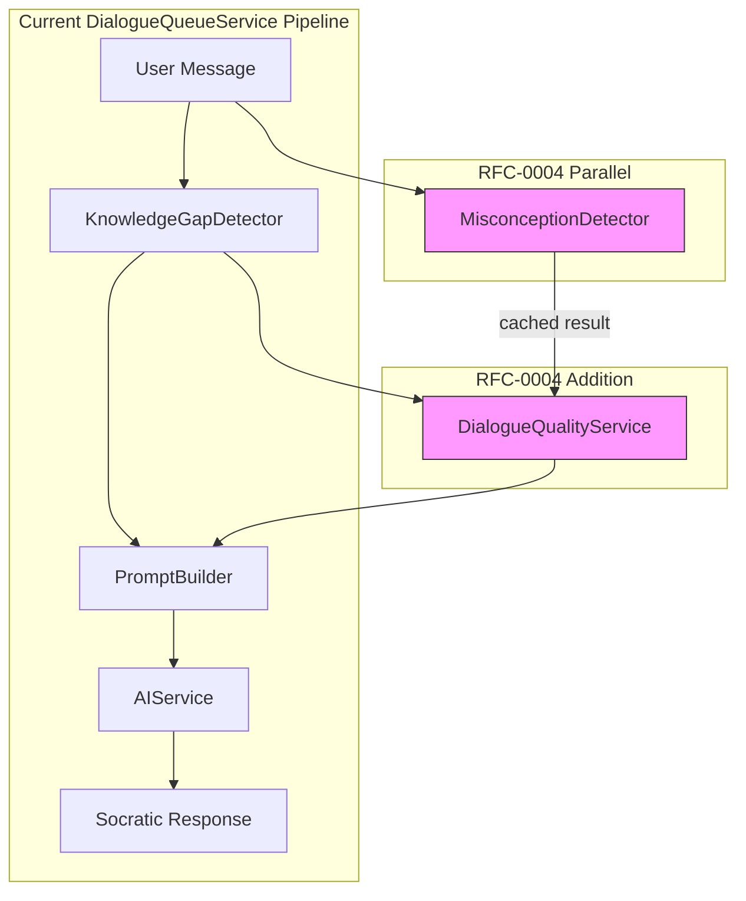
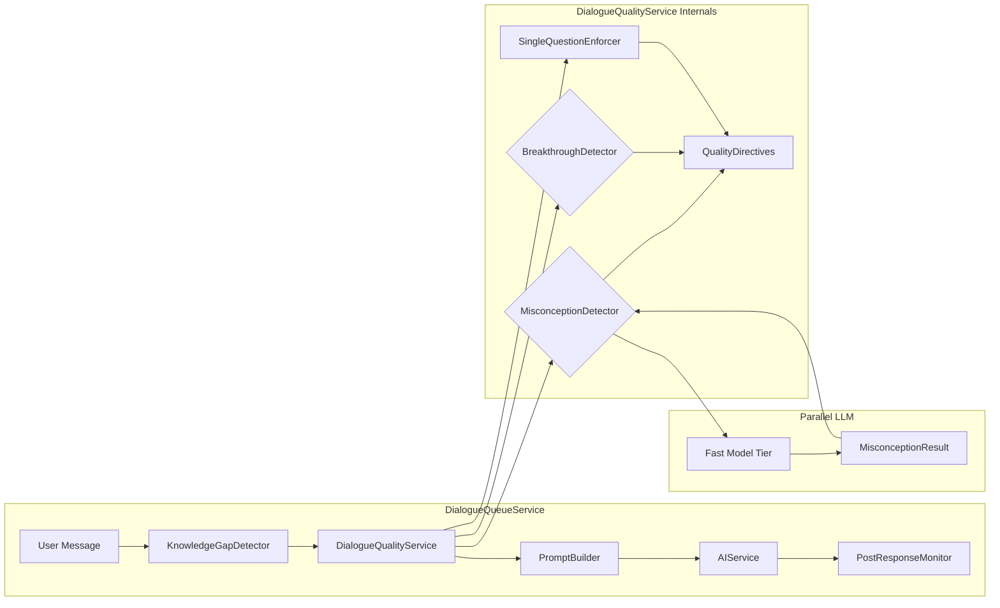
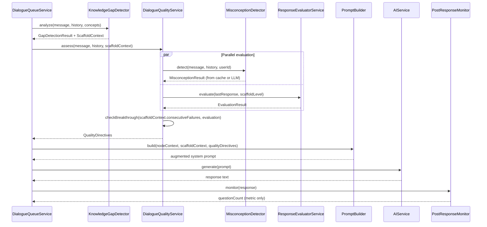
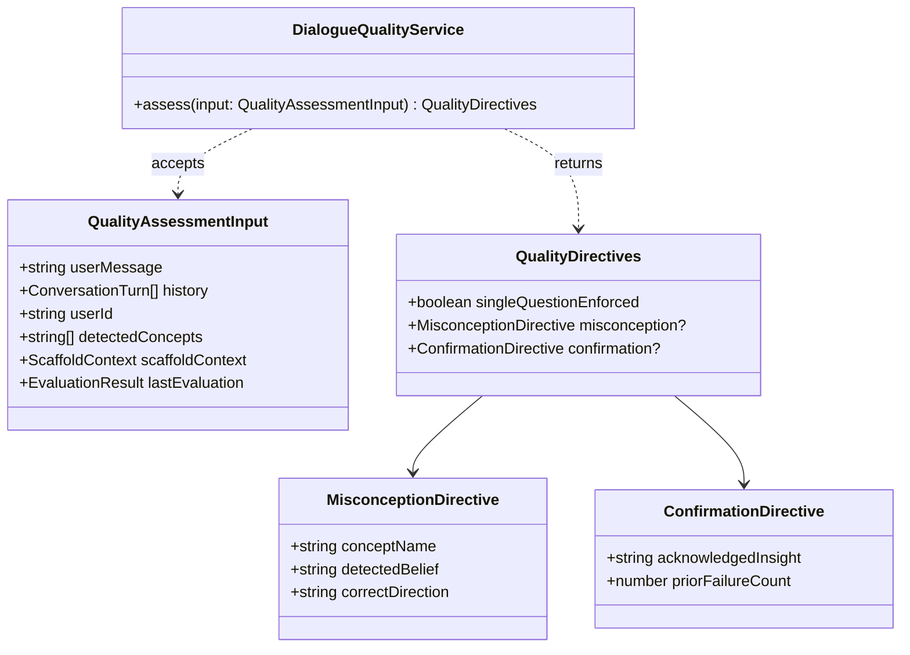
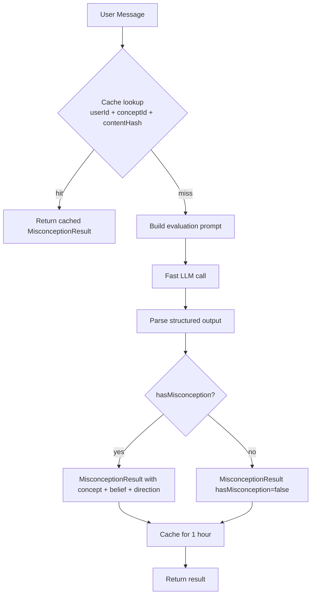
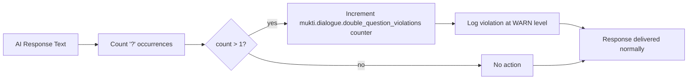
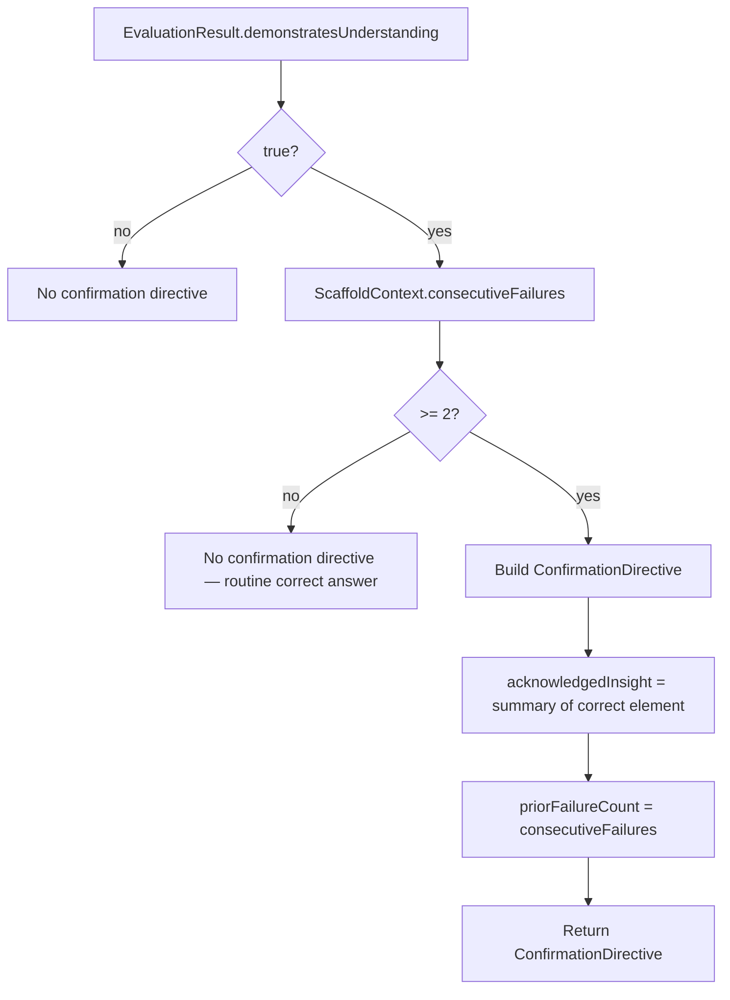
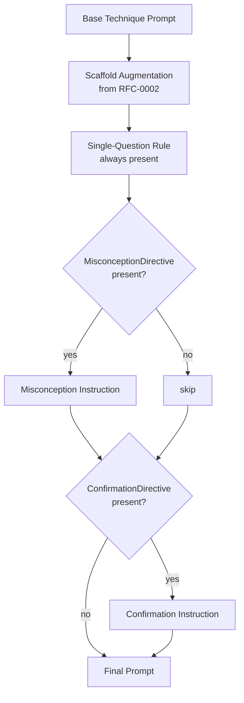
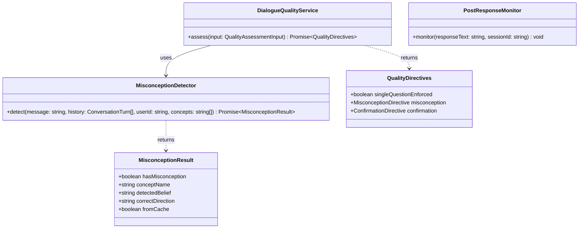
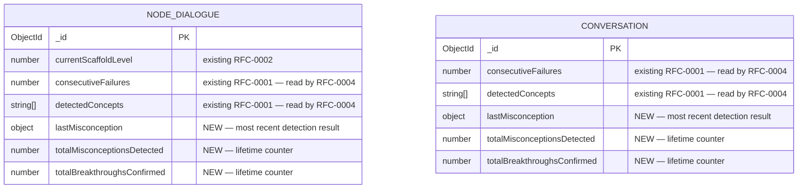

# RFC-0004: Socratic Dialogue Quality Guardrails

<!-- HEADER BLOCK: Identifies the RFC and its current lifecycle state at a glance. -->

| Field            | Value                                                              |
| ---------------- | ------------------------------------------------------------------ |
| **RFC Number**   | 0004                                                               |
| **Title**        | Socratic Dialogue Quality Guardrails                               |
| **Status**       |  |
| **Author(s)**    | [Prathik Shetty](https://github.com/shettydev)                     |
| **Created**      | 2026-03-17                                                         |
| **Last Updated** | 2026-03-17                                                         |

> **Status options:** `Draft` | `In Review` | `Accepted` | `Rejected` | `Superseded`

---

## 1. Abstract

This RFC proposes a `DialogueQualityService` that enforces three structural guardrails on Mukti's Socratic dialogue engine: misconception correction, single-question discipline, and confirmation-on-breakthrough. The motivation is grounded in a production conversation analysis (32 messages, 17 days) where all three anti-patterns appeared simultaneously — an inverted TTL misconception went uncorrected for 12 messages, double questions appeared in at least three turns, and a correct answer was met with silence, directly causing the user to ask "So indexing is not the correct term?" The service runs as a pre-prompt hook after `KnowledgeGapDetector` and before `PromptBuilder`, injecting targeted instructions into the AI prompt without requiring additional model calls for the enforcement layer itself. Misconception detection uses a parallel LLM evaluation on a fast/cheap model tier, cached per content hash.

---

## 2. Motivation

Production analysis of conversation `69a2b9ae50c9dd462515013b` — a 32-message, 17-day Socratic dialogue on caching and database indexing using `elenchus` — revealed three recurring quality failures that compounded throughout the session.

### Current Pain Points

- **Double-question anti-pattern:** The AI asked multiple questions per turn in several responses ("What do you think caching does? And how does that relate to database performance?"). Research on Socratic pedagogy consistently shows that multiple simultaneous questions cause paralysis — the user doesn't know which to address, hedges both, or ignores one. The current system has no structural check on how many questions an AI response contains.

- **Misconception amplification:** The user stated "frequently accessed data should have a short TTL" — an inversion of correct cache semantics. The AI questioned _around_ the misconception across subsequent turns without surfacing it directly. This let the user's flawed mental model persist and compound, producing increasingly confused responses. Mukti's pure Socratic mode assumes users have latent correct knowledge to be surfaced; it has no protocol for when users have confidently wrong knowledge that must be named before productive questioning can resume.

- **Absent breakthrough confirmation:** After genuine struggle, the user correctly identified "Maybe indexing?" as the answer. The AI immediately pivoted to trade-offs without any acknowledgment. Four messages later the user asked "So indexing is not the correct term?" — direct evidence that the absence of confirmation caused them to doubt a correct insight. Mukti's current system has no mechanism to detect and reinforce these earned breakthroughs.

### Evidence from the Production Session

| Turn | Event                                                    | Effect                                            |
| ---- | -------------------------------------------------------- | ------------------------------------------------- |
| ~6   | User states "frequently accessed = short TTL" (inverted) | Misconception enters conversation                 |
| 6–18 | AI questions around misconception without surfacing it   | Error compounds in subsequent responses           |
| ~22  | User asks "then what do i do?" (verbatim)                | Explicit frustration — RFC-0001 marker            |
| ~26  | User asks "then what do i do?" again                     | Help-seeking loop; `currentScaffoldLevel` still 0 |
| ~28  | User correctly identifies indexing after struggle        | Breakthrough moment                               |
| ~28  | AI pivots to trade-offs; no confirmation given           | User loses confidence in their correct answer     |
| ~32  | User asks "So indexing is not the correct term?"         | Direct consequence of absent confirmation         |

---

## 3. Goals & Non-Goals

### Goals

- [ ] Detect factual misconceptions in user messages using parallel LLM evaluation
- [ ] Inject a misconception-surfacing instruction into the AI prompt when a misconception is detected
- [ ] Enforce single-question discipline via prompt instruction
- [ ] Monitor post-generation question count for observability (no regeneration)
- [ ] Detect breakthrough moments using existing `ResponseEvaluatorService` output and `consecutiveFailures` counter
- [ ] Inject a confirmation instruction into the AI prompt when a breakthrough is detected

### Non-Goals

- **Regeneration on double questions:** Detecting a double question post-generation and discarding the response is too expensive for the marginal gain. Prompt instruction is the enforcement mechanism; monitoring is for observability only.
- **Misconception database:** We will not maintain a curated library of known misconceptions. Detection is per-message via LLM, not lookup-table matching.
- **Replacing `elenchus` or other Socratic techniques:** The guardrails augment technique-specific prompts, not replace them. The misconception surfacing instruction is compatible with all six techniques.
- **User-facing misconception explanations:** The guardrail instructs the AI to name and address the misconception Socratically — it does not generate a direct correction paragraph. The Socratic method is preserved.
- **Confirmation on every correct answer:** Confirmation is only triggered when `consecutiveFailures >= 2` before the correct answer. Routine correct responses do not receive special treatment.

---

## 4. Background & Context

### Prior Art

| Reference                                                   | Relevance                                                                                                                     |
| ----------------------------------------------------------- | ----------------------------------------------------------------------------------------------------------------------------- |
| RFC-0001: Knowledge Gap Detection System                    | Provides `consecutiveFailures` counter and `ResponseEvaluatorService.demonstratesUnderstanding` output that RFC-0004 consumes |
| RFC-0002: Adaptive Scaffolding Framework                    | Defines `ResponseEvaluatorService` interface and `ScaffoldContext` — RFC-0004 reads these outputs without modifying them      |
| `packages/mukti-api/src/dialogue/dialogue-queue.service.ts` | Target integration point — RFC-0004 hooks in between `KnowledgeGapDetector` and `PromptBuilder`                               |
| `packages/mukti-api/src/dialogue/prompt-builder.ts`         | Receives the augmented prompt context produced by `DialogueQualityService`                                                    |
| Production conversation `69a2b9ae50c9dd462515013b`          | Source of all three motivating examples; 32-message elenchus session on caching/indexing                                      |

### System Context Diagram



---

## 5. Proposed Solution

### Overview

`DialogueQualityService` is a stateless pre-prompt hook that runs immediately after `KnowledgeGapDetector` and before `PromptBuilder` in `DialogueQueueService`. It accepts the current message, conversation history, and the `ScaffoldContext` already computed by RFC-0001/RFC-0002. It produces a `QualityDirectives` object — a small set of boolean flags and optional instruction strings — that `PromptBuilder` appends to the system prompt before AI generation.

Three checks run in each invocation:

1. **Misconception check** — delegates to `MisconceptionDetector`, which issues a parallel LLM call on a fast/cheap model tier. Results are cached per `(userId, conceptId, messageContentHash)` for 1 hour so repeated similar messages don't re-evaluate.

2. **Single-question check** — purely structural. The `DialogueQualityService` appends a standing instruction to every prompt: ask exactly one question per turn. No dynamic detection required.

3. **Breakthrough check** — reads `ScaffoldContext.consecutiveFailures` (from RFC-0001) and `EvaluationResult.demonstratesUnderstanding` (from RFC-0002's `ResponseEvaluatorService`). If the user's current response demonstrates understanding after at least two prior failures, injects a confirmation instruction.

### Architecture Diagram



### Sequence Flow



### Detailed Design

#### 5.1 DialogueQualityService

The service is the orchestrator for all three guardrails. It runs synchronously (with a parallel async leg for misconception detection) and must complete within 150ms — the misconception cache hit path completes in under 5ms; the LLM path runs in parallel with gap detection so the total added latency is zero on cache hit and bounded by the fast-model round-trip on a miss.



**Integration point in `DialogueQueueService`:** The service is injected after `KnowledgeGapDetector` and before `PromptBuilder`. The `ScaffoldContext` and `EvaluationResult` already computed earlier in the pipeline are passed in — no redundant computation.

#### 5.2 MisconceptionDetector

Misconceptions are statements where the user expresses a confident but factually incorrect belief about a domain concept. Unlike confusion (uncertain, searching) or ignorance (acknowledging not knowing), a misconception is a confident wrong mental model that will block progress if left unaddressed.

Detection uses a single LLM call to a fast/cheap model tier. The prompt asks the model to evaluate whether the message contains a factual misconception about one of the detected concepts in the conversation, returning structured output with the concept name, the detected belief, and a short description of the correct direction.



**Cache key:** `sha256(userId + conceptId + normalizedMessageContent)` — the message is normalized (lowercased, punctuation stripped) before hashing so minor rephrasing doesn't bypass the cache.

**Prompt template for misconception detection:**

```
You are a domain expert evaluating a student message for factual misconceptions.

Context: The student is discussing the following concepts: {detectedConcepts}.
Recent exchange (last 3 turns): {recentHistory}
Student message: {userMessage}

A misconception is a confidently stated but factually incorrect belief about a concept.
Not confusion ("I don't know"), not a question — a stated belief that is wrong.

Respond with JSON only:
{
  "hasMisconception": boolean,
  "conceptName": string | null,
  "detectedBelief": string | null,
  "correctDirection": string | null
}

correctDirection is a brief factual description of what is true (1 sentence).
Do not explain or elaborate. JSON only.
```

**Prompt injection when misconception detected:** When `MisconceptionResult.hasMisconception` is true, `PromptBuilder` appends the following to the system prompt:

```
PRIORITY INSTRUCTION — Misconception detected:
The user appears to believe: "{detectedBelief}" about {conceptName}.
This is factually incorrect. Before asking your next question, name this belief
and guide the user to examine it Socratically. Do not state the correct answer
directly. Ask one question that surfaces the flaw in this belief.
```

#### 5.3 Single-Question Enforcer

The single-question rule is the simplest guardrail. It is enforced entirely via a standing prompt instruction that is always appended by `PromptBuilder`, regardless of dialogue state. No dynamic detection is required — the instruction applies to every turn.

**Prompt instruction (always appended):**

```
FORMATTING RULE: Ask exactly ONE question per response. If you have multiple
questions in mind, choose the most important one. A single focused question
produces better Socratic dialogue than multiple simultaneous questions.
```

**Post-generation monitoring via `PostResponseMonitor`:** After the AI response is generated and streamed, `PostResponseMonitor` counts question marks in the response and emits a metric. If the count exceeds 1, the metric is incremented and the violation is logged. No regeneration occurs — the response is delivered as-is, but the metric enables tracking whether the instruction is being followed.



#### 5.4 Breakthrough Detector

A breakthrough is defined as: the user's current response `demonstratesUnderstanding = true` (from RFC-0002's `ResponseEvaluatorService`) following a session where `consecutiveFailures >= 2`. This captures the "earned correct answer" scenario — the user genuinely struggled before arriving at the right insight, making acknowledgment pedagogically meaningful.



**Prompt injection when breakthrough detected:** `PromptBuilder` appends the following when a `ConfirmationDirective` is present:

```
PRIORITY INSTRUCTION — Breakthrough moment:
The user has just demonstrated genuine understanding after {priorFailureCount}
prior attempts on this concept. Before asking your next question, briefly
acknowledge this insight (1 sentence). Do not over-praise. Then continue
Socratically. Example: "That's the right intuition — indexing is exactly what
we're looking for here. Now, what do you think the trade-offs might be?"
```

#### 5.5 PromptBuilder Integration

`PromptBuilder` receives `QualityDirectives` as an additional parameter on `buildScaffoldAwarePrompt`. The directives are appended to the system prompt in a dedicated `QUALITY GUARDRAILS` section, after technique-specific instructions and scaffolding augmentation, in the following order:



**Conflict resolution:** If both `MisconceptionDirective` and `ConfirmationDirective` are present (which is theoretically possible if the user partially corrects a misconception while demonstrating understanding), `MisconceptionDirective` takes precedence — surfacing the remaining misconception is more urgent than celebrating the partial breakthrough.

---

## 6. API / Interface Design

### Service Interfaces



### Endpoints

No new REST endpoints are introduced. `DialogueQualityService` is an internal service, fully contained within `DialogueModule`. `PostResponseMonitor` emits metrics and logs but has no external interface.

---

## 7. Data Model Changes

### No New Collections

RFC-0004 does not introduce new MongoDB collections. All required state (`consecutiveFailures`, `detectedConcepts`) already exists on `node_dialogues` and `conversations` from RFC-0001 and RFC-0002.

### Entity-Relationship Diagram (Additive Fields Only)



### Additive Fields

| Entity           | Field                         | Type   | Description                                                       |
| ---------------- | ----------------------------- | ------ | ----------------------------------------------------------------- |
| `node_dialogues` | `lastMisconception`           | object | Most recent `MisconceptionResult` stored for debugging and replay |
| `node_dialogues` | `totalMisconceptionsDetected` | number | Lifetime count of misconceptions detected in this dialogue        |
| `node_dialogues` | `totalBreakthroughsConfirmed` | number | Lifetime count of confirmed breakthrough moments                  |
| `conversations`  | `lastMisconception`           | object | Same as above, for text conversation flow                         |
| `conversations`  | `totalMisconceptionsDetected` | number | Same as above                                                     |
| `conversations`  | `totalBreakthroughsConfirmed` | number | Same as above                                                     |

### Indexes

No new indexes required. All lookups are by primary document `_id` already indexed.

### Migration Notes

- **Migration type:** Additive
- **Backwards compatible:** Yes — new fields are optional with `undefined` as default
- **Estimated migration duration:** < 1 minute

---

## 8. Alternatives Considered

### Alternative A: Pattern-Based Misconception Detection

Use regex or keyword patterns to identify known misconceptions (e.g., "short TTL for frequently accessed" matched against a curated misconception library).

| Pros                | Cons                                               |
| ------------------- | -------------------------------------------------- |
| Zero added latency  | Requires manual curation of all misconceptions     |
| Fully deterministic | Brittle — new phrasings evade detection            |
| No LLM cost         | Domain-specific — doesn't generalize across topics |
| Easy to test        | Only catches known errors, misses novel ones       |

**Reason for rejection:** Mukti operates across open-ended domains — caching, databases, algorithms, systems design, etc. A curated misconception library would require constant maintenance and would still miss novel phrasings. LLM evaluation generalizes across domains and phrasing variants.

### Alternative B: Hybrid Pattern + LLM Detection

Use a fast keyword pre-filter to decide whether to invoke the LLM — run the LLM only when a potential misconception pattern is found.

| Pros                       | Cons                                                             |
| -------------------------- | ---------------------------------------------------------------- |
| Reduces LLM call frequency | Two-stage complexity                                             |
| Lower average latency      | Keyword filter may miss misconceptions that don't match patterns |
| Deterministic gate         | Engineering overhead of maintaining both systems                 |

**Reason for rejection:** The keyword filter still requires domain-specific curation and introduces a false-negative risk at the gate. Given the LLM call runs in parallel on a cheap/fast model tier and results are aggressively cached (1-hour TTL per content hash), the cost argument for hybridization is weak. Full LLM evaluation was explicitly chosen for generalization.

### Alternative C: Post-Generation Regeneration for Double Questions

After AI generation, count question marks. If more than 1, discard the response and regenerate with a stricter prompt.

| Pros                              | Cons                                          |
| --------------------------------- | --------------------------------------------- |
| Guarantees single-question output | Doubles generation latency for affected turns |
| Hard enforcement                  | Non-deterministic loop risk                   |
| User never sees double questions  | Expensive — costs 2× tokens per violation     |

**Reason for rejection:** The marginal benefit of hard enforcement over prompt instruction is insufficient to justify 2× latency on violations. Prompt instructions are highly effective for structural formatting rules. Post-generation monitoring provides visibility without the latency cost.

---

## 9. Security & Privacy Considerations

### Threat Surface

- **Conversation content to third-party LLM (misconception detection):** The misconception detection call sends a subset of conversation history to the same AI provider already used for dialogue generation. No new third-party exposure is introduced.

- **Cache poisoning:** A malicious actor submitting crafted messages to populate the misconception cache with incorrect entries. Mitigation: cache keys include `userId` so a user cannot poison another user's cache. Cache TTL is 1 hour, limiting persistence.

### Data Sensitivity

| Data Element                                              | Classification | Handling Requirements                                   |
| --------------------------------------------------------- | -------------- | ------------------------------------------------------- |
| Misconception detection input (message + history excerpt) | Internal       | Sent to AI provider same as main dialogue content       |
| `lastMisconception` stored field                          | Internal       | Per-dialogue, user-private, not exposed cross-user      |
| Misconception detection cache                             | Internal       | Keyed by userId, in-process memory or Redis with 1h TTL |

### Authentication & Authorization

No changes to existing auth. Misconception data inherits dialogue permissions — accessible only to the owning user and admins.

---

## 10. Performance & Scalability

| Metric                          | Current Baseline       | Expected After Change   | Acceptable Threshold  |
| ------------------------------- | ---------------------- | ----------------------- | --------------------- |
| Dialogue response latency (p99) | 1250ms (post RFC-0001) | 1255ms (+5ms cache hit) | < 1500ms              |
| Misconception LLM call latency  | N/A                    | 150–400ms (parallel)    | Bounded by fast model |
| Cache hit rate (target)         | N/A                    | > 80% at steady state   | > 70%                 |
| PostResponseMonitor overhead    | N/A                    | < 1ms (string scan)     | < 5ms                 |

**Key performance note:** The misconception LLM call runs in parallel with gap detection. On a cache hit (which should dominate at steady state), added latency is under 5ms. On a cache miss, the call runs in parallel and its latency is masked by the primary AI generation call, which is always slower.

### Known Bottlenecks

- **Cache cold start:** On first use per user/concept/message, the misconception LLM call must complete. If it exceeds the primary generation time, it becomes the critical path. Mitigation: use a fast/cheap model tier with a strict 500ms timeout; on timeout, proceed without a misconception directive (fail open).

---

## 11. Observability

### Logging

- `dialogue.quality.misconception_detected` — Log when `hasMisconception = true`, including `conceptName`, `detectedBelief`, and `fromCache`
- `dialogue.quality.breakthrough_confirmed` — Log when `ConfirmationDirective` is injected, including `priorFailureCount`
- `dialogue.quality.misconception_timeout` — Log when fast-model call exceeds 500ms timeout (fail-open case)

### Metrics

- `mukti.dialogue.double_question_violations` (counter) — Incremented by `PostResponseMonitor` when response contains more than 1 question mark; labels: `technique`, `scaffoldLevel`
- `mukti.dialogue.misconception_detected` (counter) — Incremented per detection; labels: `conceptDomain`, `fromCache`
- `mukti.dialogue.breakthrough_confirmed` (counter) — Incremented per confirmation injection
- `mukti.dialogue.misconception_cache_hit_rate` (gauge) — Rolling ratio of cache hits to total misconception checks
- `mukti.dialogue.misconception_detection_latency` (histogram) — Latency of misconception LLM calls (cache misses only)

### Tracing

- Add span `dialogue_quality_assessment` to dialogue processing trace
- Nest `misconception_detection` as a child span with `fromCache` attribute
- Add `misconceptionDetected`, `breakthroughConfirmed`, `questionCount` as span attributes on the parent processing span

### Alerting

| Alert Name                           | Condition                                            | Severity | Runbook Link |
| ------------------------------------ | ---------------------------------------------------- | -------- | ------------ |
| High Double-Question Rate            | `double_question_violations` > 20% of turns over 30m | Warning  | [link]       |
| Misconception Detection Timeout Rate | `misconception_timeout` > 5% over 10m                | Warning  | [link]       |
| Misconception Cache Miss Rate        | cache hit rate < 60% sustained over 1h               | Info     | [link]       |

---

## 12. Rollout Plan

### Phases

| Phase | Description                                                             | Entry Criteria                               | Exit Criteria                                     |
| ----- | ----------------------------------------------------------------------- | -------------------------------------------- | ------------------------------------------------- |
| 1     | Single-question instruction only (no LLM calls)                         | Code merged, tests passing                   | 1 week, double-question violation rate < 15%      |
| 2     | Breakthrough confirmation enabled                                       | Phase 1 complete; RFC-0001/RFC-0002 deployed | 1 week, no adverse feedback                       |
| 3     | Misconception detection enabled (shadow mode — detect but don't inject) | Phase 2 complete                             | 1 week data collection, false positive rate < 10% |
| 4     | Misconception injection enabled                                         | Phase 3 metrics positive                     | General availability                              |

### Feature Flags

- **Flag name:** `dialogue_quality_single_question_enabled`
- **Default state:** On (Phase 1 default)
- **Kill switch:** Yes

- **Flag name:** `dialogue_quality_breakthrough_enabled`
- **Default state:** Off
- **Kill switch:** Yes

- **Flag name:** `dialogue_quality_misconception_enabled`
- **Default state:** Off
- **Kill switch:** Yes

- **Flag name:** `dialogue_quality_misconception_inject`
- **Default state:** Off (shadow mode in Phase 3)
- **Kill switch:** Yes

### Rollback Strategy

1. Disable `dialogue_quality_misconception_inject` — misconceptions continue to be detected and logged but instructions are not injected
2. Disable `dialogue_quality_misconception_enabled` — no LLM calls made
3. Disable `dialogue_quality_breakthrough_enabled` — confirmation instructions stop
4. Disable `dialogue_quality_single_question_enabled` — single-question instruction removed from prompts
5. No data migration required; stored `lastMisconception` fields are inert

---

## 13. Open Questions

1. **Fast model selection** — Which model should be used for misconception detection? Candidates: `google/gemini-flash-1.5`, `openai/gpt-4o-mini`. The selection affects cost, latency, and accuracy. Should the model be configurable per deployment?

2. **False positive rate threshold** — Phase 3 shadow mode gates on "false positive rate < 10%". How do we measure false positives without ground truth labels? Proposal: use admin review of sampled `lastMisconception` records during shadow mode.

3. **BYOK key for misconception detection** — Should the misconception LLM call use the user's BYOK key (if provided) or always use the platform key? Using the BYOK key is cost-transparent but may surprise users who expect BYOK only for dialogue generation.

4. **Misconception in node dialogue vs. text conversation** — The prompt injection templates are written for elenchus but need to be validated against all six techniques (elenchus, dialectic, maieutics, definitional, analogical, counterfactual). Does the instruction language need technique-specific variants?

> **Reviewers:** Please reference open questions by number (e.g., "Regarding OQ-2, ...") in your comments.

---

## 14. Decision Log

| Date       | Decision                                                            | Rationale                                                                            | Decided By |
| ---------- | ------------------------------------------------------------------- | ------------------------------------------------------------------------------------ | ---------- |
| 2026-03-17 | Full LLM evaluation for misconception detection (not pattern-based) | Generalization across domains; patterns require curation and are brittle             | RFC Author |
| 2026-03-17 | Misconception LLM call runs in parallel (not sequential)            | Adds zero latency on cache hit; bounded by fast-model tier on miss                   | RFC Author |
| 2026-03-17 | No regeneration on double questions                                 | 2× latency cost not justified; prompt instruction + monitoring is sufficient         | RFC Author |
| 2026-03-17 | Confirmation only when `consecutiveFailures >= 2`                   | Avoids congratulating every correct answer; targets genuinely earned breakthroughs   | RFC Author |
| 2026-03-17 | MisconceptionDirective takes precedence over ConfirmationDirective  | Surfacing remaining misconception is more urgent than acknowledging partial progress | RFC Author |
| 2026-03-17 | Cache key includes `userId` to prevent cross-user poisoning         | Security boundary — misconception judgments are message-context-specific             | RFC Author |

---

## 15. References

- [RFC-0001: Knowledge Gap Detection System](../rfc-0001-knowledge-gap-detection/index.md)
- [RFC-0002: Adaptive Scaffolding Framework](../rfc-0002-adaptive-scaffolding-framework/index.md)
- [Chinn & Brewer (1993): The Role of Anomalous Data in Knowledge Acquisition](https://doi.org/10.3102/00346543063001001) — Foundational research on misconception persistence
- [Chi (2008): Three Types of Conceptual Change](https://doi.org/10.1017/CBO9780511611384.009) — Distinguishes misconception from ignorance; informs detection design
- [Graesser et al. (1995): AutoTutor — Socratic Dialogue with Misconception Handling](https://doi.org/10.1207/s15516709cog1703_2)

---

> **Reviewer Notes:**
>
> WARNING: Phase 3 shadow mode is essential before enabling injection. The misconception detection model must be validated on real Mukti conversations before prompt injection goes live — a false positive that instructs the AI to "correct" a correct belief would actively harm the user's learning.
>
> The single-question rule (Phase 1) can be enabled independently of the other guardrails and carries no risk. Recommend enabling it first.
>
> This RFC reads (but does not modify) outputs from RFC-0001 and RFC-0002. It should be reviewed alongside those RFCs but does not depend on them being fully implemented — breakthrough detection degrades gracefully when `consecutiveFailures` is 0 or `detectedConcepts` is empty.
