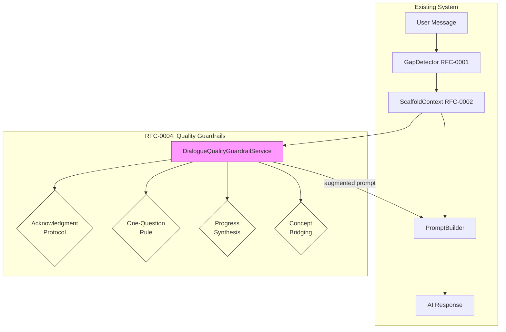
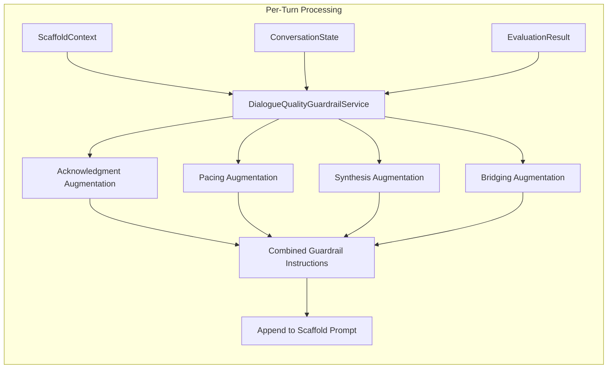
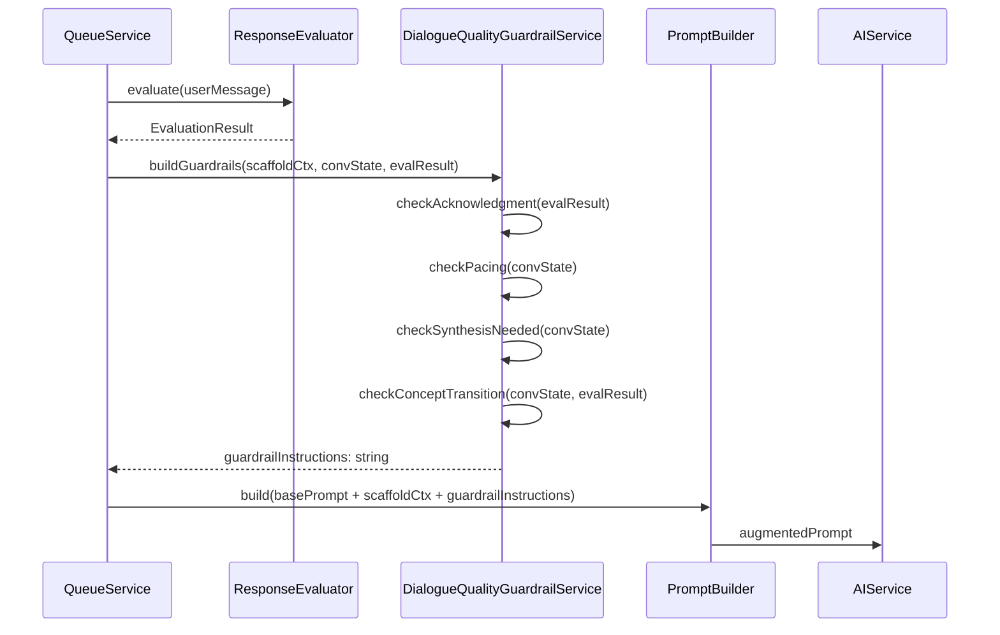
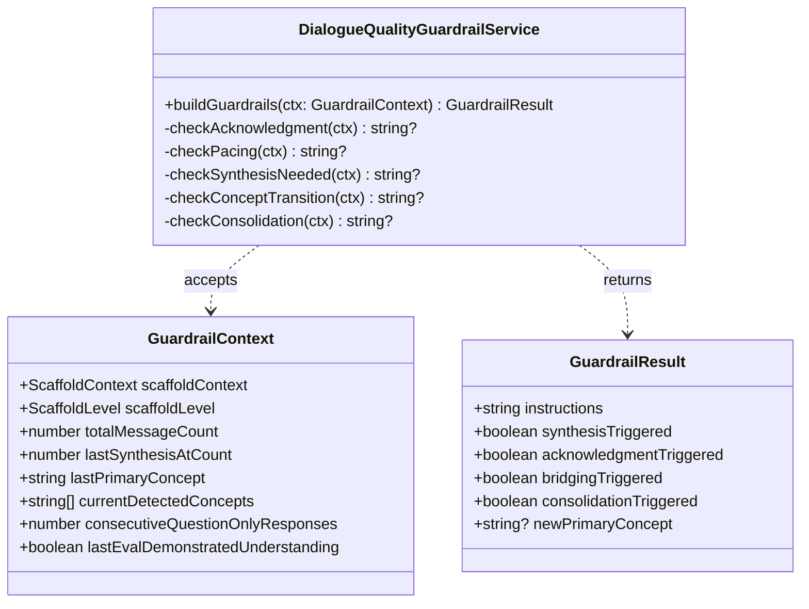
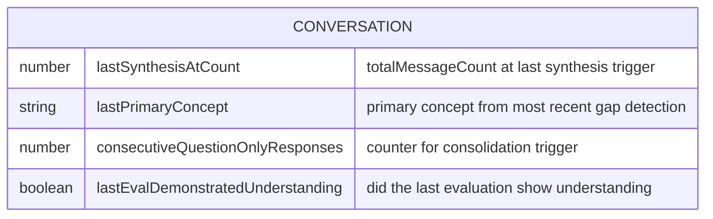

# RFC-0004: Socratic Dialogue Quality Guardrails

<!-- HEADER BLOCK: Identifies the RFC and its current lifecycle state at a glance. -->

| Field            | Value                                                              |
| ---------------- | ------------------------------------------------------------------ |
| **RFC Number**   | 0004                                                               |
| **Title**        | Socratic Dialogue Quality Guardrails                               |
| **Status**       |  |
| **Author(s)**    | [Prathik Shetty](https://github.com/shettydev)                     |
| **Created**      | 2026-03-17                                                         |
| **Last Updated** | 2026-03-17                                                         |

> **Status options:** `Draft` | `In Review` | `Accepted` | `Implemented` | `Rejected` | `Superseded`

---

## 1. Abstract

This RFC proposes a Dialogue Quality Guardrail system that addresses four systemic issues observed in production Socratic conversations: (1) complete absence of epistemic validation when users demonstrate correct understanding, (2) unenforced single-question-per-turn guidelines, (3) no progress synthesis across extended dialogues, and (4) missing concept transition bridges when the topic shifts mid-conversation. The root cause of issue (1) is traced to `scaffold-prompt-augmenter.service.ts:75`, which forbids _all_ acknowledgment under "Socratic neutrality" — conflating epistemic validation ("Yes, that's the right concept") with emotional praise ("Good job!"). This RFC introduces a `DialogueQualityGuardrailService` that augments prompts with acknowledgment protocols, enforces single-question pacing, triggers periodic progress synthesis, and detects concept transitions to inject bridging prompts.

---

## 2. Motivation

A 32-message production conversation (Feb 28 – Mar 15, 2026) about caching and performance optimization revealed that Mukti's Socratic dialogue can actively _harm_ user understanding. The most damaging incident: the user correctly guessed "indexing" as the answer, but the AI's lack of any acknowledgment caused the user to doubt their correct answer — "So indexing is not the correct term?" This is the opposite of Mukti's mission.

### Current Pain Points

- **Pain Point 1: Zero Positive Reinforcement** — The user says "Maybe indexing?" and receives another question instead of any signal that they're on the right track. The user's follow-up — "So indexing is not the correct term?" — demonstrates that the AI's Socratic neutrality is actively causing epistemic regression. The user _had_ the right answer and the system made them doubt it.

- **Pain Point 2: Double Questions** — Despite the guideline "Ask one focused question at a time" in `prompt-builder.ts:131`, multiple assistant responses contain two or more questions. The AI routinely ends messages with patterns like "What does that mean? And how does it apply to...?" This increases cognitive load and fragments the user's attention.

- **Pain Point 3: No Progress Markers** — Across 32 messages, the AI never once synthesized what the user had learned or acknowledged forward progress. Each turn exists in isolation. The user has no sense of trajectory, making long conversations feel like treadmills.

- **Pain Point 4: No Concept Transition Bridging** — The conversation shifted from caching → database querying → indexing with no explicit bridge. The AI jumped between topics as if the user should automatically see the connections. For a learner, these gaps are disorienting and break the chain of reasoning.

### Evidence from Research

- **Hattie & Timperley (2007)**: Feedback that confirms correct understanding (task-level feedback) has effect size d=0.73 on learning. Withholding it has negative effects.
- **Merrill's First Principles of Instruction (2002)**: Integration requires explicit acknowledgment that the learner has acquired the target concept before moving to the next.
- **Cognitive Load Theory — Split Attention**: Multiple questions per turn force the learner to hold both in working memory simultaneously, exceeding capacity for novices.
- **Ausubel's Advance Organizers (1968)**: Bridging old and new concepts via explicit connections is essential for meaningful learning.

### Root Cause Analysis

The root cause is a single line in `scaffold-prompt-augmenter.service.ts:75`:

```
- Offering encouragement like "good job" (maintain Socratic neutrality)
```

This FORBIDDEN rule conflates two fundamentally different behaviors:

| Behavior             | Type      | Example                                    | Effect on Learning                      |
| -------------------- | --------- | ------------------------------------------ | --------------------------------------- |
| Epistemic validation | Cognitive | "Yes, indexing is the right concept here." | Confirms correct mental model (d=0.73)  |
| Emotional praise     | Affective | "Good job! Well done!"                     | Creates dependency on external approval |

Socrates himself validated correct reasoning — the Meno dialogue shows Socrates confirming when the slave boy reaches the right geometric insight. What Socrates avoided was _praise_, not _validation_.

---

## 3. Goals & Non-Goals

### Goals

- [ ] Introduce a Socratic Acknowledgment Protocol that validates correct understanding without emotional praise
- [ ] Enforce the one-question-per-turn rule via prompt instructions and post-generation heuristic detection
- [ ] Trigger progress synthesis markers at regular intervals (~8 messages) and on consecutive understanding demonstrations
- [ ] Detect concept transitions and inject bridging prompts that connect prior topic to new topic
- [ ] Add pacing rules that insert "consolidation points" after consecutive question-only responses

### Non-Goals

- **Praise or gamification**: This RFC adds _epistemic_ feedback, not "good job" responses or points/streaks
- **Replacing ResponseEvaluatorService**: The existing evaluator determines _if_ the user understands; this RFC determines _how_ the AI communicates that back
- **Modifying scaffold levels**: RFC-0002's level system is unchanged; this RFC operates _within_ each level
- **AI response rewriting**: Guardrails modify the _prompt_, not the generated response (no post-processing filtering)
- **Multi-turn planning**: The AI is not given a multi-turn plan; guardrails are applied per-turn

---

## 4. Background & Context

### Prior Art

| Reference                              | Relevance                                                                             |
| -------------------------------------- | ------------------------------------------------------------------------------------- |
| RFC-0002: Adaptive Scaffolding         | Scaffold levels and prompt augmentation system this RFC extends                       |
| RFC-0001: Knowledge Gap Detection      | Signals that drive scaffold context; `detectedConcepts` used for transition detection |
| Hattie & Timperley (2007)              | Task-level feedback taxonomy — validation vs. praise distinction                      |
| Merrill (2002)                         | First Principles — integration phase requires explicit acknowledgment                 |
| Chi & Wylie (2014)                     | ICAP framework — constructive responses require feedback to sustain                   |
| `scaffold-prompt-augmenter.service.ts` | Current prompt augmentation — line 75 is the root cause                               |
| `prompt-builder.ts:131`                | "Ask one focused question at a time" — unenforced guideline                           |
| `response-evaluator.service.ts`        | Existing evaluation signals for understanding detection                               |

### System Context Diagram



---

## 5. Proposed Solution

### Overview

The Dialogue Quality Guardrail system is a prompt augmentation layer that sits between scaffold context resolution (RFC-0002) and final prompt building. It injects four types of guardrail instructions into the system prompt based on conversation state analysis. The guardrails are additive — they append instructions to the scaffold-augmented prompt without modifying the existing scaffold level behavior.

The system is implemented as a single `DialogueQualityGuardrailService` that accepts the scaffold context, conversation metadata, and evaluation results, and returns additional prompt instructions to append.

### Architecture Diagram



### Sequence Flow



### Detailed Design

#### 5.1 Socratic Acknowledgment Protocol

The core fix: replace the blanket ban on acknowledgment with a nuanced protocol that distinguishes validation from praise.

**Current behavior** (`scaffold-prompt-augmenter.service.ts:75`):

```
FORBIDDEN:
- Offering encouragement like "good job" (maintain Socratic neutrality)
```

**Proposed replacement** (injected at all scaffold levels):

```
ACKNOWLEDGMENT PROTOCOL:
When the learner demonstrates correct understanding (uses the right concept,
identifies the correct mechanism, or makes a valid connection):

1. VALIDATE briefly: "Yes, [concept] is exactly right." or "That's the key insight."
2. DEEPEN immediately: Follow validation with a question that builds on their
   correct understanding — "Now that you've identified [concept], what implications
   does that have for...?"
3. NEVER use emotional praise: No "good job", "well done", "great work", "excellent".
   Validation is epistemic (confirming correctness), not affective (rewarding behavior).

WHY THIS MATTERS:
- Withholding validation when the learner is correct causes them to doubt correct answers
- Socratic neutrality means avoiding PRAISE, not avoiding CONFIRMATION
- Socrates himself confirmed correct reasoning before deepening inquiry
```

The acknowledgment protocol is injected based on the `validationExpected` flag on the `GuardrailContext`, which is set when the previous evaluation detected demonstrated understanding (`lastEvalDemonstratedUnderstanding === true`).

**Scaffold level variations:**

| Level                  | Acknowledgment Style                                                           |
| ---------------------- | ------------------------------------------------------------------------------ |
| 0 (Pure Socratic)      | Minimal: "Yes, that's right." + deeper question                                |
| 1 (Meta-Cognitive)     | Reflective: "You've identified [concept]. What made you arrive at that?"       |
| 2 (Strategic Hints)    | Connective: "Exactly — [concept]. How does this piece fit with [prior topic]?" |
| 3 (Worked Examples)    | Pattern-confirming: "You've correctly applied the pattern from [example]."     |
| 4 (Direct Instruction) | Explicit: "That's correct. [concept] works because [brief reason]."            |

#### 5.2 One-Question Rule Enforcement

The "Ask one focused question at a time" guideline in `prompt-builder.ts:131` is not enforced. The guardrail strengthens this with explicit pacing instructions.

**Prompt injection:**

```
STRICT PACING RULE:
- Your response MUST contain exactly ONE question
- If you need to provide context before asking, keep it to 1-2 sentences
- NEVER end with two questions (e.g., "What does X mean? And how does it relate to Y?")
- If a topic naturally raises multiple questions, choose the ONE most productive question
  and save others for subsequent turns
- Exception: At scaffold Level 3-4, you may include one rhetorical question in your
  explanation followed by one genuine question for the learner
```

**Post-generation detection** (future enhancement, not in initial implementation):

A lightweight heuristic can detect double-question violations by counting `?` characters in the assistant response. When detected (>1 question mark not in a quoted/example context), a warning metric is emitted. This is logged for monitoring, not used for response rewriting.

#### 5.3 Progress Synthesis Markers

Extended conversations (>8 messages) currently provide no sense of progress. The guardrail injects a synthesis instruction when conditions are met.

**Trigger conditions** (any of):

- `totalMessageCount - lastSynthesisAtCount >= 8` (periodic)
- `consecutiveSuccesses >= 2` and no synthesis since last success streak
- Explicit user request containing synthesis keywords ("what have we covered", "summary", "where are we")

**Prompt injection (when triggered):**

```
PROGRESS SYNTHESIS REQUIRED:
Before your next question, provide a brief 2-3 sentence synthesis of what the learner
has explored and discovered so far. Structure as:

"So far, you've [key discovery 1] and [key discovery 2]. You're now exploring [current thread]."

Then ask your question building on this synthesis. This helps the learner see their trajectory.
Do NOT list everything discussed — focus on breakthroughs and the current direction.
```

**State tracking:**

- `lastSynthesisAtCount` (number): The `totalMessageCount` at which the last synthesis was triggered. Persisted on the conversation document.

#### 5.4 Concept Transition Bridging

When the conversation shifts from one concept domain to another (e.g., caching → indexing), the AI should explicitly bridge the transition.

**Detection mechanism:**

- Compare `detectedConcepts` from the current gap detection with `lastPrimaryConcept` stored on the conversation
- If the primary concept (first element of `detectedConcepts`) differs from `lastPrimaryConcept`, a transition has occurred
- Only trigger bridging when there is a stored `lastPrimaryConcept` (not on first message)

**Prompt injection (when transition detected):**

```
CONCEPT TRANSITION DETECTED:
The conversation has shifted from "{previousConcept}" to "{newConcept}".
Before diving into {newConcept}, briefly bridge the transition:

"We've been exploring {previousConcept}. Now you're moving toward {newConcept} —
how do you see these connecting?"

This helps the learner see the relationship between concepts rather than experiencing
a disorienting topic jump.
```

**State tracking:**

- `lastPrimaryConcept` (string): The primary concept from the most recent gap detection. Updated after each turn.

#### 5.5 Pacing Rules (Consolidation Points)

When the AI has asked multiple consecutive questions without the user demonstrating understanding, the dialogue needs a consolidation pause.

**Trigger condition:**

- `consecutiveQuestionOnlyResponses >= 4` — four consecutive assistant turns that were question-only (no validation, no synthesis, no scaffolding content)

**Prompt injection (when triggered):**

```
CONSOLIDATION POINT:
You've asked several questions in a row. Before continuing, pause and:
1. Summarize the key thread you've been exploring together
2. Invite the learner to share where they are: "Before we continue, can you tell me
   in your own words what you understand so far about [topic]?"
This prevents question fatigue and gives the learner space to consolidate.
```

**State tracking:**

- `consecutiveQuestionOnlyResponses` (number): Reset to 0 when the AI response includes validation, synthesis, or scaffold content (detected heuristically by checking if guardrail instructions were injected).

---

## 6. API / Interface Design

### Internal Service Interfaces



### Modified Interface: ScaffoldContext

A new optional field is added to `ScaffoldContext` in `scaffolding.interface.ts`:

```json
{
  "validationExpected": "boolean — true when the previous turn's evaluation detected demonstrated understanding"
}
```

This field signals the guardrail service to inject acknowledgment protocol instructions.

### REST Endpoints

No new REST endpoints. Guardrails are applied internally during queue processing.

---

## 7. Data Model Changes

### Modified Schemas

Additive fields on `conversations` collection:



| Field                               | Type    | Default | Description                                                                   |
| ----------------------------------- | ------- | ------- | ----------------------------------------------------------------------------- |
| `lastSynthesisAtCount`              | number  | 0       | `totalMessageCount` value when last synthesis was triggered                   |
| `lastPrimaryConcept`                | string  | `null`  | Primary concept from most recent gap detection result                         |
| `consecutiveQuestionOnlyResponses`  | number  | 0       | Counter for consecutive question-only AI turns; reset on synthesis/validation |
| `lastEvalDemonstratedUnderstanding` | boolean | `false` | Whether the most recent response evaluation detected understanding            |

### Prompt Modification

The FORBIDDEN rule at `scaffold-prompt-augmenter.service.ts:75` is modified:

**Before:**

```
FORBIDDEN:
- Offering encouragement like "good job" (maintain Socratic neutrality)
```

**After:**

```
FORBIDDEN:
- Offering emotional praise like "good job", "well done", "great work" (maintain Socratic neutrality)
- NOTE: Epistemic VALIDATION ("Yes, that's the right concept") is NOT forbidden — see ACKNOWLEDGMENT PROTOCOL
```

### Migration Notes

- **Migration type:** Additive
- **Backwards compatible:** Yes — all new fields have sensible defaults
- **Prompt change:** The Level 0 FORBIDDEN rule modification is backward-compatible; it relaxes a constraint rather than adding one
- **Estimated migration duration:** < 1 minute

---

## 8. Alternatives Considered

### Alternative A: Post-Generation Response Filtering

Detect and rewrite AI responses that violate guardrails (e.g., strip second questions, inject validation).

| Pros                      | Cons                                                    |
| ------------------------- | ------------------------------------------------------- |
| Guaranteed compliance     | Adds latency (needs second LLM pass or regex rewriting) |
| Works regardless of model | Response rewriting can break coherence                  |
|                           | Expensive — doubles token cost for filtered responses   |
|                           | Brittle regex patterns for question detection           |

**Reason for rejection:** Prompt-level guardrails are cheaper, simpler, and more robust. Models generally follow explicit prompt instructions well. Post-generation filtering is a potential Phase 2 enhancement if prompt-level compliance is insufficient.

### Alternative B: Separate Validation Turn

After detecting understanding, inject a dedicated "validation turn" before continuing the dialogue (i.e., two AI responses: one validation, one question).

| Pros                           | Cons                                                   |
| ------------------------------ | ------------------------------------------------------ |
| Clear separation of concerns   | Doubles response count (confusing UX)                  |
| Guaranteed validation delivery | Breaks conversation flow                               |
|                                | Requires frontend changes for multi-response rendering |

**Reason for rejection:** Validation should be _part of_ the natural conversational turn, not a separate message. The acknowledgment protocol achieves this by instructing the AI to validate-then-deepen within a single response.

### Alternative C: Client-Side Progress Tracking

Move progress synthesis to the frontend — show a "progress bar" or "concept map" alongside the conversation.

| Pros              | Cons                                                             |
| ----------------- | ---------------------------------------------------------------- |
| No AI token cost  | Doesn't address the _conversational_ absence of progress markers |
| Visual, always-on | Frontend-only solution can't influence AI behavior               |
|                   | Requires significant frontend work                               |

**Reason for rejection:** The issue is that the _AI_ never acknowledges progress in the conversation itself. Visual progress tracking is a complementary feature (not a replacement) that could be added independently.

---

## 9. Security & Privacy Considerations

### Threat Surface

- **No new attack surface.** Guardrails modify prompt instructions only — no new data ingestion, no new endpoints, no new external calls.

### Data Sensitivity

| Data Element                        | Classification | Handling Requirements                                              |
| ----------------------------------- | -------------- | ------------------------------------------------------------------ |
| `lastEvalDemonstratedUnderstanding` | Internal       | Per-conversation, not exposed to other users                       |
| `lastPrimaryConcept`                | Internal       | Derived from gap detection, same sensitivity as `detectedConcepts` |
| `consecutiveQuestionOnlyResponses`  | Internal       | Counter only, no sensitive content                                 |

### Authentication & Authorization

No changes. Guardrail data inherits conversation document permissions.

---

## 10. Performance & Scalability

| Metric               | Current Baseline           | Expected After Change        | Acceptable Threshold            |
| -------------------- | -------------------------- | ---------------------------- | ------------------------------- |
| Prompt generation    | ~55ms (with scaffold)      | ~58ms (+3ms for guardrails)  | < 100ms                         |
| Guardrail evaluation | N/A                        | < 5ms (all in-memory checks) | < 20ms                          |
| Prompt size increase | ~200-400 tokens (scaffold) | +50-150 tokens (guardrails)  | < 800 tokens total augmentation |

### Known Bottlenecks

- **Prompt token cost:** Guardrail instructions add ~50-150 tokens per turn. This is minimal compared to conversation history context.
- **No LLM calls:** All guardrail decisions are deterministic (counter checks, string comparison). No additional AI calls.

---

## 11. Observability

### Logging

- `guardrail.acknowledgment_injected` — When acknowledgment protocol is added to prompt
- `guardrail.synthesis_triggered` — When progress synthesis instruction is injected
- `guardrail.concept_transition` — When concept bridging is triggered, with old → new concept
- `guardrail.consolidation_triggered` — When consolidation point is injected
- `guardrail.double_question_detected` — When post-generation heuristic detects >1 question (monitoring only)

### Metrics

- `mukti.guardrail.acknowledgment_rate` (gauge) — Percentage of turns where acknowledgment is injected
- `mukti.guardrail.synthesis_frequency` (histogram) — Messages between synthesis triggers
- `mukti.guardrail.concept_transitions_per_session` (counter) — How often concept bridging fires
- `mukti.guardrail.consolidation_rate` (gauge) — How often consolidation points are needed
- `mukti.guardrail.double_question_rate` (gauge) — Percentage of AI responses with >1 question (compliance metric)

### Tracing

- Add `guardrails_applied` attribute to conversation processing spans (bitmask or string array)
- Track guardrail evaluation as a child span

### Alerting

| Alert Name                | Condition                                             | Severity | Runbook Link |
| ------------------------- | ----------------------------------------------------- | -------- | ------------ |
| Low Acknowledgment Rate   | < 10% of eligible turns get acknowledgment over 1h    | Warning  | [link]       |
| High Double Question Rate | > 30% of responses have >1 question over 1h           | Warning  | [link]       |
| No Synthesis Firing       | 0 synthesis triggers across all conversations over 4h | Info     | [link]       |

---

## 12. Rollout Plan

### Phases

| Phase | Description                           | Entry Criteria | Exit Criteria                        |
| ----- | ------------------------------------- | -------------- | ------------------------------------ |
| 1     | Acknowledgment protocol + prompt fix  | RFC accepted   | 1 week, monitor acknowledgment rate  |
| 2     | One-question enforcement + pacing     | Phase 1 stable | 1 week, monitor double-question rate |
| 3     | Progress synthesis + concept bridging | Phase 2 stable | 2 weeks, user feedback analysis      |

### Feature Flags

- **Flag name:** `guardrail_acknowledgment`
- **Default state:** On
- **Kill switch:** Yes (reverts to current "no acknowledgment" behavior)

- **Flag name:** `guardrail_synthesis`
- **Default state:** On
- **Kill switch:** Yes (disables synthesis triggers)

- **Flag name:** `guardrail_concept_bridging`
- **Default state:** On
- **Kill switch:** Yes (disables transition detection)

### Rollback Strategy

1. Disable feature flags — immediately reverts to pre-guardrail prompts
2. New schema fields remain but are ignored (no writes when flags are off)
3. The `scaffold-prompt-augmenter.service.ts:75` prompt change can be reverted independently
4. No data migration needed for rollback

---

## 13. Open Questions

1. **Acknowledgment Threshold** — Should validation require a high confidence score (e.g., `confidence > 0.7`) from the evaluator, or is the binary `demonstratesUnderstanding` flag sufficient? Higher thresholds reduce false-positive validations but may miss edge cases.

2. **Synthesis Interval Tuning** — Is 8 messages the right interval for progress synthesis? Should this vary by conversation pace (short responses = more frequent) or scaffold level (higher levels = less frequent)?

3. **Concept Transition Granularity** — The current detection compares `detectedConcepts[0]` (primary concept). Should we use a more sophisticated similarity measure (e.g., concept embedding distance) to avoid false transitions when concepts are closely related?

4. **Double-Question Post-Processing** — Should we implement response rewriting to strip second questions in Phase 2, or rely solely on prompt-level instruction? The risk is that some models ignore the one-question rule despite explicit instruction.

5. **Consolidation vs. Scaffold Escalation** — When `consecutiveQuestionOnlyResponses` is high AND `consecutiveFailures` is high, should consolidation take priority over scaffold escalation, or should escalation happen first?

> **Reviewers:** Please reference open questions by number (e.g., "Regarding OQ-2, ...") in your comments.

---

## 14. Decision Log

| Date       | Decision                                     | Rationale                                                                            | Decided By |
| ---------- | -------------------------------------------- | ------------------------------------------------------------------------------------ | ---------- |
| 2026-03-17 | Validation vs. praise distinction            | Hattie & Timperley taxonomy; Socrates validated in Meno                              | RFC Author |
| 2026-03-17 | Prompt-level guardrails, not post-processing | Simpler, cheaper, no coherence risk                                                  | RFC Author |
| 2026-03-17 | 8-message synthesis interval                 | Balances progress visibility with conversation flow; ~4 exchange pairs               | RFC Author |
| 2026-03-17 | Single service for all guardrails            | Guardrails share context (eval result, scaffold state); splitting increases coupling | RFC Author |
| 2026-03-17 | No multi-turn AI planning                    | Guardrails are per-turn; multi-turn planning adds complexity without clear benefit   | RFC Author |

---

## 15. References

- [RFC-0001: Knowledge Gap Detection System](../rfc-0001-knowledge-gap-detection/index.md)
- [RFC-0002: Adaptive Scaffolding Framework](../rfc-0002-adaptive-scaffolding-framework/index.md)
- [RFC-0005: Session Continuity & Temporal Awareness](../rfc-0005-session-continuity-temporal-awareness/index.md) — companion RFC for temporal gap handling
- [Hattie & Timperley (2007): The Power of Feedback](https://doi.org/10.3102/003465430298487)
- [Merrill (2002): First Principles of Instruction](https://doi.org/10.1007/BF02505024)
- [Chi & Wylie (2014): The ICAP Framework](https://doi.org/10.1080/00461520.2014.965823)
- [Ausubel (1968): Educational Psychology — A Cognitive View](https://doi.org/10.1007/978-1-4684-6027-0)
- [Sweller (2019): Cognitive Load Theory — Split Attention Effect](https://doi.org/10.1007/978-3-030-06126-4)
- Plato, _Meno_ — Socrates validates the slave boy's correct geometric reasoning before deepening inquiry

---

> **Reviewer Notes:**
>
> The prompt change at `scaffold-prompt-augmenter.service.ts:75` (replacing blanket acknowledgment ban with praise-only ban) is the single highest-impact change in this RFC. It should be reviewed and deployed first, independently of the other guardrails.
>
> This RFC intentionally does NOT address temporal discontinuity (multi-day gaps). That is covered by [RFC-0005](../rfc-0005-session-continuity-temporal-awareness/index.md).
>
> The `DialogueQualityGuardrailService` should be injected in the same processing pipeline as `ScaffoldPromptAugmenter` — after scaffold augmentation, before final prompt assembly. See RFC-0005 for the full integration ordering.
