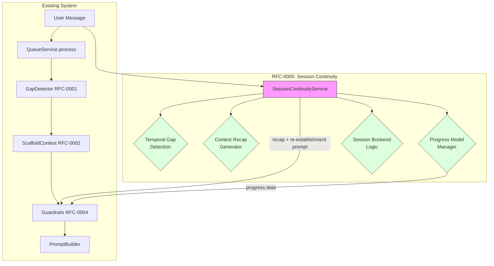
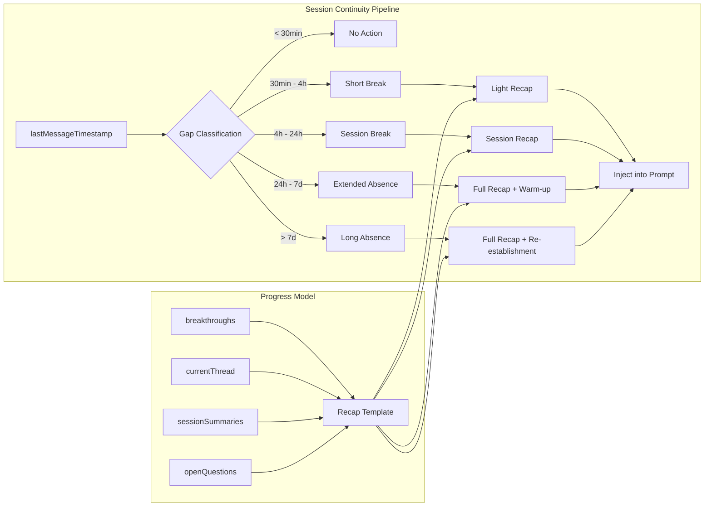
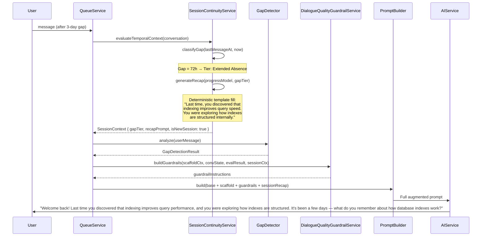
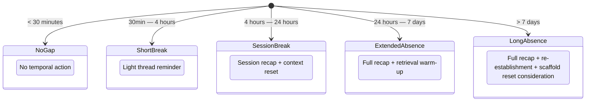
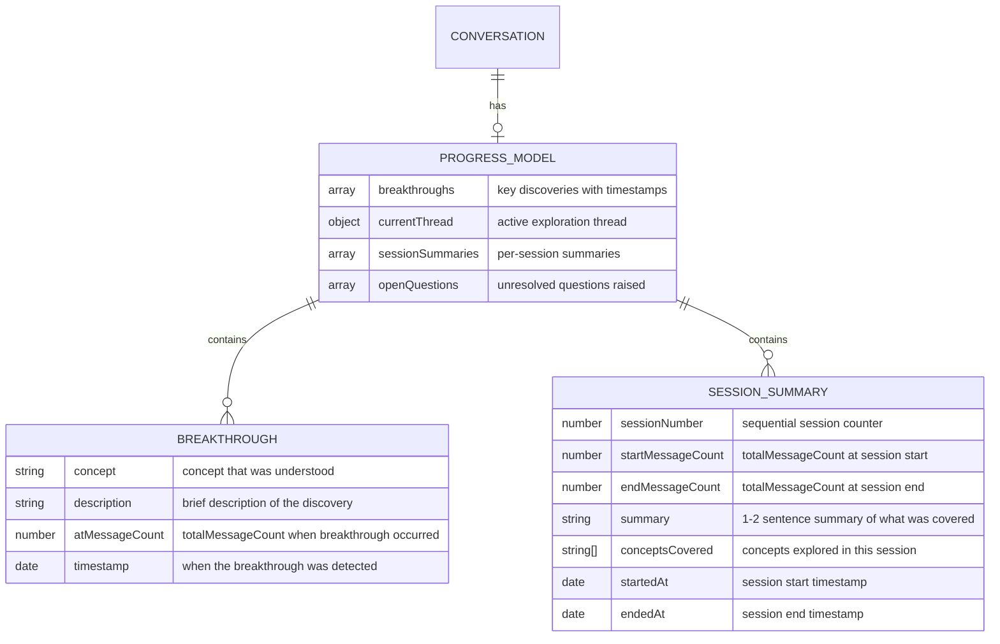
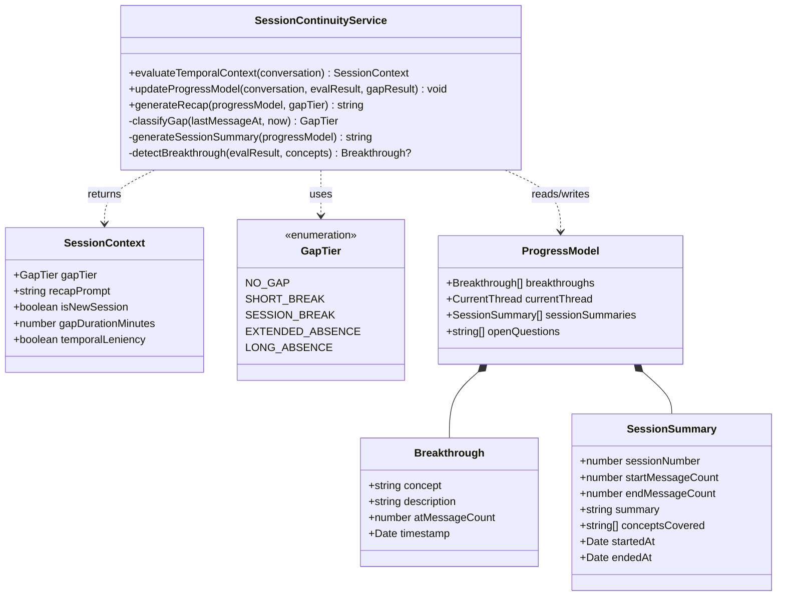
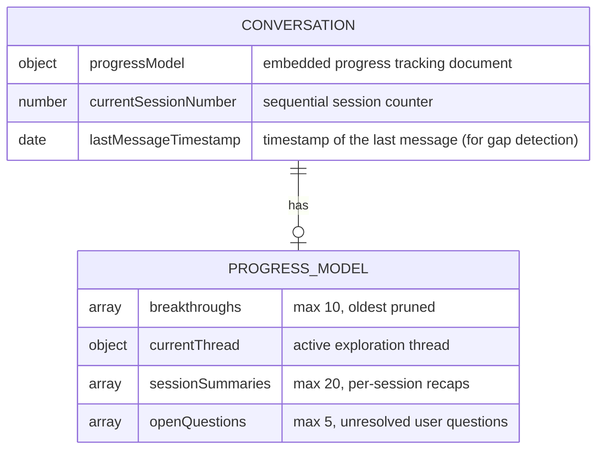

# RFC-0005: Session Continuity & Temporal Awareness

<!-- HEADER BLOCK: Identifies the RFC and its current lifecycle state at a glance. -->

| Field            | Value                                                              |
| ---------------- | ------------------------------------------------------------------ |
| **RFC Number**   | 0005                                                               |
| **Title**        | Session Continuity & Temporal Awareness                            |
| **Status**       |  |
| **Author(s)**    | [Prathik Shetty](https://github.com/shettydev)                     |
| **Created**      | 2026-03-17                                                         |
| **Last Updated** | 2026-03-17                                                         |

> **Status options:** `Draft` | `In Review` | `Accepted` | `Implemented` | `Rejected` | `Superseded`

---

## 1. Abstract

This RFC proposes a Session Continuity system that gives Mukti's Socratic dialogue temporal awareness across multi-day conversations. The same 32-message production conversation that motivated RFC-0004 contained a 12-day gap (Mar 3 → Mar 15, 2026) — the AI resumed as if no time had passed, with no recap, no re-establishment of context, and no acknowledgment of the gap. This RFC introduces temporal gap detection with a 4-tier classification (short break → long absence), a deterministic context recap generator that synthesizes progress without LLM calls, a structured progress model that tracks breakthroughs and session summaries, and session bookend logic that detects implicit session boundaries and injects re-establishment prompts. The system is designed to work in conjunction with RFC-0004's progress synthesis by providing the structured data that synthesis draws from.

---

## 2. Motivation

Mukti conversations are inherently asynchronous — users think about problems over days or weeks, returning when they have new ideas or time. The current system treats every message as if it arrived immediately after the previous one. A 12-day gap receives the exact same treatment as a 30-second pause.

### Current Pain Points

- **Pain Point 1: Temporal Discontinuity** — The user returns after 12 days and receives "What would happen if you tried a different approach?" with no context reset. The user must mentally reconstruct where they left off, what they'd been exploring, and what the AI's last question was about. This cognitive burden falls entirely on the user.

- **Pain Point 2: No Progress Persistence** — Across 32 messages, Mukti tracks no structured record of what was explored, what was discovered, or what was the active thread. When the conversation is resumed, the AI has the raw message history but no semantic understanding of the session's trajectory.

- **Pain Point 3: Stale Context Assumptions** — After a long gap, the user's mental state has changed. They may have forgotten details, researched independently, or shifted their thinking. The AI continues from the exact conversation state as if the user's working memory is perfectly preserved.

- **Pain Point 4: No Session Boundaries** — Conversations have no concept of "sessions" — a 32-message conversation spanning 15 days is treated as one continuous thread. Real learning happens in sessions with natural start/end points, recaps, and warm-ups.

### Evidence from Research

- **Ebbinghaus Forgetting Curve (1885)**: After 12 days without review, retention of detailed information drops to ~20-30%. A recap is not a nicety — it's a cognitive necessity.
- **Spaced Repetition Research (Cepeda et al., 2006)**: Returning after a gap is actually beneficial for long-term retention, but only if the gap is bridged with retrieval practice (not just re-presentation).
- **Tutoring Best Practices (VanLehn, 2011)**: Effective tutors always begin returning sessions with a brief review of prior progress and a warm-up question.
- **Contextual Reinstatement (Smith, 1988)**: Returning to a previous cognitive context requires explicit environmental cues — in dialogue, this means verbal recap.

---

## 3. Goals & Non-Goals

### Goals

- [ ] Detect temporal gaps between messages and classify them into 4 tiers with distinct behaviors
- [ ] Generate deterministic context recaps from a structured progress model (no LLM call for recap generation)
- [ ] Track conversation progress in a structured `progressModel` embedded document: breakthroughs, session summaries, current thread, open questions
- [ ] Detect implicit session boundaries and inject re-establishment prompts on session resumption
- [ ] Provide structured progress data to RFC-0004's synthesis markers

### Non-Goals

- **Spaced repetition scheduling**: We detect gaps and bridge them, but we don't schedule optimal review intervals
- **Session UI**: No frontend session boundaries, timeline views, or session selectors — this is backend/prompt only
- **Conversation splitting**: Sessions are implicit metadata, not separate database documents
- **LLM-generated recaps**: Recaps are deterministic templates filled from the progress model, not LLM-generated text
- **Forgetting curve modeling**: We don't model per-concept retention decay; we use gap duration as a proxy

---

## 4. Background & Context

### Prior Art

| Reference                             | Relevance                                                                             |
| ------------------------------------- | ------------------------------------------------------------------------------------- |
| RFC-0004: Dialogue Quality Guardrails | Companion RFC — synthesis markers consume progress model data                         |
| RFC-0001: Knowledge Gap Detection     | Temporal signals (time on problem, abandonment) partially address within-session gaps |
| RFC-0002: Adaptive Scaffolding        | Scaffold state persistence across sessions; scaffold level should not reset on gap    |
| Ebbinghaus (1885)                     | Forgetting curve — mathematical basis for gap severity classification                 |
| Cepeda et al. (2006)                  | Optimal spacing — returning after a gap benefits retention when bridged properly      |
| VanLehn (2011)                        | Tutorial dialogue — session re-establishment best practices                           |
| `queue.service.ts`                    | Integration point — gap detection runs before prompt building                         |
| `conversation.schema.ts`              | Data model — new `progressModel` embedded document                                    |

### System Context Diagram



---

## 5. Proposed Solution

### Overview

The Session Continuity system operates at the beginning of the queue processing pipeline, before gap detection and scaffold augmentation. It examines the timestamp of the last message in the conversation and compares it to the current time to determine if a temporal gap exists. Based on the gap duration, it classifies the gap into one of four tiers and generates appropriate re-establishment instructions.

The system also maintains a structured progress model on the conversation document that tracks breakthroughs, session summaries, the current exploration thread, and open questions. This model is updated after each turn (post-response) and consulted for recap generation.

### Architecture Diagram



### Sequence Flow



### Detailed Design

#### 5.1 Temporal Gap Classification

Gaps are classified into 4 tiers based on the time elapsed since the last message in the conversation.



**Tier definitions:**

| Tier                 | Gap Duration    | Rationale                                                             | AI Behavior                                                                                        |
| -------------------- | --------------- | --------------------------------------------------------------------- | -------------------------------------------------------------------------------------------------- |
| **No Gap**           | < 30 minutes    | Active conversation, no interruption needed                           | No temporal action                                                                                 |
| **Short Break**      | 30min – 4 hours | Coffee break, meeting interruption; working memory partially intact   | Light reminder: "We were exploring [currentThread]."                                               |
| **Session Break**    | 4h – 24 hours   | Overnight gap, different work session; working memory largely cleared | Session recap: summarize breakthroughs + current thread, then continue                             |
| **Extended Absence** | 24h – 7 days    | Multi-day gap; significant forgetting expected                        | Full recap + retrieval warm-up question before continuing                                          |
| **Long Absence**     | > 7 days        | Week+ gap; substantial forgetting, possible context shift             | Full recap + re-establishment: "It's been a while. Let me recap..." + open-ended re-entry question |

**Threshold rationale:**

- 30min: Based on working memory decay research — short-term memory items begin degrading after ~20-30 minutes without rehearsal
- 4h: A typical session boundary — if someone hasn't responded in 4 hours, they've likely switched tasks
- 24h: An overnight gap — sleep consolidates some memories but details are lost
- 7d: Ebbinghaus curve shows ~20-30% retention after 7 days without review

#### 5.2 Progress Model

A structured embedded document on the conversation that tracks semantic progress, not just raw messages.



**Progress model fields:**

| Field              | Type                                                               | Description                                                                                         |
| ------------------ | ------------------------------------------------------------------ | --------------------------------------------------------------------------------------------------- |
| `breakthroughs`    | `Breakthrough[]`                                                   | Key moments where the user demonstrated new understanding. Max 10 per conversation (oldest pruned). |
| `currentThread`    | `{ concept: string, description: string, startedAtCount: number }` | The active exploration thread — what the user is currently working on.                              |
| `sessionSummaries` | `SessionSummary[]`                                                 | Per-session summaries generated when a session boundary is detected. Max 20 per conversation.       |
| `openQuestions`    | `string[]`                                                         | Questions raised but not yet resolved. Max 5 (oldest pruned when new ones added).                   |

**Breakthrough detection:**
A breakthrough is recorded when:

- `ResponseEvaluatorService` returns `demonstratesUnderstanding: true` with `confidence > 0.7`
- AND the concept is different from the last recorded breakthrough concept
- The breakthrough is derived from `detectedConcepts[0]` and a template description

**Session boundary detection:**
A new session is detected when:

- The temporal gap is classified as `SessionBreak` or higher (>= 4 hours)
- The previous session summary is generated from the progress model's current state
- `currentThread` is preserved across sessions (the user may continue the same thread)

#### 5.3 Context Recap Generator

Generates deterministic recap text from the progress model. No LLM calls.

**Recap templates by tier:**

**Short Break** (30min – 4h):

```
"We were exploring {currentThread.description}."
```

**Session Break** (4h – 24h):

```
"In our last session, you explored {currentThread.concept}.
{latestBreakthrough ? 'A key insight was: ' + latestBreakthrough.description + '.' : ''}
Let's continue from where you left off."
```

**Extended Absence** (24h – 7d):

```
"It's been {gapDuration} since we last spoke. Here's where you were:
- You've been exploring {currentThread.concept}: {currentThread.description}
{breakthroughs.length > 0 ? '- Key discoveries: ' + breakthroughs.map(b => b.description).join('; ') : ''}
{openQuestions.length > 0 ? '- Open questions: ' + openQuestions.join('; ') : ''}

Before we continue, what do you remember about {currentThread.concept}?"
```

**Long Absence** (> 7d):

```
"Welcome back! It's been {gapDuration} since our last conversation. Let me recap your journey:

You started by exploring {sessionSummaries[0]?.summary || 'the original problem'}.
{breakthroughs.map(b => '- You discovered: ' + b.description).join('\n')}
{currentThread ? 'You were most recently exploring: ' + currentThread.description : ''}

It's been a while, so let's start with a warm-up: In your own words,
what do you remember about {currentThread?.concept || 'what we discussed'}?"
```

The recap is injected as a prompt instruction:

```
TEMPORAL CONTEXT — {gapTier}:
The learner is returning after {gapDuration}. Before your response, provide this recap:

"{recapText}"

Then ask a retrieval warm-up question to help them re-engage.
Do NOT assume they remember details from the previous session.
Adjust your expectations — they may need to rebuild context before progressing.
```

#### 5.4 Session Bookends

Session bookends create natural start/end points in the conversation.

**Session start** (triggered on gap >= `SessionBreak`):

- Generate recap from progress model
- Increment session counter
- Record new session start in `sessionSummaries`
- Inject recap + warm-up prompt

**Session end** (triggered when a new session starts):

- Generate summary of the ending session from breakthroughs and current thread
- Store in `sessionSummaries`
- This happens retroactively — when session N+1 starts, session N is summarized

**Post-turn progress update:**
After each AI response and evaluation, the progress model is updated:

- If breakthrough detected → append to `breakthroughs`
- If concept transition detected (RFC-0004) → update `currentThread`
- If user asks a question → append to `openQuestions` (if not already tracked)
- If open question is resolved (concept mentioned in breakthrough) → remove from `openQuestions`

#### 5.5 Scaffold Level Preservation Across Gaps

An important interaction with RFC-0002: when a user returns after a long gap, should the scaffold level reset?

**Decision: NO automatic reset.** The scaffold level represents the user's demonstrated capability, which doesn't change just because time passed. However, the _evaluation thresholds_ should be adjusted for the first 2-3 exchanges after a long absence (Extended/Long tiers) to account for potential forgetting:

- First 2 exchanges after Extended/Long absence: use evaluation thresholds one level _more lenient_ than current scaffold level
- This creates a "soft re-entry" where the user has slightly more room before escalation
- After 2 exchanges, normal thresholds resume

This is implemented by passing a `temporalLeniency: boolean` flag in the `GuardrailContext` (RFC-0004), which the evaluation step can consult.

---

## 6. API / Interface Design

### Internal Service Interfaces



### REST Endpoints

No new REST endpoints. Session continuity is applied internally during queue processing.

---

## 7. Data Model Changes

### Modified Schemas

Additive embedded document on `conversations` collection:



| Field                            | Type                                                               | Default                                                                               | Description                                                  |
| -------------------------------- | ------------------------------------------------------------------ | ------------------------------------------------------------------------------------- | ------------------------------------------------------------ |
| `progressModel`                  | `ProgressModel` (embedded)                                         | `{ breakthroughs: [], currentThread: null, sessionSummaries: [], openQuestions: [] }` | Structured progress tracking                                 |
| `progressModel.breakthroughs`    | `Breakthrough[]`                                                   | `[]`                                                                                  | Key understanding moments, max 10                            |
| `progressModel.currentThread`    | `{ concept: string, description: string, startedAtCount: number }` | `null`                                                                                | Active exploration thread                                    |
| `progressModel.sessionSummaries` | `SessionSummary[]`                                                 | `[]`                                                                                  | Per-session summaries, max 20                                |
| `progressModel.openQuestions`    | `string[]`                                                         | `[]`                                                                                  | Unresolved questions, max 5                                  |
| `currentSessionNumber`           | `number`                                                           | `1`                                                                                   | Sequential session counter                                   |
| `lastMessageTimestamp`           | `Date`                                                             | `null`                                                                                | Timestamp of the most recent message; used for gap detection |

### Indexes

- No new indexes required. `lastMessageTimestamp` is used only during queue processing for the specific conversation being processed (already loaded by `_id`).

### Migration Notes

- **Migration type:** Additive
- **Backwards compatible:** Yes — `progressModel` defaults to empty, `currentSessionNumber` defaults to 1, `lastMessageTimestamp` defaults to null (first message sets it)
- **Existing conversations:** Will start with empty progress models; breakthroughs and session summaries will accumulate from the migration point forward
- **Estimated migration duration:** < 1 minute

---

## 8. Alternatives Considered

### Alternative A: LLM-Generated Recaps

Use an LLM call to summarize the conversation before generating the response.

| Pros                                             | Cons                                                                                  |
| ------------------------------------------------ | ------------------------------------------------------------------------------------- |
| More natural, context-aware recaps               | Adds ~500ms latency + token cost per recap                                            |
| Can capture nuances deterministic templates miss | Non-deterministic — different recap each time                                         |
|                                                  | Requires separate LLM call or complex prompt engineering                              |
|                                                  | Recap quality depends on conversation length (may hallucinate for long conversations) |

**Reason for rejection:** Deterministic recaps from a structured progress model are faster, cheaper, and more reliable. The progress model captures the _semantic_ state of the conversation, so template-based recaps are surprisingly effective. LLM recaps can be added as a Phase 2 enhancement for the `LongAbsence` tier if template recaps prove insufficient.

### Alternative B: Frontend-Driven Session Management

Let the frontend detect gaps and show a "session recap" UI card before the conversation continues.

| Pros                                      | Cons                                                                |
| ----------------------------------------- | ------------------------------------------------------------------- |
| Richer UI possibilities (timeline, cards) | Doesn't affect AI behavior — the AI still has no temporal awareness |
| User can dismiss if they don't need recap | Requires significant frontend work                                  |
|                                           | Backend still needs progress model for AI prompts                   |

**Reason for rejection:** The core issue is that the _AI_ has no temporal awareness. A frontend session UI is complementary (and valuable) but doesn't solve the fundamental problem of the AI resuming conversations as if no time passed. This RFC addresses the backend/prompt layer; frontend session UI can be built independently on top of the progress model.

### Alternative C: Conversation Forking on Long Gaps

When a gap exceeds a threshold (e.g., 7 days), automatically create a new conversation linked to the old one.

| Pros                                  | Cons                                           |
| ------------------------------------- | ---------------------------------------------- |
| Clean separation of sessions          | Loses conversation continuity                  |
| Each conversation has focused context | User may want to continue the same thread      |
|                                       | Requires new "linked conversations" feature    |
|                                       | Confusing UX — "where did my conversation go?" |

**Reason for rejection:** Users return to conversations _because_ they want to continue them. Forking breaks this expectation. Implicit session boundaries within a single conversation provide the structure without the disruption.

---

## 9. Security & Privacy Considerations

### Threat Surface

- **No new attack surface.** Progress model data is derived from existing conversation content and evaluation results.
- **Progress model contains derived data only** — no raw user messages are stored in the progress model, only concept names and template descriptions.

### Data Sensitivity

| Data Element                     | Classification | Handling Requirements                                   |
| -------------------------------- | -------------- | ------------------------------------------------------- |
| `progressModel.breakthroughs`    | Internal       | Concept names + descriptions derived from gap detection |
| `progressModel.sessionSummaries` | Internal       | Aggregate per-session; no raw message content           |
| `progressModel.openQuestions`    | Internal       | Short question strings; same sensitivity as messages    |
| `lastMessageTimestamp`           | Internal       | Already implicitly available from message timestamps    |

### Authentication & Authorization

No changes. Progress model inherits conversation document permissions.

---

## 10. Performance & Scalability

| Metric                 | Current Baseline      | Expected After Change        | Acceptable Threshold   |
| ---------------------- | --------------------- | ---------------------------- | ---------------------- |
| Gap classification     | N/A                   | < 1ms (timestamp comparison) | < 5ms                  |
| Recap generation       | N/A                   | < 3ms (template fill)        | < 10ms                 |
| Progress model update  | N/A                   | < 10ms (embedded doc update) | < 50ms                 |
| Document size increase | ~5KB avg conversation | +0.5-2KB for progress model  | < 16MB (MongoDB limit) |

### Known Bottlenecks

- **Progress model growth:** Bounded by max limits (10 breakthroughs, 20 sessions, 5 questions). Oldest entries are pruned.
- **No additional LLM calls:** All recap generation and progress model updates are deterministic.
- **Embedded document updates:** MongoDB `$push` with `$slice` for bounded arrays is efficient.

---

## 11. Observability

### Logging

- `session.gap_detected` — Log gap tier and duration when a temporal gap is classified
- `session.new_session_started` — Log session number and gap duration when a new session begins
- `session.recap_generated` — Log recap tier and length when a recap is generated
- `session.breakthrough_recorded` — Log concept and confidence when a breakthrough is detected
- `session.progress_model_updated` — Log summary of progress model changes

### Metrics

- `mukti.session.gap_distribution` (histogram) — Distribution of gap durations across all conversations
- `mukti.session.gap_tier_counts` (counter) — Count of each gap tier classification
- `mukti.session.sessions_per_conversation` (histogram) — How many sessions conversations span
- `mukti.session.breakthroughs_per_session` (histogram) — Breakthroughs detected per session
- `mukti.session.recap_token_cost` (histogram) — Token cost of recap text added to prompts

### Tracing

- Add `gap_tier` and `session_number` attributes to conversation processing spans
- Track progress model update as a child span

### Alerting

| Alert Name              | Condition                                                    | Severity | Runbook Link |
| ----------------------- | ------------------------------------------------------------ | -------- | ------------ |
| High Long Absence Rate  | > 50% of resumed conversations are LongAbsence tier over 24h | Info     | [link]       |
| Progress Model Overflow | Any conversation exceeds 10KB progress model size            | Warning  | [link]       |
| Zero Breakthroughs      | 0 breakthroughs across all conversations over 24h            | Warning  | [link]       |

---

## 12. Rollout Plan

### Phases

| Phase | Description                                          | Entry Criteria | Exit Criteria                           |
| ----- | ---------------------------------------------------- | -------------- | --------------------------------------- |
| 1     | Gap detection + recap generation (no progress model) | RFC accepted   | 1 week, monitor gap distribution        |
| 2     | Progress model tracking + breakthrough detection     | Phase 1 stable | 2 weeks, validate breakthrough accuracy |
| 3     | Session summaries + full bookend logic               | Phase 2 stable | 2 weeks, user feedback analysis         |
| 4     | Temporal leniency for evaluation thresholds          | Phase 3 stable | 1 week, monitor scaffold level behavior |

### Feature Flags

- **Flag name:** `session_temporal_awareness`
- **Default state:** On
- **Kill switch:** Yes (disables all gap detection and recap injection)

- **Flag name:** `session_progress_model`
- **Default state:** Off (enabled in Phase 2)
- **Kill switch:** Yes (disables progress model updates; recaps use basic conversation metadata)

- **Flag name:** `session_temporal_leniency`
- **Default state:** Off (enabled in Phase 4)
- **Kill switch:** Yes (uses standard evaluation thresholds)

### Rollback Strategy

1. Disable `session_temporal_awareness` — immediately stops all gap detection and recap injection
2. Progress model data remains on documents but is not read (harmless)
3. Scaffold levels are unaffected — temporal leniency flag is independent
4. No data migration needed for rollback

---

## 13. Open Questions

1. **Gap Threshold Tuning** — Are the proposed thresholds (30min, 4h, 24h, 7d) appropriate for Mukti's user base? Should we collect gap duration data for 2 weeks before implementing tiers to validate assumptions?

2. **Breakthrough Detection Confidence** — The current threshold (`confidence > 0.7` from ResponseEvaluator) may produce false positives or false negatives. Should breakthrough detection use a higher threshold (0.8+) at the cost of missing some genuine breakthroughs?

3. **Progress Model Authority** — Who "owns" the progress model description text? Currently it's auto-generated from concept names. Should the AI contribute to descriptions (e.g., "the user discovered that caching reduces database load")? This would require an additional LLM call.

4. **Session Summary Granularity** — How detailed should session summaries be? A 30-message session might cover 5 topics — should the summary be 1 sentence or a paragraph?

5. **Interaction with Archived Messages** — When messages are archived (>50 messages), the progress model becomes the _only_ semantic record of early conversation. Should the progress model be updated retroactively when archival occurs to capture any missing breakthroughs?

6. **Scaffold Level on Long Absence** — The RFC proposes NOT resetting scaffold levels on gaps. But for >30 day gaps, should the level reset to Level 0? The user may have learned the concept independently in that time.

> **Reviewers:** Please reference open questions by number (e.g., "Regarding OQ-2, ...") in your comments.

---

## 14. Decision Log

| Date       | Decision                                               | Rationale                                                               | Decided By |
| ---------- | ------------------------------------------------------ | ----------------------------------------------------------------------- | ---------- |
| 2026-03-17 | 4-tier gap classification                              | Maps to cognitive science (working memory decay, forgetting curve)      | RFC Author |
| 2026-03-17 | Deterministic recaps, not LLM-generated                | Faster, cheaper, more reliable; LLM recaps can be Phase 2               | RFC Author |
| 2026-03-17 | No scaffold level reset on gaps                        | Scaffold level = demonstrated capability, not recency                   | RFC Author |
| 2026-03-17 | Implicit sessions, not conversation forking            | Users return to conversations intentionally; forking breaks flow        | RFC Author |
| 2026-03-17 | Bounded progress model (10 breakthroughs, 20 sessions) | Prevents unbounded document growth; oldest entries pruned               | RFC Author |
| 2026-03-17 | Temporal leniency as separate phase                    | Modifying evaluation thresholds is high-risk; needs isolated validation | RFC Author |

---

## 15. References

- [RFC-0001: Knowledge Gap Detection System](../rfc-0001-knowledge-gap-detection/index.md)
- [RFC-0002: Adaptive Scaffolding Framework](../rfc-0002-adaptive-scaffolding-framework/index.md)
- [RFC-0004: Socratic Dialogue Quality Guardrails](../rfc-0004-socratic-dialogue-quality-guardrails/index.md) — companion RFC for in-session quality
- [Ebbinghaus (1885): Memory — A Contribution to Experimental Psychology](https://psychclassics.yorku.ca/Ebbinghaus/)
- [Cepeda et al. (2006): Distributed Practice in Verbal Recall Tasks](https://doi.org/10.1037/0033-2909.132.3.354)
- [VanLehn (2011): The Relative Effectiveness of Human Tutoring](https://doi.org/10.1080/00461520.2011.611369)
- [Smith (1988): Environmental Context-Dependent Memory](https://doi.org/10.1016/B978-0-12-371460-1.50010-4)

---

> **Reviewer Notes:**
>
> This RFC should be reviewed alongside [RFC-0004](../rfc-0004-socratic-dialogue-quality-guardrails/index.md) — the two share integration points in `queue.service.ts` and the `GuardrailContext` interface.
>
> The progress model is the most architecturally significant addition. It transforms conversations from "bag of messages" to "structured learning journey." This has implications beyond this RFC — future features (learning analytics, conversation export, adaptive curriculum) will likely build on this model.
>
> Phase 1 (gap detection + basic recap without progress model) can ship independently and provides immediate value. The progress model (Phase 2+) is more complex but enables richer recaps and powers RFC-0004's synthesis markers.
>
> Gap thresholds should be validated with real usage data before hardcoding. Consider collecting anonymous gap duration metrics for 2 weeks before finalizing thresholds.
