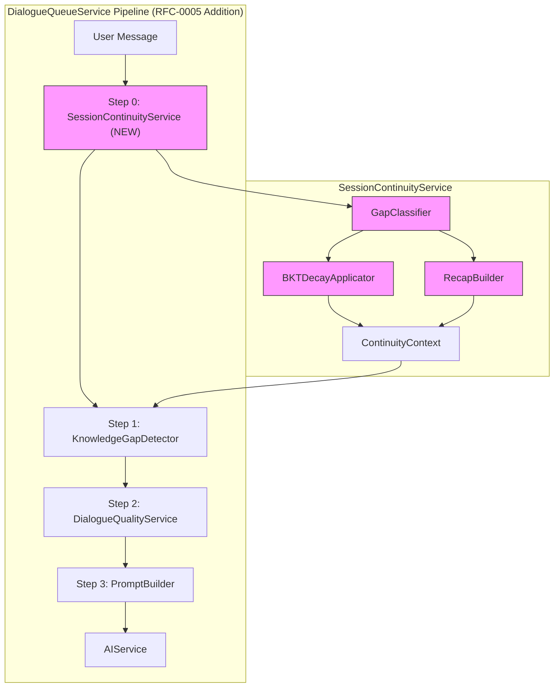
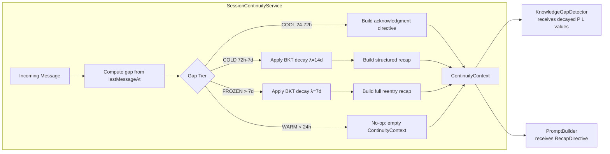
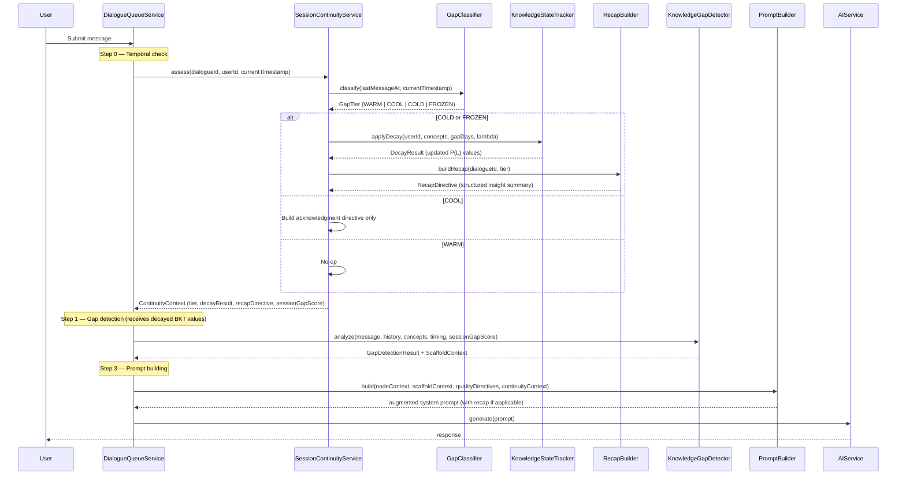
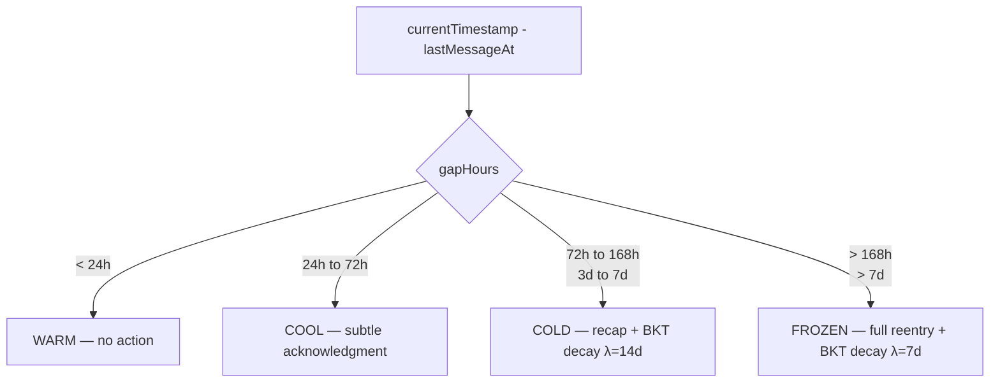
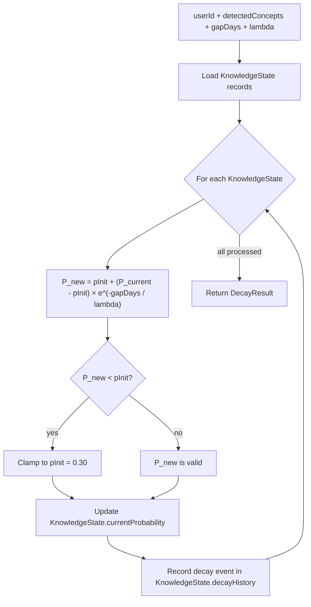
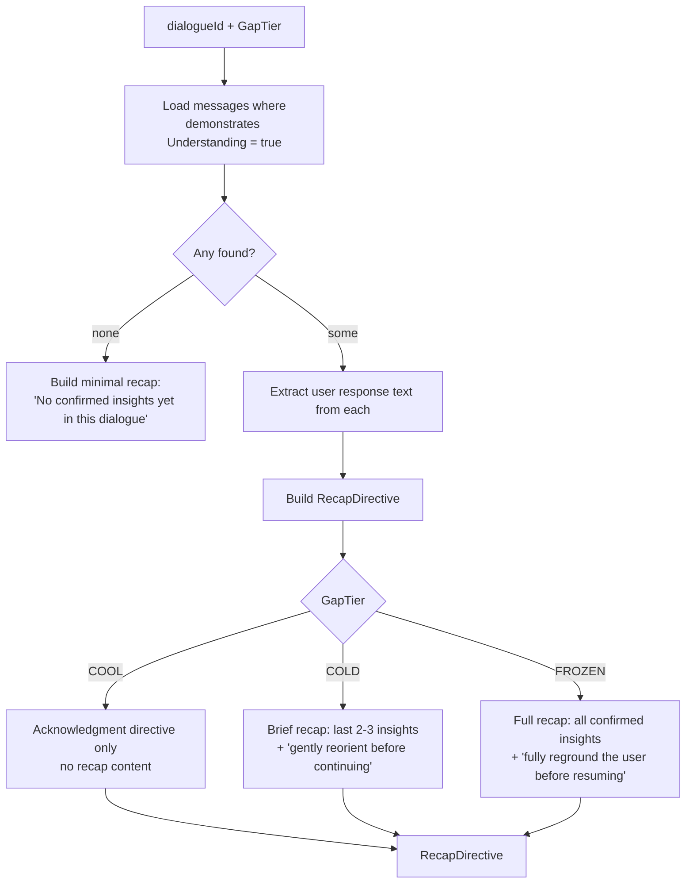
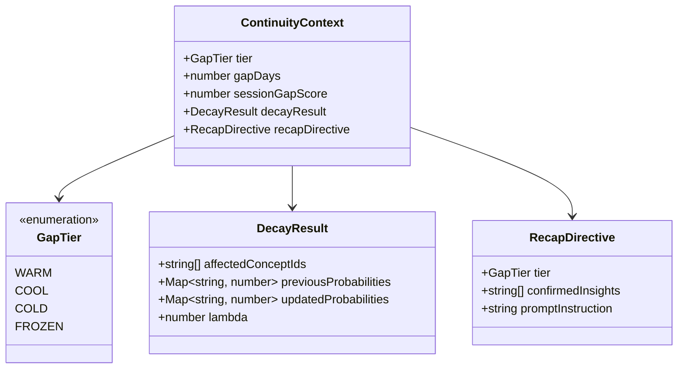
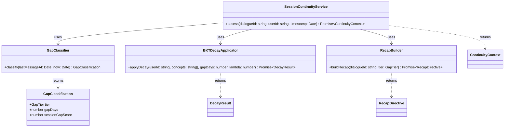
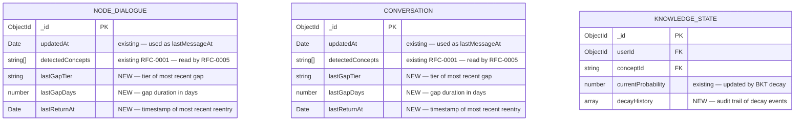

# RFC-0005: Session Continuity & Temporal Awareness

<!-- HEADER BLOCK: Identifies the RFC and its current lifecycle state at a glance. -->

| Field            | Value                                                              |
| ---------------- | ------------------------------------------------------------------ |
| **RFC Number**   | 0005                                                               |
| **Title**        | Session Continuity & Temporal Awareness                            |
| **Status**       |  |
| **Author(s)**    | [Prathik Shetty](https://github.com/shettydev)                     |
| **Created**      | 2026-03-17                                                         |
| **Last Updated** | 2026-03-17                                                         |

> **Status options:** `Draft` | `In Review` | `Accepted` | `Rejected` | `Superseded`

---

## 1. Abstract

This RFC proposes a `SessionContinuityService` that makes Mukti's Socratic dialogue engine aware of temporal gaps between sessions. The motivation is grounded in a production conversation where an 11-day gap was treated as seamless continuation — the AI resumed as though no time had passed, and the user's final message was deeply confused. The service classifies gaps into four tiers (WARM < 24h, COOL 24–72h, COLD 72h–7d, FROZEN > 7d), applies Bayesian Knowledge Tracing decay to knowledge states proportional to gap length, and injects a structured recap or reentry prompt into the AI's system prompt before dialogue resumes. Additionally, the gap signal is integrated into RFC-0001's multi-signal gap score as a fourth temporal sub-signal (`sessionGapScore`), ensuring that long absences contribute to earlier scaffolding escalation. `SessionContinuityService` runs as Step 0 in `DialogueQueueService` — before all other pipeline stages.

---

## 2. Motivation

Users do not engage with Mukti in single uninterrupted sittings. They return hours, days, or weeks later — often mid-concept, mid-reasoning chain. The current system stores conversation history but has no mechanism to detect or respond to temporal gaps. It treats a message sent 11 days after the previous one identically to a message sent 30 seconds later.

### Current Pain Points

- **Silent continuity assumption:** Every message is processed as if the prior turn happened moments ago. There is no re-orientation mechanism — no recap, no acknowledgment of time passed, no check on whether knowledge has decayed.

- **No BKT decay across gaps:** RFC-0001's Bayesian Knowledge Tracing updates `P(L)` based on interaction correctness but never decrements it for time elapsed. A user who struggled with caching semantics on Feb 28, was assessed at `P(L) = 0.45`, then returned on Mar 15 (11 days later) is still treated as if `P(L) = 0.45`. Research on human memory shows significant forgetting over gaps of this length.

- **Gap blindness in gap scoring:** RFC-0001's `temporalSignals` bucket currently captures `timeOnProblem` (time spent within a session) and `responseLag` (pause within a session) but has no signal for inter-session gap length. A returning user who has forgotten foundational context scores identically to an active user, delaying scaffolding escalation.

### Evidence from the Production Session

Conversation `69a2b9ae50c9dd462515013b` had two significant inter-session gaps:

| Gap   | From       | To         | Duration | Observed Effect                                               |
| ----- | ---------- | ---------- | -------- | ------------------------------------------------------------- |
| Gap 1 | 2026-02-28 | 2026-03-03 | 3 days   | Resumed without re-orientation                                |
| Gap 2 | 2026-03-04 | 2026-03-15 | 11 days  | Resumed without re-orientation; final message deeply confused |

After Gap 2 (11 days, classified FROZEN under this RFC), the user's final message demonstrated complete disorientation about the concepts discussed before the gap. The AI continued in pure Socratic mode with no adjustment. The session ended without resolution. This is the most direct failure mode this RFC addresses.

---

## 3. Goals & Non-Goals

### Goals

- [ ] Classify inter-session gaps into four tiers based on elapsed time
- [ ] Run `SessionContinuityService` as Step 0 in `DialogueQueueService`, before all other pipeline stages
- [ ] Apply BKT decay to all `KnowledgeState` records associated with the returning user when gap tier is COLD or FROZEN
- [ ] Inject a structured recap/reentry prompt for COLD and FROZEN tiers
- [ ] Inject a subtle acknowledgment prompt for COOL tier
- [ ] Contribute a `sessionGapScore` sub-signal to RFC-0001's temporal signal bucket
- [ ] Build COLD/FROZEN recap content structurally from existing `demonstratesUnderstanding = true` evaluator records — no additional LLM call

### Non-Goals

- **Full spaced repetition system:** The BKT decay is a one-time adjustment on return, not a background scheduler running forgetting curves continuously. Ongoing SRS is future work.
- **Proactive re-engagement:** Sending notifications or nudges to prompt users to return is out of scope. This RFC addresses the moment of return, not the gap itself.
- **Cross-conversation continuity:** The gap detection and decay operate within a single dialogue (`nodeId` or `conversationId`). Cross-conversation knowledge transfer is a separate concern.
- **WARM tier prompt modification:** Sub-24h gaps receive no prompt modification. The AI continues as normal.
- **Automated concept re-teaching:** The reentry prompt orients the user by recapping established insights — it does not automatically re-teach forgotten material. Re-teaching is triggered by RFC-0001's gap detection and RFC-0002's scaffolding, which will naturally escalate if the user demonstrates forgetting.

---

## 4. Background & Context

### Prior Art

| Reference                                                   | Relevance                                                                                                                                 |
| ----------------------------------------------------------- | ----------------------------------------------------------------------------------------------------------------------------------------- |
| RFC-0001: Knowledge Gap Detection System                    | BKT infrastructure (`KnowledgeState`, `P(L)`, `KnowledgeStateTracker`) that RFC-0005 decays; temporal signal bucket that RFC-0005 extends |
| RFC-0002: Adaptive Scaffolding Framework                    | `ResponseEvaluatorService.demonstratesUnderstanding` records used to build COLD/FROZEN recap content                                      |
| `packages/mukti-api/src/dialogue/dialogue-queue.service.ts` | Target integration point — RFC-0005 runs as Step 0 before all existing pipeline stages                                                    |
| `packages/mukti-api/src/schemas/node-dialogue.schema.ts`    | Stores `lastMessageAt` (existing) — used to compute gap duration                                                                          |
| Ebbinghaus Forgetting Curve (1885)                          | Foundational research establishing exponential knowledge decay over time                                                                  |
| ACT-R Memory Decay (Anderson et al.)                        | Models declarative memory decay; informs the `λ` parameter selection                                                                      |

### Forgetting Curve and BKT Decay Rationale

Human memory decays exponentially after learning. For declarative knowledge in a domain dialogue context, research suggests meaningful decay begins after 24–48 hours and accelerates sharply after 7 days. The decay formula used in this RFC anchors toward the prior probability (not zero) to reflect that background knowledge survives even after forgetting — the user is not starting from scratch, they are starting from weakened footing.

**Anchored exponential decay:**

```
P(L_new) = pInit + (P(L_current) − pInit) × e^(−gapDays / λ)
```

Where:

- `pInit` = 0.30 (BKT prior — the baseline probability before any learning)
- `P(L_current)` = current knowledge probability before gap
- `gapDays` = elapsed days since last interaction
- `λ` = decay time constant (14 days for COLD, 7 days for FROZEN)

This means knowledge decays _toward_ the prior (0.30) exponentially, never below it. A user with `P(L) = 0.85` after a 14-day gap with `λ = 14` decays to approximately `P(L) = 0.30 + (0.85 − 0.30) × e^(−1) ≈ 0.50`.

### System Context Diagram



---

## 5. Proposed Solution

### Overview

`SessionContinuityService` runs as Step 0 in `DialogueQueueService`. It is the first thing that executes when a user message arrives, before gap detection, before quality assessment, before prompt building. It checks the elapsed time since the last message in the current dialogue, classifies the gap, and produces a `ContinuityContext` that carries two things downstream: (1) a set of BKT decay adjustments applied to `KnowledgeState` records in MongoDB, and (2) an optional `RecapDirective` that `PromptBuilder` injects into the system prompt.

The four-tier classification drives different responses:

- **WARM (< 24h):** No action. The service produces an empty `ContinuityContext` and execution continues normally.
- **COOL (24–72h):** A single-line acknowledgment instruction is injected ("It's been a day or two — briefly acknowledge this and gently orient before continuing"). No BKT decay.
- **COLD (72h–7d):** BKT decay applied with `λ = 14d`. A structured recap is built from prior `demonstratesUnderstanding = true` evaluations in this dialogue and injected as an orientation block.
- **FROZEN (> 7d):** BKT decay applied with `λ = 7d` (sharper decay). A full reentry sequence is injected — recap of established insights plus explicit re-grounding instruction.

### Architecture Diagram



### Sequence Flow



### Detailed Design

#### 5.1 GapClassifier

Computes elapsed time between `lastMessageAt` (stored on `NodeDialogue` or `Conversation`) and the current message timestamp. Returns a `GapTier` enum and the `gapDays` float used in BKT decay.



**`lastMessageAt` source:** `NodeDialogue.updatedAt` (updated on every message processed) serves as `lastMessageAt`. This field already exists on the schema. No new tracking field is needed.

**First message edge case:** If `lastMessageAt` is null (first message in a new dialogue), the gap is treated as WARM — no continuity action needed for a fresh start.

#### 5.2 BKT Decay Applicator

Applies anchored exponential decay to all `KnowledgeState` records associated with `(userId, conceptId)` for concepts detected in the current dialogue (`NodeDialogue.detectedConcepts`). Decay is only applied for COLD and FROZEN tiers.



**Decay parameters by tier:**

| Tier   | Lambda (λ) | Effect at 7 days                          | Effect at 14 days                         |
| ------ | ---------- | ----------------------------------------- | ----------------------------------------- |
| COLD   | 14 days    | `P` decays to ~61% of distance from prior | `P` decays to ~37% of distance from prior |
| FROZEN | 7 days     | `P` decays to ~37% of distance from prior | `P` decays to ~14% of distance from prior |

**Example:** A user with `P(L) = 0.80` for a concept, returning after 7 days (COLD, `λ = 14`):

- `P_new = 0.30 + (0.80 − 0.30) × e^(−7/14) = 0.30 + 0.50 × 0.607 = 0.604`

The same user returning after 7 days (FROZEN, `λ = 7`):

- `P_new = 0.30 + (0.80 − 0.30) × e^(−7/7) = 0.30 + 0.50 × 0.368 = 0.484`

**Downstream effect:** `KnowledgeGapDetector` (Step 1) reads these freshly decayed `P(L)` values when computing gap scores. A FROZEN-tier returning user who previously had `P(L) = 0.80` (well above the 0.4 struggling threshold) may now have `P(L) = 0.48` (approaching the struggling threshold), which directly increases the gap score and may trigger earlier scaffolding.

#### 5.3 RecapBuilder

Builds recap content from existing data in the dialogue — no LLM call is required. The `RecapBuilder` queries the `DialogueMessage` collection for all messages in the current dialogue where the associated `EvaluationResult.demonstratesUnderstanding = true`. These are the moments where the user demonstrated genuine comprehension. The recap is a brief structured summary of these insights presented to the AI as grounding material.



**Why no LLM call for recap:** The `demonstratesUnderstanding = true` evaluations from RFC-0002 are already the semantically meaningful moments in the dialogue. They capture what the user understood. Summarizing them requires no inference — the AI in the main generation step can read them directly and orient its response accordingly. Adding an LLM summarization step would add latency and introduce a potential failure mode with no benefit.

**Prompt injection for COOL tier:**

```
TEMPORAL NOTE: This user's last message was 1–3 days ago. Briefly acknowledge
that some time has passed before continuing (e.g., "Welcome back — let's pick
up where we left off."). Keep this brief; do not recap the entire conversation.
```

**Prompt injection for COLD tier:**

```
TEMPORAL NOTE: This user's last message was {gapDays} days ago. Before
continuing with Socratic questioning, briefly recap what they've established:

Confirmed insights from this dialogue:
{confirmedInsights}

Orient the user by referencing these insights, then resume where we left off.
Keep the recap to 2–3 sentences.
```

**Prompt injection for FROZEN tier:**

```
TEMPORAL NOTE: This user's last message was {gapDays} days ago. Fully reground
them before resuming. Do not assume they remember the conversation context.

What this user has established in this dialogue:
{confirmedInsights}

Start your response by briefly recapping these insights and confirming the user
remembers the direction we were heading. Then resume Socratic questioning from
where we left off. Do not skip the reground step even if it feels redundant.
```

#### 5.4 sessionGapScore Integration with RFC-0001

RFC-0001's temporal signal bucket currently contains `timeOnProblem`, `responseLag`, and `abandonmentPattern`. This RFC adds a fourth sub-signal: `sessionGapScore`. The gap score contribution by tier:

| Tier   | sessionGapScore | Rationale                                                 |
| ------ | --------------- | --------------------------------------------------------- |
| WARM   | 0.00            | No meaningful forgetting; no adjustment                   |
| COOL   | 0.10            | Minor disruption; slight push toward scaffolding          |
| COLD   | 0.20            | Meaningful decay; increases gap score noticeably          |
| FROZEN | 0.35            | Severe disruption; strong push toward earlier scaffolding |

**Updated temporal signal formula (RFC-0001 §5.4):**

The temporal sub-score is now computed as the maximum of the existing temporal signals plus the `sessionGapScore`:

```
temporalScore = max(timeOnProblemScore, responseLagScore, abandonmentScore, sessionGapScore)
```

Using `max` rather than a weighted average ensures that a long session gap is not diluted by low scores on other temporal sub-signals. A FROZEN-tier return immediately pushes the temporal bucket to 0.35 regardless of response timing within the session.

**Combined effect example (FROZEN return):**

Assume a user returning after 11 days (FROZEN) on a concept where `P(L) = 0.72` (previously doing well):

1. BKT decay: `P_new = 0.30 + (0.72 − 0.30) × e^(−11/7) ≈ 0.30 + 0.42 × 0.21 ≈ 0.39`
2. Knowledge sub-score: `1 − P_new = 0.61` (up from `1 − 0.72 = 0.28` before gap)
3. Temporal sub-score: `sessionGapScore = 0.35`
4. Gap score: `0.3 × linguistic + 0.25 × behavioral + 0.15 × 0.35 + 0.3 × 0.61 ≈ 0.24` (before linguistic/behavioral signals)

Even with zero linguistic and behavioral signals, the knowledge decay and gap score alone push this user to `≈ 0.24` — close to the Level 1 scaffolding threshold of 0.30. Any hint of confusion in the first returned message crosses the threshold.

#### 5.5 ContinuityContext

The `ContinuityContext` is the output of `SessionContinuityService` and the contract between Step 0 and all downstream pipeline stages.



`KnowledgeGapDetector` receives `sessionGapScore` from `ContinuityContext` to inject into the temporal signal computation. `PromptBuilder` receives `RecapDirective` to append the appropriate instruction block to the system prompt.

---

## 6. API / Interface Design

### Service Interfaces



### Endpoints

No new REST endpoints are introduced. `SessionContinuityService` is an internal pipeline stage. The debug/admin `knowledge-tracing` endpoints from RFC-0001 are extended to expose decay history:

- `GET /api/v1/knowledge-tracing/state/:userId/:conceptId` — response extended to include `decayHistory[]` field

---

## 7. Data Model Changes

### Entity-Relationship Diagram



### Additive Fields

| Entity             | Field          | Type   | Description                                                                        |
| ------------------ | -------------- | ------ | ---------------------------------------------------------------------------------- |
| `node_dialogues`   | `lastGapTier`  | string | Enum: `WARM`, `COOL`, `COLD`, `FROZEN` — tier of the most recently processed gap   |
| `node_dialogues`   | `lastGapDays`  | number | Elapsed days of the most recently processed gap                                    |
| `node_dialogues`   | `lastReturnAt` | Date   | Timestamp of the most recent reentry (when a non-WARM gap was detected)            |
| `conversations`    | `lastGapTier`  | string | Same as above for text conversation flow                                           |
| `conversations`    | `lastGapDays`  | number | Same as above                                                                      |
| `conversations`    | `lastReturnAt` | Date   | Same as above                                                                      |
| `knowledge_states` | `decayHistory` | array  | Audit trail: `{ gapDays, lambda, previousProbability, newProbability, appliedAt }` |

### Indexes

- `knowledge_states(userId, conceptId)` — already exists (RFC-0001); used by BKT decay applicator lookups, no new index needed

### Migration Notes

- **Migration type:** Additive
- **Backwards compatible:** Yes — all new fields are optional with `undefined` as default
- **Estimated migration duration:** < 1 minute

---

## 8. Alternatives Considered

### Alternative A: LLM-Generated Recap

Use an LLM call to summarize the conversation and generate a reentry prompt rather than building the recap from `demonstratesUnderstanding = true` evaluations.

| Pros                                 | Cons                                                        |
| ------------------------------------ | ----------------------------------------------------------- |
| More natural-sounding recap          | Additional LLM call adds 150–400ms latency                  |
| Can synthesize insights across turns | Non-deterministic output — harder to test                   |
| Handles complex conceptual threads   | Potential for hallucination of "insights" that weren't made |
| No dependency on evaluator accuracy  | Cost: another model call per reentry                        |

**Reason for rejection:** The `demonstratesUnderstanding = true` evaluations from RFC-0002 are already the semantically validated insights from the conversation. Building the recap structurally from them avoids LLM cost, adds no latency, and is deterministic and testable. The AI in the main generation step is perfectly capable of reading a structured list of prior insights and formulating a natural reentry — it does not need a pre-summarized paragraph.

### Alternative B: Full Spaced Repetition System

Implement a background scheduler that continuously applies forgetting curves to all `KnowledgeState` records, not just on return.

| Pros                                           | Cons                                                      |
| ---------------------------------------------- | --------------------------------------------------------- |
| Accurately models forgetting between sessions  | Significant infrastructure: background worker, scheduling |
| Knowledge states always reflect current memory | Applies decay even for users who never return             |
| Foundation for proactive re-engagement         | Operational complexity: worker failures, race conditions  |

**Reason for rejection:** The on-demand decay model (decay applied at the moment of return) is simpler, requires no background infrastructure, and achieves the same downstream effect on the pipeline. The goal is accurate `P(L)` values at the time of interaction, not continuous modeling. Full SRS remains valid future work.

### Alternative C: Prompt Recap Without BKT Decay

Inject the recap prompt for long gaps but skip the BKT decay step — keep `P(L)` values unchanged.

| Pros                          | Cons                                                   |
| ----------------------------- | ------------------------------------------------------ |
| Simpler implementation        | Gap detection (RFC-0001) sees inflated `P(L)` values   |
| No database writes on reentry | Scaffolding may not trigger when it should             |
| Lower latency                 | The "returning user needs more support" signal is lost |

**Reason for rejection:** The BKT decay is the mechanism that integrates temporal gap awareness into RFC-0001's scaffolding system. Without it, the gap is acknowledged in the prompt but invisible to the gap score — a returning user after 11 days would be treated as confidently knowing concepts they have likely forgotten. The decay and the recap must work together.

---

## 9. Security & Privacy Considerations

### Threat Surface

- **Replay of stale `demonstratesUnderstanding` records:** The `RecapBuilder` reads historical evaluations. If these records were tampered with (e.g., injecting fake confirmed insights to manipulate the AI's framing), the recap could mislead the AI. Mitigation: evaluator records are written by server-side pipeline only — no user-facing write path exists for `EvaluationResult`.

- **BKT decay timing attacks:** A user could artificially inflate their `P(L)` by rapid interactions, then return after a gap to reset to a lower level and receive scaffolding they don't need. Mitigation: scaffolding provides support, not answers — there is no meaningful benefit to gaming this system downward.

### Data Sensitivity

| Data Element                  | Classification | Handling Requirements                                                        |
| ----------------------------- | -------------- | ---------------------------------------------------------------------------- |
| `decayHistory`                | Sensitive      | Per-user, per-concept audit trail — same access controls as `KnowledgeState` |
| `lastGapTier` / `lastGapDays` | Internal       | Stored on dialogue document; reveals usage patterns                          |
| `confirmedInsights` in recap  | Internal       | Built from existing dialogue content; no new PII                             |

### Authentication & Authorization

No changes to existing auth. Gap tier and decay data inherit dialogue permissions. The extended `knowledge-tracing` endpoint (adding `decayHistory`) inherits existing authentication requirements.

---

## 10. Performance & Scalability

| Metric                                 | Current Baseline       | Expected After Change                       | Acceptable Threshold                 |
| -------------------------------------- | ---------------------- | ------------------------------------------- | ------------------------------------ |
| Step 0 latency (WARM)                  | N/A                    | < 2ms (single timestamp comparison)         | < 5ms                                |
| Step 0 latency (COOL)                  | N/A                    | < 5ms (no DB writes)                        | < 10ms                               |
| Step 0 latency (COLD/FROZEN)           | N/A                    | < 30ms (BKT decay + recap query)            | < 50ms                               |
| `knowledge_states` write amplification | N/A                    | 1 write per detected concept on COLD/FROZEN | Bounded by `detectedConcepts.length` |
| Dialogue response latency delta (p99)  | 1255ms (post RFC-0004) | 1285ms (+30ms COLD/FROZEN)                  | < 1500ms                             |

### Known Bottlenecks

- **High `detectedConcepts` count:** If a dialogue has accumulated many detected concepts (e.g., 20+), the COLD/FROZEN BKT decay step issues 20+ MongoDB writes. Mitigation: batch the writes using `bulkWrite`; cap at 10 concepts per decay pass (process the lowest `P(L)` concepts first — they benefit most from decay-aware rescoring).

- **`RecapBuilder` query on large dialogues:** Loading all `demonstratesUnderstanding = true` evaluations in a long dialogue could involve many message records. Mitigation: limit to the most recent 10 confirmed insights; add an index on `(dialogueId, evaluationResult.demonstratesUnderstanding)`.

---

## 11. Observability

### Logging

- `continuity.gap_detected` — Log on every non-WARM gap: `tier`, `gapDays`, `dialogueId`, `userId`
- `continuity.bkt_decay_applied` — Log on COLD/FROZEN: `conceptIds`, `lambda`, summary of `P(L)` changes
- `continuity.recap_injected` — Log when `RecapDirective` is non-empty: `tier`, `insightCount`
- `continuity.first_message` — Log when `lastMessageAt` is null (new dialogue, no gap computation)

### Metrics

- `mukti.continuity.gap_tier_distribution` (counter) — Incremented per tier on each message; labels: `tier` (`WARM`, `COOL`, `COLD`, `FROZEN`)
- `mukti.continuity.bkt_decay_applied` (counter) — Incremented per decay event; labels: `tier`
- `mukti.continuity.avg_gap_days` (histogram) — Distribution of gap lengths for non-WARM tiers
- `mukti.continuity.recap_injected` (counter) — Incremented when recap is injected; labels: `tier`
- `mukti.continuity.step0_latency` (histogram) — Latency of the full `SessionContinuityService.assess()` call; labels: `tier`

### Tracing

- Add span `session_continuity_assessment` as the first child span of dialogue processing trace
- Include `gapTier`, `gapDays`, `decayApplied`, `recapInjected` as span attributes
- Add `bkt_decay` as a child span when decay is applied, with `conceptCount` and `lambda` attributes

### Alerting

| Alert Name               | Condition                                                 | Severity | Runbook Link |
| ------------------------ | --------------------------------------------------------- | -------- | ------------ |
| High FROZEN Return Rate  | FROZEN tier > 30% of all returns over 1h                  | Warning  | [link]       |
| Step 0 Latency Spike     | `step0_latency` p99 > 50ms for 10m                        | Warning  | [link]       |
| BKT Decay Write Failures | Error rate > 1% on `knowledge_states` writes during decay | Critical | [link]       |

---

## 12. Rollout Plan

### Phases

| Phase | Description                                                           | Entry Criteria             | Exit Criteria                                               |
| ----- | --------------------------------------------------------------------- | -------------------------- | ----------------------------------------------------------- |
| 1     | Gap classification + metrics only (no BKT decay, no prompt injection) | Code merged, tests passing | 1 week; validate gap tier distribution matches expectations |
| 2     | COOL acknowledgment injection enabled                                 | Phase 1 complete           | 1 week; no adverse feedback                                 |
| 3     | COLD recap injection + BKT decay enabled                              | Phase 2 complete           | 2 weeks; user session continuation quality metrics positive |
| 4     | FROZEN full reentry + BKT decay enabled                               | Phase 3 metrics positive   | General availability                                        |

### Feature Flags

- **Flag name:** `session_continuity_enabled`
- **Default state:** Off
- **Kill switch:** Yes — disables the entire `SessionContinuityService` Step 0

- **Flag name:** `session_continuity_bkt_decay`
- **Default state:** Off
- **Kill switch:** Yes — disables BKT decay writes; recap injection continues without it

- **Flag name:** `session_continuity_max_tier`
- **Default state:** `COOL` (Phase 2 default)
- **Values:** `COOL` | `COLD` | `FROZEN` — caps the effective tier used for prompt injection and decay

### Rollback Strategy

1. Disable `session_continuity_bkt_decay` — stops `KnowledgeState` writes; previously decayed values remain but decay stops accumulating
2. Disable `session_continuity_enabled` — Step 0 becomes a no-op; all gap-related prompt injections stop
3. Previously decayed `P(L)` values persist in `knowledge_states` — they do not auto-restore. If rollback is extended, a migration to restore `currentProbability` from `decayHistory` can be run manually.
4. No user-facing impact on rollback — dialogues resume without reentry prompts

> WARNING: BKT decay writes to `knowledge_states` are not automatically reversible. If a rollback occurs after COLD/FROZEN decay has been applied, `P(L)` values will remain at their decayed levels until the next interaction-based BKT update restores them naturally. This is acceptable behavior — the decayed values are more accurate representations of the user's state than the pre-decay values were.

---

## 13. Open Questions

1. **Lambda calibration** — The `λ = 14d` (COLD) and `λ = 7d` (FROZEN) values are derived from ACT-R memory decay literature applied to conversational domain knowledge. Should these be configurable per domain or per concept difficulty? A user forgetting Redis cache semantics over 7 days may decay differently than forgetting basic loop syntax.

2. **Recap content quality with sparse evaluation records** — If a dialogue has zero `demonstratesUnderstanding = true` evaluations (the user has never demonstrated comprehension), the recap is effectively empty. Should the COLD/FROZEN prompt still be injected with a "no confirmed insights yet" note, or suppressed entirely? An empty recap might confuse the AI or feel redundant.

3. **`sessionGapScore` weight in RFC-0001 temporal bucket** — The `max()` function is proposed for combining temporal sub-signals. An alternative is to replace the temporal bucket's single combined score with a weighted sum that includes `sessionGapScore` as a fourth component with weight 0.4 (and re-normalizing the others). Which approach better reflects the intended behavior?

4. **Decay on first COLD/FROZEN return only, or every return?** — The current design applies BKT decay on every COLD/FROZEN return regardless of how many have occurred. Should subsequent COLD/FROZEN returns in the same dialogue apply diminishing decay, given that `P(L)` may already be near the prior from a prior decay?

5. **Cross-dialogue decay** — Should a FROZEN gap on Dialogue A also trigger decay on `KnowledgeState` records touched by other dialogues involving the same concepts? The current design is scoped to `detectedConcepts` in the current dialogue only.

> **Reviewers:** Please reference open questions by number (e.g., "Regarding OQ-3, ...") in your comments.

---

## 14. Decision Log

| Date       | Decision                                                      | Rationale                                                                                                       | Decided By |
| ---------- | ------------------------------------------------------------- | --------------------------------------------------------------------------------------------------------------- | ---------- |
| 2026-03-17 | Four-tier classification (WARM/COOL/COLD/FROZEN)              | Granular enough to distinguish meaningful decay boundaries; simple enough to reason about and tune              | RFC Author |
| 2026-03-17 | BKT decay anchored to prior (0.30), not to zero               | Reflects that background knowledge survives gaps; users are not starting from scratch                           | RFC Author |
| 2026-03-17 | `λ = 14d` for COLD, `λ = 7d` for FROZEN                       | Derived from ACT-R declarative memory decay research for domain knowledge                                       | RFC Author |
| 2026-03-17 | Recap built from `demonstratesUnderstanding` records (no LLM) | Zero latency, deterministic, no additional cost; existing evaluations are semantically sufficient               | RFC Author |
| 2026-03-17 | `sessionGapScore` uses `max()` over temporal sub-signals      | Prevents dilution of a strong gap signal by low scores on other temporal sub-signals                            | RFC Author |
| 2026-03-17 | Step 0 placement (before all other pipeline stages)           | Decay must happen before `KnowledgeGapDetector` reads `P(L)` values; recap must be available to `PromptBuilder` | RFC Author |
| 2026-03-17 | `updatedAt` used as `lastMessageAt`                           | Field already exists on `NodeDialogue` and `Conversation`; no new field required                                | RFC Author |

---

## 15. References

- [RFC-0001: Knowledge Gap Detection System](../rfc-0001-knowledge-gap-detection/index.md)
- [RFC-0002: Adaptive Scaffolding Framework](../rfc-0002-adaptive-scaffolding-framework/index.md)
- [RFC-0004: Socratic Dialogue Quality Guardrails](../rfc-0004-socratic-dialogue-quality-guardrails/index.md)
- [Ebbinghaus (1885): Über das Gedächtnis (Memory: A Contribution to Experimental Psychology)](https://doi.org/10.5214/ans.0972-7531.1017305) — Foundational forgetting curve research
- [Anderson et al. (2004): An Integrated Theory of the Mind (ACT-R)](https://doi.org/10.1037/0033-295X.111.4.1036) — Declarative memory decay model informing λ parameter selection
- [Cen, Koedinger & Junker (2006): Learning Factors Analysis](https://doi.org/10.1007/11774303_17) — BKT decay patterns in educational contexts

---

> **Reviewer Notes:**
>
> WARNING: The BKT decay step in COLD/FROZEN produces permanent writes to `knowledge_states.currentProbability`. Unlike gap classification and recap injection (which are stateless), decay is a data mutation. Ensure the `decayHistory` audit trail is complete before enabling in production — it is the only path to understanding what values were before decay.
>
> This RFC introduces Step 0, which runs before RFC-0001. The pipeline execution order is now: SessionContinuityService → KnowledgeGapDetector → DialogueQualityService → PromptBuilder. Any future RFC that adds pipeline stages must account for this ordering.
>
> OQ-2 (recap with zero confirmed insights) should be resolved before Phase 3 rollout — the COLD injection behavior on sparse dialogues is the most likely source of unexpected AI responses in early production use.
