# RFC-0006: Mukti API Architecture Restructure

<!-- HEADER BLOCK: Identifies the RFC and its current lifecycle state at a glance. -->

| Field            | Value                                                                  |
| ---------------- | ---------------------------------------------------------------------- |
| **RFC Number**   | 0006                                                                   |
| **Title**        | Mukti API Architecture Restructure                                     |
| **Status**       |  |
| **Author(s)**    | [Prathik Shetty](https://github.com/shettydev)                         |
| **Created**      | 2026-03-26                                                             |
| **Last Updated** | 2026-03-28                                                             |

> **Status options:** `Draft` | `In Review` | `Accepted` | `Implemented` | `Rejected` | `Superseded`

---

## 1. Abstract

This RFC proposes a comprehensive architectural restructure of `@mukti/api` to address ten systemic structural issues that have accumulated as the codebase grew from 4 modules to 12. The core problems: all 24 Mongoose schemas live in a flat global `src/schemas/` directory with no domain grouping; cross-cutting concerns (guards, decorators, interceptors) are buried inside `modules/auth/`; BullMQ Redis configuration is duplicated across three modules; every controller manually constructs the response envelope; and test file placement follows no consistent convention. This RFC introduces a layered architecture with three tiers — **Core** (shared infrastructure), **Common** (cross-cutting concerns), and **Domain** (feature modules) — with schemas reorganized into domain-grouped subdirectories under `src/schemas/`, along with standardized internal module layouts and a phased migration strategy that maintains backwards compatibility at every step.

---

## 2. Motivation

The `@mukti/api` codebase has grown organically from an initial 4-module structure (Auth, Canvas, Conversations, Database) to 12 modules spanning authentication, AI integration, Socratic dialogue, knowledge tracing, scaffolding, dialogue quality guardrails, and thought mapping. Each new module was added independently, inheriting whatever patterns existed at the time. The result is a codebase where finding something requires knowing which module "owns" a particular schema, guard, or utility — knowledge that exists only in developer memory.

### Current Pain Points

- **Pain Point 1: Schema Scattering** — All 24 Mongoose schemas live in `src/schemas/` as a flat list. The `User` schema is used by 8 different modules, but the `ThoughtMapShareLink` schema is only used by `ThoughtMapModule`. Both sit in the same directory with identical import paths (`../../schemas/`). There is no signal about which domain owns which schema. Adding a new schema means updating `schemas/index.ts`, the `ALL_SCHEMAS` array, and then re-registering it via `MongooseModule.forFeature()` in the consuming module — a three-step process spread across two files.

- **Pain Point 2: Cross-Cutting Concerns Buried in Auth** — `@Public()`, `@CurrentUser()`, `@Roles()`, `JwtAuthGuard`, `RolesGuard`, and `EmailVerifiedGuard` are used globally across every authenticated module, but they live inside `modules/auth/guards/` and `modules/auth/decorators/`. Every new module must import from `../auth/` to use foundational infrastructure. This creates a false dependency: `ThoughtMapModule` has no business dependency on `AuthModule`, yet it imports auth's decorators.

- **Pain Point 3: Duplicated Infrastructure Configuration** — `ConversationsModule`, `DialogueModule`, and `ThoughtMapModule` each independently configure `BullModule.forRootAsync()` with identical Redis connection parameters. The same 12-line Redis factory function exists in three places. Changing the Redis configuration (e.g., adding TLS) requires editing three files.

- **Pain Point 4: Manual Response Envelope Construction** — Every controller method manually constructs `{ success: true, data, meta: { requestId, timestamp } }`. There is no shared interceptor or utility. A count of response envelope constructions across all controllers yields 40+ manual constructions. If the envelope shape changes (e.g., adding `version` to `meta`), every controller must be updated.

- **Pain Point 5: Nearly Empty `common/` Directory** — The `src/common/` directory contains only `filters/` (1 file) and `seeds/` (2 files). There are no shared decorators, no shared guards, no shared interceptors, no shared interfaces, no shared constants. The directory exists but serves almost no organizational purpose.

- **Pain Point 6: Inconsistent Module Internal Structure** — `AuthModule` has 5 subdirectories (`services/`, `guards/`, `decorators/`, `strategies/`, `dto/`). `CanvasModule` has flat files (`canvas.service.ts`, `canvas.controller.ts`) with no `services/` subdirectory. `KnowledgeTracingModule` has an `examples/` directory containing a runtime integration example — a pattern used nowhere else. There is no canonical internal layout that all modules follow.

- **Pain Point 7: Dual Schema Registration** — `DatabaseModule` registers ALL schemas globally via `MongooseModule.forFeature(ALL_SCHEMAS)`, but each domain module also registers the specific schemas it needs via its own `MongooseModule.forFeature([...])`. This dual registration works at runtime (Mongoose deduplicates), but it creates confusion about which module "owns" schema registration and makes it unclear whether the per-module registrations are necessary.

- **Pain Point 8: Test Placement Chaos** — Auth tests are in `services/__tests__/`. Conversation tests exist both in module-root `__tests__/` and `services/__tests__/`. Knowledge-tracing has `bkt-algorithm.service.spec.ts` directly in `services/` (no `__tests__/` subdirectory). Property tests are consistently in `__tests__/properties/` — the one bright spot. There is no documented convention.

- **Pain Point 9: Invisible Module Dependencies** — `ScaffoldingModule` and `DialogueQualityModule` are critical parts of the system (RFC-0001, RFC-0002, RFC-0004) but do not appear in `app.module.ts`. They are imported transitively via `ConversationsModule` and `DialogueModule`. A developer reading `app.module.ts` sees 10 modules, but the actual dependency graph has 12. The application topology is invisible.

- **Pain Point 10: No Shared Type/Interface Layer** — Common types like `PaginationOptions`, `ResponseEnvelope`, `NodeType`, and queue job data interfaces are defined inline in whichever module needed them first. There is no shared type layer for cross-module interfaces.

---

## 3. Goals & Non-Goals

### Goals

- [ ] Reorganize schemas into domain-grouped subdirectories under `src/schemas/`, eliminating the flat 24-file layout and the monolithic `ALL_SCHEMAS` array
- [x] Extract cross-cutting concerns (guards, decorators, filters, interceptors) into `src/common/`
- [x] Centralize BullMQ/Redis configuration into a shared `QueueModule` — configure once, import everywhere
- [x] Introduce a `ResponseInterceptor` that automatically wraps controller return values in the standard envelope
- [ ] Define and enforce a canonical internal module layout (controller, services, dto, interfaces, tests)
- [ ] Standardize test file placement: all tests in `__tests__/` subdirectories, property tests in `__tests__/properties/`
- [ ] Make all module dependencies visible in `app.module.ts`
- [ ] Create a shared types/interfaces layer for cross-module contracts
- [ ] Maintain full backwards compatibility at each migration phase — no big-bang rewrites

### Non-Goals

- **Changing the NestJS module-per-feature architecture**: The current modular approach is correct (ADR: NestJS 11 over Express). This RFC restructures _within_ that architecture.
- **Splitting `@mukti/api` into separate packages**: The API remains a single deployable. No Nx library extraction.
- **Modifying API contracts or response shapes**: External API behavior is unchanged. The response envelope format stays the same — only _how_ it's constructed changes (interceptor vs. manual).
- **Rearchitecting the Queue + SSE pattern**: The BullMQ + SSE pattern (ADR: Queue-Based AI Processing) is preserved. Only the _configuration_ is centralized.
- **Migrating away from MongoDB or Mongoose**: The data layer technology stack is unchanged.
- **Implementing new features**: This RFC is purely structural. No new endpoints, schemas, or business logic.

---

## 4. Background & Context

### Prior Art

| Reference                    | Relevance                                                                                                              |
| ---------------------------- | ---------------------------------------------------------------------------------------------------------------------- |
| ADR: NestJS 11 over Express  | Established module-per-feature architecture — this RFC restructures within it                                          |
| ADR: MongoDB + Mongoose      | Schemas use Mongoose decorators; co-location must preserve `@Schema()` patterns                                        |
| ADR: Queue-Based AI (BullMQ) | Three modules use BullMQ; centralized config is the fix for duplication                                                |
| RFC-0001                     | Added `KnowledgeTracingModule` and `ScaffoldingModule` — modules that first exposed the "invisible dependency" problem |
| RFC-0002                     | Added scaffold fields to `NodeDialogue` schema — cross-module schema coupling                                          |
| RFC-0003                     | Added `ThoughtMapModule` (largest module, 5 services, 2 controllers) — first module to strain the architecture         |
| RFC-0004                     | Added `DialogueQualityModule` — pure service module with no controller, unusual in current structure                   |
| NestJS Docs: Modules         | Official guidance on module organization, re-exporting, and global modules                                             |

### System Context Diagram

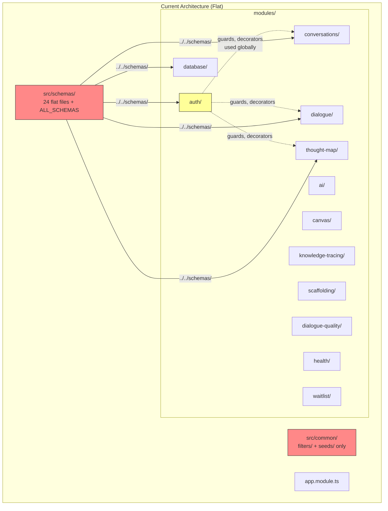

---

## 5. Proposed Solution

### Overview

The restructure introduces a three-tier layered architecture that separates infrastructure, cross-cutting concerns, and domain logic into distinct directories. Schemas are reorganized from a flat 24-file `src/schemas/` directory into domain-grouped subdirectories (e.g., `src/schemas/auth/`, `src/schemas/canvas/`), providing clear ownership signals while keeping schemas as a shared data layer accessible to all modules without false inter-module dependencies. A new `CoreModule` centralizes BullMQ/Redis configuration. Cross-cutting guards, decorators, and interceptors move from `modules/auth/` to `src/common/`. A `ResponseInterceptor` replaces 40+ manual envelope constructions. Every domain module adopts a canonical internal layout. The migration is phased: each phase produces a working, tested codebase.

### Architecture Diagram

```mermaid
graph TB
    subgraph "Proposed Architecture (Layered)"
        direction TB

        subgraph "Layer 1: Core Infrastructure"
            CORE_MOD[core/<br/>CoreModule]
            QUEUE_MOD[core/<br/>QueueModule]
            DB_MOD[core/<br/>DatabaseModule]
        end

        subgraph "Shared Data Layer: Domain-Grouped Schemas"
            SCHEMAS_AUTH[schemas/auth/]
            SCHEMAS_CANVAS[schemas/canvas/]
            SCHEMAS_CONV[schemas/conversation/]
            SCHEMAS_DLG[schemas/dialogue/]
            SCHEMAS_TM[schemas/thought-map/]
            SCHEMAS_KT[schemas/knowledge/]
            SCHEMAS_AI[schemas/ai/]
            SCHEMAS_SHARED[schemas/shared/]
        end

        subgraph "Layer 2: Common Cross-Cutting"
            GUARDS[common/guards/]
            DECORATORS[common/decorators/]
            INTERCEPTORS[common/interceptors/]
            FILTERS[common/filters/]
            INTERFACES[common/interfaces/]
            CONSTANTS[common/constants/]
        end

        subgraph "Layer 3: Domain Modules"
            AUTH_D[modules/auth/]
            AI_D[modules/ai/]
            CANVAS_D[modules/canvas/]
            CONV_D[modules/conversations/]
            DLG_D[modules/dialogue/]
            TM_D[modules/thought-map/]
            KT_D[modules/knowledge-tracing/]
            SCAF_D[modules/scaffolding/]
            DQ_D[modules/dialogue-quality/]
            HEALTH_D[modules/health/]
            WAIT_D[modules/waitlist/]
        end
    end

    CORE_MOD --> DB_MOD
    CORE_MOD --> QUEUE_MOD

    AUTH_D --> CORE_MOD
    CONV_D --> CORE_MOD
    DLG_D --> CORE_MOD
    TM_D --> CORE_MOD

    AUTH_D --> GUARDS
    CONV_D --> GUARDS
    DLG_D --> GUARDS
    TM_D --> GUARDS

    AUTH_D -.->|imports| SCHEMAS_AUTH
    CANVAS_D -.->|imports| SCHEMAS_CANVAS
    CONV_D -.->|imports| SCHEMAS_CONV
    CONV_D -.->|imports| SCHEMAS_AUTH

    style CORE_MOD fill:#8f8,stroke:#333
    style QUEUE_MOD fill:#8f8,stroke:#333
    style DB_MOD fill:#8f8,stroke:#333
    style GUARDS fill:#8bf,stroke:#333
    style DECORATORS fill:#8bf,stroke:#333
    style INTERCEPTORS fill:#8bf,stroke:#333
    style SCHEMAS_AUTH fill:#f9f,stroke:#333
    style SCHEMAS_CANVAS fill:#f9f,stroke:#333
    style SCHEMAS_CONV fill:#f9f,stroke:#333
    style SCHEMAS_DLG fill:#f9f,stroke:#333
    style SCHEMAS_TM fill:#f9f,stroke:#333
    style SCHEMAS_KT fill:#f9f,stroke:#333
    style SCHEMAS_AI fill:#f9f,stroke:#333
    style SCHEMAS_SHARED fill:#f9f,stroke:#333
```

### Detailed Design

#### 5.1 Directory Structure — Target State

The restructured `src/` directory follows a layered convention where each layer has clear responsibilities and import rules.

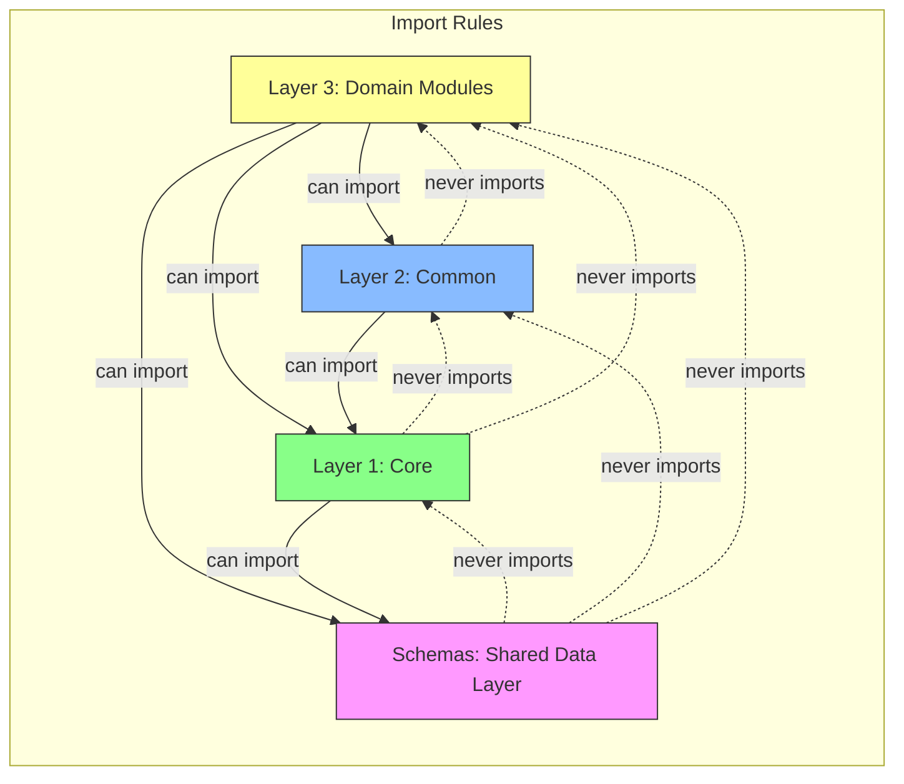

**Layer 1 — Core Infrastructure** (`src/core/`):

| Directory        | Responsibility                                                        |
| ---------------- | --------------------------------------------------------------------- |
| `core/database/` | MongoDB connection, `DatabaseModule` with `forRootAsync()`            |
| `core/queue/`    | `QueueModule` — centralized BullMQ/Redis config, exported `forRoot()` |

**Layer 2 — Common Cross-Cutting** (`src/common/`):

| Directory              | Responsibility                                                        |
| ---------------------- | --------------------------------------------------------------------- |
| `common/decorators/`   | `@Public()`, `@CurrentUser()`, `@Roles()` — framework decorators      |
| `common/guards/`       | `JwtAuthGuard`, `RolesGuard`, `EmailVerifiedGuard` — framework guards |
| `common/interceptors/` | `ResponseInterceptor` — automatic response envelope wrapping          |
| `common/filters/`      | `HttpExceptionFilter` — global exception handling (already exists)    |
| `common/interfaces/`   | Shared types: `PaginationOptions`, `ResponseEnvelope`, `NodeType`     |
| `common/constants/`    | Shared constants: roles, default values, queue names                  |
| `common/pipes/`        | Shared validation pipes (future use)                                  |

**Layer 3 — Domain Modules** (`src/modules/`):

Each domain module follows the canonical internal layout defined in §5.2.

#### 5.2 Canonical Module Layout

Every domain module must follow this internal structure. This replaces the ad-hoc layouts currently in use.

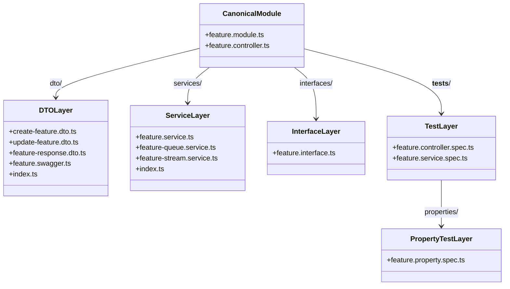

> **Note:** Schemas are _not_ co-located inside domain modules. They live in `src/schemas/` organized by domain subdirectory (see §5.3). Modules import schemas from `src/schemas/<domain>/` — this keeps schema definitions as a shared data layer accessible to all modules without creating false inter-module dependencies.

**Rules**:

| Rule                        | Description                                                            |
| --------------------------- | ---------------------------------------------------------------------- |
| `feature.module.ts`         | DI wiring only — no business logic                                     |
| `feature.controller.ts`     | HTTP routing only — delegates to services                              |
| `services/`                 | Always a subdirectory (even for single-service modules like `canvas/`) |
| `dto/`                      | DTOs, swagger decorators, barrel `index.ts`                            |
| `interfaces/`               | Module-specific TypeScript interfaces                                  |
| `__tests__/`                | All test files at module root level                                    |
| `__tests__/properties/`     | Property-based tests using fast-check                                  |
| No `schemas/` in modules    | Schemas live in `src/schemas/<domain>/` (see §5.3)                     |
| No `examples/`              | Remove runtime example files (move to documentation)                   |
| No `utils/` at module level | Utility functions belong in `services/` or `common/`                   |

#### 5.3 Schema Organization — Domain-Grouped Directory

Schemas are reorganized from the flat `src/schemas/` directory into domain-grouped subdirectories within `src/schemas/`. Schemas remain a **shared data layer** — they are not moved into domain modules. This avoids false inter-module coupling (e.g., `CanvasModule` should not need to import `AuthModule` just to access `UserSchema`) and eliminates circular dependency risks between modules that share schemas bidirectionally (e.g., `dialogue/` ↔ `canvas/`).

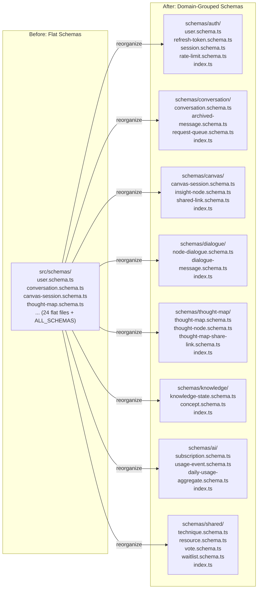

**Schema domain grouping**:

| Schema                                              | Domain Directory        | Rationale                                          |
| --------------------------------------------------- | ----------------------- | -------------------------------------------------- |
| `User`, `RefreshToken`, `Session`, `RateLimit`      | `schemas/auth/`         | Auth domain entities                               |
| `Conversation`, `ArchivedMessage`, `RequestQueue`   | `schemas/conversation/` | Conversation domain entities                       |
| `CanvasSession`, `InsightNode`, `SharedLink`        | `schemas/canvas/`       | Canvas domain entities                             |
| `NodeDialogue`, `DialogueMessage`                   | `schemas/dialogue/`     | Dialogue domain entities                           |
| `ThoughtMap`, `ThoughtNode`, `ThoughtMapShareLink`  | `schemas/thought-map/`  | Thought map domain entities                        |
| `KnowledgeState`, `Concept`                         | `schemas/knowledge/`    | Knowledge domain entities                          |
| `Subscription`, `UsageEvent`, `DailyUsageAggregate` | `schemas/ai/`           | AI/billing domain entities                         |
| `Technique`, `Resource`, `Vote`, `Waitlist`         | `schemas/shared/`       | Cross-domain entities with no single owning module |

**Domain barrel files**: Each subdirectory has an `index.ts` barrel that exports:

1. All schema classes and types (re-exports from individual files)
2. A `DOMAIN_SCHEMAS` constant array for Mongoose registration (e.g., `AUTH_SCHEMAS`, `CANVAS_SCHEMAS`)

**Root barrel** (`src/schemas/index.ts`): Re-exports all domain barrels. Provides a single `ALL_SCHEMAS` aggregation from the domain arrays (e.g., `[...AUTH_SCHEMAS, ...CANVAS_SCHEMAS, ...]`) for `DatabaseModule` global registration.

**Cross-module schema access**: Any module can import any schema from any domain directory via `src/schemas/<domain>/`. No NestJS module imports required — schemas are pure data definitions, not providers. Each module continues to declare the schemas it needs in its own `MongooseModule.forFeature()`, importing directly from the schemas directory. This preserves NestJS's explicit dependency principle without coupling unrelated modules.

**Why not co-locate schemas in modules?** Three problems with moving schemas into `modules/<name>/schemas/`:

1. **False coupling**: `User` is consumed by 8 modules — all 7 non-auth modules would need to import from `modules/auth/schemas/` or import `AuthModule`, creating a dependency that doesn't reflect business relationships.
2. **Circular dependencies**: `DialogueModule` needs `CanvasSession` (canvas-owned) and `CanvasModule` needs `NodeDialogue` + `DialogueMessage` (dialogue-owned) — bidirectional module imports require `forwardRef()` and indicate a design smell.
3. **Schemas are data, not features**: Schema files define MongoDB document shapes. They are closer to database table definitions than to business logic, and belong in a shared data layer.

#### 5.4 CoreModule — Centralized Infrastructure

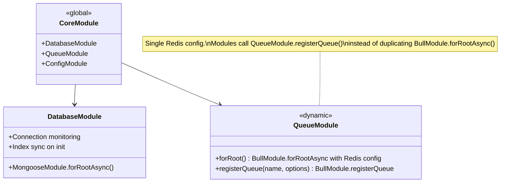

**QueueModule** exposes two static methods:

- `forRoot()` — Configures the Redis connection once (replaces 3 duplicate `BullModule.forRootAsync()` calls)
- `registerQueue(name, options)` — Registers a named queue with default job options (replaces per-module `BullModule.registerQueue()`)

This eliminates the 12-line Redis configuration factory duplicated across `ConversationsModule`, `DialogueModule`, and `ThoughtMapModule`.

#### 5.5 ResponseInterceptor — Automatic Envelope Wrapping

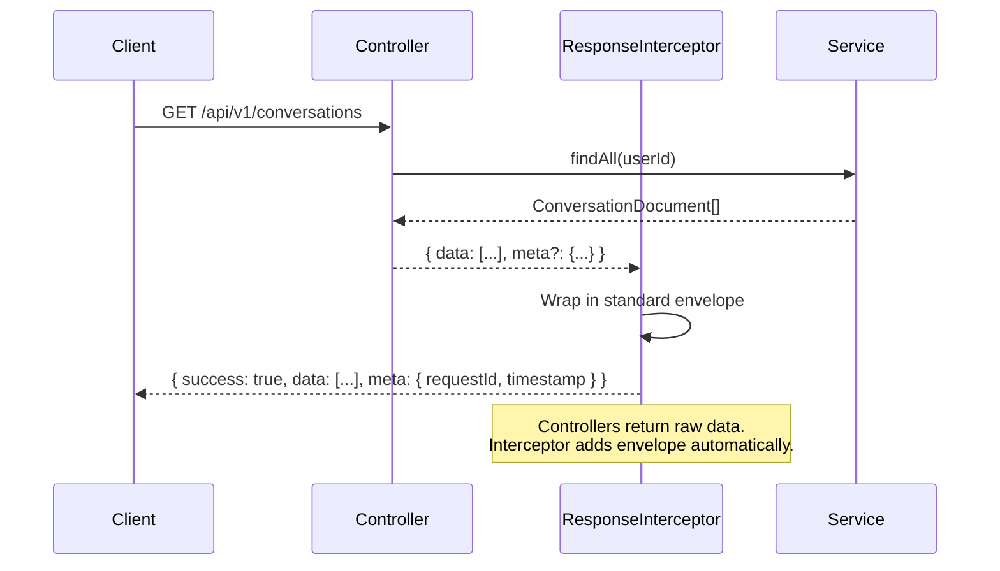

**Behavior**:

- Wraps all successful responses in `{ success: true, data, meta: { requestId, timestamp } }`
- If controller returns an object with a `meta` property, merges it (for pagination metadata)
- SSE endpoints and 202 Accepted responses opt out via a `@SkipEnvelope()` decorator
- Error responses continue to use `HttpExceptionFilter` (unchanged)

#### 5.6 Cross-Cutting Concern Extraction

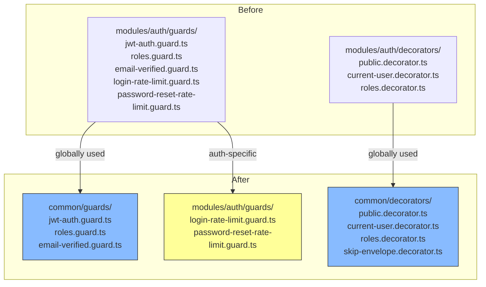

**Migration rule**: If a guard/decorator is imported by 2+ modules outside `auth/`, it moves to `common/`. If it is only used within `auth/` (like `LoginRateLimitGuard`), it stays in `modules/auth/guards/`.

#### 5.7 Test Organization Standard

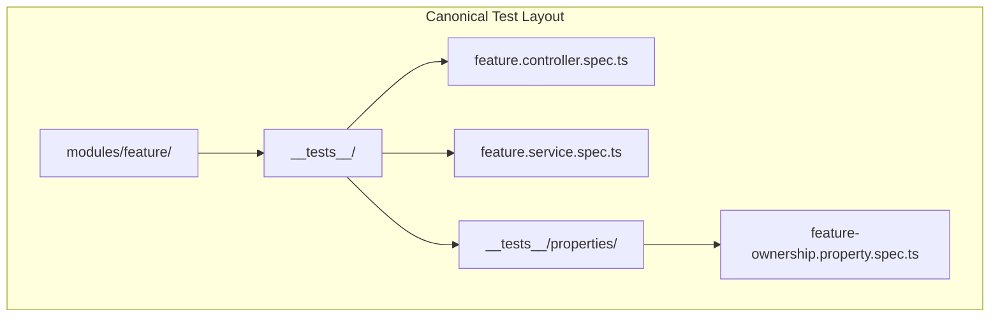

**Rules**:

| Convention                                   | Description                                                                                |
| -------------------------------------------- | ------------------------------------------------------------------------------------------ |
| All tests in `__tests__/`                    | No test files at service or module level (fixes `bkt-algorithm.service.spec.ts` placement) |
| Controller tests at module `__tests__/` root | Not inside `services/__tests__/`                                                           |
| Service tests at module `__tests__/` root    | Flattened from `services/__tests__/`                                                       |
| Property tests in `__tests__/properties/`    | Consistent with current good practice                                                      |
| Naming: `{file-name}.spec.ts`                | Unit tests                                                                                 |
| Naming: `{file-name}.property.spec.ts`       | Property-based tests                                                                       |

#### 5.8 Explicit Module Registration

All 12 modules become visible in `app.module.ts`:

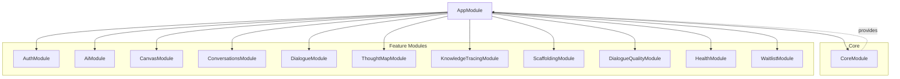

`ScaffoldingModule` and `DialogueQualityModule` are explicitly listed in `AppModule.imports[]`. While NestJS resolves transitive imports correctly, explicit registration makes the full module graph visible at a glance.

---

## 6. API / Interface Design

### Service Interfaces

This RFC does not introduce new API endpoints. All existing endpoints remain unchanged.

The primary new internal interface is the `QueueModule` static API:

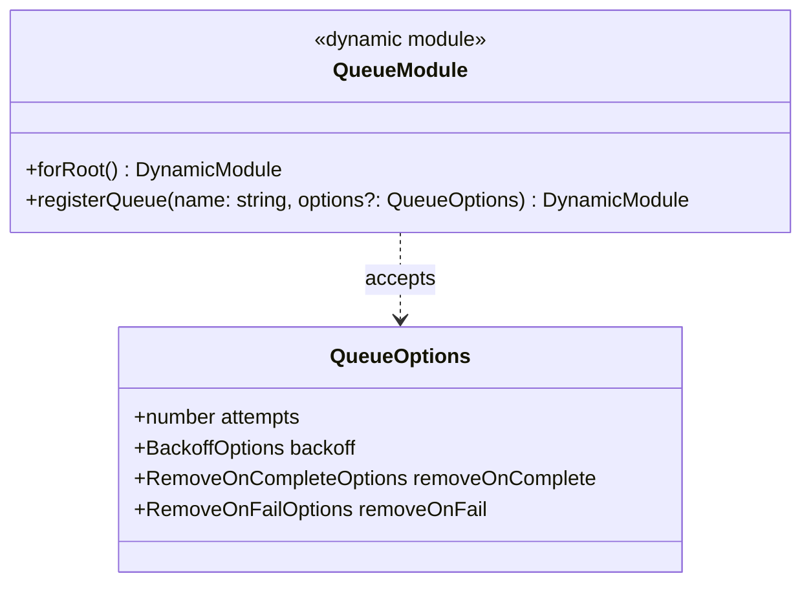

### Interceptor Contract

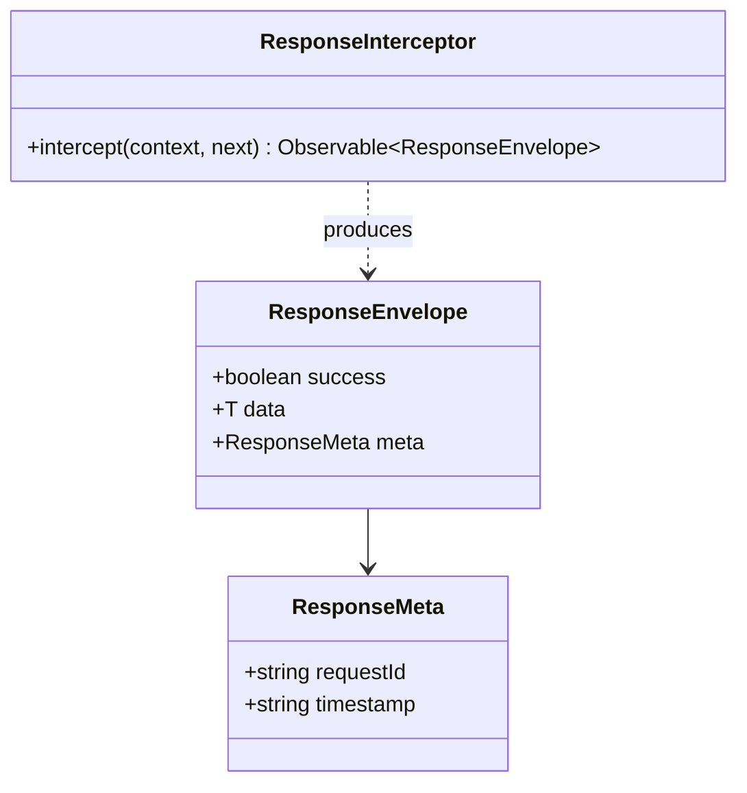

---

## 7. Data Model Changes

Not applicable. This RFC restructures code organization — no schema fields, indexes, or collections are added, removed, or modified. Schemas are _moved_ to new file locations but their content is identical.

### Migration Notes

- **Migration type:** File moves only (no data migration)
- **Backwards compatible:** Yes — no schema changes, no API changes
- **Estimated migration duration:** N/A (code restructure, not data migration)

---

## 8. Alternatives Considered

### Alternative A: Nx Library Extraction

Extract shared code (`common/`, `core/`) into separate Nx libraries within the monorepo (e.g., `packages/mukti-shared-api/`).

| Pros                                             | Cons                                    |
| ------------------------------------------------ | --------------------------------------- |
| Strong boundary enforcement via Nx project rules | Adds Nx library configuration overhead  |
| Could be shared with future services             | Only one consumer exists (`@mukti/api`) |
| Clear import paths (`@mukti/shared-api`)         | Slower builds due to additional project |

**Reason for rejection:** Over-engineering for a single-consumer scenario. The layered directory structure achieves the same organizational goals without Nx library overhead. Can revisit if a second backend service is introduced.

### Alternative B: Co-locate Schemas Inside Domain Modules

Move each schema file into its owning module's `schemas/` subdirectory (e.g., `modules/auth/schemas/user.schema.ts`). When Module B needs a schema owned by Module A, Module A exports its schema registration and Module B imports Module A.

| Pros                                               | Cons                                                                            |
| -------------------------------------------------- | ------------------------------------------------------------------------------- |
| Maximum co-location — schema lives with its module | `User` consumed by 8 modules — all must import `AuthModule` for it              |
| Module becomes fully self-contained                | Creates false NestJS module dependencies (e.g., Canvas → Auth)                  |
| Follows NestJS official guidance                   | Bidirectional schema use (Dialogue ↔ Canvas) causes circular imports           |
|                                                    | Ambiguous ownership for schemas used by multiple domains (e.g., `Subscription`) |

**Reason for rejection:** Schemas are shared data definitions, not feature code. Moving them into modules creates coupling between modules that have no business relationship. The `User` schema alone would force 7 modules to depend on `AuthModule`. Bidirectional schema usage between `DialogueModule` and `CanvasModule` would require `forwardRef()` — a design smell. Domain-grouped subdirectories under `src/schemas/` provide the same ownership signal without these coupling problems.

### Alternative C: Keep Flat Global Schemas, Fix Everything Else

Leave `src/schemas/` as a flat 24-file directory and only address the other 9 issues.

| Pros                               | Cons                                           |
| ---------------------------------- | ---------------------------------------------- |
| Smaller migration scope            | Schema ownership remains ambiguous             |
| No risk of breaking schema imports | `ALL_SCHEMAS` array continues growing linearly |
| Familiar to current developers     | No domain grouping for data layer              |

**Reason for rejection:** Schema organization is a high-impact improvement. While co-location into modules was rejected (see Alternative B), the flat 24-file directory still lacks any domain signal. Domain-grouped subdirectories solve the ownership ambiguity without the coupling downsides of full co-location.

### Alternative D: NestJS Global Module for All Schemas

Make `DatabaseModule` a `@Global()` module that registers all schemas, then remove per-module `MongooseModule.forFeature()` calls entirely.

| Pros                                 | Cons                                                     |
| ------------------------------------ | -------------------------------------------------------- |
| Zero schema registration duplication | Hides dependencies — modules don't declare what they use |
| Simplest possible schema setup       | Violates NestJS explicit-dependency principle            |
| One-line fix                         | Makes testing harder (every test gets all schemas)       |

**Reason for rejection:** NestJS's module system is designed for explicit dependency declaration. Global schema registration undermines this principle and makes it impossible to understand which schemas a module uses without reading its service code.

---

## 9. Security & Privacy Considerations

No new security or privacy implications. This RFC restructures file locations without changing:

- Authentication or authorization logic
- Guard behavior or middleware order
- CSRF protection or Helmet configuration
- Encryption of BYOK API keys
- Rate limiting behavior

The `JwtAuthGuard` and `RolesGuard` move to `common/guards/` but their implementation and registration (via `APP_GUARD`) remain identical.

---

## 10. Performance & Scalability

No performance impact. This RFC moves files and reorganizes imports — no runtime behavior changes.

| Metric          | Current Baseline | Expected After Change | Acceptable Threshold |
| --------------- | ---------------- | --------------------- | -------------------- |
| Cold start time | ~2.5s            | ~2.5s (no change)     | < 5s                 |
| Request latency | Unchanged        | Unchanged             | N/A                  |
| Build time      | ~18s             | ~18s (no change)      | < 30s                |

The `ResponseInterceptor` adds negligible overhead (one `map()` operator on the response observable). NestJS interceptors are optimized for this pattern.

---

## 11. Observability

No new observability requirements. Existing logging patterns are preserved:

- `private readonly logger = new Logger(ClassName.name)` remains the standard
- `DatabaseModule` connection logging is unchanged
- Queue metrics remain accessible via existing `getQueueMetrics()` service methods

---

## 12. Rollout Plan

### Phases

| Phase | Description                                     | Status          | Entry Criteria   | Exit Criteria                                                                                                                                                        |
| ----- | ----------------------------------------------- | --------------- | ---------------- | -------------------------------------------------------------------------------------------------------------------------------------------------------------------- |
| 1     | Extract cross-cutting concerns to `common/`     | ✅ **Complete** | RFC accepted     | All guards/decorators moved; all imports updated; tests pass                                                                                                         |
| 2     | Create `CoreModule` with `QueueModule`          | ✅ **Complete** | Phase 1 complete | BullMQ config centralized; 2 duplicate configs removed; tests pass                                                                                                   |
| 3     | Introduce `ResponseInterceptor`                 | ✅ **Complete** | Phase 2 complete | Interceptor active globally; manual envelope removed from all controllers; tests pass                                                                                |
| 4     | Reorganize schemas into domain-grouped dirs     | ⬜ Not started  | Phase 3 complete | Flat `src/schemas/` files reorganized into domain subdirs; domain barrel files created; `ALL_SCHEMAS` refactored from domain arrays; all imports updated; tests pass |
| 5     | Standardize module internals and test placement | ⬜ Not started  | Phase 4 complete | All modules follow canonical layout; all tests in `__tests__/`; linter rules enforced                                                                                |
| 6     | Explicit module registration and cleanup        | ⬜ Not started  | Phase 5 complete | All 12 modules in `app.module.ts`; `common/seeds/` relocated; `seed.ts` cleaned up                                                                                   |

### Phase Details

#### Phase 1: Extract Cross-Cutting Concerns

**Scope**: Move globally-used guards, decorators to `src/common/`. Create barrel `index.ts` files.

**Files moved**:

- `modules/auth/guards/jwt-auth.guard.ts` → `common/guards/jwt-auth.guard.ts`
- `modules/auth/guards/roles.guard.ts` → `common/guards/roles.guard.ts`
- `modules/auth/guards/email-verified.guard.ts` → `common/guards/email-verified.guard.ts`
- `modules/auth/decorators/public.decorator.ts` → `common/decorators/public.decorator.ts`
- `modules/auth/decorators/current-user.decorator.ts` → `common/decorators/current-user.decorator.ts`
- `modules/auth/decorators/roles.decorator.ts` → `common/decorators/roles.decorator.ts`

**Files remaining in `modules/auth/`**:

- `guards/login-rate-limit.guard.ts` (auth-specific)
- `guards/password-reset-rate-limit.guard.ts` (auth-specific)

**Validation**: All existing tests pass. Import paths updated via IDE refactoring.

> **✅ Completed: 2026-03-27**
>
> - `git mv` used throughout to preserve git blame/history
> - `common/guards/` created: `jwt-auth.guard.ts`, `roles.guard.ts`, `email-verified.guard.ts` + barrel `index.ts`
> - `common/decorators/` created: `public.decorator.ts`, `current-user.decorator.ts`, `roles.decorator.ts` + barrel `index.ts`
> - `modules/auth/guards/index.ts` updated to export only auth-specific guards (`login-rate-limit`, `password-reset-rate-limit`)
> - `modules/auth/decorators/` directory removed (all files moved; barrel deleted)
> - Import paths updated across 14 files: `app.module.ts`, `auth.module.ts`, `auth.controller.ts`, all 9 domain controllers, and 2 property test specs
> - Build (`bun nx run @mukti/api:build`) and tests (`bun nx run @mukti/api:test`) pass with zero regressions

#### Phase 2: Create CoreModule with QueueModule

**Scope**: Create `src/core/` directory. Move `DatabaseModule` from `modules/database/` to `core/database/`. Create `QueueModule` in `core/queue/`.

**Key change**: `ConversationsModule`, `DialogueModule`, and `ThoughtMapModule` replace their `BullModule.forRootAsync()` with `QueueModule.forRoot()` import and `QueueModule.registerQueue()` for named queues.

**Validation**: Queue tests pass. Redis connection established once (verify via logs).

> **✅ Completed: 2026-03-27**
>
> - `git mv` used to move `modules/database/database.module.ts` → `core/database/database.module.ts` (preserves git blame)
> - `core/queue/queue.module.ts` created: `QueueModule` with `forRoot()` (global Redis config) and `registerQueue(name, options?)` (default job options + per-queue overrides via deep merge)
> - `core/core.module.ts` created: bundles `DatabaseModule` + `QueueModule.forRoot()`, imported once in `AppModule`
> - Barrel files created: `core/index.ts`, `core/database/index.ts`, `core/queue/index.ts`
> - `ConversationsModule`: removed 16-line `BullModule.forRootAsync()` block, replaced `BullModule.registerQueue()` with `QueueModule.registerQueue('conversation-requests')`
> - `DialogueModule`: removed 16-line `BullModule.forRootAsync()` block, replaced `BullModule.registerQueue()` with `QueueModule.registerQueue('dialogue-requests')`
> - `ThoughtMapModule`: replaced 3× `BullModule.registerQueue()` with `QueueModule.registerQueue()` — `thought-map-dialogue-requests` (defaults), `thought-map-suggestion-requests` (custom: attempts=2, backoff=500ms, 6h retention), `thought-map-extraction-requests` (custom: attempts=2, 48h fail retention)
> - `app.module.ts`: `DatabaseModule` → `CoreModule`
> - `common/seeds/seed.module.ts`: import path updated `../../modules/database/` → `../../core/database/`
> - Empty `modules/database/` directory removed
> - Discovery: only 2 modules had `BullModule.forRootAsync()` duplication (not 3 as RFC stated — `ThoughtMapModule` inherited the Redis connection transitively via `DialogueModule`)
> - Build (`bun nx run @mukti/api:build`) passes
> - Tests: 566 pass, 23 fail (3 pre-existing test failures due to missing `SubscriptionModel` mock — unrelated to Phase 2)

#### Phase 3: Introduce ResponseInterceptor

**Scope**: Create `common/interceptors/response.interceptor.ts`. Register globally in `AppModule`. Create `@SkipEnvelope()` decorator for SSE and 202 endpoints.

**Migration**: Gradually remove manual `{ success, data, meta }` constructions from controllers, one module at a time. Each controller can be migrated independently.

**Validation**: API response format unchanged (integration tests verify). Manual envelope constructions eliminated.

> **✅ Completed: 2026-03-27**
>
> - `@SkipEnvelope()` decorator created at `common/decorators/skip-envelope.decorator.ts`, exported from `common/decorators/index.ts` barrel
> - `ResponseInterceptor` created at `common/interceptors/response.interceptor.ts` with barrel `common/interceptors/index.ts`
> - Interceptor registered globally in `app.module.ts` via `APP_INTERCEPTOR`
> - 17 unit tests written for `ResponseInterceptor` — all passing
> - **Detection logic**: If returned value has both `data` and `meta` keys at top level with `meta` being an object → extract `data` as payload, merge `meta` with generated meta (pagination case). Otherwise, entire returned value IS the data.
> - **No-data responses**: When controller returns `undefined`/`null` for non-204 status codes, produce `{ success: true, meta: {...} }` without a `data` key.
> - **RequestId format**: Uses `uuidv7()` consistent with `HttpExceptionFilter`
> - **Controllers migrated** (manual envelope removed):
>   - `WaitlistController` — 2 endpoints
>   - `ConversationController` — 5 endpoints + `@SkipEnvelope()` on SSE stream and 204 delete
>   - `DialogueController` — 3 endpoints + `@SkipEnvelope()` on SSE stream
>   - `CanvasController` — 13 endpoints
>   - `ThoughtMapController` — 19 endpoints + `@SkipEnvelope()` on 2 SSE streams
>   - `ThoughtMapDialogueController` — 3 endpoints + `@SkipEnvelope()` on SSE stream
> - **Controllers with class-level `@SkipEnvelope()`** (no envelope migration — preserving current response shapes):
>   - `AuthController` — non-standard response shapes preserved for backwards compatibility
>   - `KnowledgeTracingController` — returns raw data with no envelope
>   - `HealthController` — NestJS Terminus has its own response format
> - `generateRequestId()` private method removed from all 5 controllers that had it (Conversation, Dialogue, Canvas, ThoughtMap, ThoughtMapDialogue)
> - Test files updated: `thought-map.controller.spec.ts`, `thought-map-dialogue.controller.spec.ts`, `conversation.controller.spec.ts` — removed `expectEnvelope` helpers, updated `result.data.X` → `result.X` assertions
> - Build (`bun nx run @mukti/api:build`) passes
> - Tests: 583 pass, 23 fail (3 pre-existing test failures due to missing `SubscriptionModel` mock — unrelated to Phase 3)

#### Phase 4: Reorganize Schemas into Domain-Grouped Directories

**Scope**: Create domain subdirectories under `src/schemas/` (`auth/`, `conversation/`, `canvas/`, `dialogue/`, `thought-map/`, `knowledge/`, `ai/`, `shared/`). Move each schema file into its domain subdirectory via `git mv`. Create barrel `index.ts` in each subdirectory that exports all types and a `DOMAIN_SCHEMAS` registration array. Refactor root `src/schemas/index.ts` to re-export from domain barrels and compose `ALL_SCHEMAS` from the domain arrays. Update all import paths across modules and tests.

**Key changes**:

- 24 flat schema files → 8 domain subdirectories
- Each barrel exports a typed `DOMAIN_SCHEMAS` array (e.g., `AUTH_SCHEMAS = [{ name: User.name, schema: UserSchema }, ...]`)
- Root `index.ts` aggregates: `export const ALL_SCHEMAS = [...AUTH_SCHEMAS, ...CANVAS_SCHEMAS, ...]`
- Module `MongooseModule.forFeature()` imports update from `../../schemas/X` to `../../schemas/<domain>/X` (or from the domain barrel)
- `DatabaseModule` continues to register `ALL_SCHEMAS` globally — no change to runtime registration behavior

**Validation**: Application boots. All schema-dependent tests pass. No flat-file imports from `src/schemas/` root remain (all imports go through domain subdirectory barrels).

#### Phase 5: Standardize Module Internals

**Scope**: Apply canonical layout (§5.2) to all modules. Move tests to `__tests__/` directories. Remove `examples/` directory from `knowledge-tracing/`. Move `dialogue/utils/` to `dialogue/services/`.

**Validation**: All tests pass from new locations. Lint rules verify structure.

#### Phase 6: Explicit Registration and Cleanup

**Scope**: Add `ScaffoldingModule` and `DialogueQualityModule` to `AppModule.imports[]`. Move `common/seeds/` to `core/database/seeds/`. Clean up root `seed.ts`.

**Validation**: Full test suite passes. `app.module.ts` lists all 12 modules.

### Rollback Strategy

Each phase is an independent, merge-ready PR. Rollback = revert the PR.

1. Phases are ordered by risk (lowest first: file moves → new modules → interceptor → schema migration)
2. No phase depends on a future phase
3. Each phase produces a working, deployable codebase
4. Git history preserves file moves via `git mv` (maintains blame/history)

---

## 13. Open Questions

1. ~~**Should `Subscription` schema live in `auth/` or `ai/`?**~~ — **Resolved.** With domain-grouped schemas under `src/schemas/`, `Subscription` goes in `schemas/ai/` since it primarily governs AI usage limits. Both `AuthModule` and `AiModule` import it freely — no module coupling required.

2. ~~**Should `User` schema exports be centralized?**~~ — **Resolved.** With domain-grouped schemas, `User` lives in `schemas/auth/` but any module imports it directly from that path. No `AuthModule` import needed — the 8-module dependency surface problem disappears entirely.

3. **Should we introduce ESLint rules to enforce the canonical layout?** — An `eslint-plugin-import` rule could enforce import layering (domain never imports from another domain module's internals, schemas only import from `src/schemas/`). This adds CI enforcement but increases linter config complexity.

4. ~~**How should `Technique`, `Resource`, and `Vote` schemas be organized?**~~ — **Resolved.** These cross-domain schemas go in `schemas/shared/` along with `Waitlist`. No dedicated module needed — `schemas/shared/` is the catch-all for schemas with no single owning domain.

5. ~~**Should the `ResponseInterceptor` be opt-in or opt-out?**~~ — **Resolved in Phase 3.** Opt-out (global with `@SkipEnvelope()`) was implemented. Controllers that need non-standard response shapes use class-level `@SkipEnvelope()`.

> **Reviewers:** Please reference open questions by number (e.g., "Regarding OQ-3, ...") in your comments.

---

## 14. Decision Log

| Date       | Decision                                                              | Rationale                                                                                                                                                                                                                                                                                                 | Decided By     |
| ---------- | --------------------------------------------------------------------- | --------------------------------------------------------------------------------------------------------------------------------------------------------------------------------------------------------------------------------------------------------------------------------------------------------- | -------------- |
| 2026-03-26 | RFC created as Draft                                                  | Address accumulated structural debt across 12 modules                                                                                                                                                                                                                                                     | Prathik Shetty |
| 2026-03-27 | RFC accepted; Phase 1 complete                                        | Implementation validated: build passes, all guard/decorator imports migrated, no test regressions                                                                                                                                                                                                         | Prathik Shetty |
| 2026-03-27 | Phase 2 complete                                                      | CoreModule + QueueModule created; 2 duplicate BullModule.forRootAsync() removed; 5 queues migrated to QueueModule.registerQueue(); build + tests pass                                                                                                                                                     | Prathik Shetty |
| 2026-03-27 | Phase 3 complete                                                      | ResponseInterceptor globally registered; 45+ manual envelope constructions removed from 6 controllers; @SkipEnvelope() on SSE/204 endpoints and 3 opt-out controllers; 17 interceptor unit tests; build + tests pass                                                                                      | Prathik Shetty |
| 2026-03-28 | Phase 4 revised: domain-grouped schemas instead of module co-location | Co-locating schemas inside modules creates false coupling (User consumed by 8 modules), circular dependencies (Dialogue ↔ Canvas), and ambiguous ownership. Domain-grouped subdirectories under `src/schemas/` provide ownership signals without inter-module coupling. OQ-1, OQ-2, OQ-4, OQ-5 resolved. | Prathik Shetty |

---

## 15. References

- [ADR: NestJS 11 over Express](../../STANDARDS.md) — Architecture decision that established module-per-feature pattern
- [ADR: Queue-Based AI Processing](../../STANDARDS.md) — BullMQ + SSE pattern this RFC centralizes
- [RFC-0001: Knowledge Gap Detection](../rfc-0001-knowledge-gap-detection/index.md) — Added KnowledgeTracingModule and ScaffoldingModule
- [RFC-0002: Adaptive Scaffolding Framework](../rfc-0002-adaptive-scaffolding-framework/index.md) — Added scaffold fields to NodeDialogue schema
- [RFC-0003: Thought Map](../rfc-0003-thought-map/index.md) — Largest module that exposed architectural strain
- [RFC-0004: Socratic Dialogue Quality Guardrails](../rfc-0004-socratic-dialogue-quality-guardrails/index.md) — Added DialogueQualityModule
- [NestJS Modules Documentation](https://docs.nestjs.com/modules) — Official guidance on module organization
- [NestJS Dynamic Modules](https://docs.nestjs.com/fundamentals/dynamic-modules) — Pattern for QueueModule.forRoot()
- [NestJS Interceptors](https://docs.nestjs.com/interceptors) — Pattern for ResponseInterceptor

---

> **Reviewer Notes:**
>
> This RFC is purely structural — no business logic, API contracts, or data models change. Each phase is independently deployable and reversible. Phase 4 (schema reorganization) involves `git mv` within `src/schemas/` and import path updates — lower risk than the originally proposed module co-location approach since schemas remain a shared data layer with no module coupling changes.
