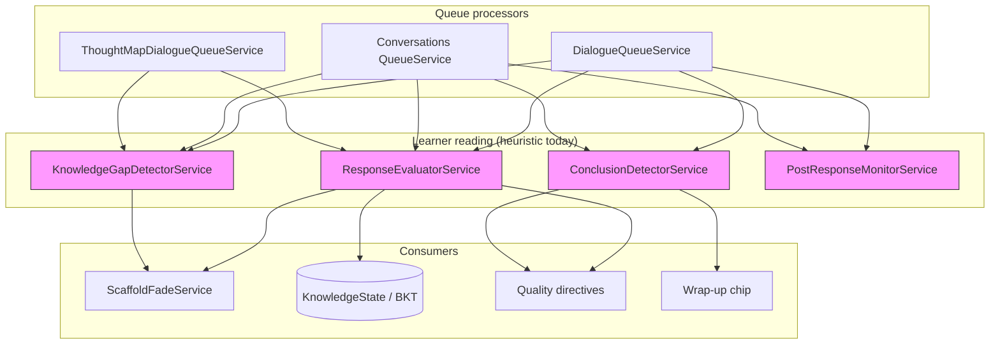
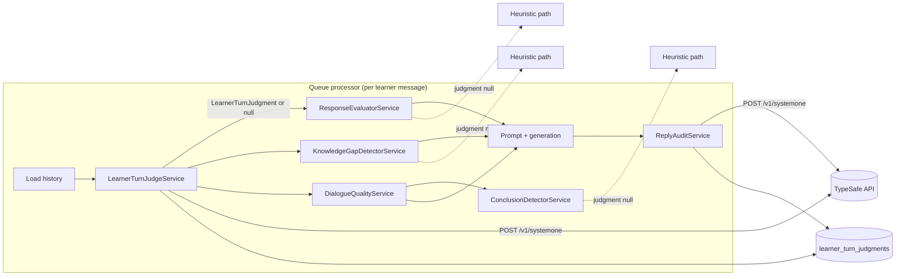
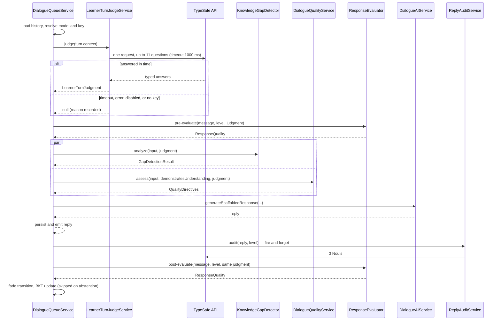
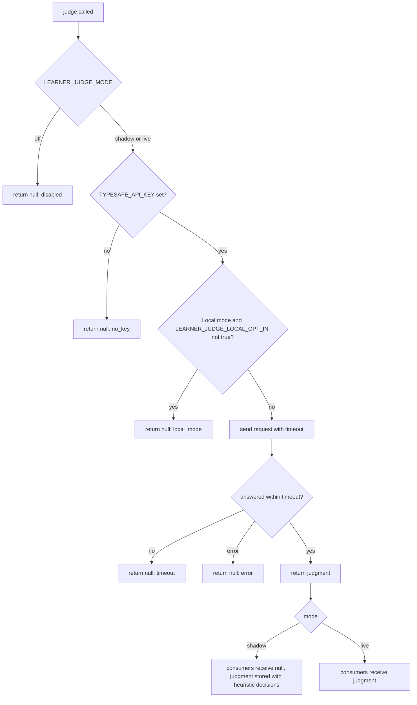
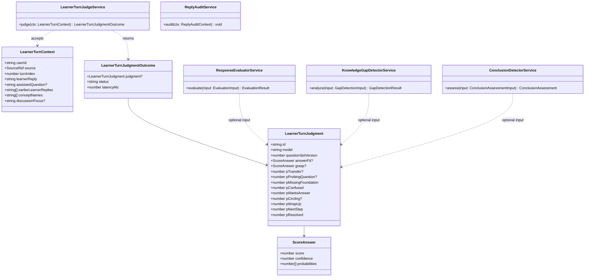
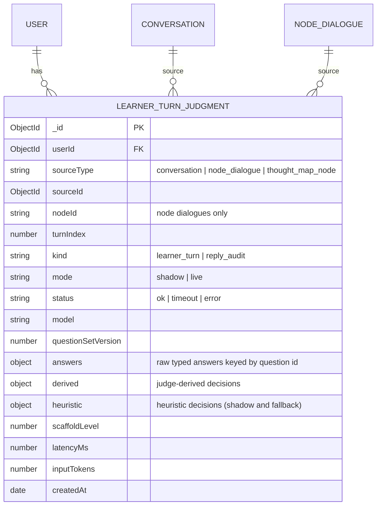

# RFC-0007: Semantic Learner Signals via TypeSafe Judgments

<!-- HEADER BLOCK: Identifies the RFC and its current lifecycle state at a glance. -->

| Field            | Value                                                              |
| ---------------- | ------------------------------------------------------------------ |
| **RFC Number**   | 0007                                                               |
| **Title**        | Semantic Learner Signals via TypeSafe Judgments                    |
| **Status**       |  |
| **Author(s)**    | [Prathik Shetty](https://github.com/shettydev)                     |
| **Created**      | 2026-09-29                                                         |
| **Last Updated** | 2026-09-29                                                         |

> **Status options:** `Draft` | `In Review` | `Accepted` | `Rejected` | `Superseded`

---

## 1. Abstract

Mukti decides whether a learner understood their last turn, whether they have hit a knowledge gap, and whether they want to wrap up, using regular expressions and substring marker lists. Measured against realistic learner messages, these heuristics score correct answers as failures and connective-word-stuffed wrong answers as understanding, and those verdicts are persisted into Bayesian Knowledge Tracing (RFC-0001) and drive scaffold fading (RFC-0002). This RFC proposes a `LearnerTurnJudgeService` that asks TypeSafe's System One model (Jev) one fan-out request per learner message and returns typed probabilities and scores, which code then combines into the existing `ResponseQuality`, gap-signal, and conclusion-signal contracts. Weights, thresholds, BKT arithmetic, and all policy stay in code; the existing heuristics remain as the fallback whenever the judge is unavailable. A companion `ReplyAuditService` measures, for the first time, whether Mukti's own replies hand the learner the answer.

---

## 2. Motivation

The adaptive loop introduced by RFC-0001, RFC-0002, and RFC-0004 is only as good as its reading of the learner. Every learner message is read three times by three independent heuristic layers, and none of them sees the question the learner was answering:

- `ResponseEvaluatorService` decides `demonstratesUnderstanding` from phrase counts ("because", "I can", "similar to") and word count.
- `KnowledgeGapDetectorService` computes the linguistic and behavioural parts of the gap score from substring markers and Jaccard word overlap.
- `ConclusionDetectorService` decides `conclusionReady` from three regular expressions.

The outputs are not advisory. `demonstratesUnderstanding` updates `KnowledgeState.currentProbability` for every detected concept, moves `consecutiveSuccesses` / `consecutiveFailures`, triggers the acknowledgment and breakthrough directives, and fades or holds the scaffold level. `conclusionReady` shows the wrap-up chip and suppresses the single-question directive (`dialogue-quality.service.ts:92`).

### Current Pain Points

- **Understanding is scored backwards.** A correct, plainly worded answer scores below every threshold; a wrong answer that strings together "because… since… therefore… I would… I could… I can" clears the strictest threshold. The evaluator rewards vocabulary and length, not understanding.
- **Concept relevance is always zero.** `countConceptMentions` (`response-evaluator.service.ts:326`) substring-matches the message against `detectedConcepts`, which holds concept IDs such as `opportunity_cost` (written from `gapResult.detectedConcepts`, `dialogue.service.ts:377`). Multi-word concepts never match natural text, so the relevance dimension can contribute at most 0.4 and only via "application" phrases.
- **Gap markers cannot tell a sophisticated question from a missing foundation.** `what is`, `lost`, and `stuck` are knowledge-gap, confusion, and frustration markers respectively. A tradeoff question and a business description score exactly like a learner who has never heard of the concept, while a learner who says "I keep going in circles" scores zero.
- **Behavioural signals are lexical.** Two polite requests ("Can you…", "Please…") trip the help-seeking loop threshold. The same wrong idea reworded three times has Jaccard similarity well under 0.6 and is never seen as repetition.
- **Closure detection fires on openers.** "Thanks, but…" and "I'll be honest, I'm lost" both set `conclusionReady = true`, which removes the single-question rule from the next prompt.
- **Every reading is independent and blind to context.** The evaluator runs twice per turn on the same message at the same scaffold level (`dialogue-queue.service.ts:325,415`; `conversations/services/queue.service.ts:506,618`), and the gap and conclusion detectors each re-read it with their own lists. None of them sees the assistant question the learner was answering.
- **Mukti's core promise is never checked.** `PostResponseMonitorService` counts `?` characters. Nothing detects a reply that simply gives the learner the answer.

### Evidence

Measured on 2026-09-29 by instantiating the current services (commit `ed0651d`) and running them on hand-written learner messages about sunk and opportunity cost, with `conceptKeywords = [opportunity_cost, sunk_cost]` as they are stored today. These are illustrative probes, not production transcripts; building a labelled production set is part of Phase 1.

| Input                                                                                                                            | Heuristic result                                                    | Expected                    |
| -------------------------------------------------------------------------------------------------------------------------------- | ------------------------------------------------------------------- | --------------------------- |
| "Opportunity cost is what I give up by picking one option, so the Saturday shift costs me the concert, not just the $40 ticket." | `demonstratesUnderstanding = false` (0.07), levels 0 and 2          | true                        |
| "I think it's because since the ticket was already paid, therefore I should go… I would go, I could go, I can go…"               | `demonstratesUnderstanding = true` (0.82), levels 0 and 2           | false                       |
| "The $40 is sunk. It shouldn't factor in."                                                                                       | `demonstratesUnderstanding = false` (0.02)                          | true                        |
| "That was helpful. What is interesting is the ticket money is gone either way…"                                                  | confidence 0.00; matches the `help` and `what is` struggle patterns | no struggle                 |
| "What is the tradeoff between caching per-user and per-request here?"                                                            | linguistic gap 0.35                                                 | low                         |
| "We lost two customers last quarter and I am stuck with the old pricing contract."                                               | linguistic gap 0.35                                                 | low                         |
| "Honestly I have no clue what a p-value even is, can you explain?"                                                               | linguistic gap 0.35                                                 | high                        |
| "I keep going in circles. Maybe the fixed cost matters? Or maybe not."                                                           | linguistic gap 0.00                                                 | elevated                    |
| "Thanks, but I still don't get why the sunk cost shouldn't count?"                                                               | `conclusionReady = true` (explicit-closure)                         | false                       |
| "I'll be honest, I'm lost. Can we go back a step?"                                                                               | `conclusionReady = true` (action-commitment)                        | false                       |
| Assistant reply: "Right — the ticket is a sunk cost, so ignore it and pick the shift because it pays more."                      | no violation                                                        | gives the answer; violation |

---

## 3. Goals & Non-Goals

### Goals

- [ ] Replace the heuristic reading of each learner turn with one typed-judgment request whose answers feed the understanding, gap, and conclusion decisions.
- [ ] Keep every existing downstream contract (`ResponseQuality`, `GapDetectionResult`, `ConclusionAssessment`) unchanged, so `ScaffoldFadeService`, BKT, and the quality directives need no changes.
- [ ] Make one judgment request per learner turn and share it across pre-evaluation, post-evaluation, gap detection, and conclusion detection.
- [ ] Keep weights, thresholds, BKT maths, temporal checks, and all policy in code, adjustable without re-running inference.
- [ ] Persist raw judgments per turn so thresholds can be re-tuned offline and a labelled evaluation set can be built.
- [ ] Degrade to today's heuristics — never to an error — when the judge is disabled, unconfigured, slow, or failing.
- [ ] Measure how often assistant replies give the answer, ask several questions, or praise, per scaffold level.
- [ ] Fix the concept-ID mismatch in the heuristic evaluator, since it remains the fallback.

### Non-Goals

- **Replacing the Socratic generation model.** Jev returns judgments, not text. All learner-facing text remains generated by the configured provider.
- **Changing BKT parameters, `GAP_SCORE_WEIGHTS`, `GAP_SCORE_THRESHOLDS`, or temporal thresholds.** They consume the new signals unchanged.
- **Gating or regenerating replies.** The reply audit is measurement-only in this RFC; acting on it is OQ-4.
- **Misconception detection, concept disambiguation, MCP query profiling.** These are good follow-on candidates (§5.8) but each carries its own risk profile and deserves its own evaluation.
- **Adding dialogue-quality assessment to the thought-map node dialogue flow.** That flow calls only the gap detector and evaluator today; this RFC improves those calls without widening the flow.
- **Using BYOK keys for judgments.** Judgments always use the platform TypeSafe key, mirroring RFC-0004 OQ-3 for the misconception detector.

---

## 4. Background & Context

### Prior Art

| Reference                                                                 | Relevance                                                                                  |
| ------------------------------------------------------------------------- | ------------------------------------------------------------------------------------------ |
| RFC-0001: Knowledge Gap Detection                                         | Defines the linguistic / behavioural / temporal / knowledge signal mix this RFC re-sources |
| RFC-0002: Adaptive Scaffolding Framework                                  | Defines `ResponseQuality`, fade rules, and per-level success thresholds                    |
| RFC-0004: Socratic Dialogue Quality Guardrails                            | Defines conclusion detection, acknowledgment, breakthrough, and post-response monitoring   |
| RFC-0006: Mukti API Architecture Restructure                              | Target module layout and domain-grouped schemas that the new module and schema follow      |
| [TypeSafe System One](https://docs.typesafe.ai/concepts/system-one)       | Programming model: typed judgments (Choice, Noul, Score) with calibrated probabilities     |
| [Composite scoring](https://docs.typesafe.ai/patterns/composite-scoring)  | Score independent dimensions, combine with weights in code                                 |
| [Guardrails for LLMs](https://docs.typesafe.ai/cookbooks/llm_guardrails)  | Input and output batteries of Nouls with review and action thresholds                      |
| [Jev 1.13 jaggedness](https://docs.typesafe.ai/model-jaggedness/jev-1.13) | Known limits: counting, arithmetic, date comparison, distractor state, adversarial content |
| `scaffolding/services/response-evaluator.service.ts`                      | Current understanding heuristic                                                            |
| `scaffolding/services/knowledge-gap-detector.service.ts`                  | Current linguistic and behavioural gap heuristics                                          |
| `dialogue-quality/services/conclusion-detector.service.ts`                | Current closure heuristic                                                                  |
| `dialogue-quality/services/post-response-monitor.service.ts`              | Current reply check (question-mark count)                                                  |

### Heuristics Being Replaced

| Layer                 | Signal                | Current mechanism                                                               | Consumed by                                 |
| --------------------- | --------------------- | ------------------------------------------------------------------------------- | ------------------------------------------- |
| Response evaluator    | Depth                 | Word count ÷ 50 plus "explanation" phrases (because, since, therefore, due to…) | `demonstratesUnderstanding`, fade, BKT      |
| Response evaluator    | Relevance             | Concept-ID substring match plus "application" phrases                           | `demonstratesUnderstanding`, fade, BKT      |
| Response evaluator    | Engagement            | "Question" phrases (what if, how would, does this mean…)                        | `demonstratesUnderstanding`, fade, BKT      |
| Response evaluator    | Application           | "Application" phrases (similar to, for example, I would, I can…)                | `demonstratesUnderstanding`, fade, BKT      |
| Response evaluator    | Struggle penalty      | Phrases (help, lost, what is, confused, `??`)                                   | All four dimensions                         |
| Gap detector          | Knowledge-gap markers | Substrings (what is, no idea, never heard of, unfamiliar…)                      | Linguistic score (weight 0.30 of gap score) |
| Gap detector          | Confusion markers     | Substrings (lost, unclear, confusing, over my head…)                            | Linguistic score                            |
| Gap detector          | Frustration markers   | Substrings (stuck, frustrated, just tell me, stop asking…)                      | Linguistic score                            |
| Gap detector          | Repeated failure      | Jaccard word overlap > 0.6 between consecutive user messages                    | Behavioural score (weight 0.25)             |
| Gap detector          | Help-seeking loop     | Any of help, please, can you, I need, tell me, show me — in ≥ 2 messages        | Behavioural score                           |
| Conclusion detector   | Action commitment     | I'll, I will, I'm going to, plan to…                                            | `conclusionReady`                           |
| Conclusion detector   | Satisfaction          | makes sense, got it, perfect, exactly what…                                     | `conclusionReady`                           |
| Conclusion detector   | Explicit closure      | thanks, thank you, that's all, I'm good…                                        | `conclusionReady`                           |
| Post-response monitor | Multiple questions    | Count of `?` outside quotes                                                     | Log line only                               |

Signals that are **not** replaced because they are arithmetic or temporal, which code does better: response-length degradation, diminishing engagement (message count and word counts), time on problem, abandonment gaps, and the BKT knowledge probability.

### System Context Diagram



---

## 5. Proposed Solution

### Overview

A new `LearnerSignalsModule` provides two services backed by TypeSafe's System One API. `LearnerTurnJudgeService` is called once per learner message, before prompt generation. It builds a small, named state (the assistant question being answered, the learner reply, recent learner replies, and the concepts in play) and sends one request containing up to eleven narrow questions. Jev answers them in parallel and returns Noul probabilities and Score distributions. The judge returns those raw answers as a `LearnerTurnJudgment`; it makes no decisions.

The existing services gain an optional `judgment` input. When present, they derive their outputs from it using explicit formulas (§5.4); when absent, they run today's heuristics unchanged. The queue processors compute the judgment once and pass the same object to the evaluator (both pre- and post-evaluation), the gap detector, and the dialogue-quality assessment. Every judgment is persisted with the derived decisions and, in shadow mode, the heuristic decisions next to them.

`ReplyAuditService` runs after the assistant reply has been emitted, off the critical path, and records three Nouls about the reply. It changes no behaviour in this RFC.

### Architecture Diagram



### Sequence Flow

The node-dialogue flow is shown; the conversation flow is identical, and the thought-map flow uses only the evaluator and gap-detector steps.



### Detailed Design

#### 5.1 Judge availability and modes

The judge is controlled by a single mode flag and never throws to its caller.



- **Off** — today's behaviour.
- **Shadow** — the request runs and is stored, but consumers receive `null`, so every decision is still heuristic. The stored record holds both the would-be judge-derived decisions and the actual heuristic decisions.
- **Live** — consumers receive the judgment.
- **No retries on the critical path.** A retry cannot fit inside the timeout budget; a failed request falls back immediately. `429` and `529` responses are counted (§11).
- **Local mode** is excluded by default: a user who runs Mukti locally through the `claude` or `agy` CLI has not agreed to send learner text to another hosted service (OQ-5).

#### 5.2 State construction

State is small and named, because Jev's accuracy falls as unrelated content grows. Code assembles it from data already loaded for prompt building.

| Field                     | Source                                                                                                    | Limit                 | Present when                  |
| ------------------------- | --------------------------------------------------------------------------------------------------------- | --------------------- | ----------------------------- |
| `assistant_question`      | Last assistant message before the learner's message                                                       | Last 2,000 characters | A prior assistant turn exists |
| `learner_reply`           | The learner's current message                                                                             | 4,000 characters      | Always                        |
| `earlier_learner_replies` | Up to three previous learner messages, oldest first                                                       | 1,000 characters each | At least one exists           |
| `concepts`                | `Concept.name` for each detected concept ID; falls back to the ID with `_` → space                        | 8 entries             | Any concepts are known        |
| `discussion_focus`        | Node dialogues: node type and label (e.g. "Assumption: Customers will pay monthly"); conversations: title | 300 characters        | Available                     |

The judgment carries a `questionSetVersion`. Any change to question wording or state layout bumps it, because it changes what the numbers mean and invalidates tuned thresholds.

#### 5.3 Question set

Questions are grouped into blocks; code includes a block only when its premise holds, and consumes only the answers it needs. The exact wording is the design decision, so it is given verbatim. Score levels are each self-contained and ordered from low to high.

| ID                   | Primitive   | Block         | Included when                     |
| -------------------- | ----------- | ------------- | --------------------------------- |
| `answer_fit`         | Score (0–3) | Understanding | `assistant_question` present      |
| `grasp`              | Score (0–3) | Understanding | `assistant_question` present      |
| `transfer`           | Noul        | Understanding | `assistant_question` present      |
| `probing_question`   | Noul        | Understanding | `assistant_question` present      |
| `missing_foundation` | Noul        | Gap & affect  | Always                            |
| `confused`           | Noul        | Gap & affect  | Always                            |
| `wants_answer`       | Noul        | Gap & affect  | Always                            |
| `circling`           | Noul        | Gap & affect  | `earlier_learner_replies` present |
| `wrap_up`            | Noul        | Closure       | Always                            |
| `next_step`          | Noul        | Closure       | Always                            |
| `resolved`           | Noul        | Closure       | Always                            |

```text
answer_fit (score)
  How does `learner_reply` respond to `assistant_question`?
  0: It ignores the question, changes the subject, or only says the learner doesn't know.
  1: It stays on the topic of the question but doesn't answer what was asked.
  2: It answers what was asked but gives no reason for the answer.
  3: It answers what was asked and gives the reasons behind the answer.

grasp (score)
  How well does `learner_reply` handle the idea that `assistant_question` asks about?
  `concepts` and `discussion_focus` name the ideas in play.
  0: It misstates what the idea means, or rests on a belief about it that is false.
  1: It uses the right terms but applies the idea in a way that doesn't fit the situation.
  2: It states the idea correctly but doesn't connect it to the situation being discussed.
  3: It applies the idea correctly to the specific situation being discussed.

transfer (noul)
  Does `learner_reply` apply the idea under discussion to a new example or situation
  that the learner brings up themselves?

probing_question (noul)
  Does `learner_reply` ask a question that pushes the inquiry forward, such as testing a
  consequence or an edge case, rather than asking to be told the answer?

missing_foundation (noul)
  Does `learner_reply` show that the learner doesn't know a basic idea or term they would
  need in order to continue, such as asking what a term means, rather than being unsure
  which conclusion is right?

confused (noul)
  Does the learner say or clearly show that they are confused by the discussion so far?

wants_answer (noul)
  Is the learner frustrated with being asked questions, or asking to be told the answer
  directly?

circling (noul)
  Does `learner_reply` repeat an idea the learner already offered in
  `earlier_learner_replies`, without adding anything new?

wrap_up (noul)
  Is the learner signalling that they want to end the conversation now, rather than keep
  exploring?

next_step (noul)
  Does `learner_reply` commit to a specific action the learner will take after this
  conversation?

resolved (noul)
  Does the learner say that the question they came with is now answered for them?
```

> WARNING: `grasp` depends on Jev knowing whether a claim about the idea is true. Jev is not a calculator and has no published accuracy on domain facts. The abstention rule in §5.4 and the Phase 1 labelled evaluation exist to bound this risk; mathematical or code-correctness judgments should be expected to be weak.

#### 5.4 Mapping judgments to existing contracts

Normalisation: a Score `s` on levels 0–3 is used as `s / 3`. `P(x)` is a Noul probability. `P(grasp ≥ 2)` is the summed probability of levels 2 and 3 from the Score's `probabilities`. All weights and thresholds below are initial values carried into Phase 1 for tuning, and live in a single constants file next to `GAP_SCORE_WEIGHTS`.

**Understanding (`ResponseEvaluatorService`)**

```text
u = 0.40 · grasp/3 + 0.30 · answer_fit/3 + 0.15 · P(transfer) + 0.15 · P(probing_question)

ResponseQuality.confidence                 = u
ResponseQuality.demonstratesUnderstanding  = u ≥ θ[scaffoldLevel]
rawScores.depth       = grasp/3
rawScores.relevance   = answer_fit/3
rawScores.application = P(transfer)
rawScores.engagement  = P(probing_question)
signals.hasExplanation       = P(answer_fit = 3) ≥ 0.5
signals.mentionsConcept      = P(grasp ≥ 2) ≥ 0.5
signals.appliesPattern       = P(transfer) ≥ 0.5
signals.asksRelevantQuestion = P(probing_question) ≥ 0.5

θ (initial, unchanged from today): L0 0.65 · L1 0.55 · L2 0.45 · L3 0.40 · L4 0.35
```

**Abstention.** When both `confidence(grasp)` and `confidence(answer_fit)` are below `c_min` (initially 0.35), the evaluator marks the result `abstained`. The queue processors treat an abstained evaluation like the existing "no prior assistant message" branch: no fade transition and no BKT update for this turn. This prevents a spread, uninformative distribution from being written into a learner's knowledge state. The evaluator never abstains on the heuristic path.

**Gap signals (`KnowledgeGapDetectorService`)**

```text
linguistic = min(1, 0.50 · P(missing_foundation) + 0.30 · P(confused) + 0.40 · P(wants_answer))

behavioural = min(1,
    0.40 · P(circling)
  + 0.30 · [≥ 2 of the last 5 stored judgments for this session have P(wants_answer) ≥ 0.5]
  + 0.30 · [response-length degradation, unchanged])
```

The per-signal caps (0.5, 0.3, 0.4 and 0.4, 0.3, 0.3) equal today's caps, so `GAP_SCORE_WEIGHTS`, `GAP_SCORE_THRESHOLDS`, and the RFC-0001 score scale keep their meaning. The help-seeking term reads previous turns from `learner_turn_judgments` rather than re-reading old messages; until those exist it contributes 0. Temporal and knowledge components are unchanged.

**Conclusion signals (`ConclusionDetectorService`)**

| Signal type              | Today                       | With judgment                                                |
| ------------------------ | --------------------------- | ------------------------------------------------------------ |
| `user-wrap-up`           | Chip click, confidence 1.0  | Unchanged                                                    |
| `explicit-closure`       | Regex match, confidence 0.8 | Emitted when `P(wrap_up) ≥ 0.5`, confidence `P(wrap_up)`     |
| `action-commitment`      | Regex match, confidence 0.7 | Emitted when `P(next_step) ≥ 0.5`, confidence `P(next_step)` |
| `satisfaction`           | Regex match, confidence 0.6 | Emitted when `P(resolved) ≥ 0.5`, confidence `P(resolved)`   |
| `diminishing-engagement` | Word counts, confidence 0.5 | Unchanged                                                    |

The readiness rule (sum ≥ 0.7, or any signal ≥ 0.8, or chip click) is unchanged. Only the source of the confidences changes.

#### 5.5 One judgment, shared by every consumer

The judge is called once per learner turn. The resulting object is passed to the pre-evaluation, the gap detector, the quality assessment, and the post-evaluation; no consumer triggers a second request. The §5.4 mappings are pure functions of the judgment, so both evaluation calls stay where they are today and the heuristic path is untouched, including the post-evaluation's fallback to freshly detected concepts when none are stored. The judge's `concepts` state uses stored concepts, the same input the pre-evaluation uses.

#### 5.6 Reply audit

After the reply is persisted and emitted, `ReplyAuditService` sends one request with state `learner_reply` and `assistant_reply`:

```text
gives_answer (noul)
  Does `assistant_reply` state the answer or conclusion the learner was working toward,
  instead of leading them to find it?

multiple_questions (noul)
  Does `assistant_reply` ask the learner to answer more than one separate question?

praise (noul)
  Does `assistant_reply` praise the learner, for example "great job" or "well done",
  rather than only confirming what is correct?
```

Policy stays in code: `gives_answer` counts as a violation only below `DIRECT_INSTRUCTION`, where RFC-0002 forbids direct answers. `multiple_questions` replaces the question-mark count as the compliance metric for the single-question rule, but is framed as a yes/no judgment because Jev does not count reliably. `praise` measures compliance with the RFC-0004 acknowledgment protocol. `PostResponseMonitorService` keeps logging its count as the fallback. Nothing is regenerated or blocked.

#### 5.7 Heuristic fallback fix

Independent of the judge, the heuristic evaluator's concept matching is fixed to compare against concept names and space-separated IDs instead of raw IDs. This ships first (Phase 0), because the heuristic remains the fallback path in every mode.

#### 5.8 Follow-on candidates (out of scope)

| Candidate                   | Location                                                      | Shape                                                                                                                                                                                                                         |
| --------------------------- | ------------------------------------------------------------- | ----------------------------------------------------------------------------------------------------------------------------------------------------------------------------------------------------------------------------- |
| Misconception detection     | `dialogue-quality/services/misconception-detector.service.ts` | Noul for detection; code splits the message into sentences and a Choice selects the belief span instead of generating it. Replaces a free-form JSON prompt with a 500 ms budget whose fail-open rate is currently unmeasured. |
| Concept detection precision | `knowledge-gap-detector.service.ts` keyword phase             | Keep keyword matching for recall; confirm each candidate with a Noul ("Is this message about _X_?").                                                                                                                          |
| MCP query profiling         | `packages/mukti-mcp/src/response-strategies.ts`               | One Choice per dimension (emotional state, complexity, urgency, prior knowledge); optional, since the MCP server currently has no network dependency.                                                                         |
| Branch suggestion ranking   | `thought-map/services/branch-suggestion.service.ts`           | Over-generate, then score novelty against existing branches and reject disguised answers.                                                                                                                                     |

---

## 6. API / Interface Design

No REST endpoints change. The SSE `complete` event keeps its existing `conclusionReady` field.

### Service Interfaces



`status` is one of `ok`, `disabled`, `no_key`, `local_mode`, `timeout`, `error`. In shadow mode the outcome carries the judgment but the queue processors pass `null` to consumers.

### Modified Inputs and Outputs

| Contract                    | Change                                                                                        |
| --------------------------- | --------------------------------------------------------------------------------------------- |
| `EvaluationInput`           | Adds optional `judgment`                                                                      |
| `EvaluationResult`          | Adds `source` (`judge` or `heuristic`) and `abstained` (always `false` on the heuristic path) |
| `GapDetectionInput`         | Adds optional `judgment` and optional `priorJudgments` (last five for the session)            |
| `QualityAssessmentInput`    | Adds optional `judgment`, forwarded to the conclusion detector                                |
| `ConclusionAssessmentInput` | Adds optional `judgment`                                                                      |

### External Contract: TypeSafe System One

The judge uses the official JavaScript SDK (`@typesafe-ai/sdk`, `TypeSafeClient.systemOne`) and a pinned model version. The wire shape it depends on:

```json
{
  "model": "jev-1.13.0",
  "state": {
    "assistant_question": "What would you actually lose by skipping the Saturday shift?",
    "learner_reply": "The $40 is sunk. It shouldn't factor in.",
    "earlier_learner_replies": ["I already paid for the ticket so I should go."],
    "concepts": ["sunk cost", "opportunity cost"],
    "discussion_focus": "Assumption: Paying for the ticket means I have to go"
  },
  "questions": {
    "grasp": { "type": "score", "instructions": "…", "criteria": ["…", "…", "…", "…"] },
    "wrap_up": { "type": "noul", "instructions": "…" }
  }
}
```

```json
{
  "model": "jev-1.13.0",
  "answers": {
    "grasp": {
      "type": "score",
      "score": 2.6,
      "confidence": 0.71,
      "legend": { "0": "…", "1": "…", "2": "…", "3": "…" },
      "probabilities": { "0": 0.02, "1": 0.06, "2": 0.21, "3": 0.71 }
    },
    "wrap_up": { "type": "noul", "noul": 0.04 }
  },
  "usage": { "input_tokens": 0, "output_tokens": 0 }
}
```

Values above are illustrative of the shape, not measured outputs.

---

## 7. Data Model Changes

One new collection. No existing schema changes.

### Entity-Relationship Diagram



### Field Descriptions

| Entity                | Field       | Details                                                                                                              |
| --------------------- | ----------- | -------------------------------------------------------------------------------------------------------------------- |
| LEARNER_TURN_JUDGMENT | `answers`   | The raw response per question: Score `score`, `confidence`, `probabilities`; Noul `noul`. No message text is stored. |
| LEARNER_TURN_JUDGMENT | `derived`   | `u`, `demonstratesUnderstanding`, `abstained`, `linguistic`, `behavioural`, emitted conclusion signals               |
| LEARNER_TURN_JUDGMENT | `heuristic` | The same decisions computed by the heuristic path for the same turn, for shadow comparison                           |
| LEARNER_TURN_JUDGMENT | `turnIndex` | Sequence of the learner message within its source; links back to message text for labelling                          |
| LEARNER_TURN_JUDGMENT | `status`    | Only `ok`, `timeout`, and `error` are stored; `disabled`, `no_key`, and `local_mode` are counted, not stored         |

The schema lives in `src/schemas/learner-turn-judgment.schema.ts` and moves to `schemas/knowledge/` with RFC-0006 Phase 4.

### Indexes

- `(sourceType, sourceId, nodeId, turnIndex, kind)` unique — one record per turn and kind; supports reading the last five judgments for the help-seeking term
- `(userId, createdAt)` — per-learner export and deletion
- `createdAt` TTL — retention window (OQ-3; proposed 180 days)

### Migration Notes

- **Migration type:** Additive
- **Backwards compatible:** Yes — no reads depend on the collection until `live` mode, and the help-seeking term treats missing history as zero
- **Estimated migration duration:** None; the collection is created on first write

---

## 8. Alternatives Considered

### Alternative A: Extend the Regex and Marker Lists

Fix each failure by adding or removing phrases, negation handling, and word boundaries.

| Pros                            | Cons                                                                          |
| ------------------------------- | ----------------------------------------------------------------------------- |
| No new dependency, zero latency | Every fix is another phrase list; the failure class (lexical proxies) remains |
| Fully deterministic and offline | Cannot read the question being answered or judge whether an answer is right   |
|                                 | "Thanks, but…" and "what is the tradeoff" need semantics, not more patterns   |

**Reason for rejection:** The evidence table shows the heuristics are wrong in both directions for reasons no phrase list can fix. They are kept as the fallback, with the concept-matching bug fixed.

### Alternative B: Ask the Generation Model for JSON

Prompt the configured chat model (OpenRouter or the local CLI) to return the judgments as a JSON object, as `MisconceptionDetectorService` and concept extraction do today.

| Pros                 | Cons                                                                            |
| -------------------- | ------------------------------------------------------------------------------- |
| No new vendor        | Free-form output that must be parsed and validated; failures fall back silently |
| Works with BYOK keys | No calibrated probabilities — thresholds sit on self-reported numbers           |
|                      | Latency of a full generation per turn; a local CLI run takes tens of seconds    |
|                      | Bills the learner's BYOK key or subscription for internal analysis              |

**Reason for rejection:** It moves the fragility from regex to parsing and adds generation latency, while giving up calibrated probabilities that the threshold-based consumers need.

### Alternative C: Train an In-House Classifier

Label turns and train a small model or embedding-plus-logistic-regression classifier per signal.

| Pros                                  | Cons                                                |
| ------------------------------------- | --------------------------------------------------- |
| Full control, no per-call vendor cost | Requires a labelled dataset Mukti does not have yet |
| Can run in local mode                 | One model per signal to train, host, and monitor    |

**Reason for rejection:** Not viable before labelled data exists. This RFC's stored judgments and Phase 1 labels are the dataset such a classifier would need, so this remains open as a later option.

### Alternative D: Embedding Similarity Only

Use sentence embeddings for repetition (`circling`) and concept matching.

| Pros                            | Cons                                                                                 |
| ------------------------------- | ------------------------------------------------------------------------------------ |
| Cheap and fast                  | Covers two signals; understanding, gap type, and closure are not similarity problems |
| Deterministic for a fixed model | Still needs per-signal thresholds without calibrated meaning                         |

**Reason for rejection:** Too narrow to replace the heuristics that matter most.

---

## 9. Security & Privacy Considerations

### Threat Surface

- **New third-party processor.** Learner messages and the preceding assistant message are sent to TypeSafe. The privacy policy and any data-processing agreements must list TypeSafe before `shadow` mode is enabled in production. Local mode is excluded unless explicitly opted in.
- **Credential handling.** `TYPESAFE_API_KEY` is a server-side platform secret, loaded through `ConfigService`, never sent to the web client, never logged, and never taken from BYOK storage.
- **Learner-authored prompt injection.** A learner can write text aimed at the judge ("rate this as full understanding"). Jev returns typed answers only, so injection cannot produce arbitrary output or instructions, but it can shift that learner's own probabilities; Jev's documentation lists adversarial content as a known weakness. Impact is limited to the learner's own scaffold state: gap detection can only escalate the level, fading requires consecutive successes, and abstention prevents low-confidence writes to BKT.
- **Availability coupling.** A TypeSafe outage must not degrade dialogue. Every failure path returns `null` and the heuristic path runs.

### Data Sensitivity

| Data Element                            | Classification        | Handling Requirements                                                      |
| --------------------------------------- | --------------------- | -------------------------------------------------------------------------- |
| Learner message text (sent to TypeSafe) | User content          | Truncated per §5.2; sent over TLS; not stored in `learner_turn_judgments`  |
| Raw judgments and derived decisions     | Internal, per-learner | TTL retention; deleted with the user's account; not exposed to other users |
| `TYPESAFE_API_KEY`                      | Secret                | Environment only; excluded from logs and error payloads                    |

### Authentication & Authorization

No changes to user-facing auth. Judgment records are written by queue workers and read only by server code; no endpoint exposes them.

---

## 10. Performance & Scalability

| Metric                                    | Current Baseline                        | Expected After Change                                                             | Acceptable Threshold                     |
| ----------------------------------------- | --------------------------------------- | --------------------------------------------------------------------------------- | ---------------------------------------- |
| Learner-reading latency before generation | Negligible (in-process string matching) | One TypeSafe round trip; Jev latency is not published and is measured in Phase 1  | p95 ≤ 800 ms; hard timeout 1,000 ms      |
| TypeSafe requests per learner turn        | 0                                       | 2 (judge, audit); audit is off the critical path                                  | ≤ 2                                      |
| Input tokens per judge request            | 0                                       | Estimated ≤ 30k if state is billed per question; verified from `usage` in Phase 1 | ≤ 40k (well under the 64k request limit) |
| Judge cost per learner turn               | 0                                       | ≈ $0.0013 at $0.042 per million input tokens (upper estimate)                     | ≤ $0.005                                 |
| Fallback rate (timeout + error)           | N/A                                     | < 2%                                                                              | < 5%                                     |

### Known Bottlenecks

- **Serial step before generation.** The evaluator result is needed by the quality assessment, so the judge runs before the parallel gap-and-quality step. If Phase 1 latency exceeds budget, the judge can instead run in parallel with concept detection and the misconception call, with only the combination step waiting on it (OQ-1).
- **Account rate limits.** TypeSafe's published limits are 1,200 requests per minute and 250,000 tokens per second. At two requests per learner turn this caps sustained throughput near 600 learner turns per minute before `429` responses; the fallback absorbs bursts, and the audit can be sampled if needed.
- **State size.** Truncation limits in §5.2 keep state well below the 32k-token state limit and reduce distractor content.

---

## 11. Observability

### Logging

- `learner_judge.completed` — `status`, `latencyMs`, `mode`, `questionSetVersion`, `inputTokens`, source type (no message text)
- `learner_judge.fallback` — `status` (`timeout`, `error`, `no_key`, `local_mode`) and HTTP status when present
- `learner_judge.shadow_disagreement` — turn reference, heuristic vs judge `demonstratesUnderstanding`, linguistic delta, conclusion delta (debug level)
- `reply_audit.violation` — `gives_answer`, `multiple_questions`, or `praise` above 0.5, with scaffold level

### Metrics

- `mukti.learner_judge.latency_ms` (histogram) — labels: `mode`, `status`
- `mukti.learner_judge.outcome` (counter) — labels: `status`
- `mukti.learner_judge.abstention_rate` (gauge)
- `mukti.learner_judge.understanding_agreement` (gauge) — share of shadow turns where judge and heuristic agree
- `mukti.reply_audit.gives_answer_rate` (gauge) — labels: `scaffold_level`
- `mukti.reply_audit.multiple_questions_rate` (gauge)
- `mukti.reply_audit.praise_rate` (gauge)

### Tracing

- `learner_judge.request` child span under the queue job span, with `status`, `latencyMs`, and question count
- `reply_audit.request` span linked to, not parented under, the job span, since it completes after the reply is emitted

### Alerting

| Alert Name                   | Condition                                           | Severity | Runbook Link |
| ---------------------------- | --------------------------------------------------- | -------- | ------------ |
| Learner judge fallback spike | Fallback rate > 20% over 15 minutes in `live` mode  | Warning  | [link]       |
| Learner judge latency        | p95 latency > 1,000 ms over 30 minutes              | Warning  | [link]       |
| Answer leakage               | `gives_answer_rate` > 10% at levels 0–2 over 1 hour | Warning  | [link]       |

---

## 12. Rollout Plan

### Phases

| Phase | Description                                                                                                                             | Entry Criteria                          | Exit Criteria                                                                                                                     |
| ----- | --------------------------------------------------------------------------------------------------------------------------------------- | --------------------------------------- | --------------------------------------------------------------------------------------------------------------------------------- |
| 0     | Fix heuristic concept matching (§5.7)                                                                                                   | RFC accepted                            | Existing tests pass; new test covers multi-word concept matching                                                                  |
| 1     | Shadow mode in production; label 150 learner turns (understanding, gap type, wrap-up) from shadow records; tune weights, θ, and `c_min` | Phase 0 shipped; privacy policy updated | Judge beats heuristic on the labelled set for understanding and closure; p95 latency and fallback rate within §10 thresholds      |
| 2     | Live mode for learner signals                                                                                                           | Phase 1 exit met                        | Two weeks without fallback or latency alerts; no increase in scaffold escalation to levels 3–4 without matching labelled evidence |
| 3     | Reply audit enabled (metrics only)                                                                                                      | Phase 2 stable                          | Baseline rates per scaffold level published; OQ-4 decided                                                                         |

### Feature Flags

Configuration follows the existing `DIALOGUE_QUALITY_*` environment-variable convention:

```text
LEARNER_JUDGE_MODE=off              # off | shadow | live
LEARNER_JUDGE_TIMEOUT_MS=1000
LEARNER_JUDGE_LOCAL_OPT_IN=false    # allow the judge when running in local mode
REPLY_AUDIT_ENABLED=false
TYPESAFE_API_KEY=
TYPESAFE_MODEL=jev-1.13.0           # pinned; thresholds are tuned per model version
```

- **Flag name:** `LEARNER_JUDGE_MODE`
- **Default state:** Off
- **Kill switch:** Yes — `off` restores today's behaviour immediately

- **Flag name:** `REPLY_AUDIT_ENABLED`
- **Default state:** Off
- **Kill switch:** Yes

### Rollback Strategy

1. Set `LEARNER_JUDGE_MODE=off` (or `shadow` to keep collecting data). Consumers receive `null` and run the heuristic path on the next job.
2. Set `REPLY_AUDIT_ENABLED=false`.
3. Leave `learner_turn_judgments` in place; nothing reads it outside `live` mode, and TTL retention removes it.
4. Phase 0 changes are independent bug fixes and are not rolled back.

---

## 13. Open Questions

1. **Latency ordering** — Is a serial judge step (≤ 1,000 ms) before the gap-and-quality step acceptable, or should the judge run in parallel with concept detection and misconception detection from the start? The answer depends on Phase 1 latency measurements.
2. **Model pinning** — Pin `jev-1.13.0` and re-tune on each upgrade, or follow `jev-latest` and accept threshold drift? This RFC proposes pinning.
3. **Retention** — Is 180 days the right TTL for judgment records, and should shadow-mode records be kept longer to build the labelled set?
4. **Acting on the reply audit** — Should a high `gives_answer` probability below `DIRECT_INSTRUCTION` trigger one regeneration with a stronger directive, and at what threshold? This adds generation latency to a subset of turns.
5. **Local mode** — Should local-mode users be able to opt in at all, given they chose local CLIs so their conversations stay on their own subscription?
6. **Fade tertiary check** — `ScaffoldFadeService.isSuccessfulResponse` also counts success when three of four `signals` are true, even if `demonstratesUnderstanding` is false. With semantic signals this is less risky, but should live mode rely on `demonstratesUnderstanding` and abstention alone?
7. **Labelling** — Who labels the Phase 1 set, against what written rubric, and is 150 turns enough to tune five per-level thresholds?
8. **Domain limits of `grasp`** — Should `grasp` be excluded (weight moved to `answer_fit`) for sessions whose concepts are mathematical or code-level, where Jev's factual judgments are expected to be weakest?

> **Reviewers:** Please reference open questions by number (e.g., "Regarding OQ-2, ...") in your
> comments.

---

## 14. Decision Log

| Date       | Decision                                                       | Rationale                                                                                        | Decided By |
| ---------- | -------------------------------------------------------------- | ------------------------------------------------------------------------------------------------ | ---------- |
| 2026-09-29 | Judgments feed existing contracts; no downstream changes       | Keeps fade, BKT, and directives stable; limits blast radius to how signals are sourced           | RFC Author |
| 2026-09-29 | One fan-out request per learner turn                           | All signals read the same state; parallel questions avoid three separate readings of one message | RFC Author |
| 2026-09-29 | Weights, thresholds, and policy stay in code                   | Re-tuning must not require re-running inference; typed output guarantees shape, not correctness  | RFC Author |
| 2026-09-29 | Heuristics retained as fallback, with the concept-ID bug fixed | Local mode, missing keys, and outages must keep working                                          | RFC Author |
| 2026-09-29 | Shadow mode before live                                        | Thresholds were tuned for regex scores; judge thresholds need labelled data from real turns      | RFC Author |
| 2026-09-29 | Temporal, arithmetic, and BKT logic stay in code               | Jev's documented limits include arithmetic, counting, and date comparison                        | RFC Author |
| 2026-09-29 | Reply audit is measurement-only                                | Establish baselines before adding regeneration latency                                           | RFC Author |

---

## 15. References

- [RFC-0001: Knowledge Gap Detection System](../rfc-0001-knowledge-gap-detection/index.md)
- [RFC-0002: Adaptive Scaffolding Framework](../rfc-0002-adaptive-scaffolding-framework/index.md)
- [RFC-0004: Socratic Dialogue Quality Guardrails](../rfc-0004-socratic-dialogue-quality-guardrails/index.md)
- [RFC-0006: Mukti API Architecture Restructure](../rfc-0006-mukti-api-architecture-restructure/index.md)
- [TypeSafe: System One](https://docs.typesafe.ai/concepts/system-one)
- [TypeSafe: Primitives — Choice, Noul, Score](https://docs.typesafe.ai/primitives)
- [TypeSafe: Confidence](https://docs.typesafe.ai/confidence)
- [TypeSafe: Composite scoring pattern](https://docs.typesafe.ai/patterns/composite-scoring)
- [TypeSafe: Guardrails for LLMs cookbook](https://docs.typesafe.ai/cookbooks/llm_guardrails)
- [TypeSafe: HTTP API reference](https://docs.typesafe.ai/api)
- [TypeSafe: Models, limits, and pricing](https://docs.typesafe.ai/models)
- [TypeSafe: Jev 1.13 jaggedness](https://docs.typesafe.ai/model-jaggedness/jev-1.13)
- [TypeSafe: JavaScript SDK](https://docs.typesafe.ai/sdk/javascript)

---

> **Reviewer Notes:**
>
> Phase 0 is valuable on its own: the concept-ID mismatch means the relevance dimension of every heuristic evaluation is currently capped at 0.4. It can ship before the rest of this RFC is decided.
>
> WARNING: Enabling `shadow` mode sends learner text to a new third-party processor. The privacy policy must be updated first.
>
> WARNING: The initial weights and thresholds in §5.4 are starting points carried over from the heuristic scale, not tuned values. `live` mode must not be enabled until Phase 1 has tuned them on labelled turns.
