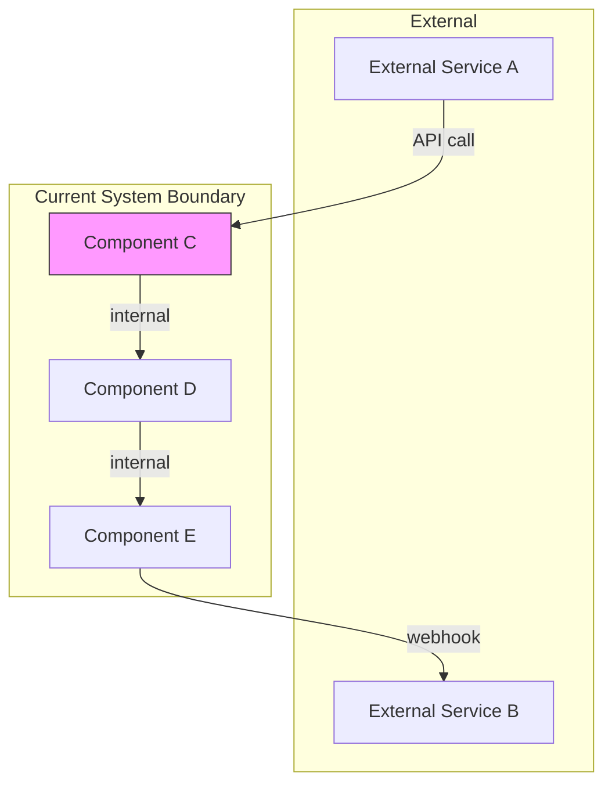
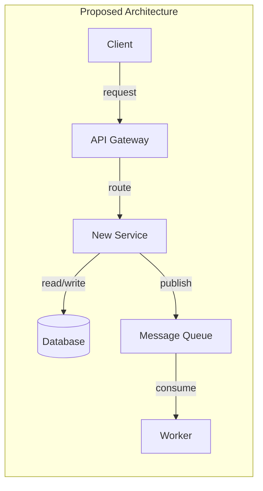
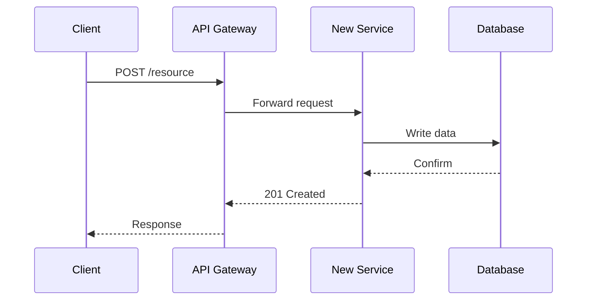
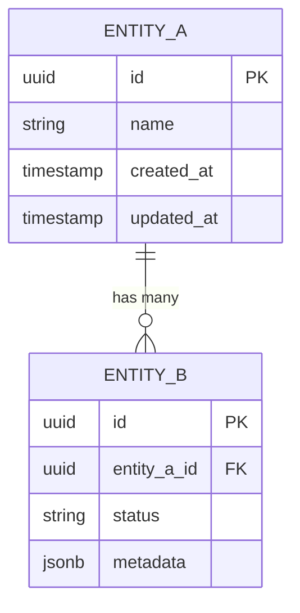

# RFC-NNNN: [Title of Proposal]

<!-- HEADER BLOCK: Identifies the RFC and its current lifecycle state at a glance. -->

| Field            | Value                                                              |
| ---------------- | ------------------------------------------------------------------ |
| **RFC Number**   | NNNN                                                               |
| **Title**        | [Descriptive title of the proposal]                                |
| **Status**       |  |
| **Author(s)**    | [Prathik Shetty](https://github.com/shettydev)                     |
| **Created**      | YYYY-MM-DD                                                         |
| **Last Updated** | YYYY-MM-DD                                                         |

> **Status options:** `Draft` | `In Review` | `Accepted` | `Rejected` | `Superseded`

---

## 1. Abstract

<!-- PURPOSE: Provide a concise summary so readers can decide whether to read the full RFC. -->

_Write a 3-5 sentence summary of the entire proposal. State what is being proposed, why it matters,
and the expected outcome. A reader should be able to understand the core idea without reading any
other section._

---

## 2. Motivation

<!-- PURPOSE: Establish the problem space and justify why this RFC exists. -->

_Describe the problem this proposal addresses. Explain the current pain points, who is affected, and
what happens if this problem is not solved. Use concrete examples, data, or incident references where
possible._

### Current Pain Points

- **[Pain Point 1]:** [Description of the issue and its impact.]
- **[Pain Point 2]:** [Description of the issue and its impact.]
- **[Pain Point 3]:** [Description of the issue and its impact.]

---

## 3. Goals & Non-Goals

<!-- PURPOSE: Set explicit boundaries so reviewers know exactly what is and is not in scope. -->

### Goals

_List the specific, measurable outcomes this RFC aims to achieve._

- [ ] [Goal 1]
- [ ] [Goal 2]
- [ ] [Goal 3]

### Non-Goals

_List items that are explicitly out of scope. Non-goals are mandatory -- they prevent scope creep and
set reviewer expectations._

- [Non-Goal 1]: [Brief explanation of why this is out of scope.]
- [Non-Goal 2]: [Brief explanation of why this is out of scope.]
- [Non-Goal 3]: [Brief explanation of why this is out of scope.]

---

## 4. Background & Context

<!-- PURPOSE: Provide the historical and technical context a reviewer needs to evaluate this proposal. -->

_Describe prior art, existing systems, and relevant history. Reference previous RFCs, ADRs, or
external standards that inform this proposal. Include enough context that a new team member could
understand the landscape._

### Prior Art

| Reference            | Relevance                         |
| -------------------- | --------------------------------- |
| [Link or RFC number] | [How it relates to this proposal] |
| [Link or RFC number] | [How it relates to this proposal] |

### System Context Diagram

_The following diagram shows where the proposed change fits within the current system architecture._



---

## 5. Proposed Solution

<!-- PURPOSE: Present the detailed technical design that addresses the motivation. -->

_Describe the proposed solution in sufficient detail for an engineer to implement it. Include
architectural decisions, data flow, component interactions, and any new abstractions introduced.
Be specific about what changes and what stays the same._

### Overview

_High-level description of the approach (2-3 paragraphs)._

### Architecture Diagram



### Sequence Flow

_Describe the primary interaction flow for the most common use case._



### Detailed Design

_Break down the implementation into discrete, reviewable sections. Use sub-headings for each
significant component or behavior change._

#### 5.1 [Component / Subsystem Name]

_Description of changes to this component._

#### 5.2 [Component / Subsystem Name]

_Description of changes to this component._

---

## 6. API / Interface Design

<!-- PURPOSE: Define the contracts other systems or developers will depend on. -->

_Document any new or modified APIs, schemas, endpoints, CLI commands, or component interfaces.
If this RFC does not introduce public interfaces, state "Not applicable" and explain why._

### Endpoints

#### `POST /api/v1/resource`

_Brief description of what this endpoint does._

**Request:**

```json
{
  "field_a": "string (required) -- Description of field_a.",
  "field_b": 0,
  "field_c": {
    "nested": "value"
  }
}
```

**Response (201 Created):**

```json
{
  "id": "uuid",
  "field_a": "string",
  "created_at": "ISO-8601 timestamp"
}
```

**Error Responses:**

| Status Code | Description             |
| ----------- | ----------------------- |
| 400         | Invalid request body    |
| 401         | Authentication required |
| 409         | Resource already exists |
| 500         | Internal server error   |

---

## 7. Data Model Changes

<!-- PURPOSE: Document schema changes so reviewers can assess data migration risk and storage impact. -->

_Describe any new tables, columns, indexes, or modifications to existing data models. If no data
model changes are required, state "Not applicable" and explain why._

### Entity-Relationship Diagram



### Migration Notes

_Describe the migration strategy: additive-only, backwards-compatible, requires downtime, etc._

- **Migration type:** [Additive / Destructive / Mixed]
- **Backwards compatible:** [Yes / No -- explain if No]
- **Estimated migration duration:** [e.g., < 1 minute for current dataset size]

---

## 8. Alternatives Considered

<!-- PURPOSE: Show that other approaches were evaluated, building confidence in the chosen solution. -->

_List at least two alternatives. For each, describe the approach, its pros and cons, and the reason
it was not selected._

### Alternative A: [Name]

_Brief description of this approach._

| Pros    | Cons    |
| ------- | ------- |
| [Pro 1] | [Con 1] |
| [Pro 2] | [Con 2] |

**Reason for rejection:** _[Explain why this alternative was not chosen.]_

### Alternative B: [Name]

_Brief description of this approach._

| Pros    | Cons    |
| ------- | ------- |
| [Pro 1] | [Con 1] |
| [Pro 2] | [Con 2] |

**Reason for rejection:** _[Explain why this alternative was not chosen.]_

---

## 9. Security & Privacy Considerations

<!-- PURPOSE: Identify threats and data sensitivity so the team can assess risk before implementation. -->

_Describe the security and privacy implications of this proposal. If there are none, state "No new
security or privacy implications" and explain why._

### Threat Surface

- **[Threat 1]:** [Description and mitigation.]
- **[Threat 2]:** [Description and mitigation.]

### Data Sensitivity

| Data Element       | Classification | Handling Requirements            |
| ------------------ | -------------- | -------------------------------- |
| [e.g., user email] | PII            | Encrypted at rest, access-logged |
| [e.g., session ID] | Sensitive      | Short TTL, not logged            |

### Authentication & Authorization

_Describe any changes to auth flows, permissions, or access control._

---

## 10. Performance & Scalability

<!-- PURPOSE: Quantify expected load and identify bottlenecks before they reach production. -->

_Describe the expected performance characteristics and scalability limits of the proposed solution.
Include benchmarks, load estimates, or capacity projections where available._

| Metric              | Current Baseline | Expected After Change | Acceptable Threshold |
| ------------------- | ---------------- | --------------------- | -------------------- |
| [e.g., p99 latency] | [value]          | [value]               | [value]              |
| [e.g., throughput]  | [value]          | [value]               | [value]              |

### Known Bottlenecks

- **[Bottleneck 1]:** [Description and mitigation plan.]

---

## 11. Observability

<!-- PURPOSE: Ensure the change is operable in production with adequate logging, metrics, and alerts. -->

_Describe how the system will be monitored after this change is deployed. Cover logging, metrics,
tracing, and alerting._

### Logging

- [Describe new log events, log levels, and structured fields.]

### Metrics

- [List new metrics to be emitted, their type (counter, gauge, histogram), and labels.]

### Tracing

- [Describe new spans or changes to existing trace propagation.]

### Alerting

| Alert Name | Condition                      | Severity | Runbook Link |
| ---------- | ------------------------------ | -------- | ------------ |
| [Alert 1]  | [e.g., error rate > 5% for 5m] | Critical | [link]       |

---

## 12. Rollout Plan

<!-- PURPOSE: Define a safe, incremental deployment strategy with clear rollback procedures. -->

_Describe how this change will be deployed to production. Include phases, feature flags, migration
steps, and rollback strategy._

### Phases

| Phase | Description                  | Entry Criteria | Exit Criteria |
| ----- | ---------------------------- | -------------- | ------------- |
| 1     | [e.g., Internal dogfood]     | [condition]    | [condition]   |
| 2     | [e.g., 10% canary]           | [condition]    | [condition]   |
| 3     | [e.g., General availability] | [condition]    | [condition]   |

### Feature Flags

- **Flag name:** `[flag_name]`
- **Default state:** Off
- **Kill switch:** [Yes / No]

### Rollback Strategy

_Describe the steps to revert this change if a critical issue is discovered post-deployment._

1. [Step 1]
2. [Step 2]
3. [Step 3]

---

## 13. Open Questions

<!-- PURPOSE: Surface unresolved decisions so reviewers can focus discussion on what still needs input. -->

_List all unresolved questions that require discussion or decisions before this RFC can be accepted.
Number each question for easy reference in review comments._

1. **[Question]** -- [Context or constraints relevant to answering this question.]
2. **[Question]** -- [Context or constraints relevant to answering this question.]
3. **[Question]** -- [Context or constraints relevant to answering this question.]

> **Reviewers:** Please reference open questions by number (e.g., "Regarding OQ-2, ...") in your
> comments.

---

## 14. Decision Log

<!-- PURPOSE: Create an audit trail of decisions made during the RFC review process. -->

_Record decisions as they are made during the review process. This table serves as an audit trail._

| Date       | Decision               | Rationale              | Decided By     |
| ---------- | ---------------------- | ---------------------- | -------------- |
| YYYY-MM-DD | [Decision description] | [Why this was decided] | [Name / Group] |

---

## 15. References

<!-- PURPOSE: Link to all related materials so reviewers can access full context without searching. -->

_List all related RFCs, issues, documentation, ADRs, and external resources._

- [RFC-XXXX: Related RFC Title](link)
- [Issue #NNN: Related Issue Title](link)
- [ADR-NNN: Related Architecture Decision](link)
- [External: Relevant specification or article](link)

---

> **Reviewer Notes:**
>
> Use `> blockquote` syntax for inline reviewer callout notes throughout the document.
>
> Use the prefix `WARNING:` for known risks, e.g.:
>
> WARNING: This migration is not backwards-compatible and requires a maintenance window.
