# Mukti Data Modelling

## Introduction

This document provides an overview of the data modelling process in Mukti. And what better way to understand it than by visualizing the data models?

Mukti uses Entity-Relationship Diagrams (ERDs) to represent data models. An ERD is a visual representation of the entities and their relationships in a database.

  

## Data Models

So, let's dive into the details of how Mukti handles data models.

### Core Schemas

1. **User** (`user.schema.ts`)
   - User accounts and authentication
   - Role-based access control (RBAC): user, moderator, admin
   - Preferences and profile information
   - Account status management

2. **Subscription** (`subscription.schema.ts`)
   - User subscription management
   - Usage tracking with atomic operations
   - Tier-based limits (free/paid)
   - Billing and payment tracking (payment-provider agnostic)

3. **Conversation** (`conversation.schema.ts`)
   - Socratic dialogue sessions
   - Hybrid message storage (recent + archived)
   - Conversation history
   - Public sharing of dialogues

4. **ArchivedMessage** (`archived-message.schema.ts`)
   - Scalable message storage
   - Sequence-based retrieval
   - Full-text search support
   - Load conversation history on demand

### Community Schemas

5. **Resource** (`resource.schema.ts`)
   - User-contributed resources
   - Denormalized vote counts
   - Moderation workflow
   - Community resource sharing

6. **Technique** (`technique.schema.ts`)
   - Allow users to create custom dialogue styles
   - Community-curated techniques library
   - Built-in techniques for socratic questioning
   - Moderation of user-submitted techniques

7. **Vote** (`vote.schema.ts`)
   - Voting system for resources/techniques
   - One vote per user per target
   - Quality ranking

8. **SharedLink** (`shared-link.schema.ts`)
   - Conversation sharing
   - View tracking and limits (e.g., expires in 7 days or max 100 views)
   - Password protected sharing
   - Track links analytics

### Analytics Schemas

9. **UsageEvent** (`usage-event.schema.ts`)
   - Real-time event tracking
   - TTL: 90 days auto-cleanup
   - Billing calculation (token usage x cost)
   - Audit logs

10. **DailyUsageAggregate** (`daily-usage-aggregate.schema.ts`)
    - Cost and token tracking ("You've used 1,234 tokens today")
    - Monthly billing reports
    - Usage charts/graphs

### Infrastructure Schemas

11. **RequestQueue** (`request-queue.schema.ts`)
    - Free tier request queuing (e.g., 10 questions/hour, 50/day)
    - Paid tier request queuing (e.g., 100 questions/hour, 500/day)
    - Priority-based processing
    - Retry logic

12. **RateLimit** (`rate-limit.schema.ts`)
    - Rate limiting storage
    - Anti-spam measures
    - DoS protection
    - Sliding window algorithm
    - Auto-expiration via TTL

## Data Flow

Now that we have established the schemas for our data models, let's understand how they interact with each other and how they flow through the system.

```mermaid
flowchart TB
    subgraph Client["🌐 Client Layer"]
        Start([User submits question]) --> API[API Gateway<br/>POST /conversations/:id/messages]
    end

    subgraph AuthZ["🔐 Authorization & Rate Limiting"]
        API --> RateLimitCheck{Rate Limit Check}
        RateLimitCheck -->|Exceeded| RateLimitError[❌ HTTP 429<br/>Rate Limit Exceeded<br/>Retry-After: windowEnd]
        RateLimitCheck -->|OK| ConsumeQuota[✓ Consume Quota<br/>Decrement remaining]

        ConsumeQuota --> SubCheck[Get Subscription Tier<br/>Calculate Priority]
    end

    RateLimitError --> EndError([🛑 End])

    subgraph Queueing["📋 Asynchronous Queue Layer"]
        SubCheck --> Enqueue[Enqueue Request<br/>status: PENDING<br/>priority: tier-based]
        Enqueue --> QueueResponse[HTTP 202 Accepted<br/>Location: /queue/:requestId<br/>Position: N]
    end

    QueueResponse --> EndAccepted([✓ Request Queued])

    subgraph WorkerPool["⚙️ Background Worker Pool"]
        direction TB
        Poll([Worker Polling]) -.->|Every 100ms| Dequeue[Dequeue Next Request<br/>Priority: DESC<br/>QueuedAt: ASC]

        Dequeue --> AcquireLock[Acquire Distributed Lock<br/>status: PENDING → PROCESSING]

        AcquireLock --> LoadContext[Load Context<br/>• Conversation history<br/>• Technique template<br/>• User preferences]
    end

    subgraph AIProcessing["🤖 AI Processing Layer"]
        direction TB
        LoadContext --> BuildPrompt[Build Prompt<br/>• Apply technique systemPrompt<br/>• Inject conversation context<br/>• Apply questioning style]

        BuildPrompt --> CallLLM[Call LLM API<br/>Model: tier-based<br/>Timeout: 30s]

        CallLLM --> LLMResponse{Response Status}

        LLMResponse -->|Error| ErrorHandler[Error Handler<br/>Log error details]
        LLMResponse -->|Success| ParseResponse[Parse Response<br/>Extract: content, tokens, cost]
    end

    subgraph RetryLogic["🔄 Retry Logic"]
        ErrorHandler --> CheckRetries{Retry Count<br/>< Max Retries?}
        CheckRetries -->|Yes| BackoffDelay[Exponential Backoff<br/>delay = 2^retryCount * 1000ms]
        BackoffDelay --> Requeue[Requeue Request<br/>status: PENDING<br/>retryCount++]
        CheckRetries -->|No| MarkFailed[Mark as FAILED<br/>Notify user via webhook]

        Requeue -.->|Re-enter queue| Poll
    end

    MarkFailed --> EndFailed([⚠️ Failed])

    subgraph DataPersistence["💾 Data Persistence Layer"]
        direction TB
        ParseResponse --> TxBegin[Begin Transaction]

        TxBegin --> UpdateConv[Update Conversation<br/>• Append to recentMessages<br/>• Increment messageCount<br/>• Update metadata]

        UpdateConv --> CheckSize{Message Array<br/>> 50 items?}

        CheckSize -->|Yes| Archive[Archive Oldest Messages<br/>• Move to ArchivedMessage<br/>• Keep last 50 in memory<br/>• Set hasArchivedMessages flag]
        CheckSize -->|No| SkipArchive[Skip Archival]

        Archive --> UpdateQueueStatus
        SkipArchive --> UpdateQueueStatus

        UpdateQueueStatus[Update Request Queue<br/>status: COMPLETED<br/>completedAt: timestamp<br/>result: messageId, tokens]

        UpdateQueueStatus --> TxCommit[Commit Transaction]
    end

    subgraph Analytics["📊 Analytics & Telemetry Layer"]
        direction TB
        TxCommit --> AsyncLog[Async Event Logging]

        AsyncLog --> LogEvent[UsageEvent<br/>• eventType: QUESTION<br/>• tokens, cost, latency<br/>• model, technique]

        LogEvent --> AggregateDaily[DailyUsageAggregate<br/>• Increment questionsCount<br/>• Sum totalTokens, totalCost<br/>• Update avgLatency<br/>• Group by technique,
model]

        AggregateDaily --> UpdateUsage[Subscription.usage<br/>• questionsToday++<br/>• questionsThisHour++<br/>• Check reset windows]
    end

    subgraph Enforcement["🚦 Usage Enforcement"]
        UpdateUsage --> EnforceLimits{Quota<br/>Exceeded?}

        EnforceLimits -->|Yes| BlockUser[Set Rate Limit Block<br/>isBlocked: true<br/>blockedUntil: windowEnd]
        EnforceLimits -->|No| AllowContinue[Within Limits]

        BlockUser --> NotifyLimit[Push Notification<br/>'Daily limit reached'<br/>Suggest upgrade]

        NotifyLimit --> Respond
        AllowContinue --> Respond
    end

    Respond --> EndSuccess([✅ Success])

    classDef errorStyle fill:#ffebee,stroke:#c62828,stroke-width:2px,color:#000
    classDef successStyle fill:#e8f5e9,stroke:#2e7d32,stroke-width:2px,color:#000
    classDef processStyle fill:#e3f2fd,stroke:#1565c0,stroke-width:2px,color:#000
    classDef queueStyle fill:#fff3e0,stroke:#ef6c00,stroke-width:2px,color:#000
    classDef aiStyle fill:#f3e5f5,stroke:#6a1b9a,stroke-width:2px,color:#000
    classDef dataStyle fill:#fce4ec,stroke:#ad1457,stroke-width:2px,color:#000
    classDef analyticsStyle fill:#e0f2f1,stroke:#00695c,stroke-width:2px,color:#000

    class RateLimitError,MarkFailed,EndError,EndFailed errorStyle
    class EndSuccess,EndAccepted successStyle
    class ConsumeQuota,SubCheck,AcquireLock,LoadContext processStyle
    class Enqueue,Dequeue,Requeue queueStyle
    class BuildPrompt,CallLLM,ParseResponse aiStyle
    class UpdateConv,Archive,UpdateQueueStatus,TxBegin,TxCommit dataStyle
    class LogEvent,AggregateDaily,UpdateUsage analyticsStyle
```

