# Unified Thinking Model: Branch Resolution & Chat-Canvas Convergence

## Introduction

This document addresses two interconnected challenges in Mukti's Socratic dialogue system:

1. **The Endless Dialogue Problem** - Elenchus conversations have no natural termination point. The AI is instructed to "never provide direct answers", which creates an infinite questioning loop with no mechanism for closure.
2. **The Two-World Problem** - Chat conversations and Thinking Canvas sessions are structurally isolated, despite representing the same underlying activity: structured thinking.

The solution proposed here unifies both by treating **every conversation as a thought graph** — displayed linearly in chat mode and spatially in canvas mode — with **branch-level resolution** replacing the concept of a single "ending".

---

## The Problem

### Why Conversations Never End

The current system prompt in `prompt-builder.ts` contains these instructions:

> "Your role is to ask thought-provoking questions, not provide answers."
> "Never provide direct answers or solutions."

This is philosophically correct but operationally broken. There is no instruction for when to **stop** asking questions, no signal detection for user understanding, and no mechanism for the user to "graduate" from a line of inquiry.

Real Socratic dialogues end. They end in one of three classical ways:

| Classical Ending | Description                               | User Signal                                       |
| ---------------- | ----------------------------------------- | ------------------------------------------------- |
| **Aporia**       | Productive puzzlement - user sees the gap | "I realize I don't actually know why I assumed X" |
| **Synthesis**    | User integrates multiple insights         | "So the real issue is X, not Y, because Z"        |
| **Praxis**       | User is ready to act                      | "I know what to try next"                         |

### Why Two Separate Systems

Currently, Mukti has two disconnected data models:

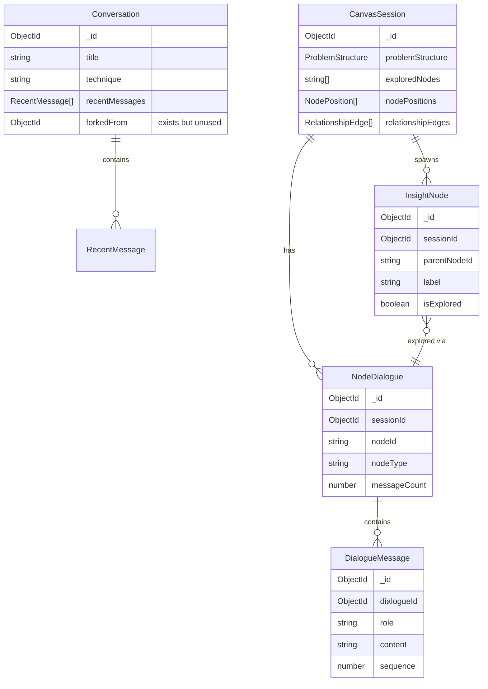

The `Conversation` model is linear (flat message array). The `CanvasSession` model is a graph (nodes with parent-child relationships via `InsightNode.parentNodeId`). But they represent the same cognitive activity viewed differently.

---

## Core Insight: Every Conversation is a Thought Graph

Instead of "chat vs canvas", the unified model treats all thinking as a graph structure with multiple **view modes**:

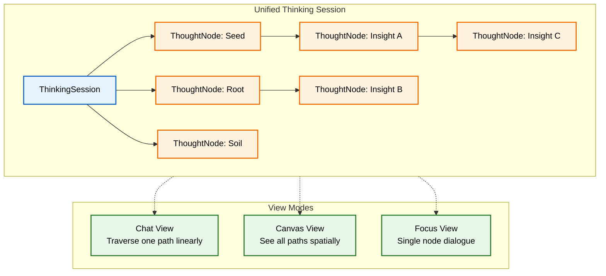

A chat conversation is just a **depth-first traversal** of the thought graph. A canvas session is the **full graph rendered spatially**. Converting between them is a change of view, not a data migration.

---

## Branch Resolution Model

### The Reframe

The question changes from:

> "How do we end the conversation?"

To:

> "How do we know when a **branch** is resolved, and when the **overall session** has reached a useful state?"

### Node States

Each node in the thought graph carries an independent resolution state:

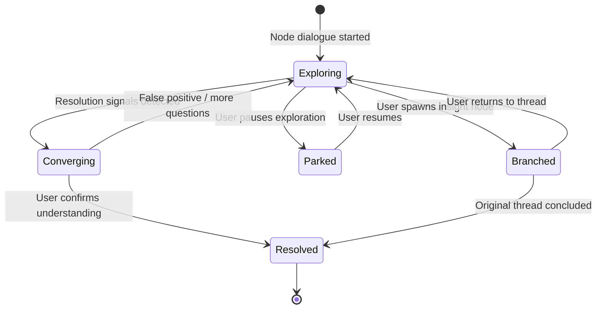

| State          | Description                                | Trigger                             |
| -------------- | ------------------------------------------ | ----------------------------------- |
| **Exploring**  | Active dialogue, Mukti is asking questions | Default state when dialogue starts  |
| **Converging** | User showing signs of understanding        | Resolution signals in user language |
| **Resolved**   | User reached conclusion for this node      | User confirms / passes teach-back   |
| **Branched**   | User spawned new questions from this node  | Insight node created from dialogue  |
| **Parked**     | User chose to pause, may return later      | Explicit user action or inactivity  |

### Session States

The overall thinking session aggregates node states:

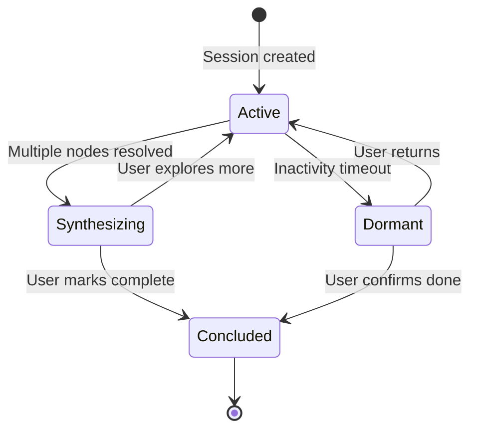

| State            | Condition                                                        |
| ---------------- | ---------------------------------------------------------------- |
| **Active**       | At least one node is `Exploring` or `Converging`                 |
| **Synthesizing** | Seed has at least one resolved path; AI offers synthesis         |
| **Concluded**    | User explicitly marks session complete                           |
| **Dormant**      | No activity for configured timeout; all active nodes auto-parked |

---

## Resolution Detection

### Per-Node Resolution Criteria

Different node types have different criteria for what constitutes "resolved":

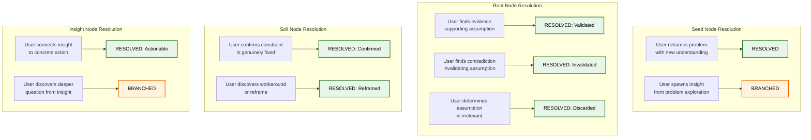

### Resolution Signal Detection

The system monitors user messages for signals indicating convergence:

**Positive Resolution Signals** (user is reaching clarity):

- Summarizing without prompting: "So basically what this means is..."
- Connecting to action: "I think I should try..."
- Teaching back: "The reason this works is because..."
- Reframing: "Actually, the real question is..."
- Expressing confidence: "I understand now", "That makes sense"

**Anti-Resolution Signals** (user is frustrated, not resolved):

- Terse frustration: "whatever", "just tell me", "I give up"
- Topic jumping without connection
- Repeating the same question
- Decreasing response length with negative tone

**Ambiguous Signals** (need clarification):

- Short responses (could be satisfaction or disengagement)
- "OK" / "Got it" (genuine or dismissive)

When resolution signals are detected, the system transitions the node from `Exploring` to `Converging` and adjusts the AI's behavior.

---

## The Convergence Protocol

When a node enters `Converging` state, the AI's prompt shifts from pure questioning to validation:

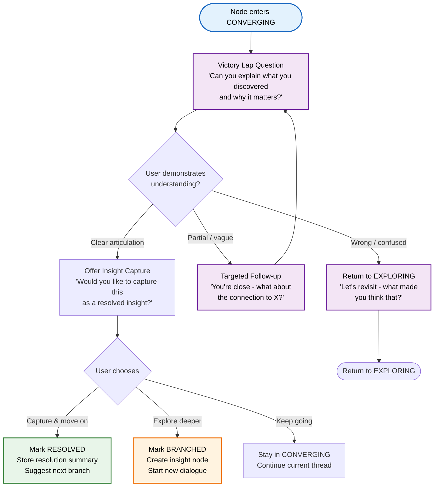

### Prompt Augmentation for Convergence

When the node state is `converging`, the system prompt is augmented:

```
The user appears to be reaching clarity on this topic.

Your behavior should shift:
- If they demonstrate understanding, ask them to summarize their insight
- Offer to capture this as a resolved point
- Suggest exploring connected branches if relevant
- DO NOT keep asking new exploratory questions if the user has clearly reached a conclusion
- Validate their understanding, don't challenge it further unless it has gaps
```

This is the key addition to `prompt-builder.ts` that currently doesn't exist — **state-aware prompting**.

---

## Branch Point Mechanism

When the AI or user identifies a branching opportunity during dialogue, the system offers explicit choices:

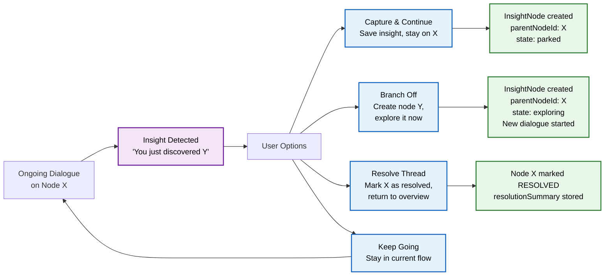

This creates the tree structure organically through conversation, rather than requiring the user to manually set up a canvas.

---

## Chat to Canvas Conversion

### Linear to Graph Transformation

When a user wants to "see their thinking" from a chat conversation:

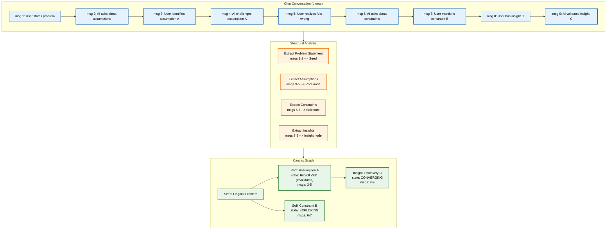

### Conversion Data Structure

Each extracted node references back to the original messages:

```typescript
interface ConversationNode {
  messageRange: [startSequence: number, endSequence: number];
  type: 'seed' | 'soil' | 'root' | 'insight';
  label: string; // AI-extracted key point
  state: NodeState; // Inferred from dialogue progression
  parentId?: string; // Which node this branched from
}
```

### Canvas to Chat Linearization

The reverse operation traverses the graph depth-first and concatenates dialogues:

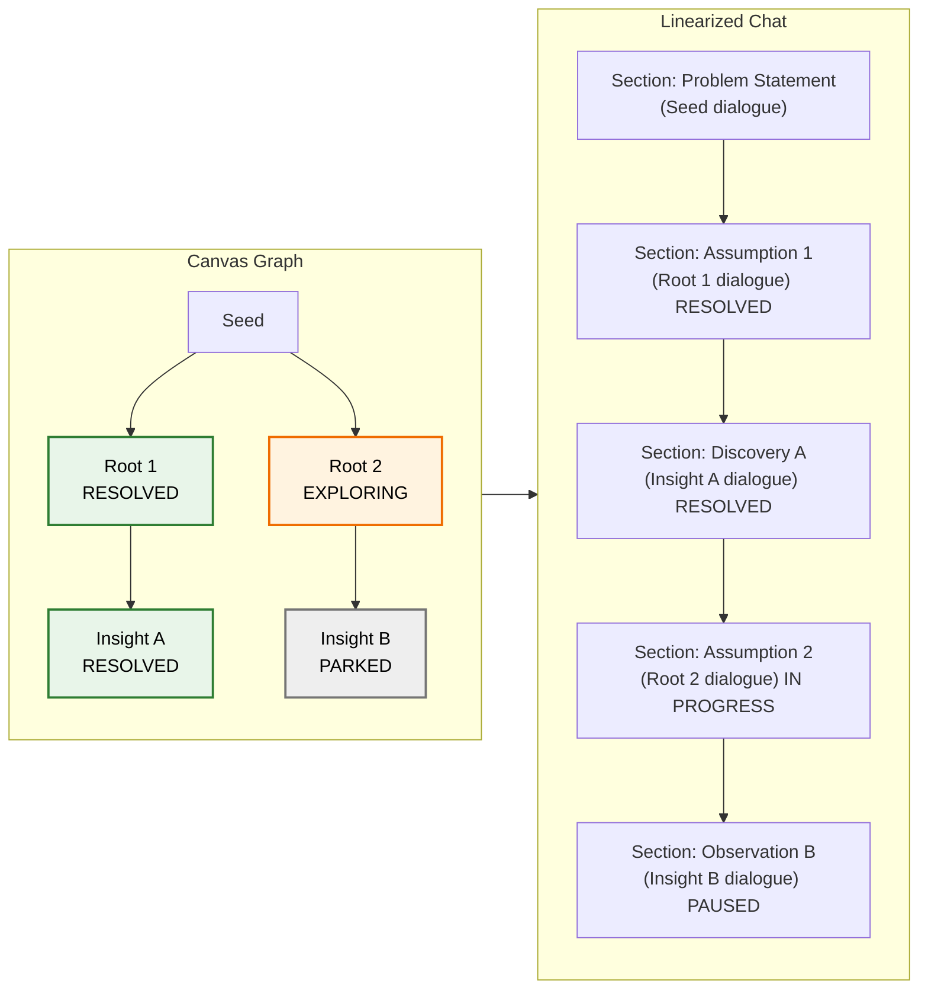

---

## The Synthesis Phase

When the session reaches a state where enough branches are resolved, the system enters **Synthesis Mode** — the natural conclusion of a thinking session.

### Synthesis Trigger Conditions

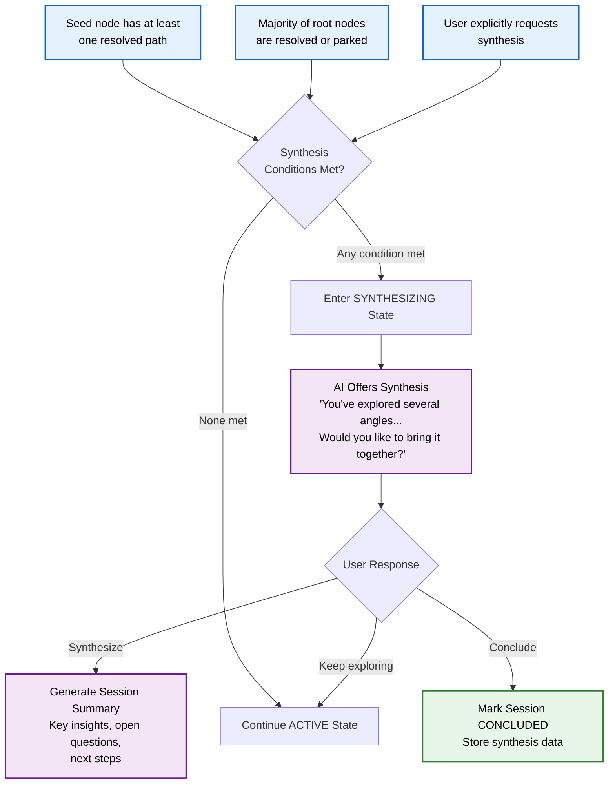

### Synthesis Output Structure

When the user chooses to synthesize:

```typescript
interface SynthesisData {
  /** Key insights discovered across all branches */
  keyInsights: string[];
  /** Questions that remain open for future exploration */
  openQuestions: string[];
  /** Concrete next steps the user identified */
  nextSteps: string[];
  /** User's own reflection on the thinking process */
  userReflection?: string;
  /** Map of node resolutions */
  nodeResolutions: Record<
    string,
    {
      state: NodeState;
      summary: string;
    }
  >;
}
```

The synthesis is NOT AI-generated content — it is the user's own articulation, guided by Mukti's prompts. This preserves the core philosophy.

---

## Multi-Ending Example

A single thinking session can have multiple valid conclusions across its branches:

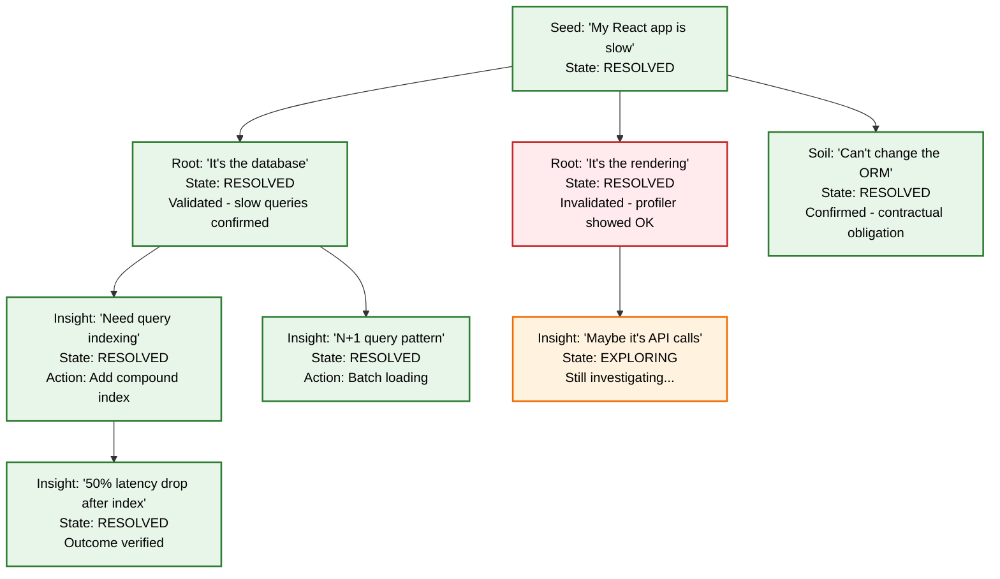

The session is "complete enough" when:

1. The original seed has at least one resolved path to an actionable insight
2. The user has explored the branches they care about
3. The user explicitly chooses to conclude, or
4. Inactivity plus majority resolved branches triggers a synthesis suggestion

There is no single "right answer". The thought graph IS the answer.

---

## Schema Additions

### NodeDialogue Schema Extensions

New fields for node-level state tracking:

```typescript
// Add to node-dialogue.schema.ts

/** Current resolution state of this dialogue thread */
@Prop({
  enum: ['exploring', 'converging', 'resolved', 'branched', 'parked'],
  default: 'exploring',
  type: String,
})
state: NodeState;

/** AI or user-generated summary of the conclusion reached */
@Prop({ type: String })
resolutionSummary?: string;

/** How the node was resolved (validated, invalidated, reframed, actionable, discarded) */
@Prop({
  enum: ['validated', 'invalidated', 'reframed', 'actionable', 'discarded'],
  type: String,
})
resolutionType?: ResolutionType;

/** Insight node IDs that were spawned from this dialogue */
@Prop({ default: [], type: [String] })
spawnedInsightIds: string[];
```

### CanvasSession / ThinkingSession Schema Extensions

New fields for session-level state and synthesis:

```typescript
// Add to canvas-session.schema.ts (or new thinking-session.schema.ts)

/** Overall session state */
@Prop({
  enum: ['active', 'synthesizing', 'concluded', 'dormant'],
  default: 'active',
  type: String,
})
sessionState: SessionState;

/** Synthesis data generated when user concludes the session */
@Prop({ type: Object })
synthesisData?: {
  keyInsights: string[];
  openQuestions: string[];
  nextSteps: string[];
  userReflection?: string;
  nodeResolutions: Record<string, { state: string; summary: string }>;
};

/** Reference to source conversation if converted from chat */
@Prop({ type: Types.ObjectId, ref: 'Conversation' })
sourceConversationId?: Types.ObjectId;

/** Reference to generated canvas if converted from chat */
@Prop({ type: Types.ObjectId, ref: 'CanvasSession' })
linkedCanvasId?: Types.ObjectId;
```

### Conversation Schema Extensions

New fields for chat-side tracking:

```typescript
// Add to conversation.schema.ts

/** Overall thinking state of the conversation */
@Prop({
  enum: ['active', 'synthesizing', 'concluded', 'dormant'],
  default: 'active',
  type: String,
})
sessionState: SessionState;

/** Reference to canvas session if user visualized this conversation */
@Prop({ type: Types.ObjectId, ref: 'CanvasSession' })
linkedCanvasId?: Types.ObjectId;

/** Extracted thought nodes from conversation analysis (for conversion) */
@Prop({ default: [], type: [Object] })
extractedNodes?: ConversationNode[];
```

---

## Prompt Builder Extensions

### State-Aware Prompt Augmentation

The `buildSystemPrompt` function in `prompt-builder.ts` should be extended to accept node state:

```typescript
function getStateAwarePrompt(state: NodeState): string {
  switch (state) {
    case 'exploring':
      return ''; // Default behavior, no augmentation needed

    case 'converging':
      return `
The user appears to be reaching clarity on this topic.
Your behavior should shift:
- If they demonstrate understanding, ask them to summarize their insight
- Offer to capture this as a resolved point
- Suggest exploring connected branches if relevant
- DO NOT keep asking new exploratory questions if the user has clearly reached a conclusion
- Validate their understanding rather than challenging further (unless gaps exist)`;

    case 'resolved':
      return `
This thread has been resolved. The user reached the following conclusion:
[resolutionSummary]
If they return to this thread, help them reflect on the conclusion or explore new angles.
Do not re-open resolved questions unless the user explicitly wants to revisit.`;

    case 'parked':
      return `
The user previously paused this exploration. Help them re-orient:
- Briefly summarize where they left off
- Ask what prompted them to return
- Offer to continue from where they stopped or take a fresh angle`;

    default:
      return '';
  }
}
```

### Synthesis Prompt

When the session enters synthesizing state:

```typescript
const synthesisPrompt = `
The user has explored multiple aspects of their problem. Help them synthesize:

Resolved branches:
${resolvedNodes.map((n) => `- ${n.nodeLabel}: ${n.resolutionSummary}`).join('\n')}

Open branches:
${openNodes.map((n) => `- ${n.nodeLabel}: Still exploring`).join('\n')}

Guide the user to:
1. Articulate what they learned across all branches
2. Identify what questions remain open
3. Define concrete next steps
4. Reflect on how their understanding changed

Do NOT summarize for them. Ask them to do it themselves.
The synthesis must come from the user's own thinking.`;
```

---

## Full Lifecycle Flow

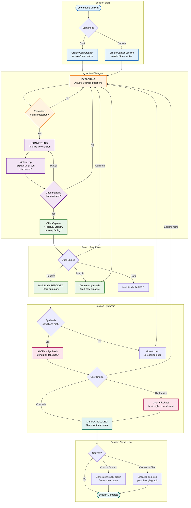

---

## Implementation Roadmap

### Phase 1: Node State Tracking

- Add `state`, `resolutionSummary`, `resolutionType`, and `spawnedInsightIds` to `NodeDialogue` schema
- Add `sessionState` and `synthesisData` to `CanvasSession` schema
- Update `prompt-builder.ts` with state-aware prompt augmentation
- Implement basic resolution signal detection (keyword matching)

### Phase 2: Convergence Protocol

- Implement `Converging` state transition logic in dialogue queue service
- Build "Victory Lap" prompt generation
- Add branch point detection and insight spawning from dialogue
- Implement user choice handling (resolve / branch / park / continue)

### Phase 3: Synthesis Engine

- Implement synthesis trigger conditions
- Build synthesis prompt generation
- Create synthesis data structure and storage
- Add session conclusion flow

### Phase 4: Chat-Canvas Conversion

- Build conversation analysis for structure extraction (chat to graph)
- Implement graph traversal for linearization (canvas to chat)
- Add `linkedCanvasId` and `sourceConversationId` references
- Build conversion API endpoints

### Phase 5: Advanced Signal Detection

- Replace keyword matching with LLM-based resolution signal analysis
- Add confidence scoring for convergence detection
- Implement adaptive thresholds based on user patterns
- Track resolution accuracy and refine over time
